# 网络安全：P35：CSRF漏洞原理、利用与防御

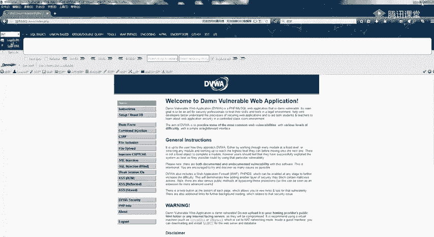

## 概述
在本节课中，我们将要学习CSRF（跨站请求伪造）漏洞。这是一种攻击者诱导用户在已登录的Web应用中执行非本意操作的攻击方式。我们将从漏洞的基本概念讲起，逐步深入到其成因、利用方法、寻找技巧以及防御措施，并通过实例帮助初学者理解。

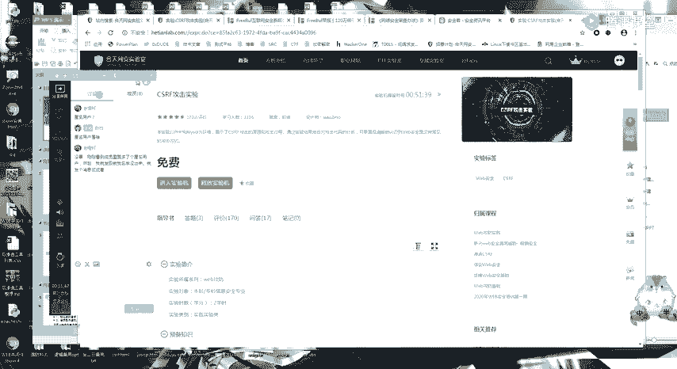

## CSRF漏洞简介 🎯
上一节我们介绍了课程的整体安排，本节中我们来看看什么是CSRF漏洞。


CSRF全称为跨站请求伪造。其核心是攻击者利用用户在当前已登录的Web应用程序中的身份认证状态（通常是Cookie），诱骗用户访问恶意构造的页面或链接，从而在用户不知情的情况下，以用户的身份执行非预期的操作。

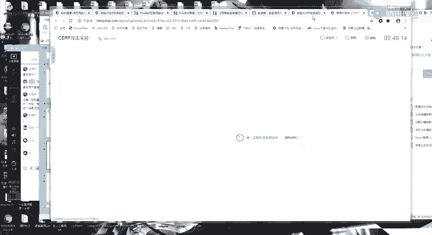

CSRF漏洞的成因主要有两点：
1.  用户的登录状态由浏览器Cookie维持，且在浏览器未关闭或主动退出前持续有效。
2.  网站的关键操作（如修改密码、转账、发表评论）仅通过简单的HTTP请求（GET或POST）即可完成，且请求中的所有参数均可被攻击者预测或获取。

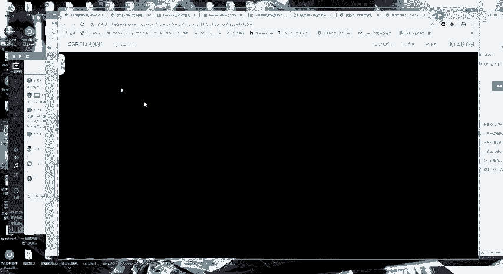

## CSRF漏洞的攻击模型与实例 🔍
理解了CSRF的基本概念后，本节我们通过一个具体的攻击模型和实例来看看它是如何发生的。

一个典型的CSRF攻击流程如下：
1.  用户登录受信任的网站A，并在浏览器中生成身份认证Cookie。
2.  用户在未登出网站A的情况下，访问了恶意网站B。
3.  网站B的页面中隐藏了一个指向网站A某个功能（如修改密码）的请求。
4.  用户的浏览器在访问网站B时，会自动携带网站A的Cookie，向网站A发出这个恶意请求。
5.  网站A服务器接收到带有合法Cookie的请求，误以为是用户本人的操作，从而执行了该请求（例如修改了密码）。

以下是一个基于GET请求的CSRF攻击实例。假设一个修改密码的请求链接如下：
```
http://vulnerable-site.com/change_password?new_password=attacker123
```
攻击者可以构造一个包含该链接的恶意HTML页面：
```html

```
当已登录`vulnerable-site.com`的用户访问这个恶意页面时，浏览器会自动加载`img`标签的`src`，从而悄无声息地执行修改密码的操作。

## CSRF漏洞的利用方式 ⚙️
上一节我们了解了CSRF的攻击模型，本节中我们来看看如何具体构造利用代码。

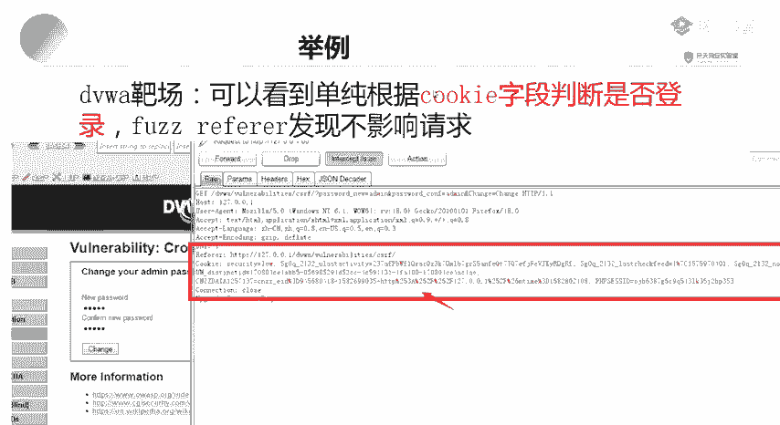

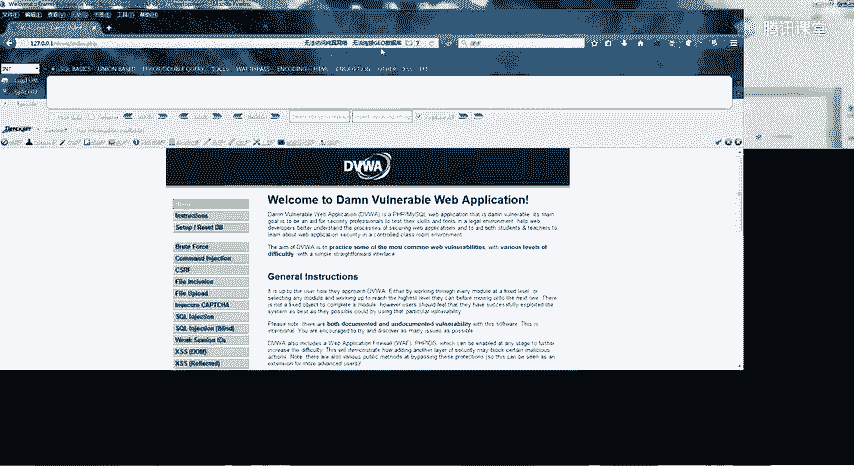

CSRF的利用方式主要取决于目标操作使用的是GET请求还是POST请求。

**以下是GET型CSRF的利用方式：**
对于GET请求，攻击最为简单，通常只需构造一个能自动发起请求的HTML标签即可，例如使用``、`<iframe>`或`<script>`标签。
```html
<!-- 利用图片标签自动发起GET请求 -->

```

**以下是POST型CSRF的利用方式：**
对于POST请求，需要构造一个能自动提交的表单。
```html
<!-- 构造一个隐藏表单，并通过JS自动提交 -->
<form id="csrf_form" action="http://target.com/transfer" method="POST">
    <input type="hidden" name="to" value="attacker_account" />
    <input type="hidden" name="amount" value="10000" />
</form>
<script>document.getElementById('csrf_form').submit();</script>
```

在实际渗透测试中，可以利用Burp Suite等工具快速生成CSRF PoC（概念验证）代码，大大简化了利用过程。

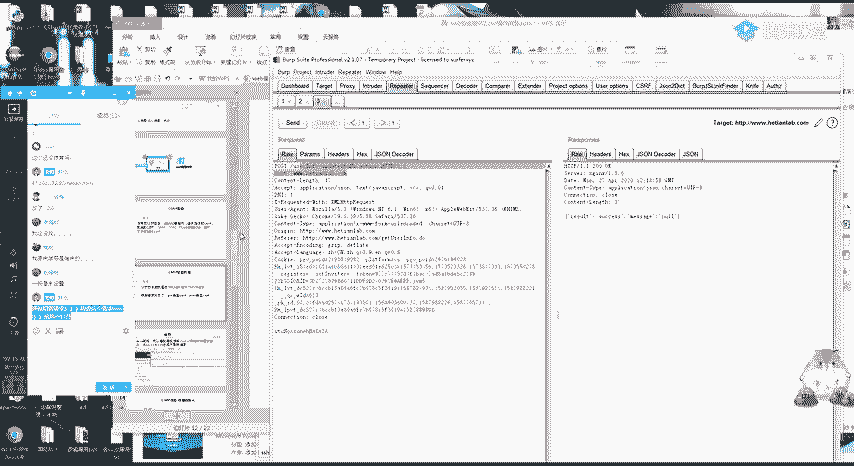

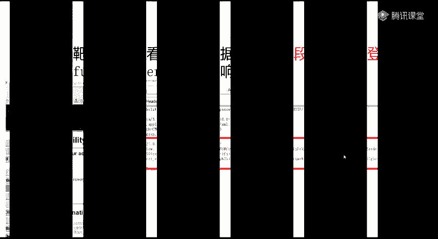

## 如何寻找CSRF漏洞 🕵️♂️
学会了如何利用CSRF后，本节我们来看看如何在目标网站中寻找这类漏洞。

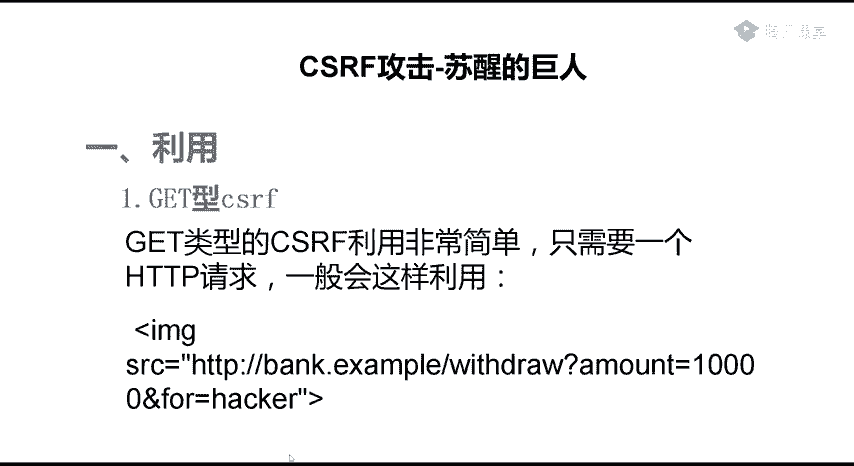

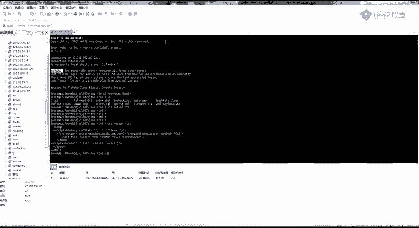

寻找CSRF漏洞的核心是分析关键功能点的HTTP请求数据包。关键步骤如下：

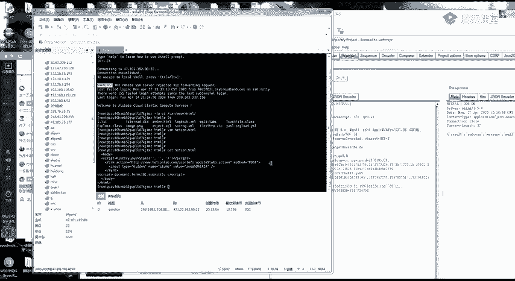


1.  **定位关键功能**：寻找所有涉及“增、删、改”的操作点，如修改资料、转账、添加管理员、发布文章等。
2.  **分析请求包**：使用抓包工具（如Burp Suite）拦截这些操作的请求。重点关注请求中是否包含不可预测或不可伪造的令牌。
3.  **验证参数可伪造性**：尝试修改或删除请求中的参数，观察操作是否依然成功。需要特别检查以下几个关键字段：
    *   **Token/CSRF Token**：一个随会话变化的随机令牌，是防御CSRF的主要手段。
    *   **Referer/Origin Header**：HTTP头，用于指示请求的来源。服务器可验证其是否来自本站。
    *   **自定义Header**：一些应用会添加自定义的认证头。
4.  **测试请求伪造**：如果删除`Token`、`Referer`等字段后，请求依然能成功执行，且请求中的所有参数（如用户ID、商品编号）都是攻击者可知或可控制的，那么该处很可能存在CSRF漏洞。

**以下是判断请求是否易受CSRF攻击的检查清单：**
*   请求是否为简单的GET或POST？
*   请求中是否没有动态生成的、不可预测的Token？
*   请求是否不严格验证`Referer`或`Origin`头？
*   请求中的所有参数（如`userid`, `amount`）是否均可被攻击者构造？

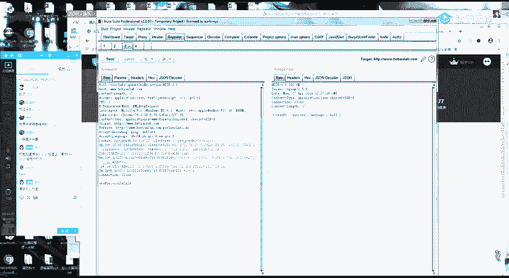

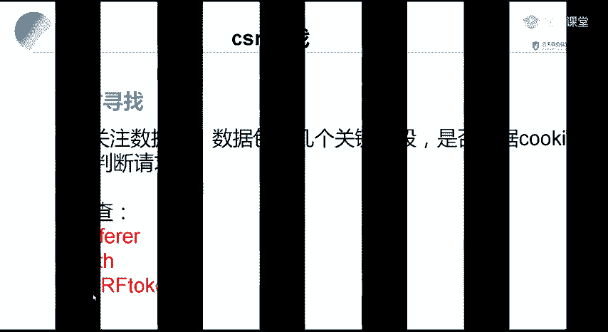

## CSRF漏洞的防御 🛡️
了解了如何攻击，本节我们自然要看看如何防御。健全的防御机制是杜绝CSRF漏洞的关键。

目前业界公认最有效的CSRF防御方案是使用 **Anti-CSRF Token**。

**其工作原理如下：**
1.  服务器在用户会话中生成一个随机、不可预测的令牌（Token），并将其传递给客户端（通常藏在表单的隐藏域中）。
2.  当客户端提交表单或发起敏感请求时，必须将这个Token一并提交。
3.  服务器收到请求后，会校验提交的Token是否与当前会话中存储的Token一致。如果不一致，则拒绝该请求。

**Token的生成与校验可以用以下伪代码表示：**
```python
# 生成Token (服务器端)
import secrets
session[‘csrf_token‘] = secrets.token_hex(16)

# 校验Token (服务器端)
def verify_csrf(request):
    client_token = request.form.get(‘csrf_token‘)
    server_token = session.get(‘csrf_token‘)
    if not client_token or client_token != server_token:
        return False # 验证失败，可能是CSRF攻击
    return True # 验证成功
```

**其他辅助防御措施包括：**
*   **验证Referer/Origin头**：检查请求是否来自合法的源域名。但这并非绝对可靠，可以被绕过。
*   **使用SameSite Cookie属性**：将Cookie的`SameSite`属性设置为`Strict`或`Lax`，可以限制第三方网站在跨站请求中携带Cookie。
*   **关键操作使用二次确认**：如修改密码、转账时，要求用户再次输入密码或进行短信验证。

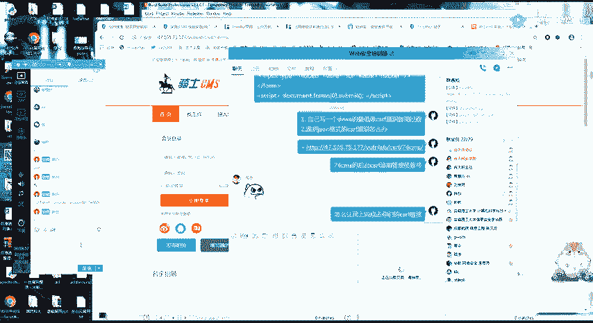

## 总结
本节课中我们一起学习了CSRF漏洞。我们从其定义和攻击模型出发，理解了它是如何利用用户的登录状态进行伪造请求的。接着，我们学习了如何针对GET和POST请求构造利用代码，并掌握了通过分析HTTP请求包来寻找CSRF漏洞的关键技巧。最后，我们探讨了以Anti-CSRF Token为核心的多种防御方案。CSRF是一种原理简单但危害较大的漏洞，深刻理解其攻防两端的原理，对于从事Web安全至关重要。