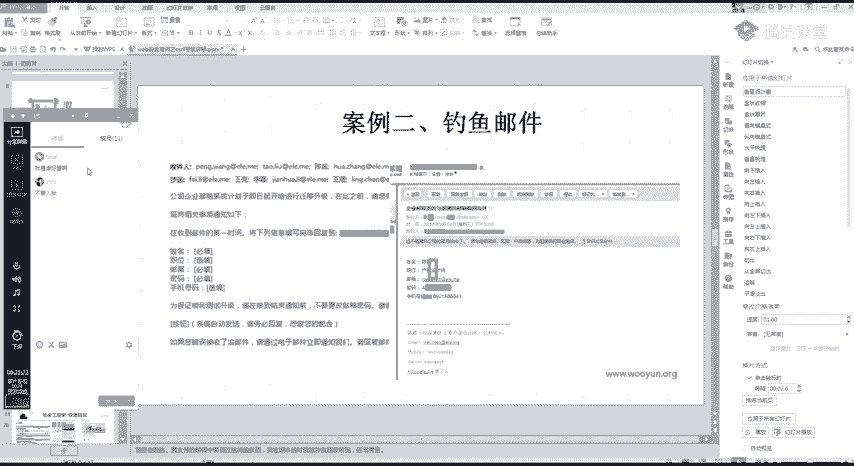
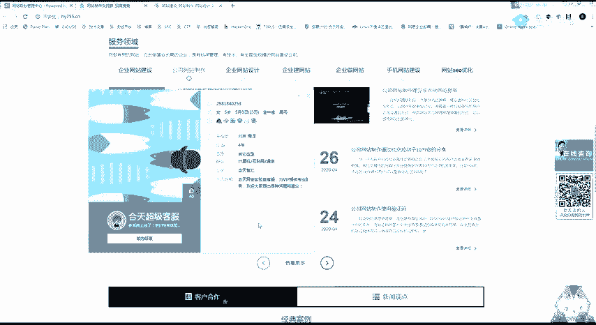
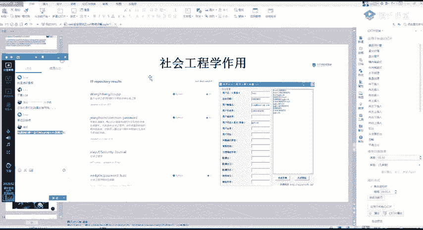
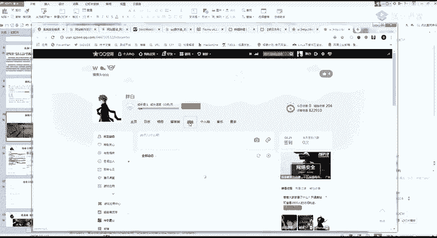

# 护网行动红蓝攻防教程：P37：Web安全-13.CSRF漏洞扩大影响 🎯

在本节课中，我们将要学习CSRF漏洞的深入利用方法，并了解社会工程学在渗透测试中的辅助作用。课程将分为两部分：首先介绍社会工程学的基本概念和常见手法，然后探讨如何将CSRF漏洞与其他漏洞结合，以扩大其影响范围，实现更深层次的攻击。

## 社会工程学简介 🎭

上一节我们介绍了CSRF漏洞的基本利用，本节中我们来看看如何通过非技术手段辅助渗透测试。社会工程学是一种通过人际交流影响他人心理，从而使其执行特定操作或泄露机密信息的行为。在安全领域，这通常被视为一种欺诈手段，用于收集信息或入侵系统。

### 社会工程学案例

以下是几个常见的社会工程学攻击案例：

1.  **信息诈骗**：攻击者通过非法手段获取大量个人信息（如从招生平台窃取数据），然后利用这些详细信息伪装成可信机构，诱骗受害者执行操作。
2.  **钓鱼邮件**：攻击者伪造来自可信来源（如公司IT部门、银行）的邮件，诱导收件人点击恶意链接或附件。这是目前非常有效的攻击方式。
3.  **钓鱼页面**：攻击者创建与真实网站高度相似的虚假页面（例如利用腾讯官方问卷系统创建钓鱼页面），利用可信域名诱导用户输入敏感信息。



### 社会工程学在渗透测试中的作用


社会工程学在渗透测试中的一个核心作用是**信息收集**。攻击者可以利用公开信息或与目标人员的交流，获取更多用于攻击的素材。

例如，针对一个网站制作公司，攻击者可能采取以下步骤：
*   寻找并加入相关的行业交流群。
*   在群内或通过客服渠道，伪装成潜在客户进行咨询。
*   在交流过程中，尝试发送带有恶意文件的“测试案例”或“问题反馈”，利用网站后台可能存在的文件上传漏洞获取权限。

此外，攻击者还可以利用已知的QQ号、邮箱等信息，在社工库中查询历史泄露的密码，尝试进行撞库攻击。




**核心工具思路**：利用已知信息（用户名、生日、邮箱等）生成针对性密码字典。
```python
# 社工字典生成器示例思路（非完整代码）
已知信息 = [“用户名”, “出生年份”, “常用邮箱前缀”]
常用密码 = [“123456”, “password”, “qwerty”]
生成字典 = []
for 信息 in 已知信息:
    for 密码 in 常用密码:
        生成字典.append(信息 + 密码)
        生成字典.append(密码 + 信息)
```
> **重要提示**：学习社会工程学是为了提升自身安全意识，并理解攻击者手法以更好地进行防御。所有技术都应在法律允许和授权测试的范围内使用。《网络安全法》是必须遵守的底线。

## CSRF漏洞的深入利用 ⚔️

在掌握了社会工程学的基本思路后，我们回到技术层面，探讨如何深化CSRF漏洞的利用。




### 挖掘高价值CSRF点

发现CSRF漏洞时，不应满足于基础演示，而应寻找能造成更大影响的攻击点。

*   **操作类CSRF**：应优先寻找敏感操作功能，例如：
    *   删除用户账号
    *   修改绑定手机/邮箱
    *   转账、支付
    *   修改系统关键配置
*   **读取类CSRF**：应优先寻找能泄露敏感信息的功能，例如：
    *   获取账号的API密钥或Token
    *   导出个人通讯录或私密资料
    *   查看详细个人住址等信息

**核心思路**：CSRF漏洞往往在整套系统中通用。修复时也是全局修复。因此，挖掘时应以“影响最大化”为目标，寻找最敏感的功能点进行利用。

### 组合漏洞攻击

单一的CSRF或XSS漏洞奖励可能有限，但将它们组合起来，可能实现质的飞跃，例如GetShell。

**案例：XSS + CSRF 组合拳**
假设一个网站存在存储型XSS漏洞，攻击者可以注入恶意脚本。如果该网站同时存在CSRF漏洞，允许通过请求添加管理员账号，那么可以构造如下攻击链：
1.  利用XSS注入一个恶意脚本。
2.  该脚本在受害者浏览器中执行，并利用CSRF漏洞自动向后台发送添加管理员账号的请求。
3.  攻击者成功获得一个后台管理员账号。

**POC示例思路**：
```html
<!-- 假设存在XSS的点可以插入此脚本 -->
<script>
    img = new Image();
    img.src = ‘http://target.com/admin/add_user.php?name=attacker&pass=hacked&csrf_token=自动获取或绕过’;
</script>
```

### 扩大漏洞影响的意义

在实战漏洞挖掘（如SRC项目）中，深入利用漏洞能带来显著收益：
1.  **技术成长**：在尝试组合利用漏洞的过程中，会极大地提升你的技术视野和解决问题的能力。
2.  **奖励提升**：漏洞奖金与漏洞危害程度直接相关。一个可导致GetShell或内网渗透的组合漏洞，其奖金远高于一个孤立的CSRF或XSS漏洞。在某些大型活动中，深入利用的漏洞奖励可能高达数万元。

## 课程总结 📚

本节课我们一起学习了以下内容：
1.  **社会工程学基础**：了解了社工的概念、常见手法（钓鱼邮件、钓鱼页面）及其在渗透测试中用于信息收集的作用。
2.  **CSRF漏洞深入利用**：学习了如何寻找高价值的CSRF攻击点，以及如何将CSRF漏洞与XSS等其他漏洞组合，形成更具威胁的攻击链，从而扩大漏洞影响，甚至实现GetShell。
3.  **安全与法律意识**：再次强调了所有技术学习都应以提升防御能力、在法律和授权范围内使用为目的。



核心要点在于转变思路：在发现一个漏洞时，不应立即止步，而应思考“我能否利用这个点，结合其他信息或漏洞，做更多的事情？” 这种主动探索和关联思考的能力，是安全研究员进阶的关键。