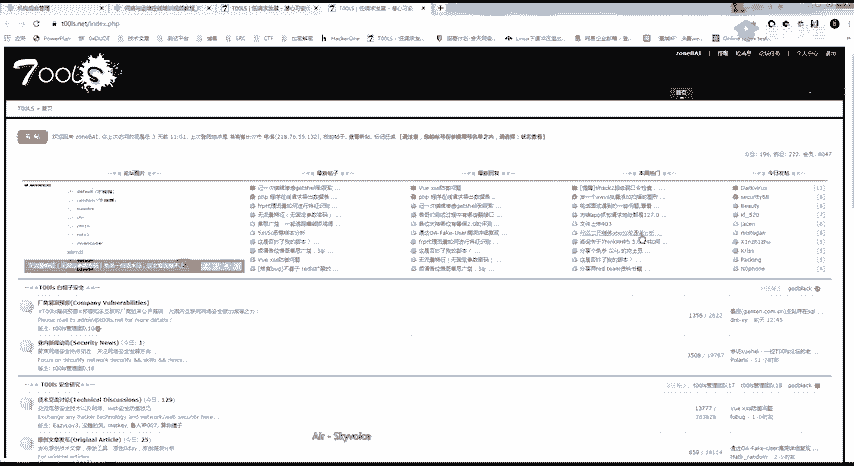
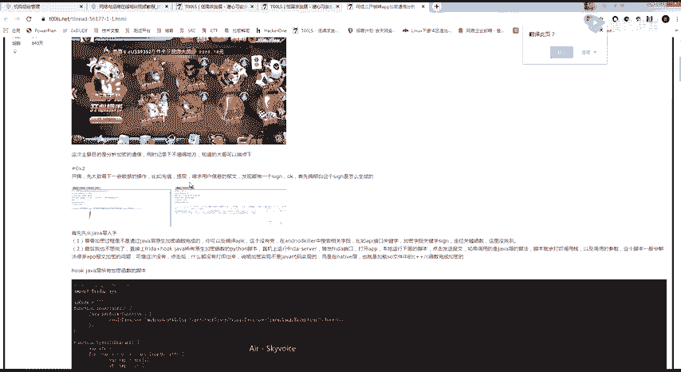
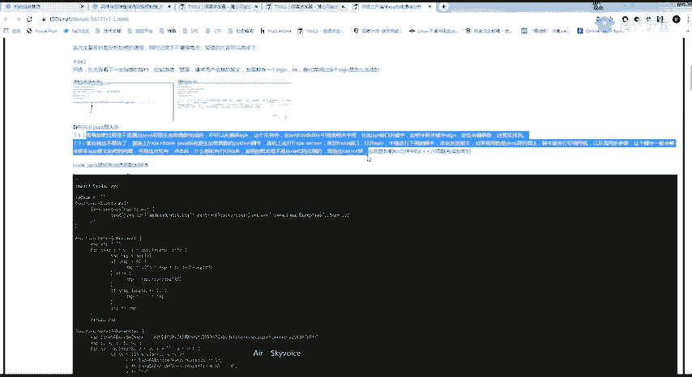
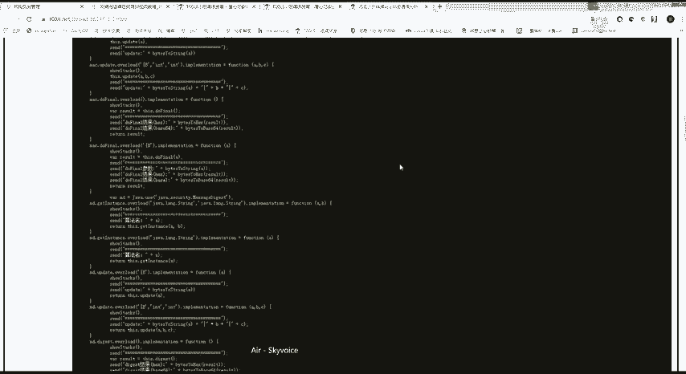
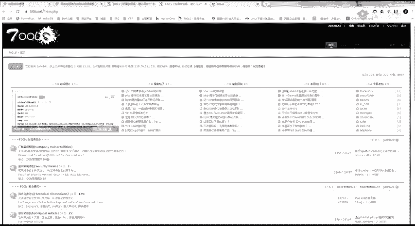
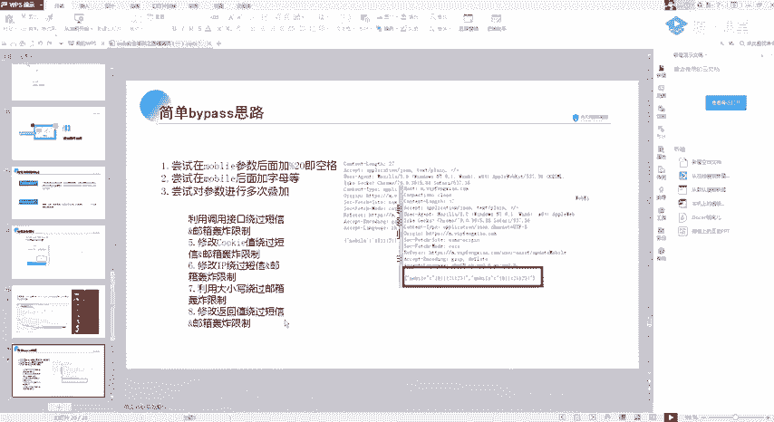

# 护网行动红蓝攻防教程：P38：Web安全-14. 逻辑漏洞简介 🧠

在本节课中，我们将要学习逻辑漏洞的基本概念，并重点探讨两种常见的逻辑漏洞类型：URL跳转漏洞和短信轰炸漏洞。逻辑漏洞是Web安全中非常重要的一部分，它源于程序员的逻辑设计缺陷，往往难以被自动化工具发现，因此在实战和SRC挖掘中占据很大比重。

## 什么是逻辑漏洞？🤔

上一节我们介绍了Web安全的多种攻击面，本节中我们来看看逻辑漏洞。逻辑漏洞与传统的SQL注入、XSS等漏洞不同，它并非由代码层面的技术缺陷直接导致，而是因为程序员在编写程序时，其逻辑思维存在不严密之处。

简单来说，逻辑漏洞是通过应用程序的“合法”业务流程，达到非预期的破坏效果。例如，一个四位数的验证码功能，从设计上看是正常的，但程序员可能没有考虑到攻击者可以暴力破解这有限的组合，这就构成了一个逻辑漏洞。

由于这类漏洞是利用正常功能实现的，因此传统的WAF（Web应用防火墙）和安全扫描器很难发现它们。这也是为什么在各大SRC（安全应急响应中心）的漏洞报告中，逻辑漏洞的占比通常很高。

## 逻辑漏洞的挖掘思路 💡

理解了逻辑漏洞的本质后，我们来看看如何挖掘它们。挖掘逻辑漏洞的核心在于理解业务流程并熟练使用抓包工具。

以下是挖掘逻辑漏洞的几个关键要点：
*   **熟练使用Burp Suite**：这是最重要的工具。你需要能够仔细查看和分析HTTP请求与响应包中的每一个参数。
*   **建立思路体系**：不要局限于已知的漏洞模式。漏洞是人找出来的，只要你能证明某个操作存在安全风险，就可能构成一个新的漏洞。
*   **关注复杂业务**：一个网站的功能点越多，业务流程越复杂，出现逻辑漏洞的可能性就越大。例如大型电商、金融平台等。

这里分享一个有趣的挖掘思路：有时一个请求包中只包含部分参数（例如只允许修改用户名），但服务器后端可能接收并处理更多参数。攻击者可以尝试将其他功能的参数（如修改手机号、邮箱的字段）添加到当前请求中，看看服务器是否会错误地执行这些操作。这种“参数污染”或“越权操作”的思路往往能发现意想不到的漏洞。

## URL跳转漏洞 🔀

上一节我们介绍了逻辑漏洞的通用概念，本节中我们来看看第一种具体的漏洞类型：URL跳转漏洞。

URL跳转漏洞，也称为开放重定向漏洞。其核心危害在于，攻击者可以利用它将用户从正常的网站重定向到恶意构造的页面上。

**漏洞原理**：网站某个功能（如登录后跳转、分享后跳转）接收一个URL参数，并据此进行跳转。如果程序没有对这个传入的URL进行严格的检查和过滤，攻击者就可以将其替换为任意恶意地址。

**攻击场景**：
1.  **钓鱼攻击**：将跳转地址改为一个高仿的登录页面，诱骗用户输入账号密码。
2.  **配合XSS**：跳转到一个存在XSS漏洞的页面，执行恶意脚本。
3.  **配合CSRF**：在跳转过程中携带CSRF攻击参数。
4.  **利用浏览器漏洞**：跳转到一个包含浏览器0day漏洞利用代码的页面。

**如何寻找URL跳转漏洞？**
关键在于寻找网站中所有会进行跳转的功能点。

以下是常见的存在跳转漏洞的业务场景：
*   用户登录、注册、注销后的跳转。
*   用户分享、收藏内容后的跳转。
*   跨站认证、授权后的回调（如OAuth）。
*   站内消息、通知点击后的跳转。
*   业务操作完成后的跳转（如修改密码成功、支付完成）。

在Burp Suite中，你可以重点关注HTTP状态码为 **`302`** 或 **`301`** 的响应，以及请求参数中带有 `url`、`redirect`、`link`、`jump`、`to` 等关键字的请求。

**简单的绕过技巧**：
有些网站会对跳转的域名进行白名单校验（如只允许跳转到 `*.example.com`）。以下是几种常见的绕过方法：
*   **利用 `@` 符号**：`http://www.example.com@www.evil.com`。部分浏览器会跳转到 `@` 后面的域名。
*   **利用子域名**：`http://www.example.com.evil.com`。如果校验不严，可能会被放行。
*   **利用IP地址编码**：将IP地址转换为十进制、八进制或十六进制格式，例如 `http://2130706433` 等价于 `http://127.0.0.1`。

## 短信/邮件轰炸漏洞 📱

本节我们来看另一种常见的业务逻辑漏洞：短信/邮件轰炸漏洞。这个漏洞理解起来非常简单，但危害不小。

**漏洞原理**：在用户注册、登录、找回密码等需要发送短信或邮件验证码的功能处，如果服务器没有对发送频率、次数或接收方做有效限制，攻击者就可以通过重放数据包，在短时间内向同一个手机号或邮箱地址发送海量验证信息，造成“轰炸”效果。

**漏洞挖掘**：所有需要发送验证码的功能点都是可疑的。使用Burp Suite抓取发送验证码的请求包，然后将其发送到 **Intruder** 模块进行重放测试，观察是否可以无限制发送。

**一些绕过限制的思路**：
如果目标对同一手机号的发送频率做了限制，可以尝试以下方法：
1.  **参数污染**：在手机号参数后添加特殊字符，如空格（URL编码为`%20`）、无关字母等，系统可能将其识别为新号码。例如：`13800138000` 和 `13800138000%20`。
2.  **参数叠加**：将参数改为数组形式，尝试一次请求发送给多个号码。例如：`mobile[]=13800138000&mobile[]=13800138001`。
3.  **调用不同接口**：网站可能有多个发送短信的接口（注册、改密、绑定等）。尝试找出接口标识参数（如 `type=register`），遍历修改以调用不同接口进行轰炸。
4.  **修改Cookie或删除登录状态**：有些发送验证码的请求会校验用户是否已登录。尝试删除或修改Cookie，看是否能以未登录状态无限发送。
5.  **修改返回包**：这是一种较高级的技巧。拦截服务器返回的“发送次数超限”或“发送成功”的响应包，在本地修改其内容（如将错误信息改为成功），再放行给客户端，欺骗前端逻辑。

## 总结 📝

本节课中我们一起学习了逻辑漏洞的基础知识。我们首先明确了逻辑漏洞是由于程序业务逻辑设计不严谨导致的，它利用合法流程达到攻击目的，难以被自动化工具检测。

我们重点分析了两种逻辑漏洞：
1.  **URL跳转漏洞**：攻击者控制跳转目标，可用于钓鱼、配合其他漏洞攻击。挖掘关键是寻找带跳转参数的功能点。
2.  **短信/邮件轰炸漏洞**：由于缺乏频率限制，导致可向目标发送大量验证信息，造成骚扰。挖掘关键是测试所有发送验证码的接口。

逻辑漏洞的挖掘极度依赖对业务的理解、清晰的思路和Burp Suite等工具的熟练使用。记住，漏洞是人找出来的，多观察、多测试、多思考，你就能在复杂的业务流中发现更多安全问题。