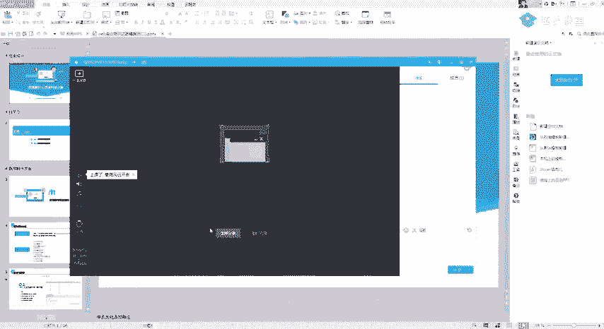
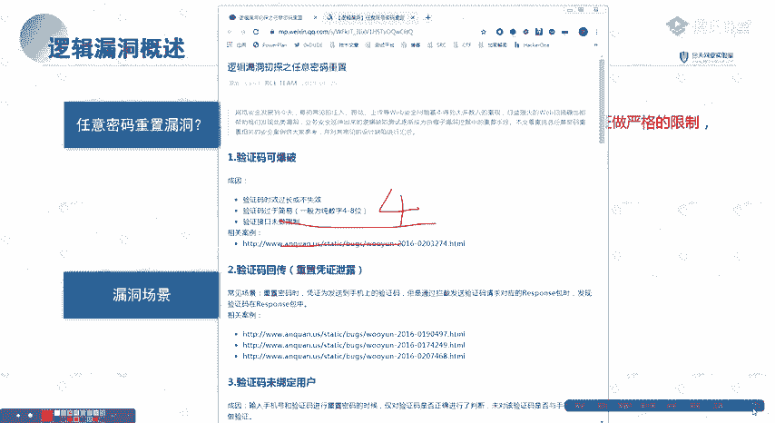
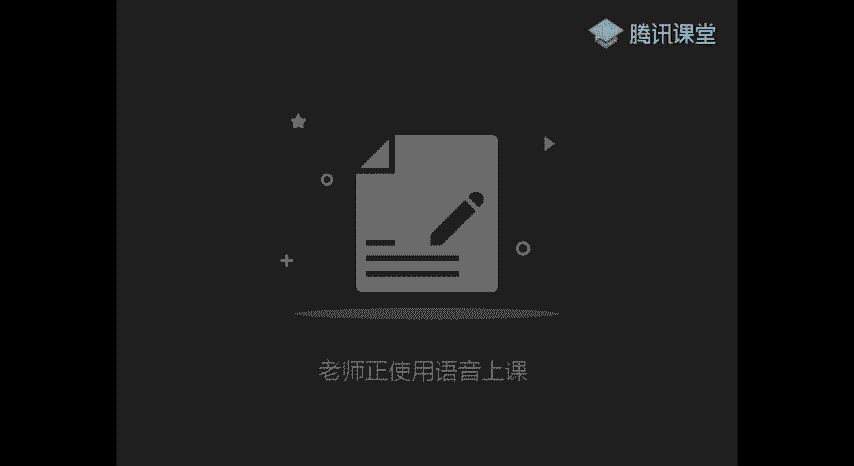
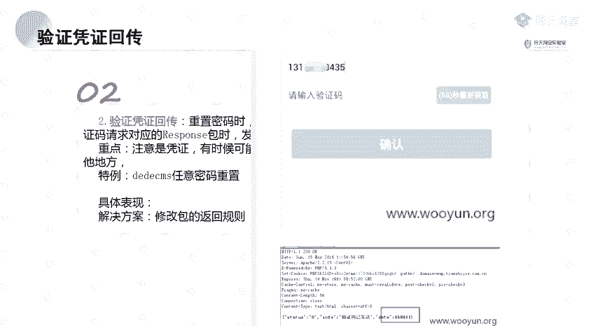
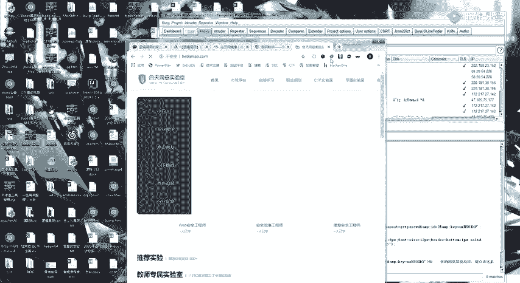
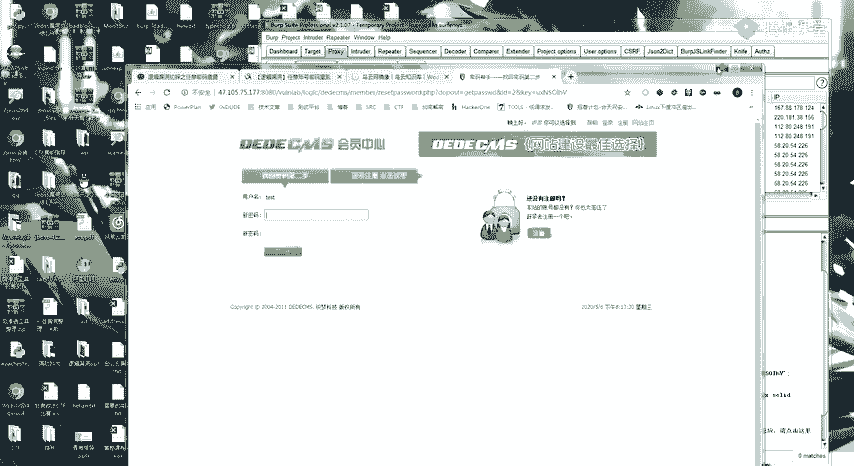
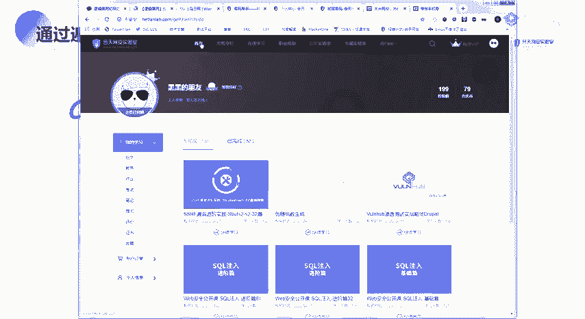
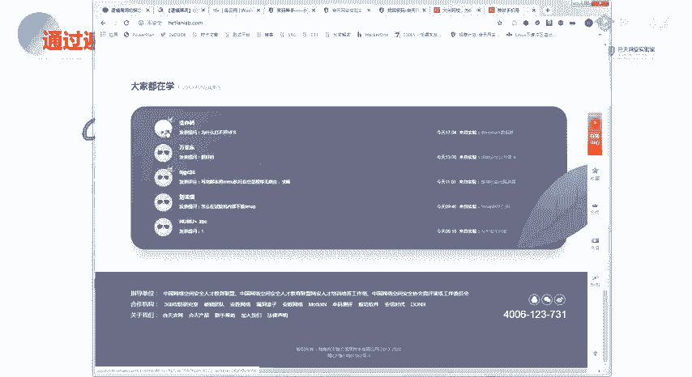
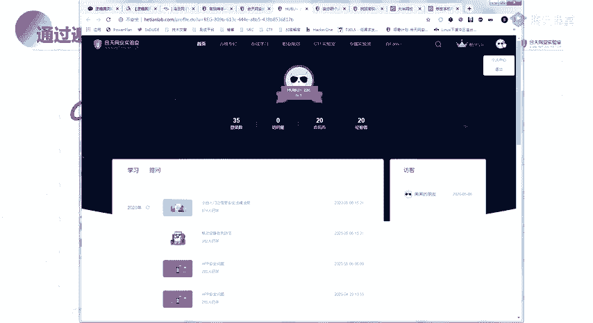
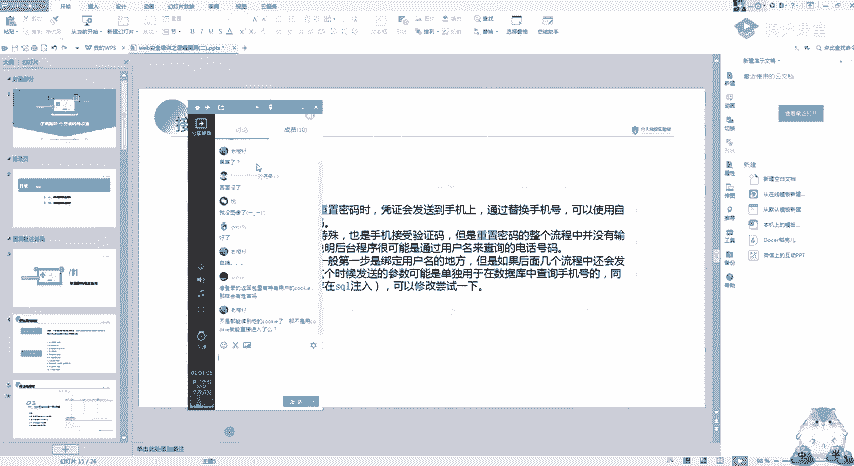

# 护网行动红蓝攻防教程：P39：Web安全-15. 逻辑漏洞讲解 🎯



在本节课中，我们将要学习Web安全中一种常见但危害巨大的漏洞类型——逻辑漏洞。逻辑漏洞的核心在于程序流程或业务逻辑上的缺陷，而非技术实现上的错误。我们将重点讲解“任意密码重置”和“任意账户登录”这两大类逻辑漏洞的原理、常见场景及挖掘思路。

---



## 任意密码重置漏洞 🔑



上一节我们介绍了逻辑漏洞的基本概念，本节中我们来看看“任意密码重置”漏洞。这类漏洞的核心原理是：**在密码修改或找回流程中，系统没有对用户身份验证凭证进行严格校验，导致攻击者可以绕过验证，修改任意用户的密码**。

用简单的代码逻辑表示，一个存在漏洞的密码重置接口可能如下：
```python
# 漏洞代码示例：未验证凭证与用户的绑定关系
def reset_password(user_id, new_password, token):
    # 仅验证token是否存在且有效，但未验证此token是否属于该user_id
    if token in valid_tokens_list:
        update_password(user_id, new_password)  # 危险！可修改任意用户密码
        return "密码修改成功"
    else:
        return "验证失败"
```

以下是“任意密码重置”漏洞的十种常见场景：

### 1. 验证码可被爆破
此场景指验证码（如短信/邮箱验证码）位数过短（如4位）或有效期内未限制尝试次数，导致攻击者可以暴力枚举所有可能的验证码组合。




### 2. 验证码/凭证在返回包中回显
系统在响应包（Response）中直接返回了验证码或重置令牌（Token）。攻击者通过抓包即可直接获取，无需接收短信或邮件。

### 3. 验证码未与用户绑定
系统只验证了验证码是否正确，但未校验该验证码是否由当前操作用户的手机号/邮箱接收。导致A用户收到的验证码可用于重置B用户的密码。



### 4. 仅前端验证
验证逻辑仅在前端JavaScript中完成，服务器端未做二次校验。攻击者可通过禁用JS或修改前端代码轻松绕过。





### 5. 可跳过验证步骤
密码重置流程分为多步（如：1.输入账号 -> 2.验证身份 -> 3.设置新密码）。攻击者通过直接访问最终设置新密码的URL，跳过前面的身份验证步骤。

### 6. 重置Token可被预测
系统生成的重置密码链接中的Token（如：`reset?token=xyz123`）存在规律（如递增、基于时间生成、可解密），攻击者可预测其他用户的Token。

### 7. 同时向多个账户发送相同凭证
在“找回密码”处，输入用逗号分隔的多个手机号/邮箱，系统向所有账户发送了相同的验证码。攻击者可用此验证码重置其中任一账户。

### 8. 接收端可被篡改
在验证身份后、修改密码前，存在一个可修改接收验证码手机号或邮箱的步骤。攻击者在此处将接收端改为自己控制的号码，从而接管账户。

### 9. 修改服务器返回包
在密码重置流程中，拦截服务器返回的“验证失败”等数据包，将其修改为“验证成功”的状态码或信息，从而欺骗前端通过验证。

### 10. 存在万能验证码
系统为测试或后台管理预留了通用验证码（如：000000、999999），此验证码可用于任何账户的密码重置。

---

## 任意账户登录漏洞 👤

了解了任意密码重置后，我们来看看与之高度重叠的“任意账户登录”漏洞。其定义是：**利用逻辑错误，在未授权的情况下登录系统内任意用户的账户**。

以下是几种常见的任意登录场景：

### 1. 验证码回显登录
在验证码登录场景中，验证码直接在返回包中回显，攻击者抓包获取后即可登录。

### 2. 修改返回包实现登录
拦截登录接口的返回包，将“登录失败”的响应修改为“登录成功”，并携带目标用户的身份标识（如Cookie、Token），使客户端误以为登录成功。

### 3. 修改用户标识参数
登录过程或登录后的会话维持，通过参数（如`user_id`、`username`）标识用户身份。攻击者修改此参数为其他用户的值，即可切换身份。

### 4. SQL注入之“万能密码”
登录处的用户名和密码参数存在SQL注入漏洞，使用诸如 `admin' --` 或 `admin' or '1'='1` 等Payload，可绕过密码验证。





### 5. 默认口令登录
系统存在未修改的默认账号密码（如`admin/admin123`），或学校、企业系统的初始密码有规律（如学号/工号即密码），攻击者通过枚举即可登录。



### 6. 撞库攻击
利用从其他平台泄露的账号密码数据库（社工库），尝试登录目标系统。很多用户在不同平台使用相同密码，导致撞库成功率很高。

### 7. Cookie混淆
系统通过Cookie中的某个字段（如`user_id`）判断当前登录用户。攻击者通过修改自己Cookie中的该字段值为目标用户的ID，即可实现身份切换。

---

## 总结与练习 📝

本节课中我们一起学习了Web安全中逻辑漏洞的核心部分：**任意密码重置**与**任意账户登录**。这两种漏洞的本质都是**业务逻辑设计或实现上的缺陷**，使得身份验证环节被绕过。

挖掘逻辑漏洞的关键在于：
1.  **理解正常业务流程**：彻底走通密码找回、登录、修改信息等流程。
2.  **寻找差异点**：思考“每一步验证了什么？”“哪些参数可以控制？”“服务器信任了客户端的哪些信息？”
3.  **尝试绕过**：运用本节课提到的思路（如爆破、修改参数、跳过步骤、预测Token等）进行测试。
4.  **多练多看**：逻辑漏洞高度依赖经验，多分析历史漏洞案例，多在实际靶场中练习。

建议课后完成以下练习以巩固知识：
*   在提供的靶场中，复现至少两种任意密码重置漏洞。
*   尝试挖掘一个简单的登录逻辑缺陷（如修改Cookie中的用户ID）。
*   阅读乌云等漏洞平台上的历史逻辑漏洞报告，学习他人的挖掘思路。



记住，**思路远比工具重要**。保持好奇心，像攻击者一样思考，你就能发现更多隐藏的逻辑缺陷。