# 护网行动红蓝攻防教程：P41：Web安全-17. 课程考核与逻辑漏洞脑洞篇 🧠

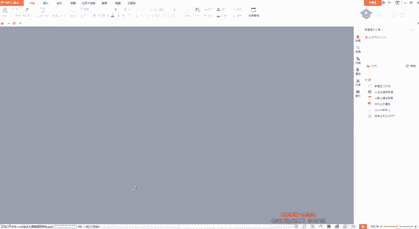

在本节课中，我们将对之前布置的课程考核题目进行讲解，并深入探讨逻辑漏洞挖掘中一些非常规的“脑洞”思路。我们将学习如何通过抓包改包发现支付逻辑漏洞、越权漏洞，并掌握通过“增、删、改”参数来发现隐藏漏洞的技巧。

---

## 考核题目讲解

上一节我们介绍了逻辑漏洞的基本概念，本节中我们来看看三道考核题目的具体解法。

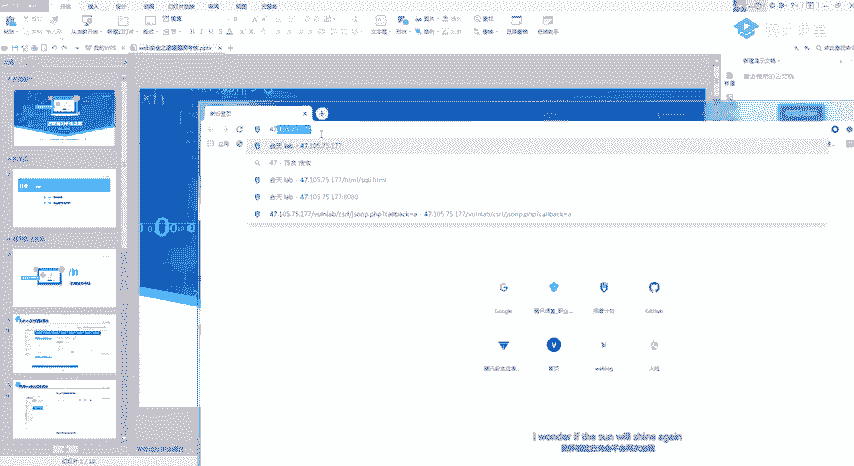

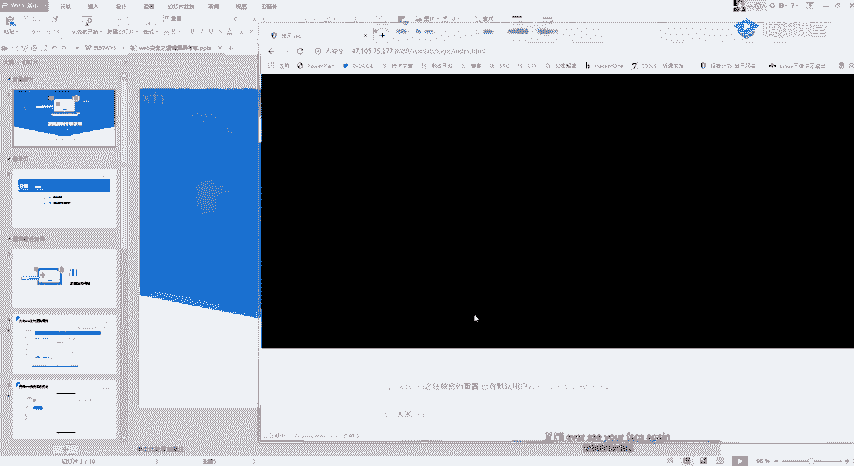

### 大米CMS支付逻辑漏洞 💰

这道题考察的是支付环节的逻辑漏洞。核心思路是：在提交订单时拦截并修改HTTP请求包中的关键参数。

**操作步骤如下：**

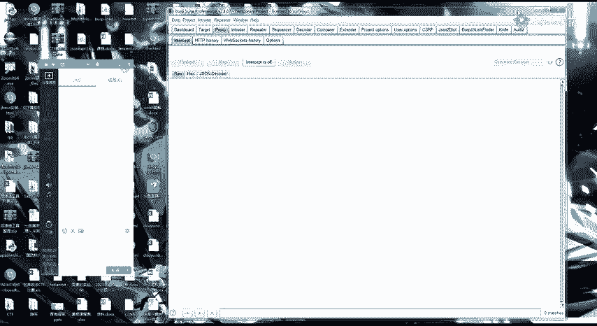

1.  注册一个用户账号。
2.  在网站中选择任意商品，点击购买。
3.  在提交订单的环节，使用抓包工具（如Burp Suite）拦截HTTP请求。
4.  分析请求包，找到代表商品**数量**或**价格**的参数。
5.  尝试修改这些参数，例如将数量 `quantity` 改为负数（如 `-1`）。
6.  如果系统未对负数进行校验，则可能实现“支付负金额”，从而增加账户余额。

**关键点：**
在测试时，应尝试修改请求包中的每一个可能参数，例如 `price`（价格）、`id`（商品ID）等，因为开发者可能只对其中部分参数做了校验。

### 熊海CMS后台越权漏洞 🔑

这道题考察的是通过Cookie进行身份验证的越权漏洞。核心思路是：发现系统通过Cookie中的某个字段（如`username`）判断用户权限，并尝试伪造该字段。

**操作步骤如下：**

1.  访问后台登录页面（如 `admin/login.php`）。
2.  使用抓包工具拦截任意请求，观察Cookie结构。
3.  通过下载该CMS的源码或目录扫描，了解后台可能存在的页面（如 `admin/index.php`）。
4.  在请求的Cookie中，手动添加或修改一个字段，例如 `user=admin`。
5.  重新发送请求，观察是否能直接访问后台管理页面，绕过登录验证。

**关键点：**
对于开源CMS，下载源码进行分析是快速了解其鉴权逻辑的有效方法。

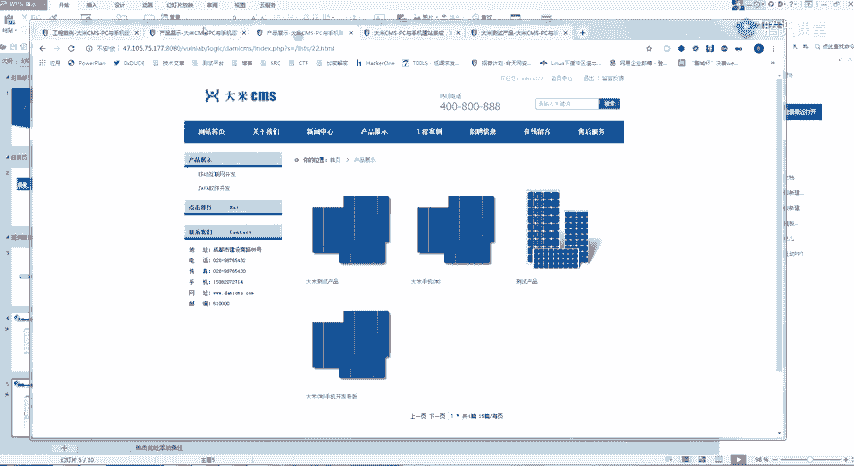

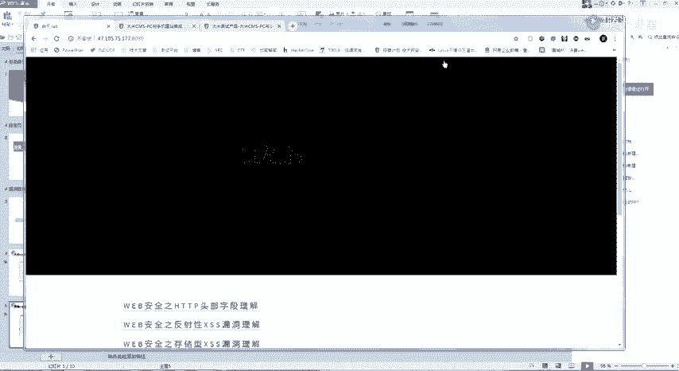

### ThinkShop收货地址越权漏洞 🏠

这道题是经典的越权漏洞案例。核心思路是：在操作用户数据（如增删改查收货地址）时，修改请求包中的用户ID参数，以访问或操作其他用户的数据。

**操作步骤如下：**

1.  登录自己的账户，进入“收货地址管理”页面。
2.  进行添加、修改或删除地址的操作，并拦截该请求。
3.  在请求包中找到标识用户的参数，常见名称为 `uid`、`userid` 等。
4.  将该参数值修改为其他用户的ID（可通过注册小号等方式获取）。
5.  提交请求，如果成功操作了其他用户的数据，则证明存在越权漏洞。

**关键点：**
此类漏洞在用户信息密集的系统（如医院病历系统、学校教务系统）中危害极大。

---

## 逻辑漏洞脑洞篇：参数“增删改”思维 🧩

完成了基础考核，我们来看看如何将思维发散，挖掘更深层次的逻辑漏洞。核心在于对HTTP请求参数进行“增、删、改”的全面测试。

### 1. “删”除参数：寻找未授权访问

有时，系统用于鉴权的参数可能是冗余的或可以被绕过。

**思路：**
在拦截到的请求包中，尝试删除看似用于身份验证的参数，如 `token`、`Cookie` 整体或某个认证字段。

**案例：**
在一个修改用户信息的请求中，删除整个 `Cookie` 头后重放请求，如果依然能修改成功，说明该端点存在**未授权访问**漏洞，进一步可能衍生出越权漏洞。

```http
# 原始请求
POST /api/update_user HTTP/1.1
Cookie: session=abc123; user_id=456
...

# 测试请求（删除Cookie）
POST /api/update_user HTTP/1.1
...
```

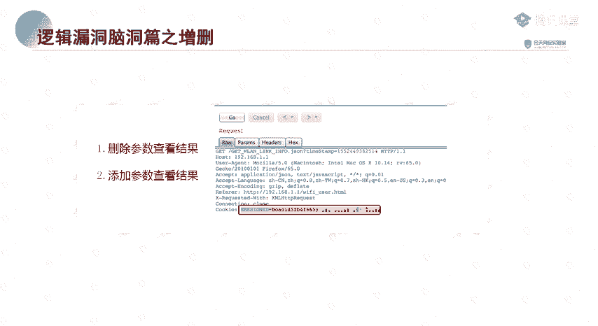

### 2. “增”加参数：发现隐藏功能与漏洞

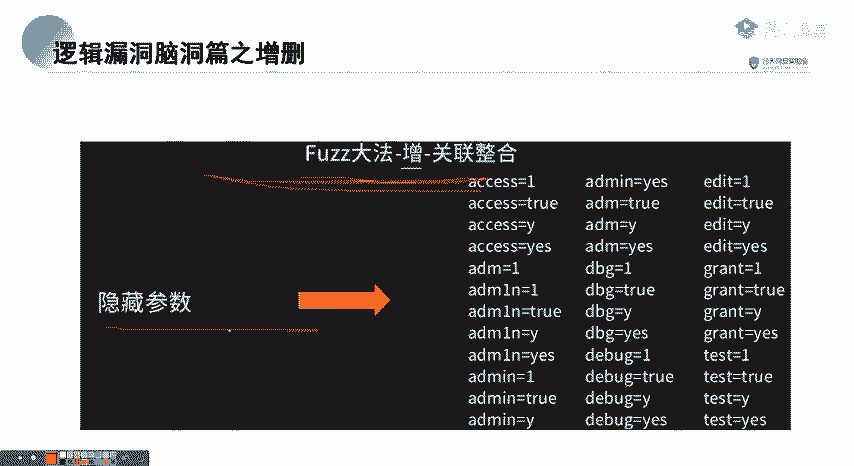

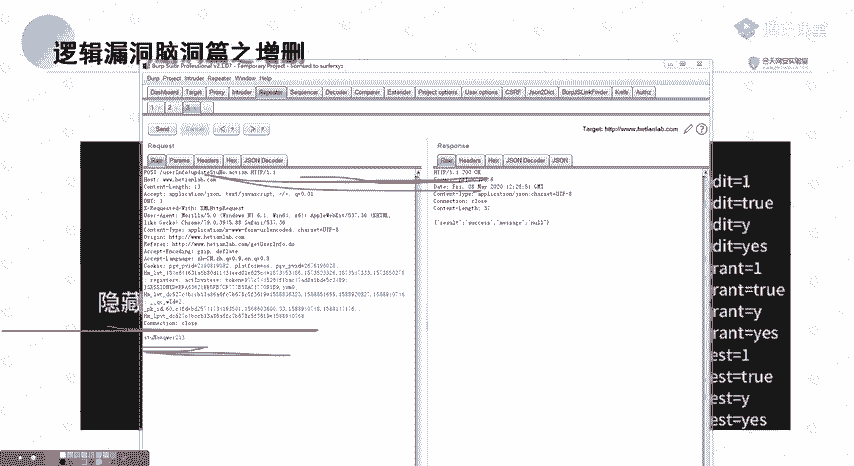

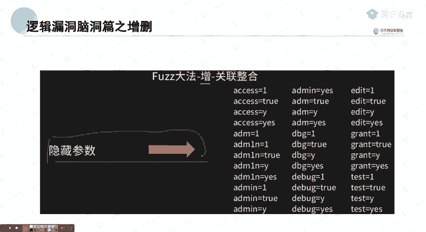

系统可能存在未在前端暴露的隐藏参数，这些参数可能开启新的功能或引入漏洞。

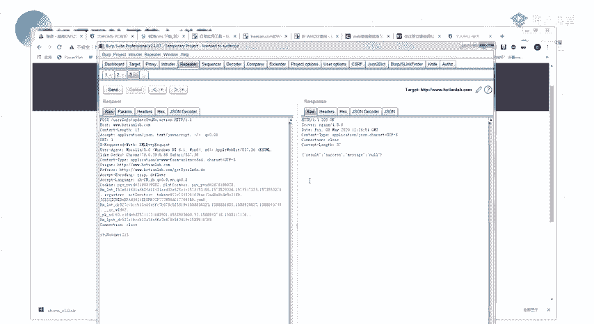

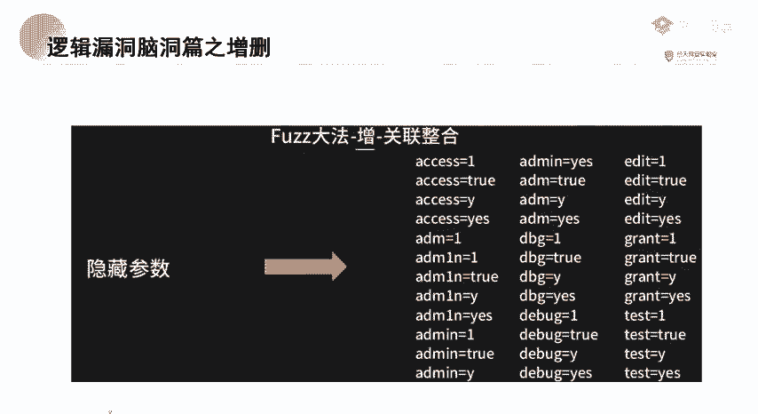

**思路：**
在请求中手动添加参数进行测试。这需要结合经验和字典。

**以下是常用方法：**

*   **使用参数字典爆破：** 利用已有的参数字典（如 `callback`, `jsonp`, `debug`, `admin` 等），在请求URL或参数中进行爆破，观察响应变化。
*   **从响应中寻找线索：** 观察API返回的JSON数据，其中的某些字段名（如 `studentId`, `familyId`）可能就是潜在的隐藏参数。尝试将这些字段名作为参数名添加到请求中进行测试。

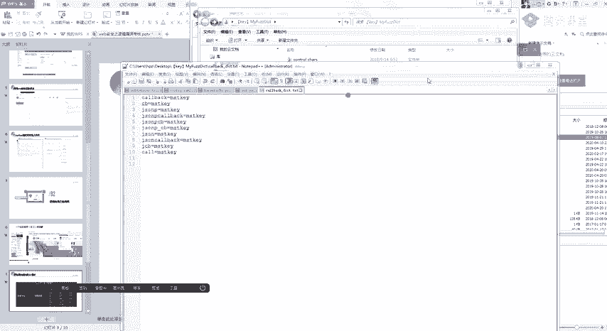

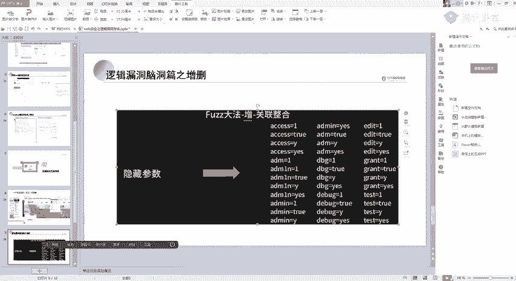

**案例：**
*   在某个请求后添加 `?callback=test`，可能触发JSONP劫持漏洞。
*   在一个查询请求的响应体中看到 `"familyId": 789`，尝试在原始请求中添加参数 `&familyId=790`，可能造成数据越权访问。

### 3. “改”换参数：不局限于常规ID

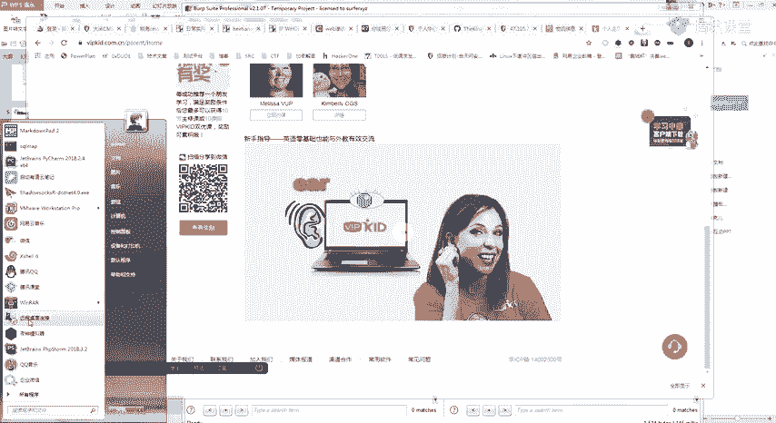

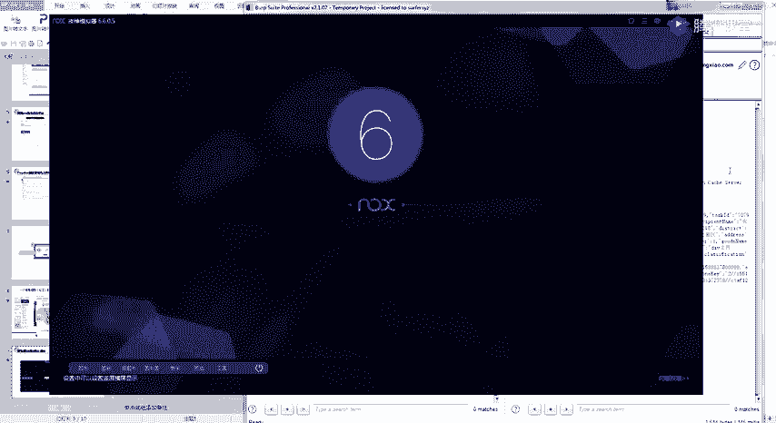

不要将参数修改思维局限于简单的用户ID递增/递减。

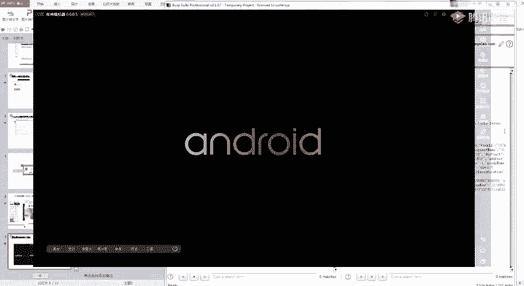

**思路：**
*   **参数类型转换：** 将数字型ID改为字符串、数组或特殊字符，测试程序处理异常。
*   **替换参数名：** 用从其他接口或响应中发现的类似参数名进行替换。例如，将请求中的 `userId` 参数名改为从其他响应里看到的 `ownerId` 再进行测试。
*   **多参数组合测试：** 同时修改多个参数，检查其联合校验逻辑是否完备。

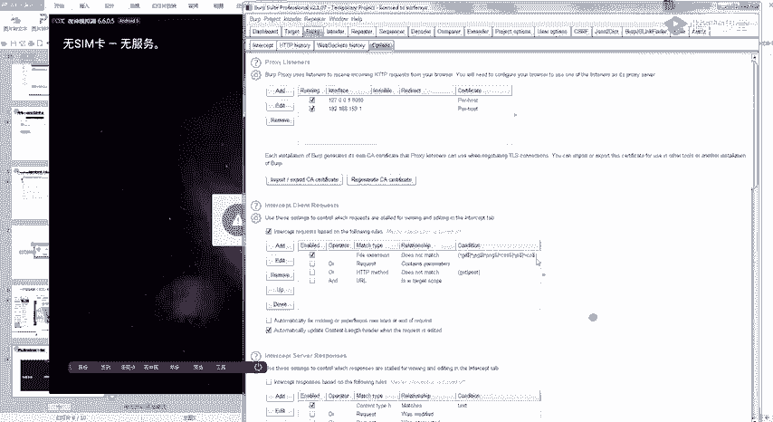

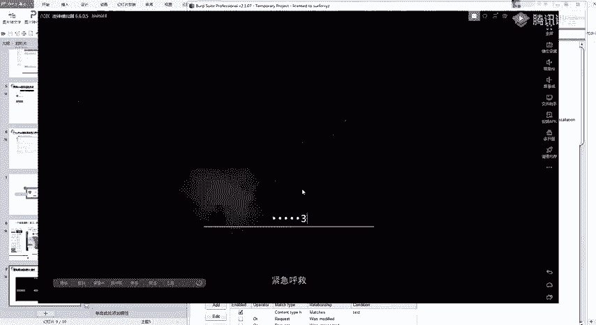

**案例：**
在一个查询接口中，原始参数为 `id=123`。你从另一个相关接口的响应中发现了一个字段 `studentId: 456`。你可以尝试将请求改为 `studentId=457`，看是否能越权查询其他学生的信息。这需要一定的运气和大量的尝试。

---

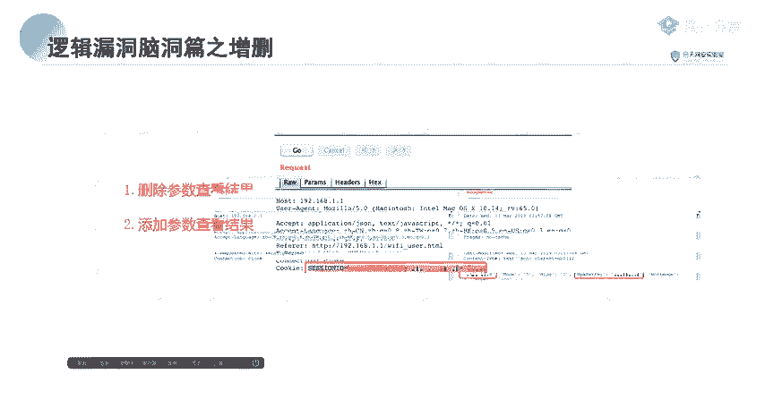

## 总结

本节课中我们一起学习了：
1.  **三道考核题目的解法**：涵盖支付逻辑漏洞、Cookie越权、ID越权，核心操作都是**抓包与改包**。
2.  **逻辑漏洞的进阶挖掘思维**：提出了对HTTP参数进行 **“增、删、改”** 的全面测试方法。
    *   **“删”** 除认证参数，寻找未授权访问。
    *   **“增”** 加隐藏参数，利用字典或代码线索发现新漏洞点。
    *   **“改）”** 换参数名与值，进行更深入、非常规的越权测试。

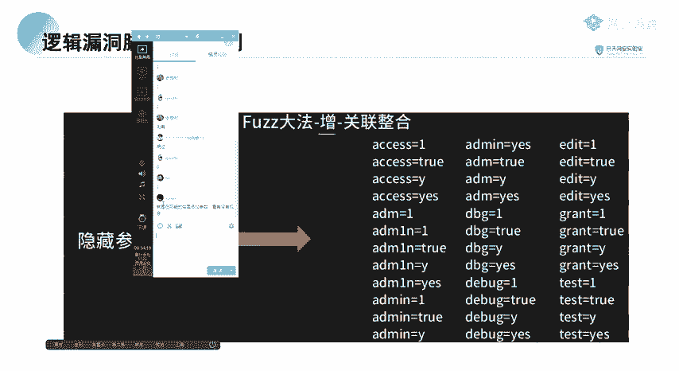

记住，挖掘逻辑漏洞需要保持**好奇心**和**发散性思维**，不放过请求包中的任何一个细节，敢于尝试各种看似“离谱”的修改。安全防护往往关注常规攻击路径，而这些非常规的“脑洞”测试，正是发现高危漏洞的关键所在。