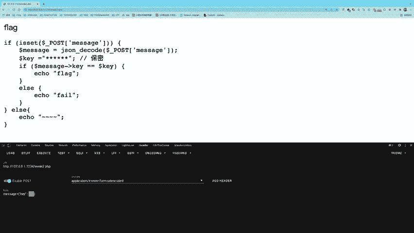
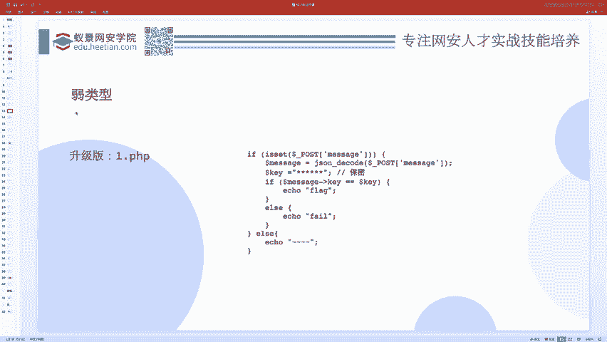
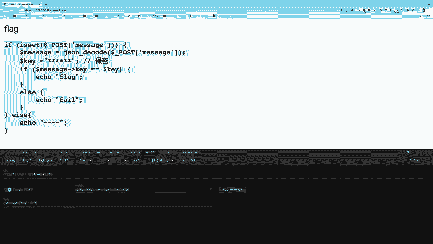

# 护网行动红蓝攻防教程：P49：01_弱类型问题 🔓

在本节课中，我们将要学习PHP语言中的弱类型问题。这是一个在Web安全，特别是CTF比赛中常见的考点。我们将通过理解PHP中两种不同的比较方式，来掌握如何利用弱类型比较的特性来发现和利用安全漏洞。

## 弱类型比较的原理

上一节我们介绍了课程概述，本节中我们来看看弱类型问题的核心原理。

PHP语言在判断两个值是否相等时，有两种方式：
*   **严格比较（`===`）**：它会同时判断两个值的**类型**和**值**是否都相同。
*   **松散比较（`==`）**：它只判断两个值的**值**是否相等，在比较前会尝试进行**类型转换**。

以下是两种比较方式的代码示例：
```php
var_dump(1 == true);   // 输出: bool(true)，因为1转换为布尔值true
var_dump(1 === true);  // 输出: bool(false)，因为类型（int vs bool）不同
```
松散比较为了“方便”开发者，会将不同类型的数据转换为相同类型后再比较，这有时会导致两个看似不同的值被判断为相等，从而引发安全问题。

## 字符串与数字的松散比较规则

理解了基本概念后，我们重点分析最常见的弱类型场景：字符串与数字的比较。

当使用松散比较（`==`）时，如果涉及数字与字符串的比较，PHP会尝试将**字符串转换为数值**，再进行比较。转换规则如下：

以下是字符串转数字的具体规则：
1.  转换从字符串**起始位置**开始。
2.  依次读取数字字符，直到遇到第一个**非数字字符**（包括小数点`.`、科学计数法`e/E`）为止。
3.  将读取到的数字字符序列转换为整数或浮点数。
4.  如果字符串**不是以数字开头**，则转换结果为**0**。

以下是几个转换示例：
*   `"123admin"` -> `123` （读取到`a`停止）
*   `"admin123"` -> `0` （开头非数字）
*   `"12e3abc"` -> `12000` （科学计数法，`12 * 10^3`）
*   `"0e12345"` -> `0` （`0 * 10^12345` 结果仍为0）

## 科学计数法的特殊情况

除了常规的数字转换，还有一种特殊情况需要特别注意。

当字符串的格式符合**科学计数法**（如 `数字 + e/E + 数字`）时，即使两个字符串看起来完全不同，在松散比较下也可能相等。这是因为它们都被当作数值计算，并且计算结果相同。

例如：
```php
var_dump("0e123" == "0e456"); // 输出: bool(true)
// 因为两者都被计算为 0 * 10^N，结果都是0。
```

## 实战演练：利用弱类型绕过验证

理论需要结合实践，现在我们来看一个具体的CTF题目，应用刚才学到的知识。

假设我们遇到以下PHP代码片段，目标是获取`flag`：
```php
$key = "a_secure_key_123"; // 这个值对我们不可见
$data = json_decode($_GET['message']);
if ($data->key == $key) {
    echo $flag;
}
```
题目要求我们通过GET参数`message`传入一个JSON数据，并且其`key`属性的值需要与服务器上的`$key`（未知）相等。


**解题思路：**
1.  代码使用了松散比较（`==`）。
2.  我们可以控制`$data->key`的类型和值。
3.  如果`$key`是字符串，且不是以数字开头（例如`"secret"`），那么它与数字`0`进行松散比较时，字符串`"secret"`会被转换为数字`0`。
4.  因此，我们构造`$data->key`为数字`0`，即可使条件成立。

**攻击Payload：**
我们传递的`message`参数值为：
```
{"key": 0}
```
这样，`$data->key`是整数`0`，与未知字符串`$key`比较时，`$key`被转为`0`，条件`0 == 0`成立，从而输出`flag`。

## 进阶：当密钥以数字开头时

如果上一题的方法失效了（返回`fail`），说明服务器密钥（`$key`）可能是以数字开头的字符串（例如`"123secret"`）。

在这种情况下，我们无法直接猜出完整密钥，但可以利用弱类型和**爆破**的思路。

**解题思路：**
1.  字符串`"123secret"`在松散比较中会被转换为数字`123`。
2.  因此，我们需要找到一个数字`N`，使得 `N == "123secret"` 成立。
3.  由于`N`是整数，我们可以在一个合理范围内（如0-10000）进行遍历尝试。

以下是使用Python进行爆破的示例代码：
```python
import requests
import json

url = "http://target.com/vuln.php"
for i in range(10000):
    payload = json.dumps({"key": i})
    params = {'message': payload}
    r = requests.get(url, params=params)
    if "flag{" in r.text: # 根据实际返回内容调整判断条件
        print(f"Found key: {i}")
        print(r.text)
        break
```
通过脚本，我们可以快速爆破出使条件成立的数字`N`（本例中为`123`），从而获得`flag`。

## 弱类型比较相等性矩阵

为了更全面地理解松散比较，我们可以参考以下相等性矩阵。它展示了不同类型值之间使用`==`比较时，哪些组合会返回`true`（标色部分）。这有助于我们在更复杂的逻辑中寻找可利用的点。

（此处可插入经典的PHP松散比较矩阵图，图中标色区域表示比较结果为`true`）

这个矩阵直观地展示了`false`、`0`、`"0"`、`""`、`null`、`array()`等值在松散比较中的复杂关系，是审计PHP代码时的重要参考。





## 总结



本节课中我们一起学习了PHP弱类型安全问题。我们首先理解了严格比较（`===`）与松散比较（`==`）的根本区别。然后，我们深入探讨了字符串与数字在松散比较时的转换规则，特别是科学计数法这一特例。接着，我们通过一个简单的CTF题目，实战演练了如何利用弱类型比较绕过身份验证。最后，对于更复杂的情况，我们介绍了结合爆破技术来解决问题的方法。

记住，弱类型问题源于开发者对`==`运算符的不当使用。在代码审计和攻防演练中，看到`==`就要警惕是否存在类型转换带来的非预期行为，这往往是漏洞挖掘的突破口。