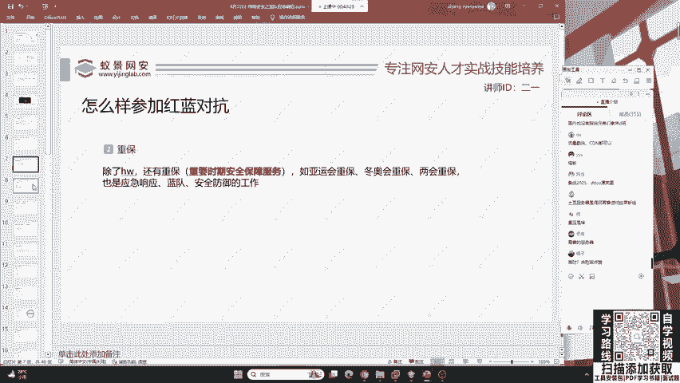
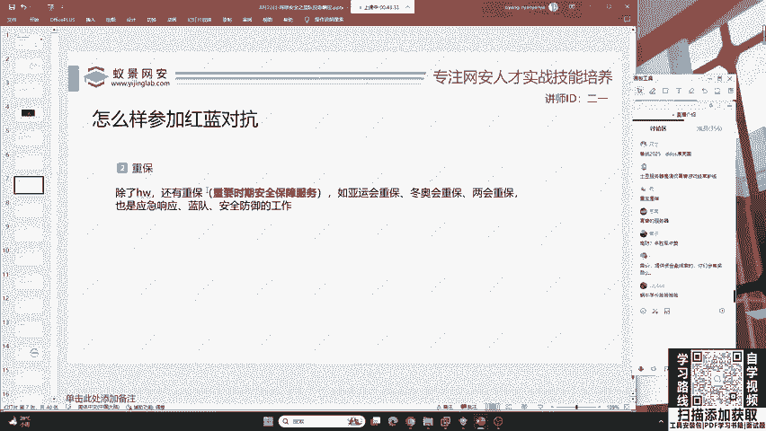
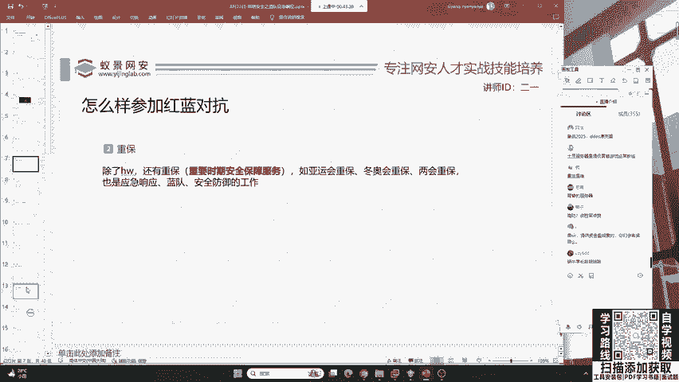

# 护网行动红蓝攻防教程：P4：蓝队应急响应-3.网络安全 🛡️

在本节课中，我们将要学习网络安全领域中的一种常见攻击手段——DDoS攻击。我们将了解其基本概念、攻击原理以及基础的防御思路，帮助初学者建立起对网络流量攻击的初步认识。

上一节我们介绍了应急响应的其他方面，本节中我们来看看网络安全中一个典型的威胁。

## DDoS攻击：拒绝服务

DDoS，全称为**分布式拒绝服务攻击**。其核心目的是通过海量的无效访问请求，耗尽目标服务器或网络资源的处理能力，从而导致合法用户无法获得正常服务。

我们可以通过一个简单的类比来理解：

> 假设一个餐厅仅有100个座位。一名攻击者雇佣了100个人进入餐厅，占满所有座位，但他们既不点餐也不就餐。这导致真正想来吃饭的顾客无法进入餐厅，餐厅的正常营业服务被“拒绝”。

在网络世界中，原理类似。一个网站服务器能同时处理的用户连接数是有限的（例如1万个）。攻击者操控成千上万台被控制的“肉鸡”（傀儡计算机）同时向该网站发送访问请求。当请求数量远超服务器的处理上限时，服务器就会因资源耗尽而瘫痪、响应缓慢甚至崩溃，使得正常用户无法访问。

其攻击效果可以形象地理解为：`正常服务器 -> 超载 -> 土豆服务器（无法访问）`。

## 关于DDoS的常见问题

在理解了DDoS的基本概念后，以下是初学者可能关心的一些问题。

**1. 护网行动中允许使用DDoS吗？**
不允许。在正规的护网攻防演练或“重保”（重要时期安全保障）行动中，DDoS攻击通常是被禁止的。这类攻击多为破坏性行为，常见于真实的网络犯罪或境外黑客组织对国家关键基础设施的恶意冲击。

**2. DDoS攻击发生在何时？**
在国家举办重大活动期间，如冬奥会、亚运会等，相关网站和信息系统常成为境外黑客DDoS攻击的重点目标，以图破坏活动的顺利运行。

**3. 如何防御DDoS攻击？**
防御DDoS的主要思路是识别并过滤恶意流量，确保正常流量通过。常见的解决方案是使用**高防服务器**或**高防IP**。
*   **原理**：高防服务具备强大的流量清洗能力。它能实时分析访问流量，识别出DDoS攻击特征，并将恶意流量拦截或引流到清洗中心，只将正常流量转发给源站服务器。
*   **类比**：就像餐厅配备了保安和智能管理系统，能识别出占座不消费的人群并将其请出，保证就餐座位始终处于有效流动状态。

**4. 什么是“重保”？**
“重保”是“重要时期安全保障”的简称。指在国家举行重大会议、赛事等活动期间，网络安全团队执行的一系列高强度安全监测与防御工作，以确保相关网络和信息系统万无一失。

## 总结

本节课中我们一起学习了网络安全中的DDoS攻击。我们了解到DDoS是一种通过海量流量耗尽目标资源的攻击方式，它在真实网络犯罪和国家级对抗中较为常见。在防御上，通常采用具备流量清洗能力的“高防”服务来应对。理解这些基础概念，是蓝队成员进行应急响应和网络安全防护的重要一环。

---
*下一节，我们将探讨国家日益重视的另一个安全领域：数据安全。*