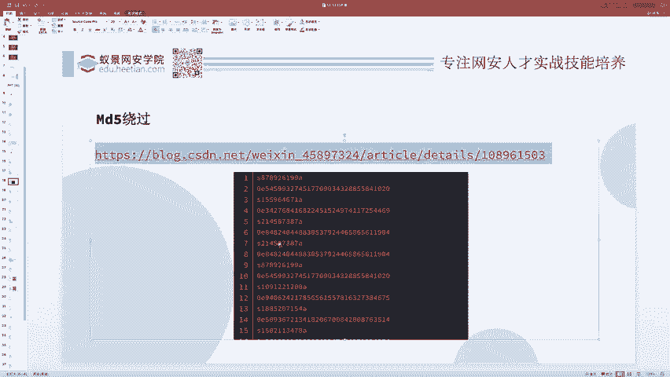
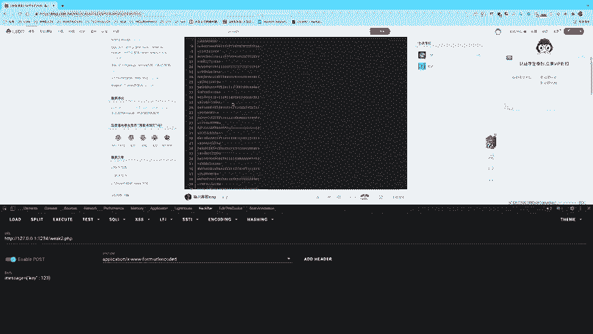
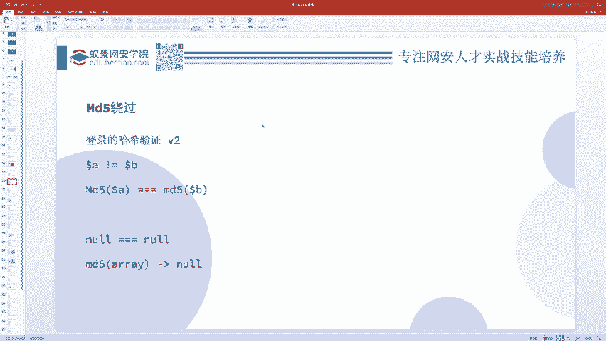
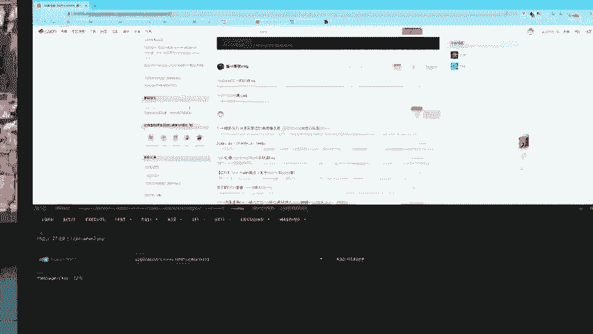
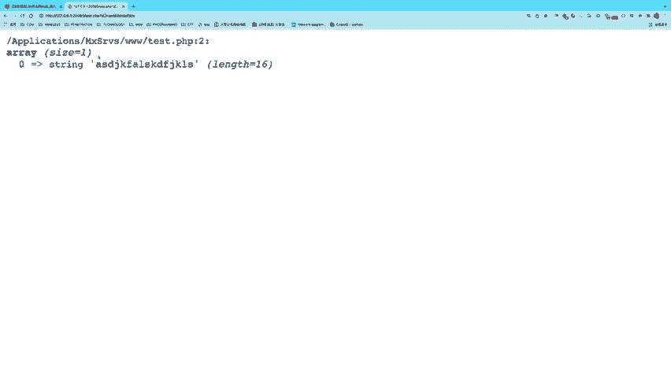
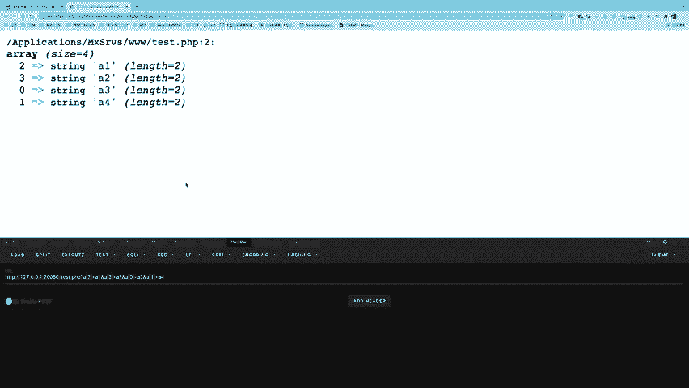
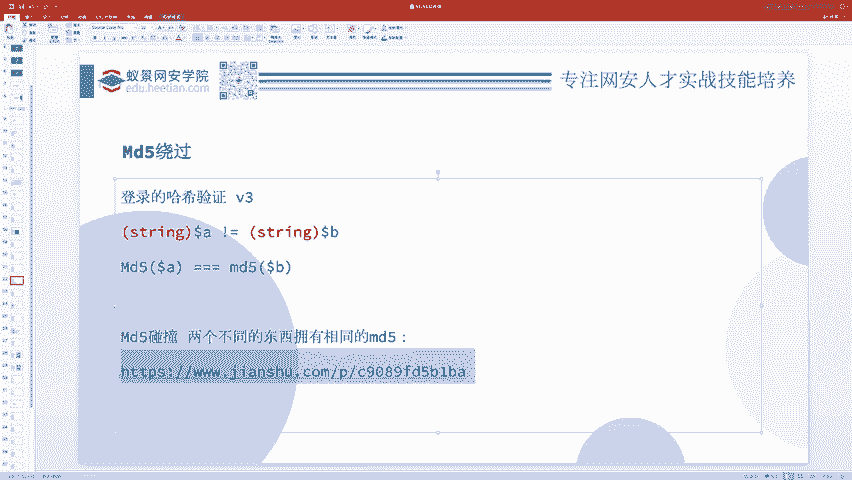
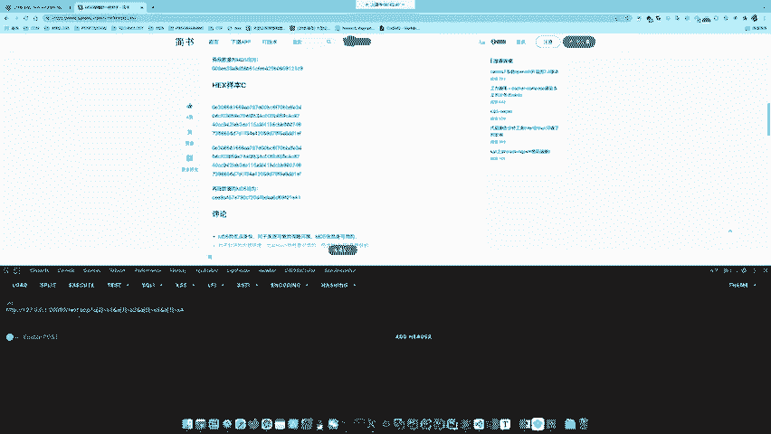
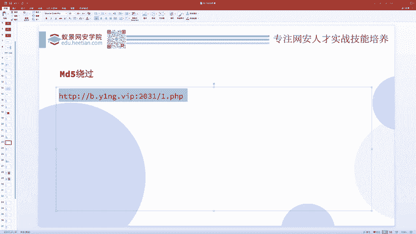
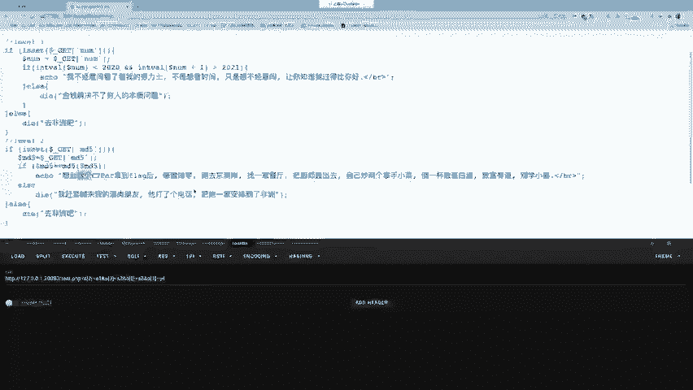

# 护网行动红蓝攻防教程：P50：哈希（MD5）绕过问题 🔑

在本节课中，我们将要学习哈希（特别是MD5）的绕过问题。这是弱类型问题的一个具体应用与延伸。掌握了弱类型，哈希绕过问题就迎刃而解。我们将通过一个具体的题目，讲解三种主要的绕过方法，并确保内容简单直白，让初学者能够看懂。

## 问题概述

假设有一个题目，要求用户提交两个变量 `$a` 和 `$b`。这两个变量需要满足以下条件：
1.  `$a` 和 `$b` 不相等。
2.  但 `md5($a)` 和 `md5($b)` 可以相等（弱相等）。

这本质上就是要求找到两个不同的字符串，但它们的MD5哈希值在弱比较下相等。

## 方法一：利用科学计数法字符串绕过弱相等





上一节我们介绍了弱类型比较，本节中我们来看看如何利用它来解决哈希绕过问题。当MD5函数处理以“0e”开头的纯数字字符串时，PHP会将其视为科学计数法。在弱比较（`==`）中，两个科学计数法表示的0会被认为是相等的。



以下是满足条件的字符串对示例：
*   `$a = “0e830400451993494058024219903391”`
*   `$b = “0e462097431906509019562988736854”`



它们的MD5值分别是：
*   `md5($a) = “0e830400451993494058024219903391”`
*   `md5($b) = “0e462097431906509019562988736854”`

在弱比较 `md5($a) == md5($b)` 时，两者都被当作数字 `0` 处理，因此相等。而 `$a` 和 `$b` 本身作为字符串并不相等。

你可以从专门的资料库中找到许多这类现成的字符串对。

## 方法二：利用数组绕过强相等



现在我们把问题升级：如果要求 `md5($a)` 和 `md5($b)` 必须严格相等（强相等，使用 `===`），该怎么办？

这时就可以使用数组。当 `md5()` 函数的参数是一个数组时，函数会报出一个警告（Warning），但会继续执行并返回 `NULL`。

以下是演示代码：
```php
$a = array(“abc”);
$b = array(“def”);
var_dump(md5($a)); // 输出：NULL
var_dump(md5($b)); // 输出：NULL
```
因此，`md5($a) === md5($b)` 成立，因为两者都是 `NULL`，而 `$a` 和 `$b` 作为两个不同的数组，并不相等。

那么，如何通过URL传递一个数组参数呢？方法很简单，在参数名后加上中括号 `[]` 即可。
*   传递单个值：`?a[]=123`
*   传递多个值：`?a[]=123&a[]=456`
*   指定键名：`?a[x]=123&a[y]=456`

这种传参方式有时能用于绕过一些安全检查。例如，题目可能检查 `$a[0]` 和 `$a[1]`，但实际拼接执行的却是数组的前两个元素。通过构造 `?a[2]=payload&a[3]=payload&a[0]=normal&a[1]=normal`，就可以让检查落在“normal”上，而让危险的“payload”被拼接执行。



## 方法三：进行真正的MD5碰撞



最后，我们来看最严格的情况：要求 `$a` 和 `$b` 必须是字符串，并且 `md5($a)` 和 `md5($b)` 必须强相等（`===`）。



在这种情况下，前两种方法都失效了。我们只能寻找两个不同的原始数据（明文），使它们经过MD5计算后得到完全相同的哈希值，这就是**MD5碰撞**。MD5算法已被证明存在碰撞的可能性，因此可以找到这样的数据对。



网络上存在公开的MD5碰撞实例，例如两张内容不同但MD5值完全相同的图片，或者两个不同的十六进制字符串具有相同的MD5值。在CTF比赛中，可能会直接提供这样的碰撞值，或者需要选手利用工具自行生成。

**一个常见的迷惑点**：有时题目变量名会具有误导性。例如，题目要求一个名为 `$md5` 的变量，并检查 `md5($md5) == $md5`。不要被变量名“md5”迷惑，它只是一个普通的字符串变量。解决思路依然是寻找一个字符串，其MD5值与该字符串本身满足弱相等关系，即我们**方法一**中提到的“0e”开头的科学计数法字符串。

例如，字符串 `“0e215962017”` 的MD5值是 `“0e291242476940776845150308577824”`，在弱比较中两者都等于0，因此满足 `md5($md5) == $md5`。

## 总结



本节课中我们一起学习了哈希（MD5）绕过的三种主要方法：
1.  **弱相等绕过**：利用以“0e”开头的科学计数法字符串，使MD5值在弱比较（`==`）下相等。
2.  **数组绕过**：向 `md5()` 函数传入数组，使其返回 `NULL`，从而绕过强相等（`===`）检查。
3.  **MD5碰撞**：寻找两个不同的明文，使其MD5值严格相同，用于应对最严格的字符串强相等检查。

理解这些方法的核心在于牢固掌握PHP的弱类型特性，并灵活运用。在实战中，要仔细审题，不要被题目表面的变量名或描述所误导。