# 护网行动红蓝攻防教程：P51：03_变量覆盖问题 🔄

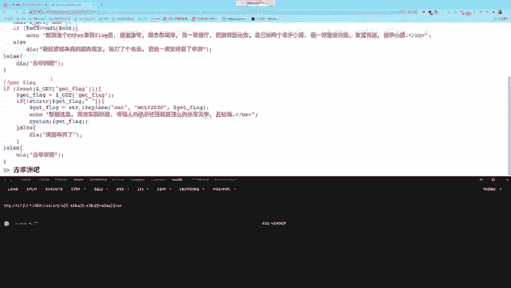

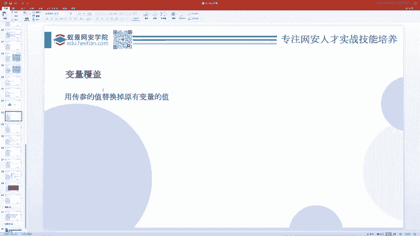

在本节课中，我们将要学习PHP中的变量覆盖问题。变量覆盖本身并非高危漏洞，但它可能为后续的危险操作创造条件，是渗透测试中需要理解的一个关键概念。

## 什么是变量覆盖？

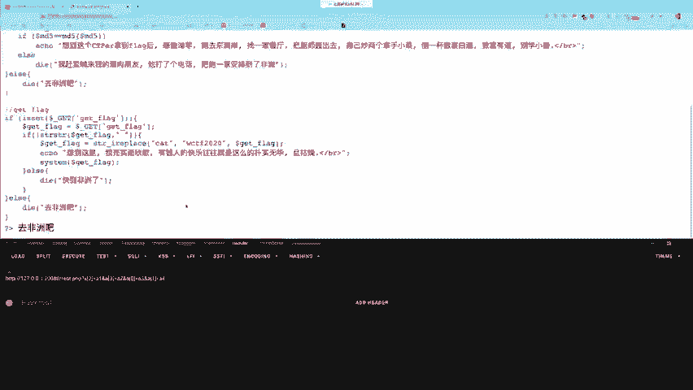

变量覆盖，顾名思义，是指一个变量的值被另一个值所取代。在PHP中，变量可以被定义和赋值。例如，我们定义一个变量 `$A` 并赋值为 `ABC`，随后将其值覆盖为 `DEF`。

```php
$A = "ABC";
$A = "DEF"; // 变量 $A 的值被覆盖
```

如果攻击者能够控制覆盖过程，并影响后续使用该变量的代码逻辑，就可能引发安全问题。

## 导致变量覆盖的关键函数

变量覆盖通常与两个函数有关：`extract()` 和 `parse_str()`。虽然历史上 `import_request_variables()` 也有此功能，但它在PHP 5.4.0后已被废弃，我们不再讨论。

### 1. extract() 函数

`extract()` 函数能将数组中的键值对转换为变量，其中**键**作为变量名，**值**作为变量值。

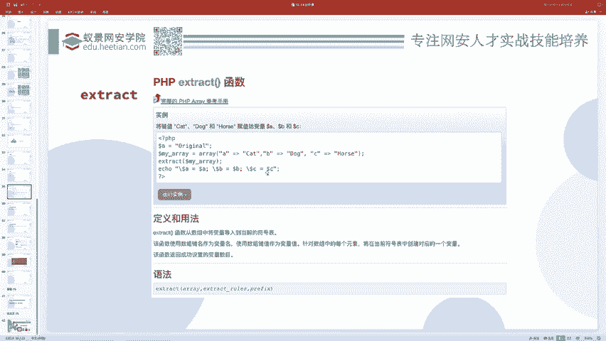

```php
$A = "origin";
$arr = array("A" => "cat", "B" => "dog", "C" => "horse");
extract($arr);
echo $A; // 输出: cat
echo $B; // 输出: dog
echo $C; // 输出: horse
```

在上面的例子中，`extract()` 创建了变量 `$B` 和 `$C`，并覆盖了已存在的变量 `$A` 的值。这个函数本意是方便开发，但如果开发者允许用户控制传入的数组，就可能覆盖掉程序内部重要的变量。

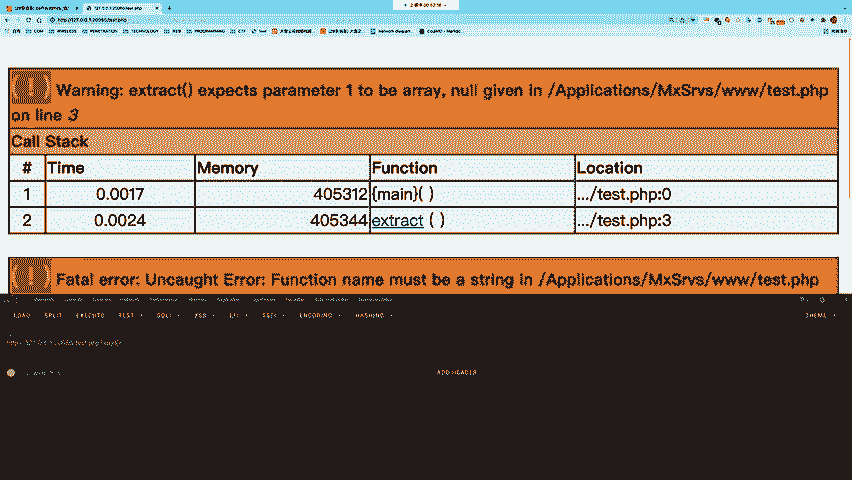

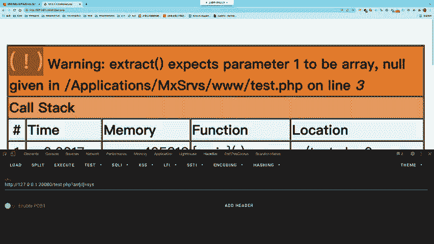

### 2. parse_str() 函数

`parse_str()` 函数用于将查询字符串解析到变量中，其功能与 `extract()` 类似。

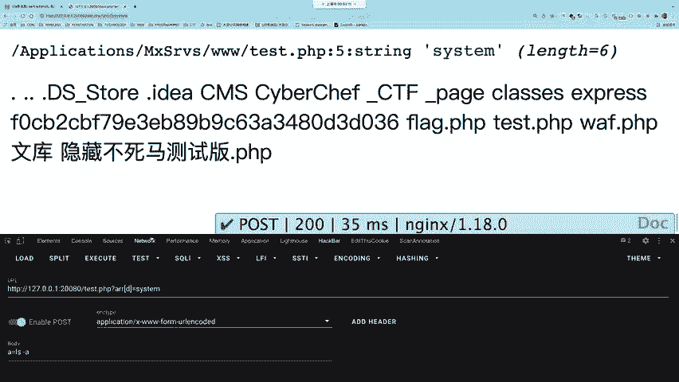

```php
parse_str("name=Bob&age=60");
echo $name; // 输出: Bob
echo $age;  // 输出: 60
```

它同样可以将解析结果存入指定的数组。

```php
parse_str("name=Bob&age=60", $myArray);
print_r($myArray); // 输出: Array ( [name] => Bob [age] => 60 )
```

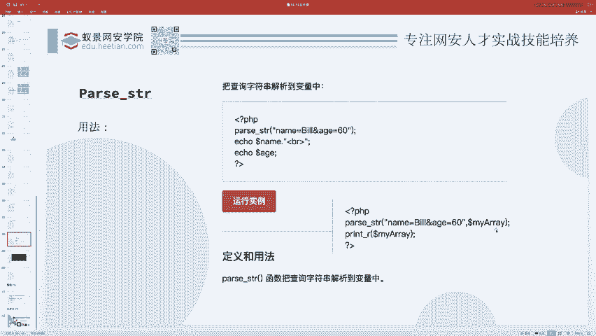

## 变量覆盖如何导致安全问题？

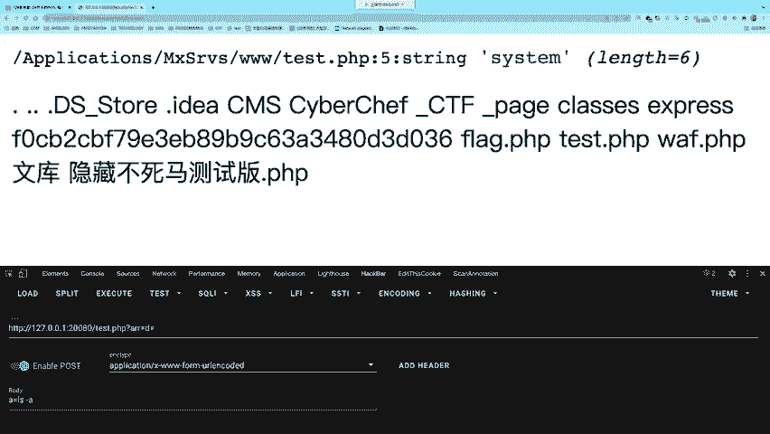

单独看变量覆盖并无危害。危险在于，覆盖变量后，后续的代码逻辑如果使用了这些被篡改的变量，就可能执行恶意操作。

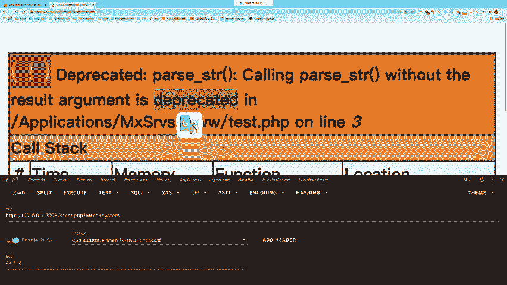

上一节我们介绍了导致变量覆盖的函数，本节中我们来看看一个具体的攻击示例。

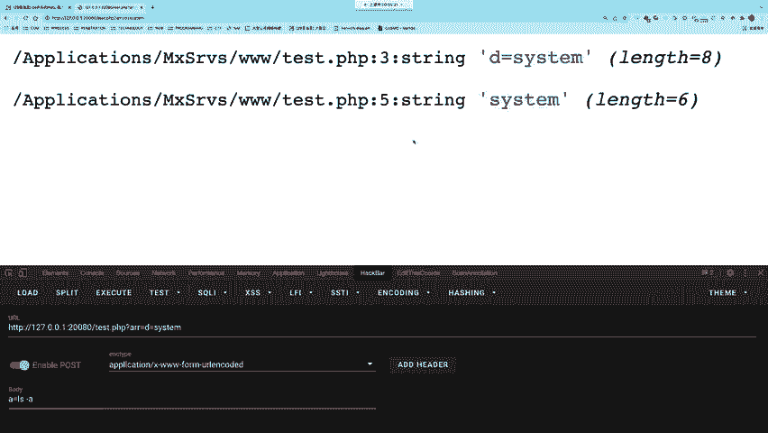

考虑以下代码：
```php
$arr = $_GET[‘arr’];
extract($arr);
$D($A);
```

这段代码的逻辑是：
1.  从GET参数 `arr` 获取一个数组。
2.  使用 `extract()` 将该数组转换为变量。
3.  动态调用函数，函数名和参数来自新生成的变量。

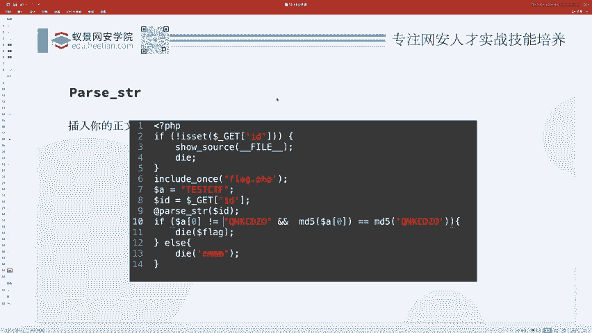

攻击者可以这样利用：
1.  构造GET请求：`?arr[D]=system&arr[A]=ls`
2.  `extract()` 后，会生成 `$D = “system”` 和 `$A = “ls”`。
3.  代码执行 `$D($A)` 即 `system(“ls”)`，从而在服务器上执行系统命令。

`parse_str()` 的利用方式与之类似：
```php
$arr = $_GET[‘arr’];
parse_str($arr);
$D($A);
```
攻击者传入 `?arr=D=system&A=ls` 即可达到同样效果。

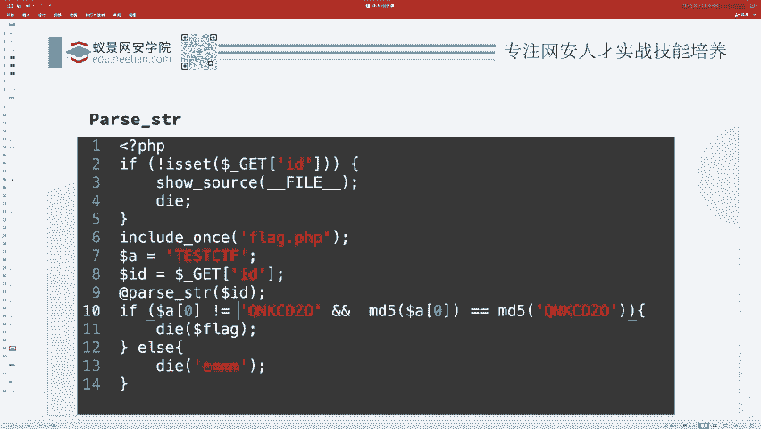

## 综合案例分析

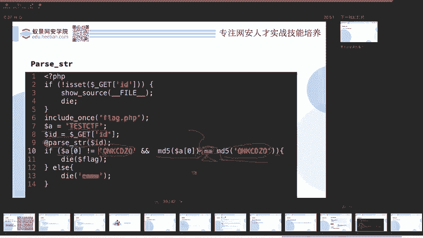

现在，我们将前面学到的知识综合起来，分析一道稍复杂的题目。

题目源码逻辑如下：
```php
$id = $_GET[‘id’];
parse_str($id);
if ($a[0] != ‘QNKCDZO’ && md5($a[0]) == md5(‘QNKCDZO’)) {
    echo “flag{xxx}”;
}
```

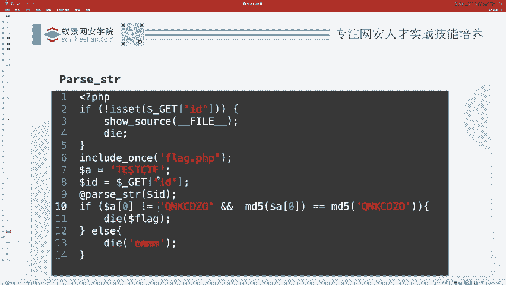

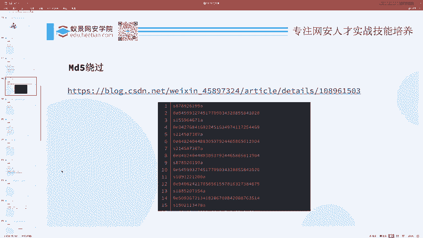

解题思路分析：
1.  **变量覆盖**：`parse_str($id)` 允许我们通过 `id` 参数覆盖变量 `$a`。
2.  **条件绕过**：需要满足 `$a[0] != ‘QNKCDZO’` 但 `md5($a[0]) == md5(‘QNKCDZO’)`。
3.  **MD5弱类型比较**：`==` 是弱比较。经查，`md5(‘QNKCDZO’)` 的结果是 `0e830400451993494058024219903391`，这是一个以 `0e` 开头的科学计数法字符串，在弱比较时会被视为数字 `0`。
4.  **寻找碰撞**：我们需要找到另一个MD5值也是 `0e` 开头的字符串，例如 `s878926199a`。
5.  **构造Payload**：我们需要让 `$a` 成为一个数组，且 `$a[0]` 的值为 `s878926199a`。根据 `parse_str` 的解析规则，可以构造如下Payload：

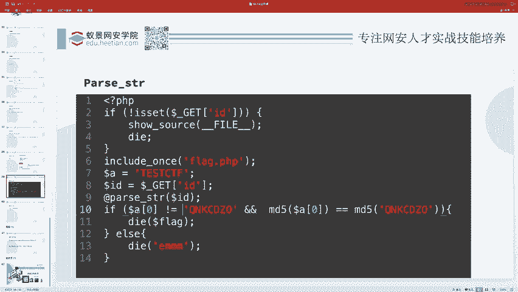

```
?id=a[0]=s878926199a
```

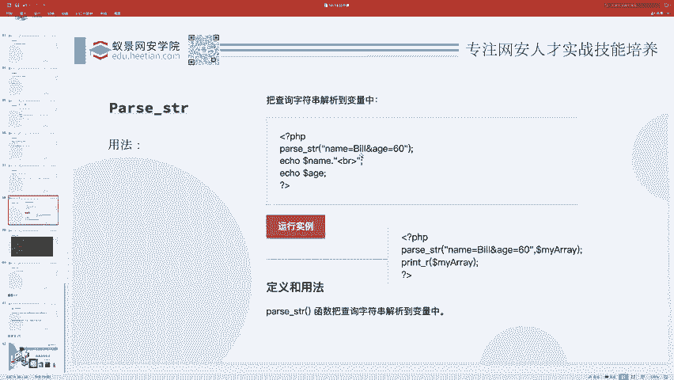

当代码执行时：
*   `parse_str(“a[0]=s878926199a”)` 会创建数组 `$a = array(0 => ‘s878926199a’)`。
*   条件判断：`$a[0] (‘s878926199a’) != ‘QNKCDZO’` 成立。
*   `md5(‘s878926199a’)` 的结果也是 `0e` 开头，在弱比较中等于 `md5(‘QNKCDZO’)` (即数字0)。
*   因此，条件成立，输出flag。

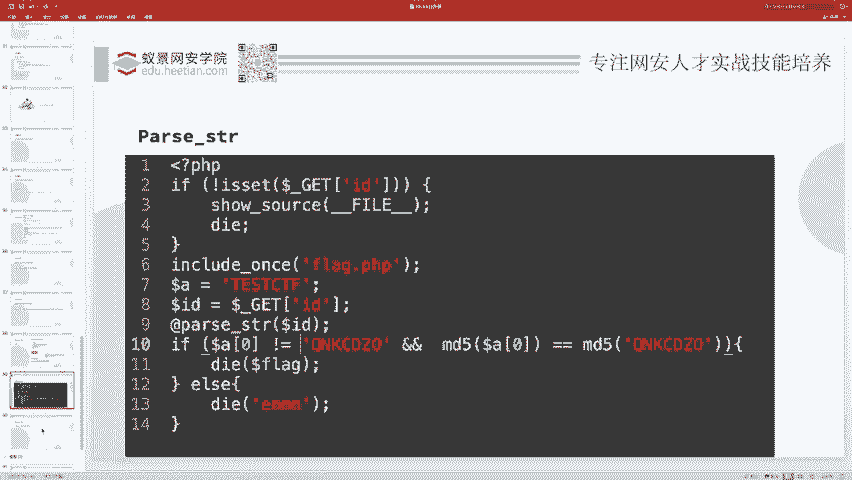

## 本节课总结

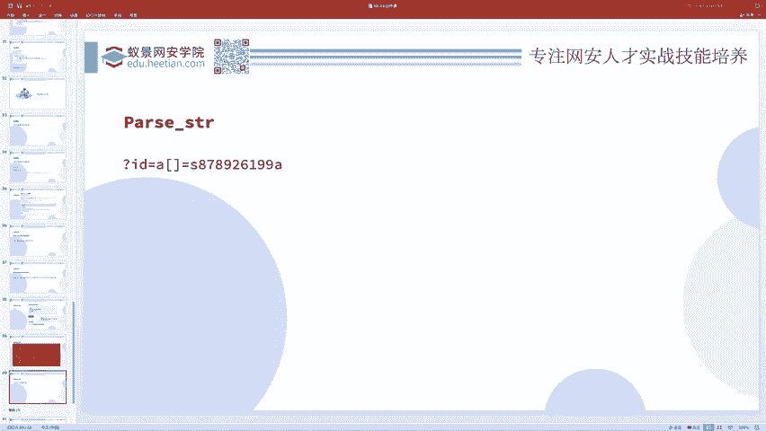

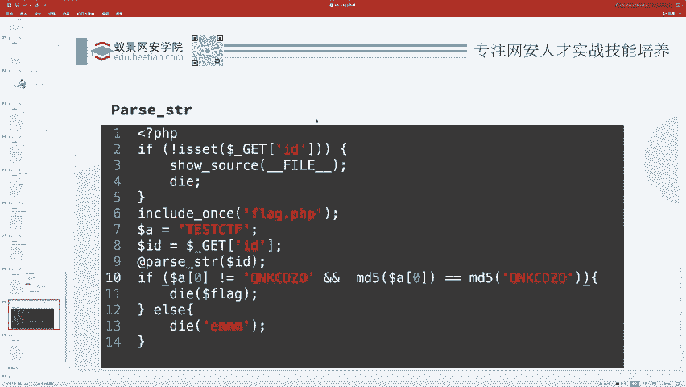

本节课中我们一起学习了PHP中的变量覆盖问题。我们首先了解了变量覆盖的基本概念，然后重点分析了导致此问题的两个关键函数：`extract()` 和 `parse_str()`。我们通过实例看到，变量覆盖本身不危险，危险的是后续代码对被覆盖变量的不当使用。最后，我们通过一个综合案例，将变量覆盖与之前学过的MD5弱类型比较相结合，完成了题目的分析与破解。理解这些基础但关键的原理，是构建完整Web安全知识体系的重要一步。