# 网络安全：P52：04_命令执行漏洞 🛡️

在本节课中，我们将要学习命令执行漏洞。这是一种常见的Web安全漏洞，攻击者可以利用它让Web应用程序在服务器操作系统上执行任意命令。我们将从漏洞的原理、产生条件、危害以及一个简单的例子入手，帮助你理解这一核心概念。

## 命令执行漏洞原理

上一节我们介绍了命令执行漏洞的基本概念，本节中我们来看看它的具体原理。

命令执行漏洞的本质是：Web应用程序在调用系统命令时，由于未对用户输入进行严格过滤，导致攻击者可以注入并执行恶意的系统命令。

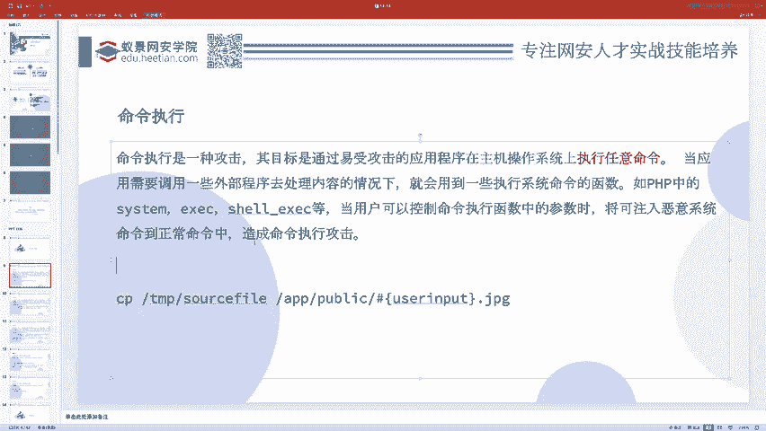

为什么会发生这种情况？因为应用程序有时需要调用外部程序来处理某些内容，这时就会用到执行系统命令的函数。

例如，一个PHP开发者想通过代码创建一个目录。他可能不知道如何使用PHP内置函数来创建目录，但知道在Linux系统中可以使用 `mkdir` 命令。因此，他可能会选择调用系统命令来实现这个功能。

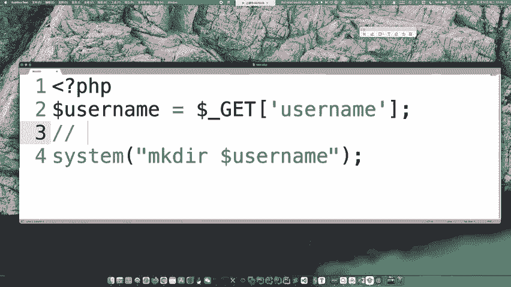

在PHP中，可以使用 `system()`、`exec()`、`shell_exec()` 等函数来执行系统命令。

```php
<?php
system('mkdir abc');
?>
```

这段代码本身没有问题，因为它执行的命令是固定的（`mkdir abc`），用户无法控制。漏洞的产生源于**命令的一部分由用户输入控制**。

## 漏洞产生条件与示例

理解了原理后，我们来看看漏洞产生的具体条件。命令注入攻击想要成功，必须满足两个核心条件：

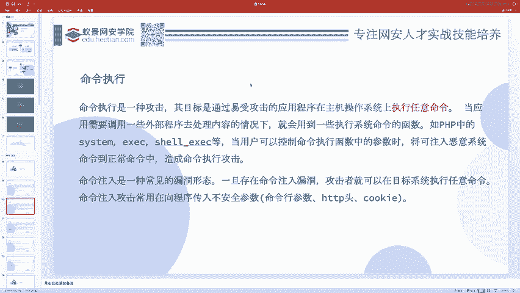

1.  应用程序使用了可以执行系统命令的函数。
2.  该函数执行的命令中，有一部分内容完全或部分地由用户输入控制。

用户通常通过向应用程序传递参数（如URL参数、表单数据）来控制这部分内容。如果这些参数被直接拼接到系统命令中，就可能产生漏洞。

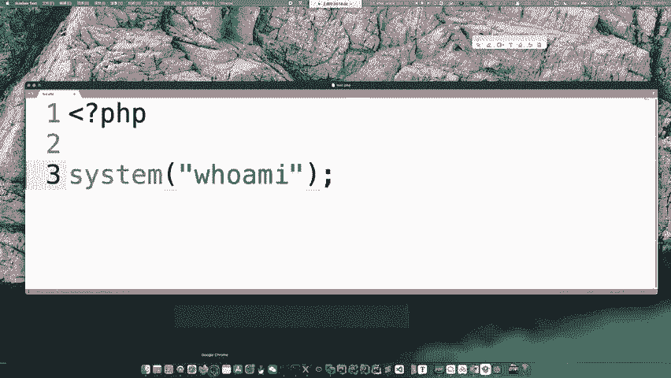

以下是一个存在漏洞的代码示例：

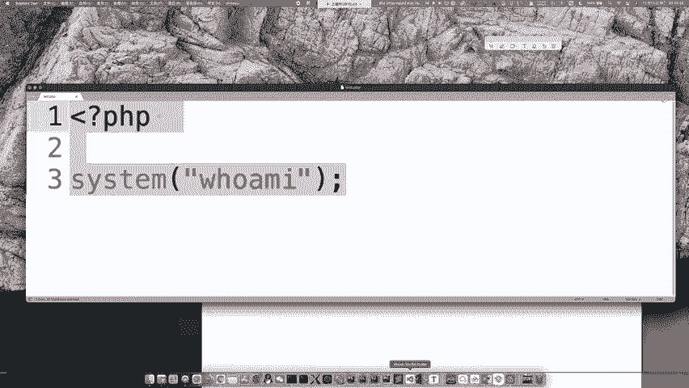

```php
<?php
$username = $_GET['username']; // 用户可控的输入
system("mkdir $username"); // 将用户输入直接拼接到命令中
?>
```

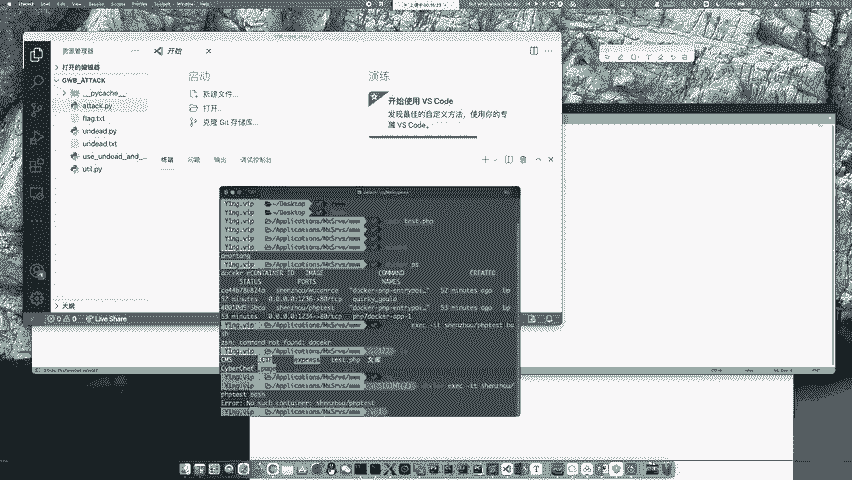

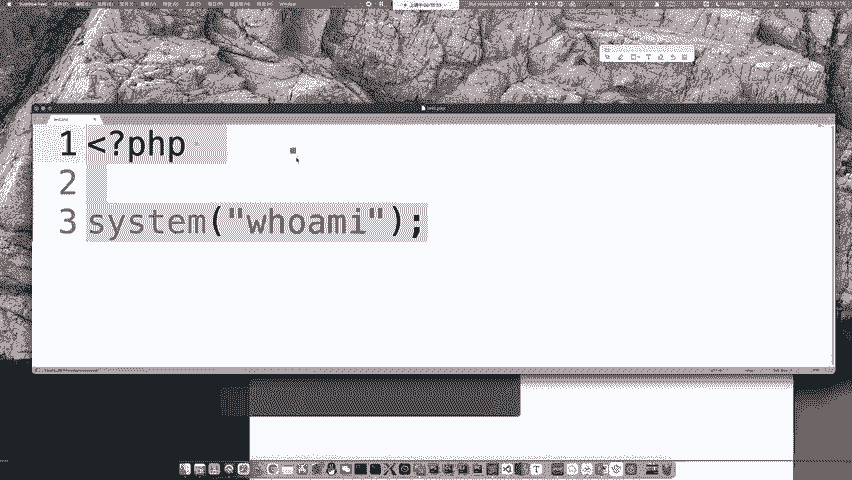

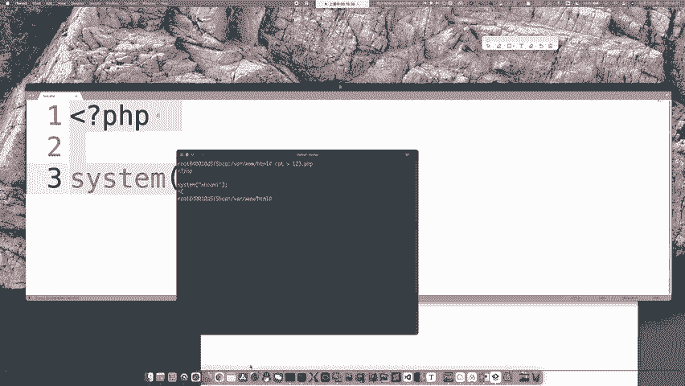

这段代码的本意是：根据用户输入的用户名，创建一个同名目录。
*   **正常输入**：如果用户输入 `abc`，则执行的命令是 `mkdir abc`，会创建 `abc` 目录。
*   **恶意输入**：如果攻击者输入 `abc; cat /flag`，则拼接后的命令变为 `mkdir abc; cat /flag`。

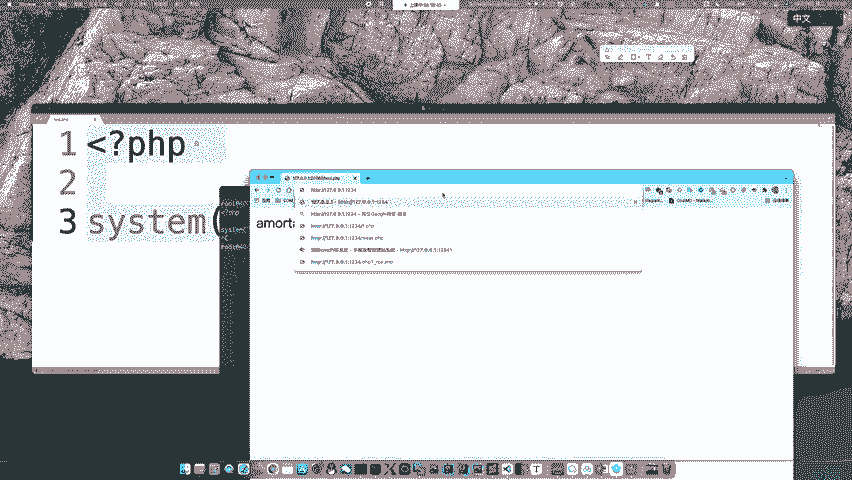

在Linux中，分号 `;` 用于分隔同一行中的多个命令。因此，上述命令会依次执行：
1.  `mkdir abc` （创建目录）
2.  `cat /flag` （读取flag文件内容）

这样，攻击者就通过注入分号和`cat /flag`命令，实现了越权操作，这就是一个典型的命令注入攻击。


## 命令执行的权限问题

在利用命令执行漏洞时，权限是一个至关重要的因素。本节我们来探讨执行命令的权限及其影响。

执行系统命令的是Web服务器进程（如Apache、Nginx），而非攻击者直接操作。因此，命令是以Web服务器运行用户的权限执行的，在Linux系统中，这个用户通常是 `www-data`。

这个权限与系统最高权限 `root` 相比是受限的。`www-data` 用户一般无法执行关机、停止关键服务、修改系统核心文件等操作。

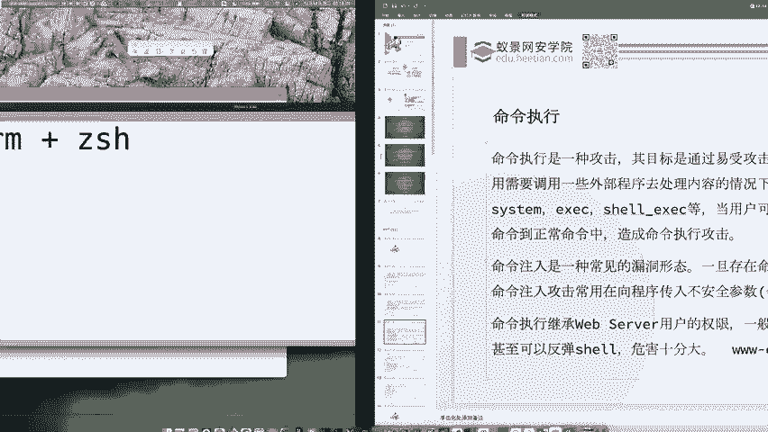

**权限的影响主要体现在对文件的操作上**：
*   **读操作**：通常可以执行。攻击者可以查看应用程序源代码、配置文件、甚至系统文件（如 `/etc/passwd`），从而窃取敏感信息。
*   **写/删操作**：受限制。只能写入或删除 `www-data` 用户拥有写权限的目录中的文件（如Web目录 `/var/www/html`）。

**实战场景（AWD攻防赛）**：
在AWD比赛中，常遇到对手写入的Webshell无法删除的情况。这是因为Webshell是由 `www-data` 用户写入的，文件所有者是 `www-data`，而防守方通常使用另一个用户（如 `ctf`）通过SSH登录进行维护。`ctf` 用户没有权限删除 `www-data` 用户的文件。

**解决方案**：
给自己写入一个Webshell，然后通过这个Webshell去删除对手的Webshell。因为通过Web访问自己的Shell时，执行命令的权限是 `www-data`，此时删除同属 `www-data` 的文件就拥有了权限。

## 常见的危险函数

识别危险函数是发现漏洞的第一步。以下是PHP中与命令/代码执行相关的一些常见危险函数：

**执行系统命令的函数**：
*   `system()`：执行外部程序并显示输出。
*   `exec()`：执行外部程序。
*   `shell_exec()`：通过Shell执行命令，并将完整输出以字符串返回。
*   `passthru()`：执行外部程序并显示原始输出。
*   `popen()` / `proc_open()`：打开进程文件指针。
*   **反引号 `` ` ``**：这是 `shell_exec()` 的简写形式，功能相同。

**执行PHP代码的函数**：
*   `eval()`：把字符串作为PHP代码执行。
*   `assert()`：检查一个断言是否为 `FALSE`（常用于代码执行）。
*   `preg_replace()` + `/e` 修饰符（在PHP 5.5.0后已废弃）：执行正则替换。

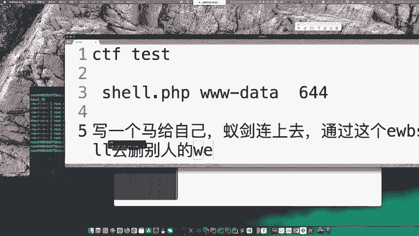

## 漏洞利用实战演示

最后，我们通过一个简单的靶场环境来演示如何发现和利用命令执行漏洞。

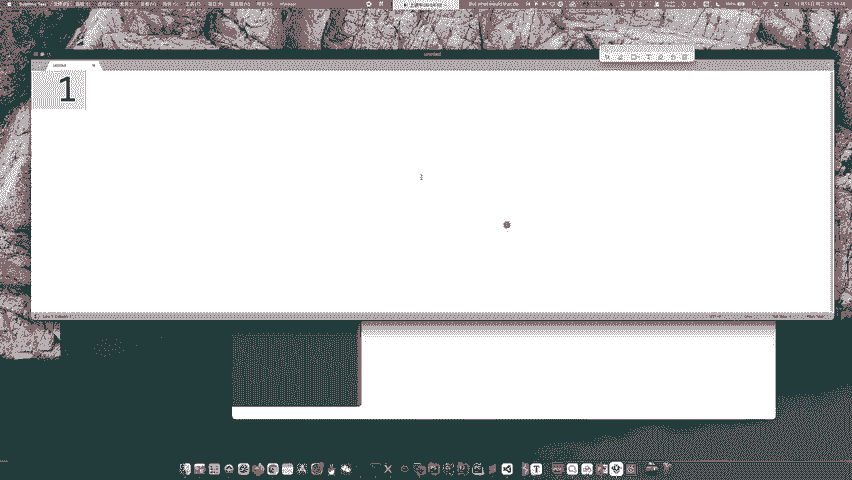

假设存在以下PHP代码（`cmd.php`）：
```php
<?php
if (isset($_GET['ip'])) {
    $ip = $_GET['ip'];
    system("ping -c 4 $ip"); // 将用户输入的ip参数直接拼接到ping命令中
} else {
    highlight_file(__FILE__);
}
?>
```

这段代码的功能是接收一个 `ip` 参数，然后执行 `ping` 命令探测该IP地址。

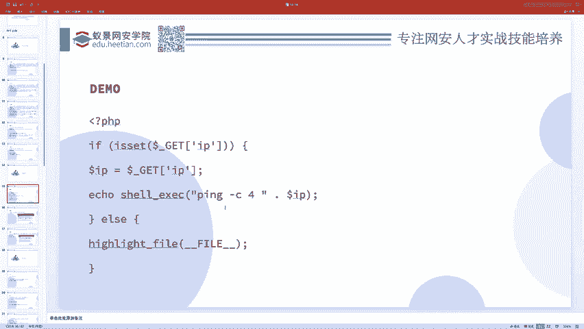

**正常访问**：
访问 `http://target/cmd.php?ip=127.0.0.1`
服务器会执行命令：`ping -c 4 127.0.0.1`，并返回结果。

**漏洞利用**：
利用分号 `;` 注入额外命令。
访问 `http://target/cmd.php?ip=127.0.0.1; ls -l`
服务器实际执行的命令变为：`ping -c 4 127.0.0.1; ls -l`
这条命令会先执行 `ping`，然后执行 `ls -l` 列出当前目录下的文件。攻击者成功实现了命令注入，可以进一步探测服务器信息。

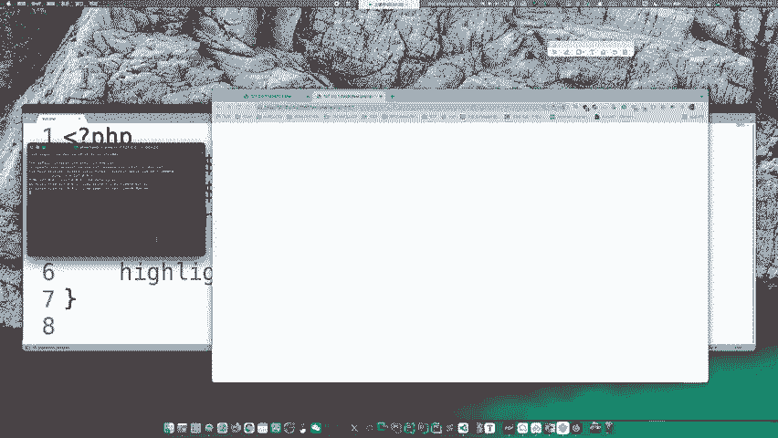

---

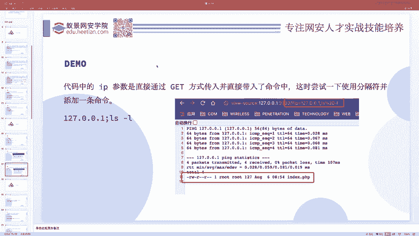

本节课中我们一起学习了命令执行漏洞。我们了解了它的核心原理是“用户输入被拼接到系统命令中执行”，掌握了漏洞产生的两个必要条件，认识了执行命令的权限限制及其在实战中的影响，并学习了PHP中相关的危险函数。最后，通过一个简单的靶场演示，我们直观地看到了漏洞的利用过程。理解这些基础知识，是进行安全审计和渗透测试的第一步。