# 护网行动红蓝攻防教程：P55：07_无字母数字RCE和create_function

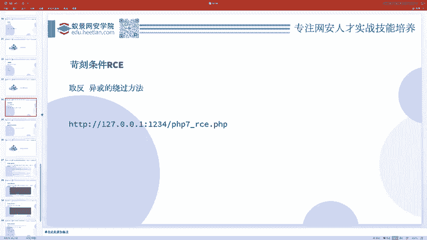

在本节课中，我们将要学习PHP代码执行中的两种特殊场景：无字母数字的命令执行绕过，以及`create_function`函数可能存在的代码注入风险。这些是CTF比赛和实际渗透测试中可能遇到的典型问题。

## 无字母数字RCE的挑战

上一节我们介绍了常规的代码执行，本节中我们来看看当代码执行遇到严格过滤时该如何应对。

一种常见的限制是过滤所有字母和数字。这意味着我们无法直接使用像`system`、`cat`这样的函数名或命令。然而，PHP提供了通过运算（如异或、取反）来动态生成字符串的特性，这为我们绕过过滤提供了可能。

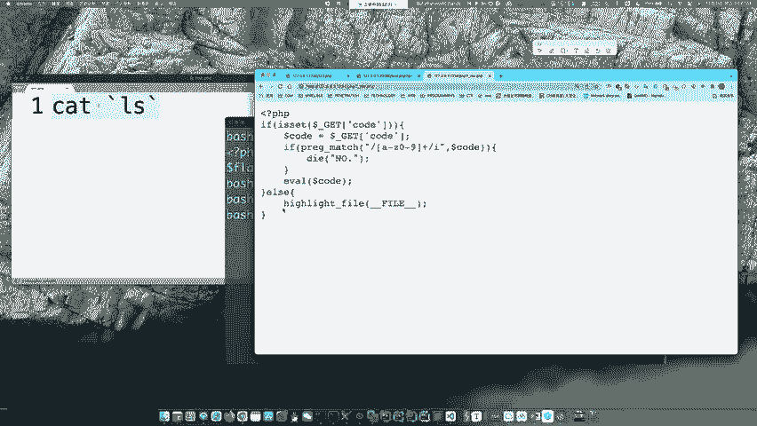

### PHP动态函数调用

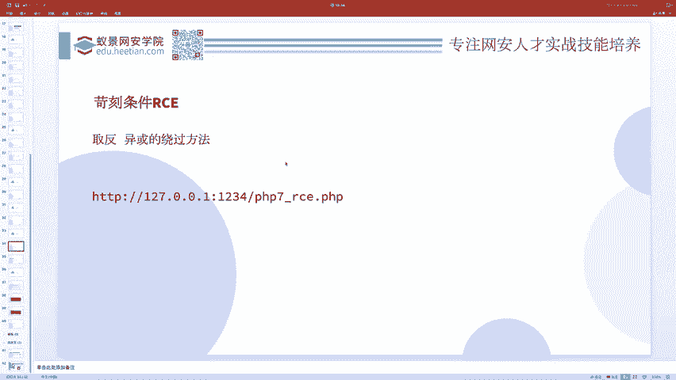

理解绕过的关键在于一个PHP特性：**动态函数调用**。如果一个变量包含一个字符串，且该字符串与某个函数名相同，那么通过给该变量加上括号，即可调用对应的函数。

**示例代码：**
```php
$func = "phpinfo";
$func(); // 这将执行 phpinfo() 函数
```

因此，我们的目标就转变为：**在不使用字母和数字的情况下，构造出我们想要的函数名字符串（如`system`）和参数（如`ls`）**。

### 利用异或运算构造字符串

异或运算可以帮助我们将非字母数字的字符组合，运算得到我们需要的字母或数字。以下是构造字符串`phpinfo`的示例思路。

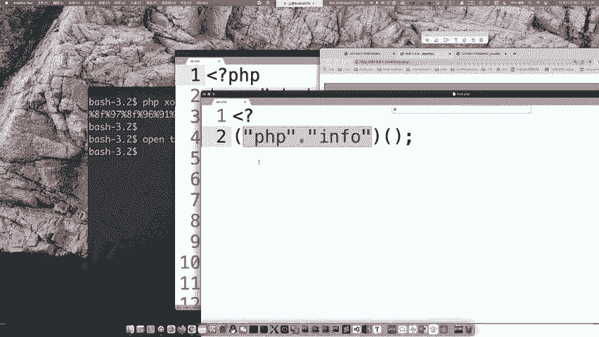

**核心步骤：**
1.  选择两个或多个非字母数字的字符进行异或运算。
2.  运算结果恰好是我们目标字符串中的字符。
3.  拼接这些运算结果，得到目标函数名的字符串。

**概念公式（示意）：**
`‘非字母字符A‘ ^ ‘非字母字符B‘ = ‘目标字母C‘`

通过精心构造，我们可以得到字符串`phpinfo`，然后利用动态调用执行它。同理，可以构造`system(‘ls‘)`等。

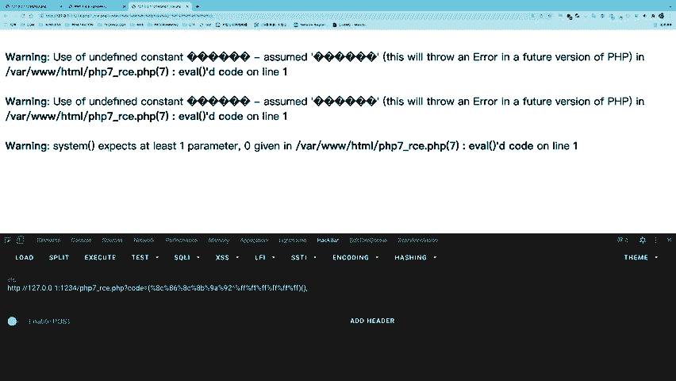

### 利用取反运算构造字符串

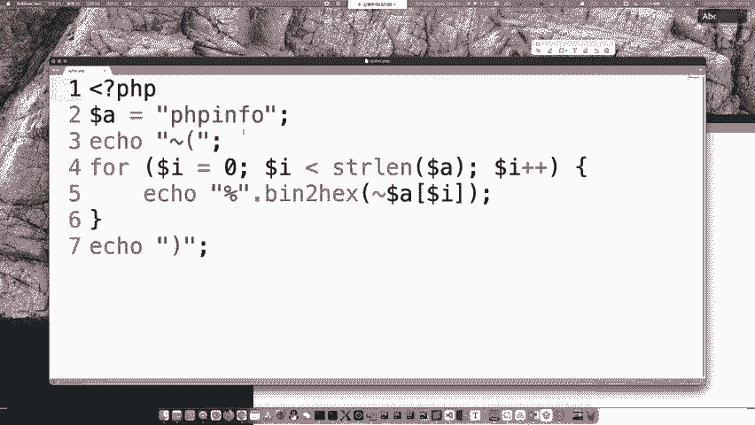

除了异或，取反运算也是常用的手段。对一个字符串取反，可以得到另一串字符，这串字符经过URL编码后可能不包含被过滤的字母数字，但在执行时会被PHP解析回原意。

**示例：**
`~‘phpinfo‘` 运算后得到一串乱码，将其传入代码执行点，PHP会先对其进行取反操作还原为`phpinfo`，从而触发函数执行。

**代码示意：**
```php
// 假设 $code 是我们可以控制的输入，且过滤了字母数字
// 我们传入取反后的字符串（此处为示意，实际是一串乱码）
$code = ‘某串取反后的字符‘;
eval($code); // PHP处理时会先对取反字符串进行还原，然后执行 phpinfo()
```

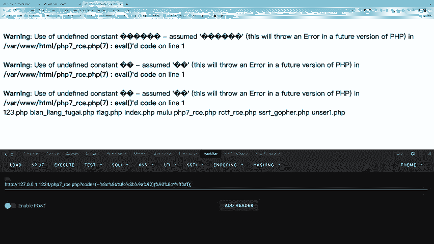

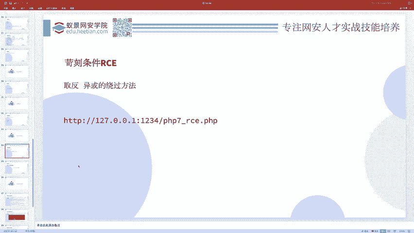

以下是两种方法的关键点总结：
*   **异或**：通过字符间的运算直接生成目标字符。
*   **取反**：利用PHP对取反操作的自动处理来还原字符串。

## 一道综合限制的CTF例题

接下来我们分析一道综合了多种限制的CTF题目，它禁止了字母、数字、下划线以及多种符号（如`& | ^ ~ ( ) [ ] $ @ .`），并且总长度不能超过18个字符。

题目看似苛刻，但解法却非常巧妙。核心在于利用了两个PHP特性：

1.  **短标签**：`<?=` 是 `<?php echo` 的简写形式。
2.  **反引号执行命令**：反引号（\`\`）在PHP中相当于执行`shell_exec()`函数。

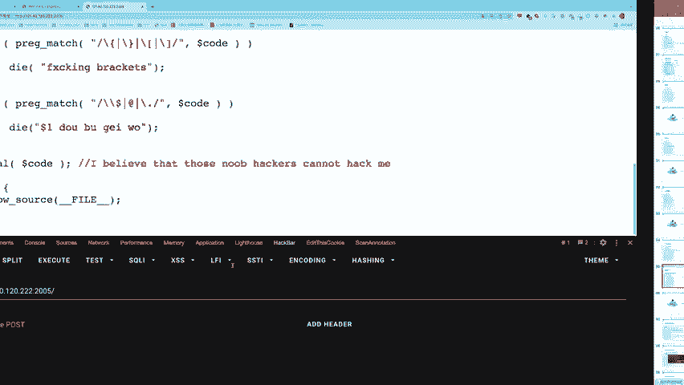

**最终Payload：**
```
?code=?><?=`/???/???%20/???/???/????/*`;
```


**Payload拆解分析：**
*   `?>`：闭合题目中可能存在的PHP开始标签。
*   `<?=`：开启短标签，表示后续内容将被输出。
*   \`/???/???%20/???/???/????/*\`：这是被反引号包裹的系统命令。
    *   `%20`是空格的URL编码。
    *   `?`在Shell通配符中代表任意单个字符。
    *   `*`在Shell通配符中代表任意字符串。
    *   因此，这部分大致匹配了类似 `/bin/cat /var/www/html/flag.php` 的命令路径，从而读取flag。

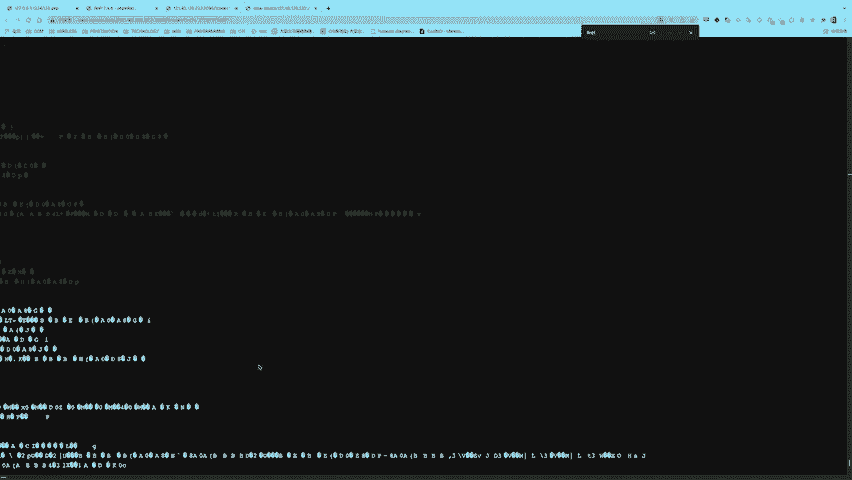

这个解法完全避开了被过滤的所有字符，并且满足了长度限制，展示了在极端条件下灵活运用语言特性的思路。

## 关于create_function的代码注入

最后，我们简要了解一个历史知识点：`create_function`函数。此函数用于动态创建匿名函数，但由于其实现方式，在过去存在代码注入漏洞。

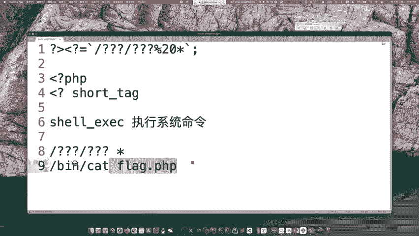

**函数原型：**
```php
create_function(string $args, string $code)
```

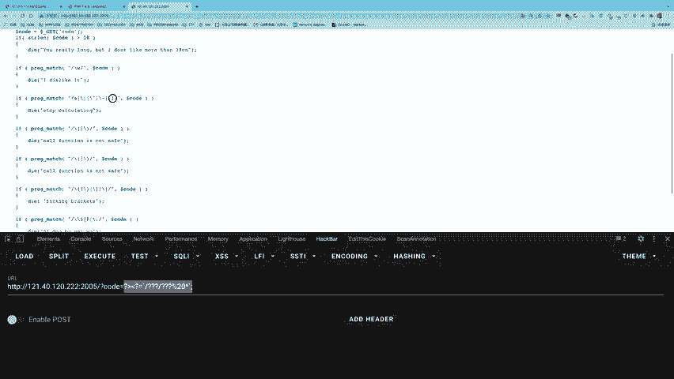

**漏洞原理：**
该函数内部通过拼接字符串 `“function($args){$code}“` 并使用 `eval` 执行来创建函数。如果用户能控制 `$code` 参数，并且其中包含未闭合的花括号 `}`，则可以提前结束函数定义，注入后续代码，并使用注释符 `//` 或 `/*` 注释掉原代码末尾的花括号。

**示例利用：**
假设代码如下：
```php
$func = create_function(‘$a‘, ‘return $a . “ injected“;} phpinfo();//‘);
```
实际执行的代码字符串为：
`function($a){return $a . “ injected“;} phpinfo();//}`
这样，`phpinfo();`就被注入并执行了。

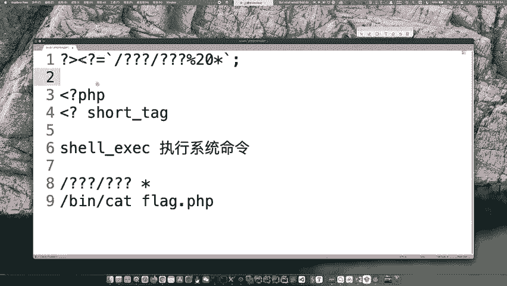

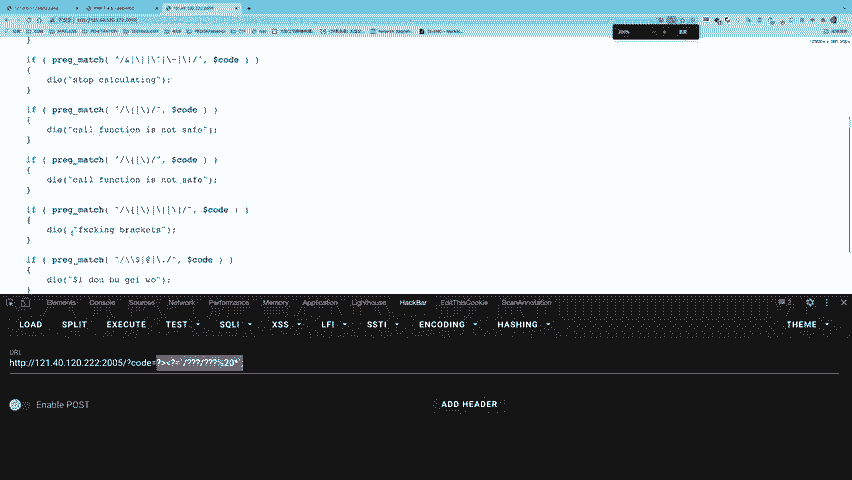

**请注意**：`create_function`函数在PHP 7.2.0起已被弃用，在PHP 8.0.0中被移除。现代代码中已不常见，但在分析老旧应用或特定CTF题目时可能遇到。

## 课程总结

本节课中我们一起学习了PHP代码执行的高级绕过技巧。
1.  我们探讨了在**无字母数字**的限制下，如何利用**异或**和**取反**运算动态构造字符串，并结合PHP的**动态函数调用**特性来执行命令。
2.  我们分析了一道综合CTF题目，学习了如何巧妙组合**短标签**、**反引号命令执行**和**通配符**来应对极端复杂的过滤条件。
3.  我们了解了历史函数`create_function`的**代码注入**漏洞原理。

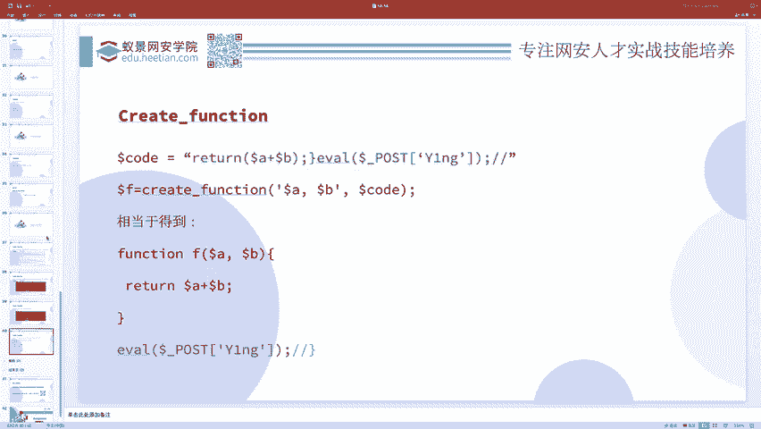

这些知识有助于深化对PHP代码执行漏洞的理解，并提升在CTF竞赛和渗透测试中解决复杂问题的能力。