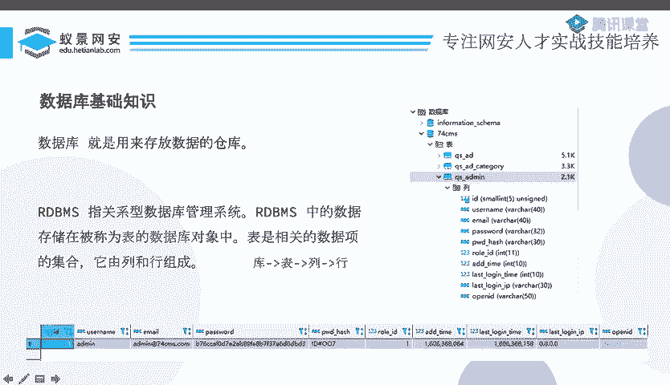
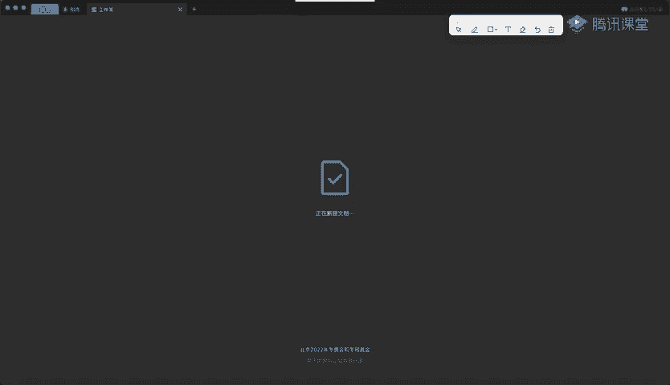
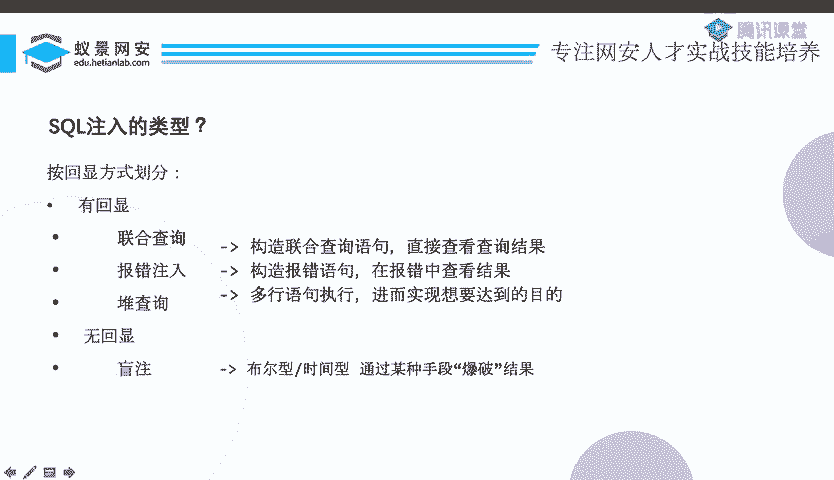

# MySQL基础与SQL注入入门：P57：09_MySQL基础

在本节课中，我们将要学习MySQL数据库的基础知识，并初步了解SQL注入攻击的基本概念与分类。课程内容分为三大部分：MySQL基础、联合查询注入和报错注入。

## 数据库基础概念

上一节我们介绍了课程的整体安排，本节中我们来看看什么是数据库。

数据库是存放数据的仓库。关系型数据库管理系统（RDBMS）将数据存储在称为“表”的数据库对象中。表是相关数据项的集合，由列和行组成。

我们可以用一个简单的结构来理解数据库：

*   **库**：一个数据库包含多个表。
*   **表**：一个表包含多列和多行数据。
*   **列**：定义了数据的类型和结构（如ID、用户名）。
*   **行**：一条具体的数据记录。



一个常见的类比是Excel表格。一个Excel文件相当于一个“库”，文件中的每个工作表（Sheet）相当于一个“表”，工作表的列标题是“列”，而每一行数据就是“行”。

## 结构化查询语言（SQL）



我们知道数据库用于存储数据，但如何与数据库交互呢？这就需要一种数据库能理解的语言。

SQL（结构化查询语言）是用于管理关系型数据库管理系统的标准语言。它的操作范围包括数据的插入、查询、更新和删除，即常说的“增删改查”。

以下是几个基础的SQL操作语句示例：

```sql
SHOW DATABASES; -- 显示所有数据库
USE database_name; -- 使用某个数据库
SHOW TABLES; -- 显示当前数据库中的所有表
```

## SQL注入攻击简介

上一节我们介绍了操作数据库的语言SQL，本节中我们来看看SQL注入是什么。

SQL注入是指攻击者将SQL代码插入或添加到应用程序的输入参数中，这些参数被传递给后台的SQL服务器解析并执行。

简单来说，当应用程序构造SQL语句时，如果其某一部分（通常是用户输入的参数）能被用户控制，并且用户输入的内容被直接拼接到SQL语句中执行，就可能产生SQL注入漏洞。

SQL注入产生的核心条件是：
1.  用户能够控制SQL语句的一部分。
2.  用户的输入被直接拼接，并成为了符合SQL语法的代码的一部分。

攻击者通过构造特殊的输入，让数据库执行非预期的SQL命令，从而获取、篡改或删除数据库中的数据。

## SQL注入的分类

根据攻击时获取信息的方式（即“回显”方式），SQL注入主要可以分为两大类。

### 有回显的注入

在这种类型中，应用程序会将SQL查询的结果或错误信息直接或间接地显示给用户。根据回显的具体形式，又可分为以下几种：

*   **联合查询注入**：利用 `UNION` 操作符将多个查询语句的结果合并在一起返回。
*   **报错注入**：通过构造SQL语句触发数据库报错，并从错误信息中提取出敏感数据。
*   **堆叠注入**：利用某些数据库特性，一次性执行多条SQL语句。

### 无回显的注入（盲注）

在这种类型中，应用程序不会直接显示查询结果或详细的错误信息。攻击者需要根据页面响应的差异（如真/假状态、时间延迟）来推断数据。盲注是CTF比赛和实际渗透测试中更常见的考点。



本节课中我们一起学习了MySQL数据库的基本结构、SQL语言的作用，以及SQL注入攻击的定义和主要分类（有回显注入与盲注）。理解这些基础概念是后续深入学习各类具体注入技术的前提。