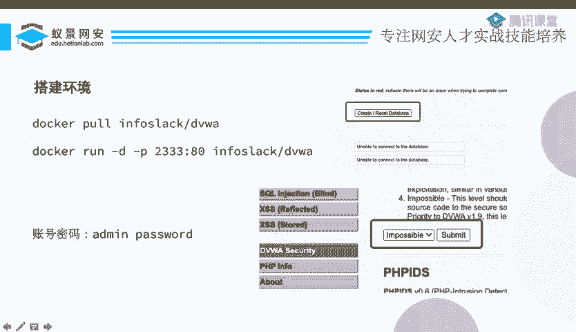
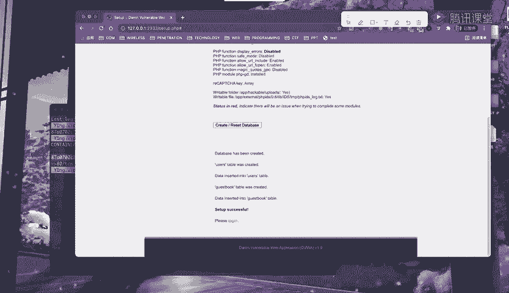
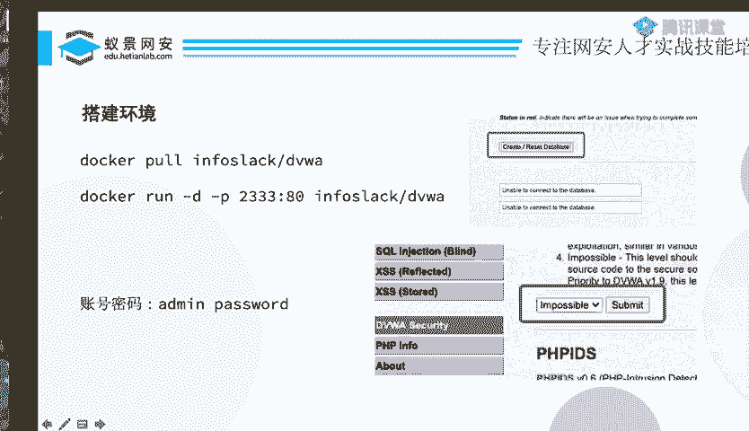
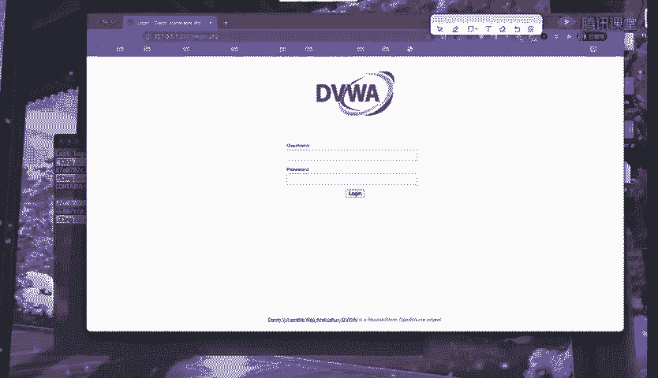
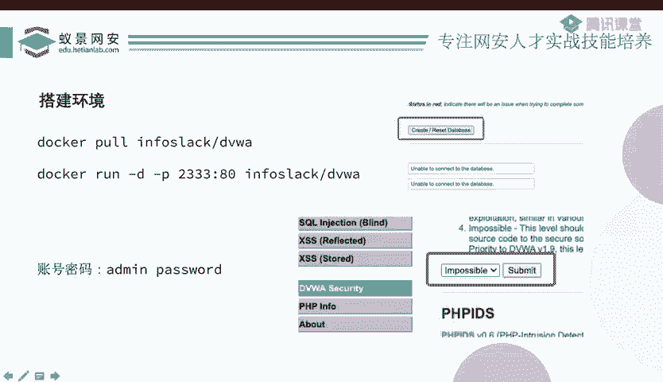

# 护网行动红蓝攻防教程：P58：DVWA靶场搭建 🎯

在本节课中，我们将学习如何搭建一个名为DVWA的网络安全靶场。DVWA是一个专门用于练习和测试Web应用漏洞的平台，包含了多种常见的漏洞类型。通过搭建这个靶场，我们可以为后续的渗透测试、应急响应等实战操作提供一个安全、可控的练习环境。

---

## 准备与搭建靶场

上一节我们介绍了一些基础概念，本节中我们来看看如何实际操作。首先，我们需要准备一个靶场环境。DVWA靶场可以通过多种方式搭建，其中使用Docker容器是最为便捷高效的方法之一。

以下是搭建DVWA靶场的两种主要方式：

1.  **使用Docker镜像（推荐）**：这是最简单快捷的方式。Docker是一个容器化平台，可以快速部署应用。对于DVWA，已有集成的Docker镜像，我们只需一条命令即可拉取并运行。
2.  **使用源代码搭建**：如果你有类似PHPStudy这样的集成环境，也可以下载DVWA的源代码进行手动配置和安装。

对于初学者，我们强烈推荐使用Docker方式，因为它能避免复杂的依赖和环境配置问题。

---

## 使用Docker启动DVWA

接下来，我们详细介绍如何使用Docker来启动DVWA靶场。请确保你的系统已经安装了Docker。



执行以下命令来拉取DVWA镜像并启动一个容器：

```bash
docker run -d -p 2333:80 vulnerables/web-dvwa
```

**命令参数解释**：
*   `docker run`： 运行一个新容器。
*   `-d`： 让容器在后台运行。
*   `-p 2333:80`： 进行端口映射。将容器内部的80端口映射到宿主机的2333端口。这意味着我们通过访问本机的`2333`端口就能访问到容器内的DVWA应用。
*   `vulnerables/web-dvwa`： 这是DVWA的官方Docker镜像名称。


执行命令后，Docker会从仓库拉取镜像（首次运行需要一些时间），然后启动容器。你可以使用以下命令查看正在运行的容器：

```bash
docker ps
```

该命令会列出当前运行的容器及其信息，确认DVWA容器是否已成功启动并映射到2333端口。

---



## 初始化与访问靶场

当容器成功启动后，我们就可以通过浏览器访问DVWA了。

1.  打开浏览器，访问地址：`http://localhost:2333` 或 `http://你的服务器IP:2333`。
2.  页面加载后，你会看到DVWA的安装界面。首先需要点击 **“Create / Reset Database”** 按钮来初始化数据库。因为这是一个全新的环境，数据库尚未建立。




3.  数据库创建成功后，页面会自动跳转到登录界面。




DVWA提供了默认的登录凭证：
*   **用户名**：`admin`
*   **密码**：`password`

输入默认账号密码后，即可成功登录DVWA主界面。


---

## 配置安全等级

成功进入靶场后，在开始练习之前，有一个非常重要的设置需要调整，那就是安全等级（Security Level）。

在左侧菜单栏找到并点击 **“DVWA Security”**。



你会看到 **“Security Level”** 选项，它默认设置为 **“Impossible”**。DVWA提供了四种安全等级：
*   **Low**： 安全防护极低，漏洞利用非常简单。
*   **Medium**： 中等防护，增加了一些基础的安全措施。
*   **High**： 较高的防护等级，漏洞利用难度增大。
*   **Impossible**： 最高防护，理论上无法利用漏洞，用于展示安全的代码写法。

“Impossible”等级意味着靶场处于绝对安全状态，所有漏洞都被完美修复，这不符合我们练习攻击技术的初衷。因此，我们需要根据自身的学习阶段调整安全等级。例如，作为初学者，可以先设置为 **“Low”**。

至此，你的DVWA靶场已经完全搭建并配置妥当，可以开始使用了。

---


## 总结

本节课中我们一起学习了DVWA靶场的完整搭建流程。我们首先了解了搭建靶场的两种方式，并选择了最便捷的Docker方案。接着，我们通过一条Docker命令启动了靶场容器，并通过浏览器完成了数据库初始化和登录。最后，我们强调了在开始练习前，必须将靶场的默认安全等级从“Impossible”调整为“Low”或其他等级，以确保漏洞可以被成功利用进行练习。现在，你已经拥有了一个功能完备的实战练习环境，为后续学习各种Web安全漏洞打下了坚实的基础。