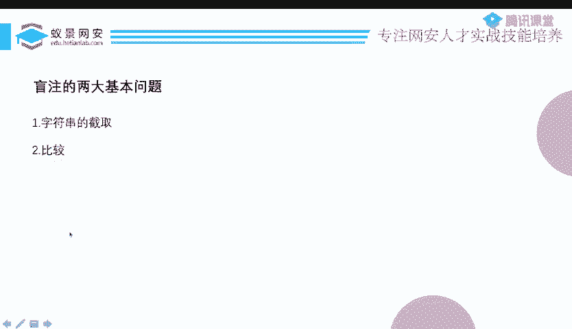
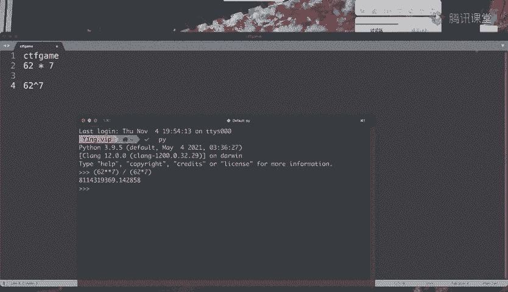
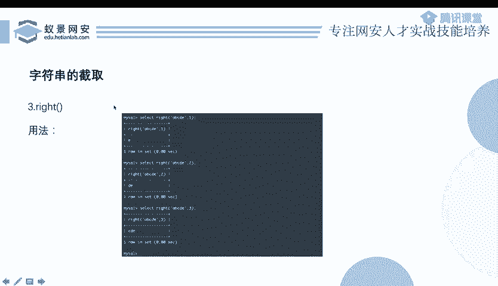
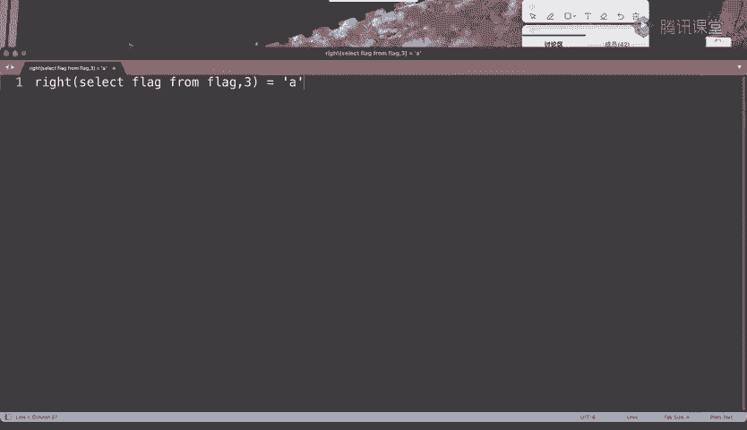
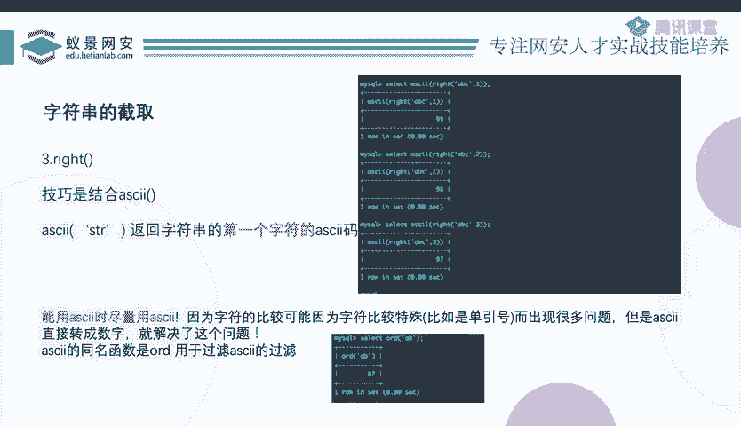
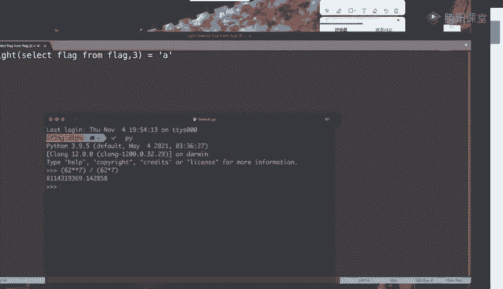
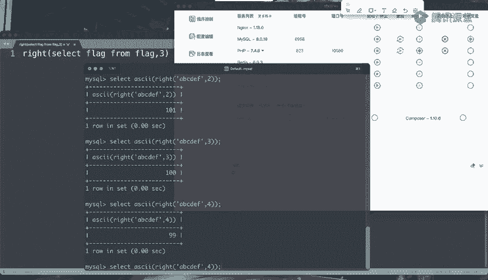

# 护网行动红蓝攻防教程：P60：12_布尔盲注1 🔍

在本节课中，我们将要学习SQL注入中一个重要的类型：布尔盲注。我们将从基本概念入手，理解其工作原理，并学习如何通过字符串截取与比较来逐位“猜解”数据库信息。

---

## 布尔盲注的基本概念 💡

上一节我们介绍了SQL注入的分类。根据回显方式，我们可以将其划分为有回显和无回显（即盲注）两大类。

盲注需要通过某种间接手段来“爆破”查询结果。它主要有两个分支：**布尔型盲注**和**时间型盲注**。本节我们重点学习布尔型盲注。

布尔型盲注的核心在于，页面会根据SQL查询语句执行结果的“真”或“假”，返回两种不同的状态。这种状态差异就是我们的判断依据。

以下是几种常见的布尔状态表现形式：
*   **内容不同**：查询成功时页面显示具体内容，失败时则不显示或显示错误信息。
*   **HTTP状态码不同**：例如，登录成功返回301重定向，失败则返回200并提示登录失败。
*   **响应头不同**：成功时可能包含`Location`或`Set-Cookie`等头信息，失败时则没有。
*   **基于错误的盲注**：这将在后续章节详细讨论。

这些页面状态的变化，本质上反映了后端数据库执行SQL查询的成功与失败，即布尔（真/假）状态。

---

## 布尔盲注的工作原理 ⚙️

为了理解布尔盲注，我们先回顾一个简单的测试用例：`id=1 and 1=1` 和 `id=1 and 1=2`。

在`WHERE id=1 AND 1=1`这个语句中，`id=1`为真，`1=1`也为真，整个查询成功。而在`WHERE id=1 AND 1=2`中，`1=2`为假，导致整个查询失败。页面会根据查询成功与否呈现不同内容。

这个`1=1`或`1=2`就是一个**布尔表达式**，它的值（真或假）直接决定了整个SQL查询的最终结果。

理解了这一点，我们就可以进行关键替换：将`1=1`这个简单的布尔表达式，替换成更复杂、能帮助我们获取信息的表达式。

例如，我们可以构造这样的语句：
```sql
id=1 AND SUBSTRING((SELECT DATABASE()), 1, 1) = 'a'
```
这个语句的意思是：查询`id`为1的记录，**并且**当前数据库名的第一个字符是否等于字母`'a'`。

*   `SUBSTRING((SELECT DATABASE()), 1, 1)` 用于截取数据库名的第一个字符。
*   `= 'a'` 是一个判断是否相等的布尔表达式。

如果第一个字符确实是`'a'`，那么整个`AND`条件为真，页面会返回查询成功（`id=1`存在）的状态。如果不是`'a'`，条件为假，页面则返回查询失败的状态。

于是，我们可以从`'a'`到`'z'`，`'A'`到`'Z'`，`'0'`到`'9'`，逐个字符进行测试（最多62次）。当页面返回“成功”状态时，我们就“猜”中了第一位字符。

接下来，我们只需修改`SUBSTRING`函数的参数，例如将`(1,1)`改为`(2,1)`，即可开始猜测第二位字符，并以此类推，直到获取完整的字符串。

**这就是布尔盲注的核心过程：通过构造布尔表达式，并观察页面两种状态的差异，像“猜谜”一样逐位爆破出目标数据。**



---

## 盲注的两大基本问题：截取与比较 🔧



通过上面的分析，我们可以将盲注的核心操作抽象为两个基本问题：**字符串截取**和**字符串比较**。

### 为什么需要字符串截取？

假设正确结果是`CTFgame`（7位字符）。如果不对字符串进行截取，直接猜测整个字符串，那么每一位有62种可能（字母数字），总共需要尝试 `62^7` 种组合，这是一个天文数字。

如果我们将字符串截取成单个字符逐一猜测，则最多只需要尝试 `62 * 7` 次。两者效率相差 `(62^7) / (62*7) ≈ 81亿倍`。因此，**字符串截取是盲注可行性的关键**，它能将指数级复杂度降为线性复杂度。

### 为什么需要字符串比较？

“猜”的过程本质上就是“比较”。我们不断询问数据库：“这一位是不是等于`'a'`？”“是不是等于`'b'`？”……这个“是不是”就是一个比较操作（`=`）。通过比较结果的真假，触发页面不同的布尔状态，我们才能获得反馈信息。

因此，**所有的盲注技巧，本质上都是围绕“如何更有效地截取字符串”和“如何更灵活地进行比较”这两个问题展开的。**

---

## 字符串截取方法总结 📝



以下是SQL中常用的字符串截取函数及其在盲注中的应用。

### 1. SUBSTRING / SUBSTR / MID
这是最常用、最精确的截取函数。
*   **语法**：`SUBSTRING(str, start, length)`
*   **示例**：`SUBSTRING((SELECT DATABASE()), 1, 1)` 截取数据库名的第一个字符。
*   **注意**：如果逗号`,`被过滤，可以使用`FROM ... FOR ...`语法替代：`SUBSTRING(str FROM start FOR length)`。

### 2. RIGHT / LEFT
这两个函数从字符串的右端或左端开始截取指定长度的子串。
*   **语法**：`RIGHT(str, length)`， `LEFT(str, length)`
*   **特点**：它们不能直接精确截取中间某一位。但结合`ASCII()`函数可以巧妙实现。
*   **示例**：要获取字符串`ABCDEF`的倒数第三位（即`D`），可以这样操作：
    ```sql
    ASCII(RIGHT(‘ABCDEF’, 3)) 
    -- RIGHT(‘ABCDEF’, 3) 得到 ‘DEF’
    -- ASCII(‘DEF’) 返回首字符 ‘D’ 的ASCII码，即 68
    ```
    通过改变`RIGHT`的`length`参数，我们可以依次获取倒数第N位的ASCII码值。

---

## 使用ASCII码的优势 🚀





在盲注中，将字符转换为ASCII码（数字）进行比较，具有显著优势：



1.  **避免特殊字符干扰**：如果待猜字符包含单引号`'`、反斜杠`\`等SQL特殊字符，直接进行字符比较`=`可能会破坏SQL语法。而比较数字则没有这个问题。
2.  **实现精确截取**：如上所述，`ASCII(RIGHT(str, N))`可以将`RIGHT/LEFT`函数变成“精确”获取倒数/正数第N位字符的工具。
3.  **引入更高效的比较方式**：数字不仅可以判断相等`=`，还可以判断大小`>`、`<`。这允许我们使用**二分查找法**来大幅提升爆破效率。
    *   例如，已知某位字符的ASCII码范围是32~126。我们不再需要从32到126逐个尝试`=`，而是先判断`> 79`（中间值）？根据页面返回的“真/假”，即可将范围缩小一半。如此反复，最多只需 `log2(126-32) ≈ 7` 次即可确定该字符的ASCII码。

---

## 本节课总结 📚

本节课我们一起学习了布尔盲注的核心知识：
*   **概念**：布尔盲注依赖于SQL查询结果为“真”或“假”时，页面返回的**两种不同状态**。
*   **原理**：通过构造一个其真假能影响整个查询结果的**布尔表达式**，并将待获取的信息（如数据库名）嵌入到这个表达式中，通过观察页面状态的变化来逐位“猜解”数据。
*   **核心**：盲注可归结为**字符串截取**与**字符串比较**两大基本问题。
*   **技巧**：
    *   掌握`SUBSTRING`、`RIGHT`、`LEFT`等字符串截取函数。
    *   善用`ASCII()`函数将字符转换为数字，以规避特殊字符干扰、实现非精确函数的精确截取，并启用二分查找等高效比较方法。



理解这些基本原理后，面对各种盲注题型，我们都能从“截取”和“比较”这两个角度去分析和构造Payload。下一节，我们将通过实战案例来巩固这些知识。