# 护网行动红蓝攻防教程：P61：13_布尔盲注2

在本节课中，我们将深入学习布尔盲注的高级技巧，特别是如何利用ASCII码和二分查找法来提升注入效率，并介绍一些不常见的字符串截取与比较函数，以应对各种过滤场景。

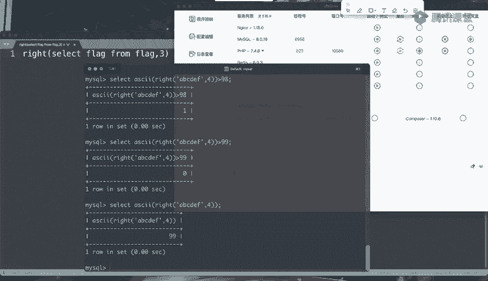

---

## 利用ASCII码与二分查找法

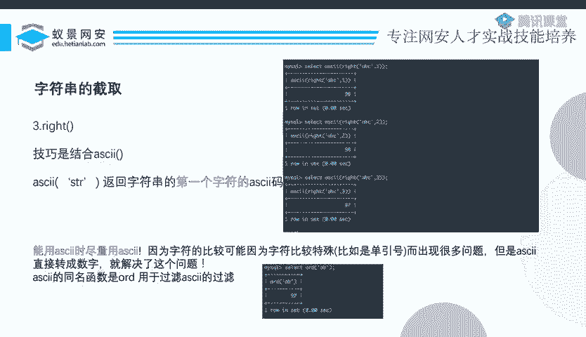

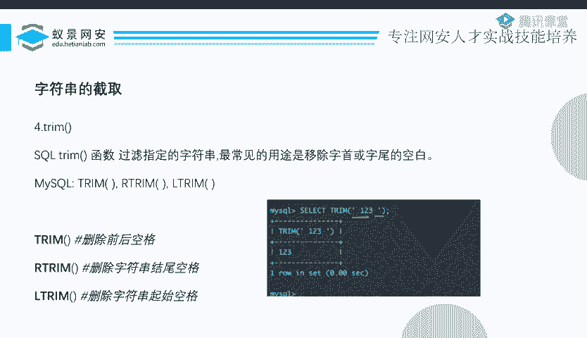

上一节我们介绍了布尔盲注的基本原理。本节中我们来看看如何利用ASCII码函数和二分查找法来大幅提升注入效率。

假设我们不知道某个字符的ASCII码值。常规方法是逐一比较，从1到99需要99次尝试。但如果我们使用大于（`>`）和小于（`<`）符号进行判断，就可以采用二分查找算法。


例如，判断ASCII码是否大于1，返回“是”；是否大于100，返回“否”；是否大于50，返回“是”；是否大于90，返回“是”；是否大于95，返回“否”……如此反复，只需不到10次比较就能确定该值为99。这极大地减少了请求次数、时间和网络流量。

**核心公式**：
```
if(ascii(substr(database(),1,1)) > 50, 1, 0)
```

ASCII码有超过120个可能值，使用二分法通常只需十几次尝试即可确定，无需120多次。

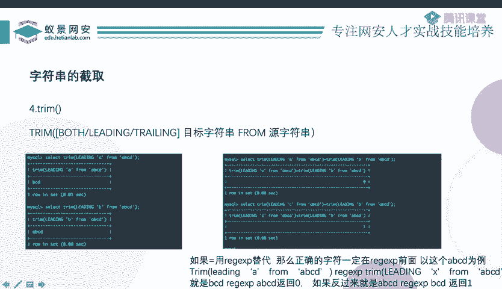

**注意**：如果`ascii()`函数被过滤，可以使用其同名函数`ord()`进行绕过。

使用数字（ASCII码值）进行判断有三个优点：
1.  实现精确的字符截取与判断。
2.  排除特殊字符的干扰。
3.  可以使用二分法，显著提升效率。

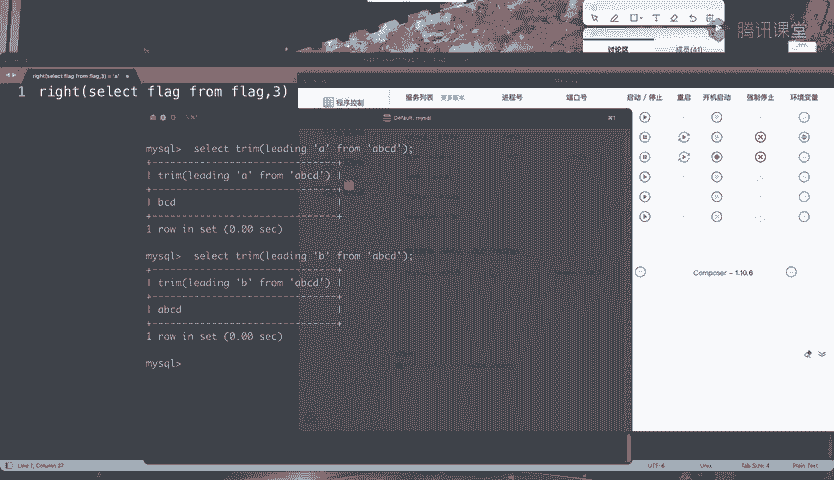

---

## 其他字符串截取函数

除了常用的`substr()`、`mid()`，还有`left()`和`right()`函数。

`left()`函数从字符串左侧开始截取指定长度的字符。但此时，变化的将是字符串的尾部字符，而非首字符，这不利于我们逐位判断。

**技巧**：结合`reverse()`函数。`reverse()`函数将字符串倒序。这样，原字符串尾字符的变化就变成了倒序后首字符的变化，此时再配合`ascii()`函数即可进行判断。

**代码示例**：
```sql
ascii(reverse(left(reverse(column_name), 1)))
```

---

## 使用TRIM函数进行截取判断

`trim()`函数本用于移除字符串首尾的空白字符。但其扩展用法`trim(leading ‘target’ from ‘string’)`可以移除字符串开头指定的“目标字符串”。

例如：
*   `trim(leading ‘A’ from ‘ABCD’)` 返回 `‘BCD’`。
*   `trim(leading ‘B’ from ‘ABCD’)` 返回 `‘ABCD’`（因为字符串不以B开头，无法移除）。

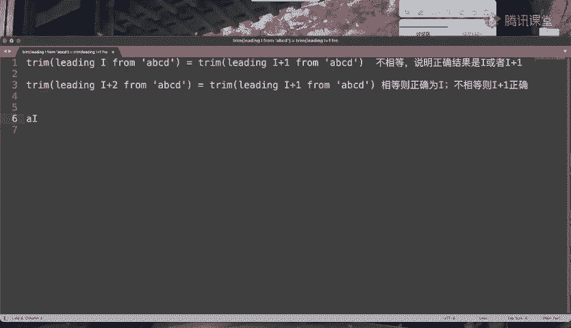

虽然`trim()`本身不是截取函数，但通过技巧可以利用它进行逐位判断。思路如下：

设待测字符串为`S`（如`‘ABCD’`），用变量`I`代表一个字符（如`‘A’`，`‘B’`…）。

1.  **第一步：定位字符范围**
    比较 `trim(leading I from S)` 和 `trim(leading I+1 from S)` 是否相等。
    *   如果相等，说明`I`和`I+1`都不是`S`的正确起始字符。
    *   如果不相等，说明正确起始字符是`I`或`I+1`中的一个。

2.  **第二步：确定具体字符**
    当第一步出现不相等时，再比较 `trim(leading I+1 from S)` 和 `trim(leading I+2 from S)`。
    *   如果相等，则`I+1`和`I+2`都不是正确起始字符，结合第一步结论，可推出正确字符为`I`。
    *   如果不相等，则`I+1`和`I+2`中有一个是正确起始字符，结合第一步结论，可推出正确字符为`I+1`。

找到第一位字符后，即可用`trim(leading ‘已知前缀’ from S)`的方式，继续判断后续字符。

---

## 其他比较方式

### LIKE 注入
`like`操作符用于模式匹配。`%`代表任意字符序列。
*   在没有`%`的情况下，`like`与等号（`=`）功能完全相同。因此，如果等号被过滤，可以优先考虑使用`like`。

### 正则表达式注入
使用`regexp`或`rlike`进行正则匹配。
**注意**：默认情况下，MySQL的正则匹配是大小写不敏感的。如果需要区分大小写，需使用`binary`关键字。
**代码示例**：
```sql
column_name regexp binary ‘^Ctf’
```

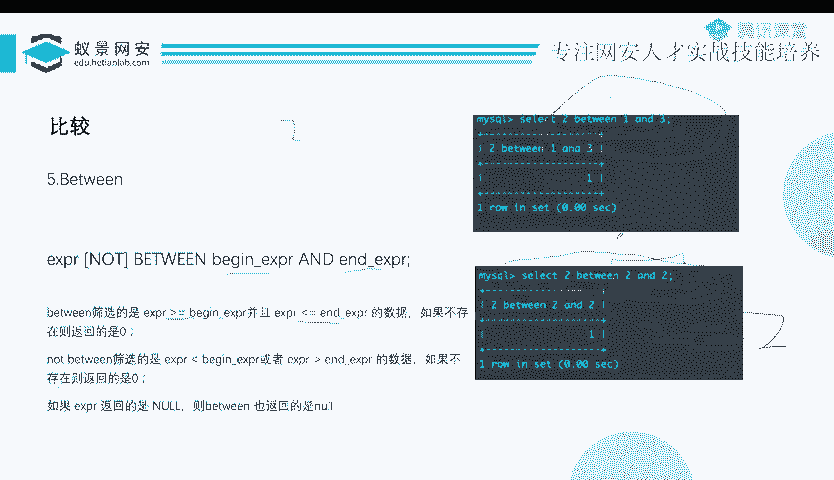

### BETWEEN 注入
`between a and b` 判断值是否在闭区间 `[a, b]` 内。
**技巧**：可以直接让上下界相同，例如 `between 2 and 2`，这等价于判断是否等于2。

### IN 注入
`in`操作符判断值是否属于一个集合。
**注意**：它同样是大小写不敏感的，如需区分大小写，也要使用`binary`关键字。
**代码示例**：
```sql
‘a’ in (binary ‘A’, ‘B’, ‘C’) -- 返回假(0)
```

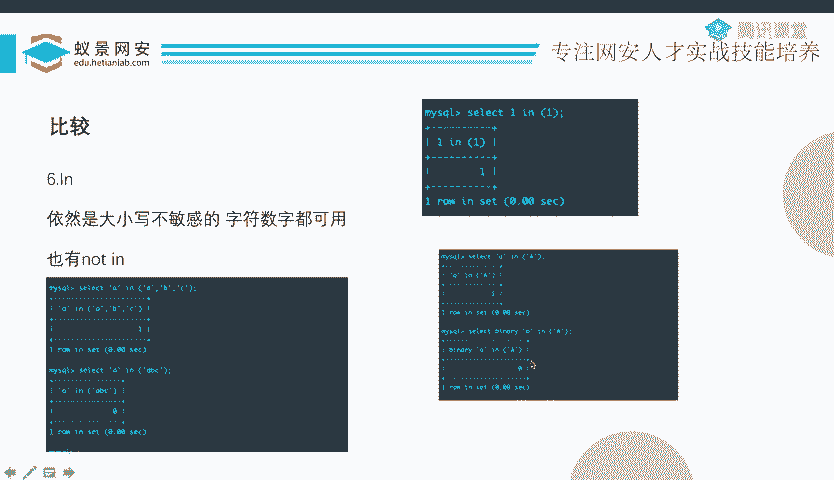

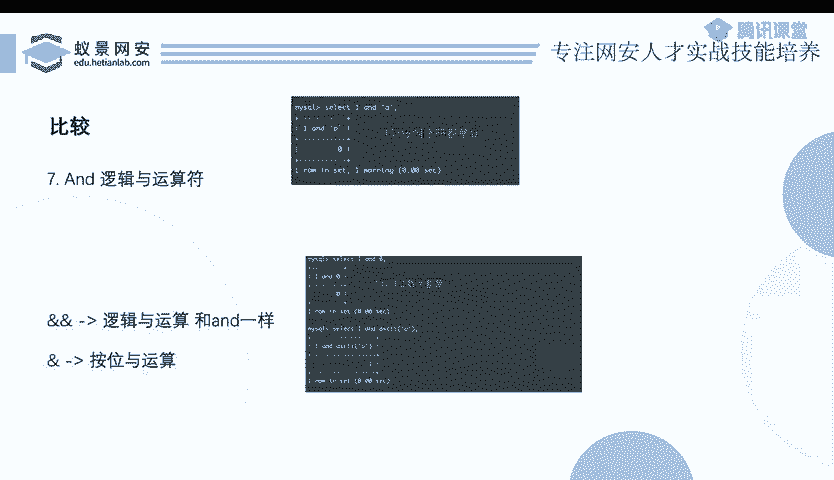

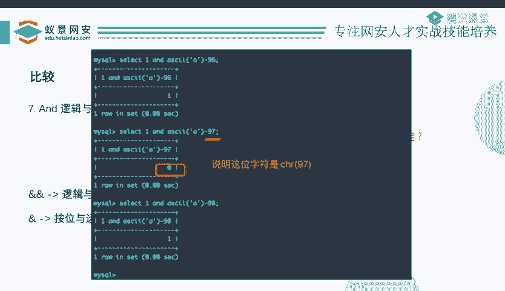

---

## 异或注入的应用场景

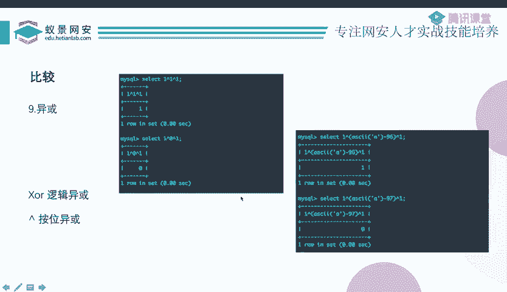

异或（`^`）注入常用于一种特定场景：**当注释符（如`#`, `--`）被禁用时**。

回顾一个注入点：
```sql
SELECT * FROM users WHERE id=‘$id’
```
我们输入`1’ and 1=1#`来闭合并注释掉后面的单引号。但如果不能使用注释符，后面的单引号就会破坏语法。

此时，可以构造如下payload：
```sql
1’ and ‘1’=‘1
```
但实际注入时，中间的`1=1`需要替换为复杂的布尔判断表达式。如果`and`、`=`等被过滤，就可以利用异或。

**构造原理**：
```sql
1’^(ascii(substr(database(),1,1))>97)=‘1
```
*   整个表达式是 `‘1’ ^ (布尔表达式的结果) = ‘1’`。
*   布尔表达式结果为真时返回1，为假时返回0。
*   `‘1’ ^ 1` 的结果不是 `‘1’`，而 `‘1’ ^ 0` 的结果是 `‘1’`。通过页面回显差异即可进行布尔判断。

除了异或，连等（`=`）或其他运算（如`-`）也可以达到类似效果，用于在无注释符时连接和闭合查询语句。

---

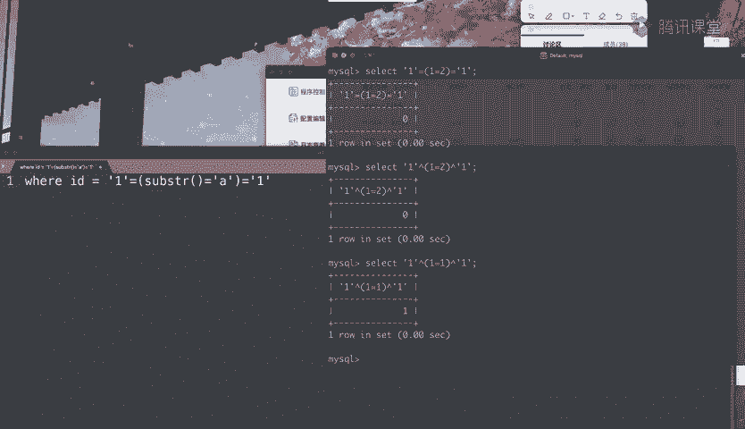

本节课中我们一起学习了布尔盲注的效率优化技巧（ASCII码与二分查找），探索了`left()`、`trim()`等非常规截取方法，并总结了`like`、`regexp`、`between`、`in`等多种比较方式。最后，我们了解了异或注入在禁用注释符场景下的特殊应用。掌握这些方法能帮助你更灵活地应对各种注入过滤和限制。