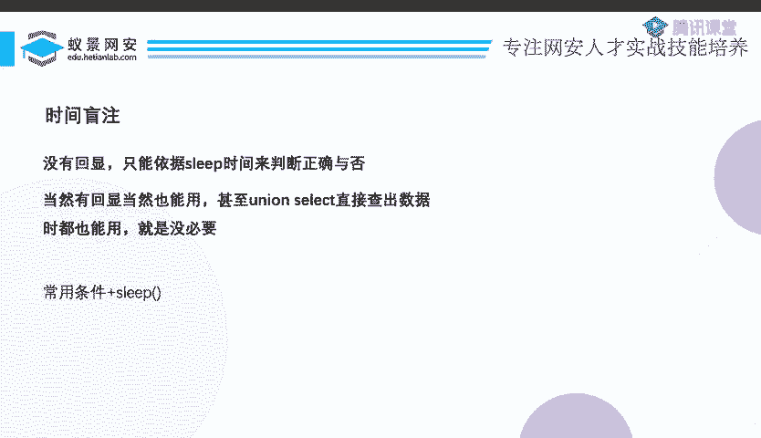
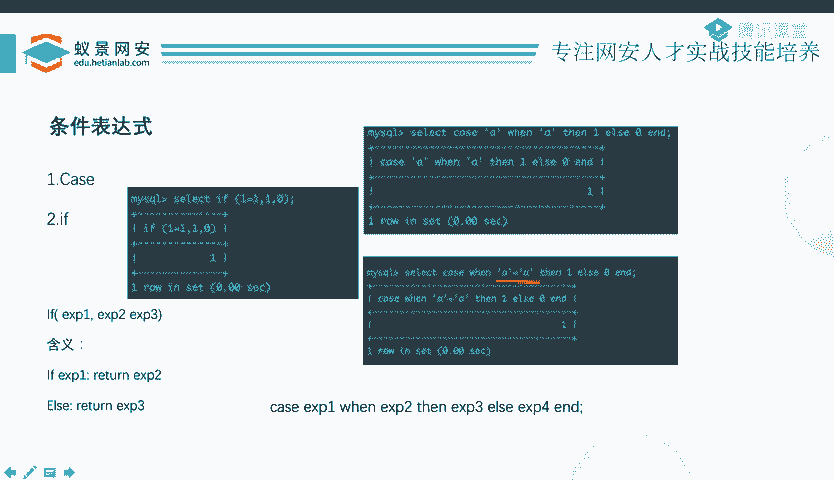
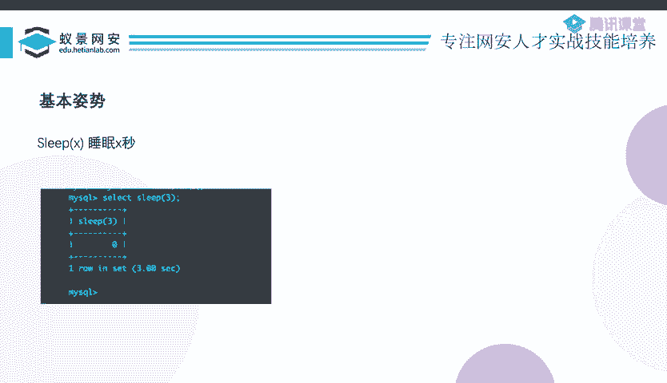

# 护网行动红蓝攻防教程：P62：14_延时盲注

在本节课中，我们将要学习SQL注入中的延时盲注技术。延时盲注是当目标应用对数据库查询的响应没有明显差异（例如，无论查询成功与否都返回相同页面）时，用于判断注入条件是否成立的一种方法。我们将通过条件表达式结合延时函数来实现。

## 延时盲注的原理

上一节我们介绍了布尔盲注，它依赖于应用对真假查询的不同回显。本节中我们来看看延时盲注。延时盲注适用于一种情况：无论你提交的查询语句是否正确，应用都返回相同的“查询成功”页面，没有布尔状态可供判断。

在这种情况下，我们可以利用“延时”来判断。其核心思想是：构造一个包含条件表达式的SQL语句，如果条件为真，则让数据库执行一个延时操作（如等待数秒）。由于Web服务器（如PHP）需要等待数据库返回结果后才能完成页面响应，因此用户会感知到页面加载时间变长。通过观察页面响应时间的长短，我们就可以推断出注入条件是否成立。



## 核心方法与函数

实现延时盲注主要依赖条件表达式和延时函数。

### 条件表达式

以下是两种常用的SQL条件表达式写法：

1.  **IF 表达式**
    其语法结构为：`IF(expr1, expr2, expr3)`。如果表达式 `expr1` 成立（为真），则返回 `expr2` 的值，否则返回 `expr3` 的值。



2.  **CASE 表达式**
    有两种常见写法：
    *   `CASE value WHEN compare_value THEN result ELSE result END`：判断 `value` 是否等于 `compare_value`，相等则返回 `THEN` 后的结果，否则返回 `ELSE` 后的结果。
    *   `CASE WHEN condition THEN result ELSE result END`：直接判断 `condition` 条件是否成立，为真则返回 `THEN` 后的结果，否则返回 `ELSE` 后的结果。

### 延时函数

最常用的延时函数是 `SLEEP()`。我们可以将条件表达式与 `SLEEP()` 函数结合。

例如，使用 `IF` 表达式：
```sql
IF(1=1, SLEEP(5), 0)
```
如果条件 `1=1` 成立，则数据库会休眠5秒，否则立即返回0。

或者，使用 `CASE WHEN` 表达式：
```sql
CASE WHEN 1=1 THEN SLEEP(5) ELSE 0 END
```
效果与上述 `IF` 表达式相同。

当构造的注入语句使条件成立时，数据库执行 `SLEEP(5)`，导致Web页面响应延迟约5秒；条件不成立时，页面立即响应。通过测量这种时间差，攻击者就能逐位推断出数据库中的信息。

## 其他延时方法



除了 `SLEEP()` 函数，还存在一些其他可能引起数据库操作延时的方法，例如：
*   `BENCHMARK()` 函数：通过执行大量重复计算来消耗时间。
*   笛卡尔积查询：构造复杂的多表关联查询以增加数据库处理时间。
*   `GET_LOCK()` 函数：利用数据库锁机制。
*   正则表达式攻击：利用某些耗时的正则匹配模式。

这些方法在实际考核和CTF比赛中出现频率较低，了解即可。相关细节可在课程提供的PPT资料中查阅。

## 总结


本节课中我们一起学习了延时盲注技术。我们首先了解了其应用场景——当目标缺乏布尔型回显差异时。接着，我们掌握了其核心原理：通过 `IF` 或 `CASE WHEN` 等**条件表达式**控制 **`SLEEP()`** 延时函数的执行，进而根据页面响应时间的差异来判断注入条件是否成立。最后，我们简要了解了其他几种可能造成延时的SQL方法。掌握延时盲注是完善SQL注入技能树的重要一环。