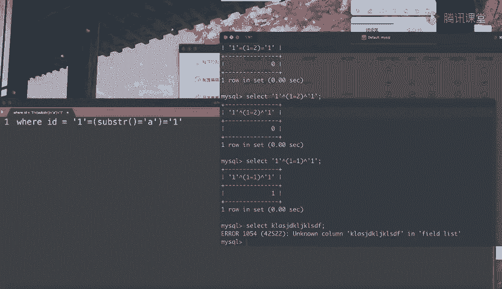
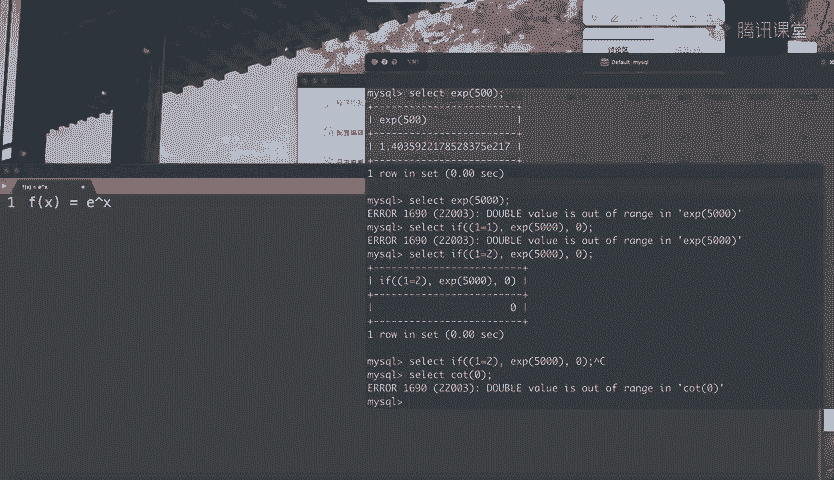

# 护网行动红蓝攻防教程：P63：15_报错盲注 🔍

在本节课中，我们将要学习一种特殊的SQL注入技术——报错盲注。我们将了解它的基本原理、与普通报错注入的区别，以及如何利用特定的MySQL函数来构造有条件的报错，从而实现数据盲注。

## 概述


报错盲注是布尔盲注的一个小分支，但在某些特定场景下非常有用。它适用于当数据库查询出错时，应用仅返回一个通用的“出错”提示，而不显示具体错误信息的情况。本节将详细讲解如何在这种情况下进行注入。

## 什么是报错盲注？

报错盲注是指这样一种场景：当MySQL查询出错时，应用程序仅返回一个简单的“出错”提示（例如“error”）；如果查询成功，则返回“OK”。除此之外，没有其他信息反馈。

基于这种情况，我们无法使用常规的报错注入（如`updatexml`或`extractvalue`）来直接获取数据，因为具体的错误内容不会被显示。如果常规的延时盲注方法也被过滤，那么报错盲注就成为一种可行的替代方案。

## 核心思路



报错盲注的核心在于**有选择性地触发错误**。我们需要构造一个SQL表达式，使得：
*   当某个条件为真时，执行一个会引发错误的函数。
*   当条件为假时，不引发错误。

这样，通过观察页面是返回“出错”还是“OK”，我们就能判断构造的条件是否成立，从而实现基于布尔逻辑的盲注。


这与延时盲注的逻辑类似：
*   延时盲注：`IF(条件, SLEEP(5), 0)` → 条件为真则延时。
*   报错盲注：`IF(条件, 报错函数(), 0)` → 条件为真则报错。

关键在于找到合适的、能**受控触发错误**的函数。

## 可用的报错函数

以下是两种常用的、可用于构造报错盲注的MySQL函数。

### 1. EXP() 函数

`EXP(X)` 函数返回自然常数 *e* 的 *X* 次方（*e^X*）。指数函数增长极快，当 *X* 足够大时，计算结果会超出MySQL的`DOUBLE`类型所能表示的范围，从而引发溢出错误。

**公式示例：**
```sql
IF(1=1, EXP(5000), 0)
```
当条件 `1=1` 为真时，执行 `EXP(5000)`。由于结果过大，数据库会报错（如“DOUBLE value is out of range”），从而使应用程序返回“出错”提示。若条件为假，则返回0，查询正常。

我们可以将 `1=1` 替换为数据查询条件，例如：
```sql
IF(SUBSTRING(database(),1,1)='a', EXP(5000), 0)
```
通过观察页面是否报错，即可逐位判断数据库名的第一个字符是否为 ‘a’。

### 2. COT() 函数

`COT(X)` 是余切函数。当参数 *X* 为0时，`COT(0)` 在数学上趋于无穷大，这同样会导致MySQL计算溢出而报错。

**公式示例：**
```sql
IF(1=1, COT(0), 0)
```
当条件为真时，执行 `COT(0)` 会引发错误。

## 其他思路

基于“通过数学运算制造溢出错误”的思路，你可以尝试寻找其他类似的函数或表达式，例如尝试进行除零操作等。核心是构造一个在特定条件下才会执行的、会导致数据库计算错误的子句。



## 总结

本节课我们一起学习了报错盲注技术。我们首先明确了报错盲注的应用场景：即网站只反馈查询“成功”或“失败”，而不显示具体内容。接着，我们分析了其核心原理——有选择性地触发数据库错误来作为布尔判断的依据。最后，我们重点介绍了两个关键的MySQL函数：`EXP()` 和 `COT()`，并展示了如何利用它们来构造有效的报错盲注载荷。


报错盲注作为布尔盲注的一种特殊形式，其脚本编写思路与常规盲注大同小异。掌握其原理后，通过实战练习编写几次脚本，就能熟练运用这项技术。