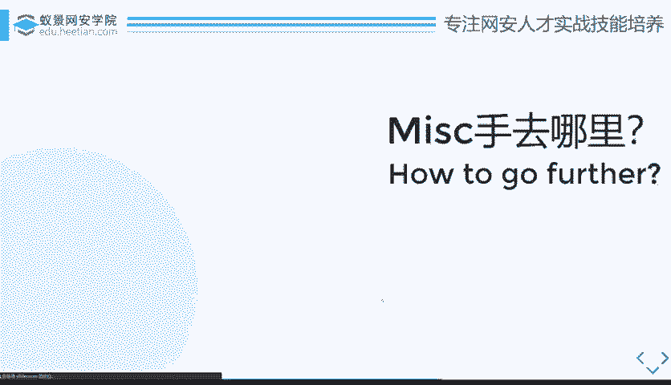
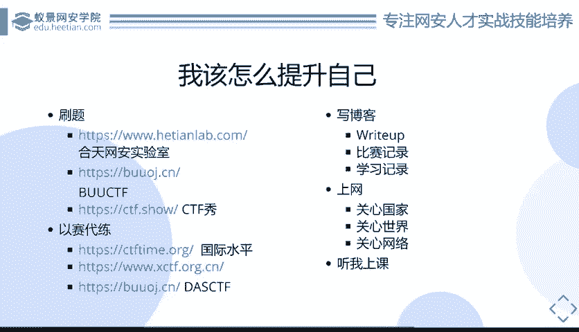
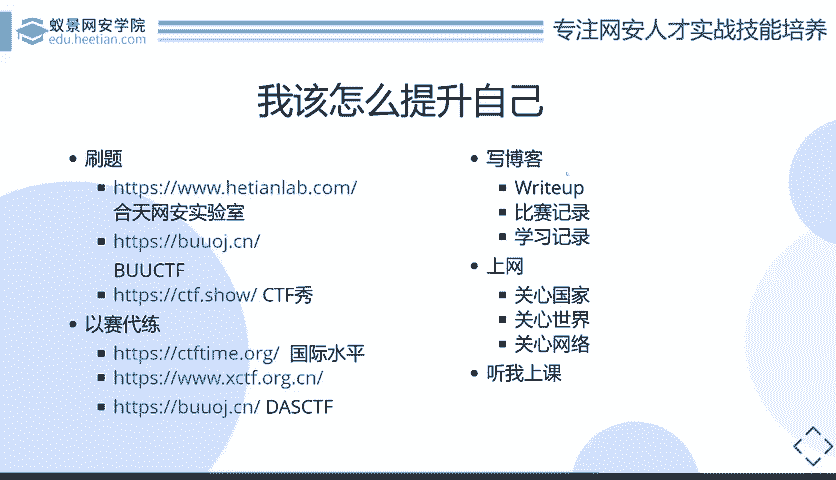

# 护网行动红蓝攻防教程：P64：16_MISC该怎么去学习 🧩

在本节课中，我们将探讨MISC（杂项）方向的学习路径。我们将从初学者如何入门开始，逐步深入到如何进一步提升技能，并最终将所学应用于实际工作或更高阶的比赛中。课程将涵盖学习方法、资源推荐以及长期发展的建议。

---

上一节我们介绍了MISC的基本概念和特点，本节中我们来看看具体该如何系统地学习MISC。

对于MISC学习者，无论是新手寻求入门，还是高手寻求突破，核心路径都离不开以下几个关键步骤。

以下是MISC学习的核心方法：

1.  **刷题练习**
    刷题是提升MISC能力最直接有效的方法。通过大量练习，可以积累解题思路、熟悉各类题型和隐藏的知识点。如果能将历年CTF比赛中出现的MISC题目全部练习一遍，你的知识面和解题能力将得到极大提升。刷题不仅能巩固已知知识，还能在遇到新题时，快速联想到过往的类似解法。

    以下是推荐的刷题平台：
    *   **攻防世界（HackTheBox Lab）**：提供丰富的实战环境与题目。
    *   **BUUOJ**：由安全爱好者维护的永久免费CTF平台，题库持续更新。
    *   **CTFshow**：一个CTF学习平台（注：部分功能或题目可能需要付费）。
    *   **历年赛题**：建议优先练习国内外大型CTF赛事（如“强网杯”、“网鼎杯”）的真题，这些题目质量高，参考价值大。例如，Web安全中经典的 **`sqlilabs`** 注入靶场，就是考察基础能力的绝佳例子。

2.  **以赛代练**
    通过参加比赛来检验和提升学习成果是最佳实践。你可以关注 **`CTFtime`** 网站，上面几乎每周都有国际比赛。虽然国内外比赛的研究方向有所差异，但参加国际赛有助于拓宽思路。此外，也可以参与 **`XCTF`**、**`DASCTF`** 等国内组织的月度或周期性赛事。即使无法解出所有题目，参与过程本身也是宝贵的学习经历。

3.  **总结与输出（写博客/WRITE UP）**
    学习MISC时，知识点的积累非常零散，建立一个属于自己的知识体系至关重要。

    以下是写博客的核心价值：
    *   **巩固学习**：将解题过程、工具使用、学习心得整理成WRITE UP（解题报告），是消化知识的最佳方式。
    *   **建立知识库**：使用 **`GitHub Pages`** + **`Hexo`** 或购买云服务器搭建 **`WordPress`**，创建个人博客，将所有学习记录归档，方便日后查阅。
    *   **内化知识**：切忌只看别人的WRITE UP。正确的做法是：先尝试解题 -> 参考前辈的WRITE UP -> 抛开答案自己重新做一遍 -> 最终输出自己的WRITE UP。这个过程才是真正的掌握。

4.  **关注安全动态**
    MISC题目常与最新的安全事件、技术突破相关联。主动关注安全资讯，是变被动学习为主动学习的关键。

    以下是需要关注的方面：
    *   **学术突破**：例如，王小云院士的MD5碰撞研究发表后，很快出现了相关的MISC题目。
    *   **重大漏洞**：如Apache Log4j2漏洞（CVE-2021-44228）爆发后，相关考点迅速出现在赛题中。
    *   **行业要闻**：多浏览安全社区、论坛和新闻，保持对行业热点的敏感度。

5.  **系统化课程学习**
    最后，参加系统化的课程学习可以帮你快速构建知识框架，避开一些常见的弯路。例如，本系列课程旨在讲解MISC的基础知识和常见套路，虽然不能让你立刻成为顶尖高手，但能为你的整体技能提升打下坚实基础，指明学习方向。

---

本节课中我们一起学习了MISC方向的五大学习策略：**刷题练习**、**以赛代练**、**总结输出**、**关注动态**和**系统学习**。记住，MISC的学习是一场持久战，依赖于持续的知识积累、广泛的实践和积极的思考。结合这些方法，持之以恒，你一定能在这个充满趣味和挑战的领域里不断进步。