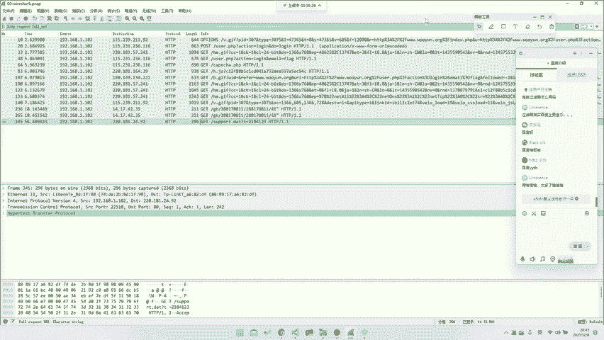
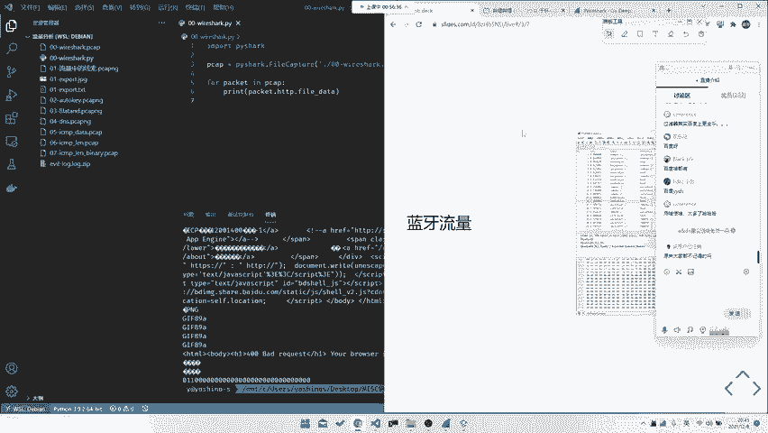

# 护网行动红蓝攻防教程：P65：17_基础之流量种类

在本节课中，我们将要学习网络流量分析的基础知识，特别是流量的种类。我们将从OSI七层模型出发，了解不同网络层次中可能出现的流量类型，并介绍在安全分析和CTF比赛中常见的流量分析场景。

## 概述

流量分析是网络安全和应急响应中的核心技能。网络流量种类繁多，从底层的物理协议到顶层的应用协议，都可能成为分析的对象。理解这些流量的种类和特点，是进行有效分析的第一步。

## OSI七层模型与流量种类

上一节我们介绍了流量分析的重要性，本节中我们来看看流量具体有哪些种类。最常见的分析对象是网络流量，其结构通常参照OSI七层模型。

OSI模型将网络通信分为七层，从下至上分别是：物理层、数据链路层、网络层、传输层、会话层、表示层和应用层。在流量分析中，我们关注的重点通常在上面的几层。

### 物理层与数据链路层

物理层涉及电信号、光信号等原始比特流的传输，例如以太网、802.11（Wi-Fi）协议。在CTF或安全分析中，直接考察物理层协议的情况较少。

数据链路层负责在直接相连的节点间传输数据帧，例如以太网帧。这一层的分析题目也不多见，但并非没有。

**示例代码：一个简单的以太网帧结构可能如下（示意）：**
```
| 目标MAC地址 (6字节) | 源MAC地址 (6字节) | 类型 (2字节) | 数据 (46-1500字节) | CRC (4字节) |
```

### 网络层

网络层负责在不同网络间寻址和路由，例如IP协议。这一层是流量分析中能考察到的相对底层。

以下是网络层可能涉及的考点：
*   **IP协议分析**：统计IP地址、分析IP分片等。
*   **ICMP协议**：分析Ping请求/回复、路由跟踪等流量。
*   **ARP协议**：分析地址解析过程，可能存在ARP欺骗等攻击流量。

### 传输层

传输层提供端到端的通信服务，主要是TCP和UDP协议。这一层是流量分析的重中之重。

传输层核心概念包括：
*   **TCP**：面向连接、可靠的协议。涉及**三次握手** (`SYN -> SYN-ACK -> ACK`) 和**四次挥手**过程。
*   **UDP**：无连接、不可靠的协议。结构简单，头部开销小。

### 应用层

应用层包含各种为用户提供服务的协议，也是流量分析中考察最多、最灵活的一层。

以下是应用层常见的流量分析类型：
*   **HTTP/HTTPS协议**：分析Web请求与响应，可能涉及SQL注入、文件上传、命令执行等攻击流量。
*   **DNS协议**：分析域名查询记录，可能用于数据外泄（DNS隧道）或攻击。
*   **FTP/SMTP/POP3等协议**：分析文件传输或邮件通信流量。
*   **自定义协议**：分析未公开或私有协议的数据格式，这是CTF中的高频难点。
*   **工控协议**：如Modbus、S7comm等，在工控安全比赛中逐渐增多。

## 非网络流量种类

除了基于TCP/IP的网络流量，还有其他类型的通信流量也可能需要分析。

### USB流量

USB流量通常指捕获的USB设备通信数据。USB设备主要分为三类：

1.  **USB UART**：仅用于数据传输。
2.  **USB HID**：人体输入设备，如键盘、鼠标。分析此类流量可还原按键或鼠标操作。
    *   **键盘流量数据示例**：`02 00 00 00 00 00 00 00` (可能表示按下了某个键)
3.  **USB Mass Storage**：大容量存储设备，如U盘。分析文件传输操作。

### 其他协议流量

随着物联网发展，更多协议流量进入分析视野：
*   **蓝牙流量**：分析蓝牙设备间的配对和数据传输。
*   **ZigBee流量**：低功耗局域网协议，常用于智能家居。
*   **其他射频或硬件协议**：如I2C、SPI等协议数据被封装传输。

## 流量包结构示例

在Wireshark等工具中，一个数据包是分层解析的。以下是一个HTTP数据包的简化视图：

```
Frame (物理层/数据链路层帧)
├── Ethernet II (数据链路层: 源/目标MAC地址)
│   └── Type: IPv4 (0x0800)
├── Internet Protocol Version 4 (网络层: 源/目标IP地址)
│   └── Protocol: TCP (6)
├── Transmission Control Protocol (传输层: 源/目标端口、序列号等)
│   └── [Stream index: 0]
└── Hypertext Transfer Protocol (应用层: HTTP请求/响应)
    ├── GET /index.html HTTP/1.1\r\n
    ├── Host: www.example.com\r\n
    └── ...其他头部信息
```

分析时，我们通常从顶层（应用层）开始，如果协议无法识别或需要深入，再逐层向下分析。

## 学习方法与工具使用

流量分析涉及知识面广，需要不断积累。

*   **善用搜索**：遇到不熟悉的协议字段，及时查阅官方文档或资料。
*   **掌握过滤器**：在Wireshark中，使用显示过滤器能快速定位目标流量。例如：
    *   `http` 过滤所有HTTP流量。
    *   `ip.src == 192.168.1.1` 过滤源IP。
    *   `tcp.port == 80` 过滤TCP 80端口流量。
*   **理解协议原理**：掌握TCP/IP、HTTP等核心协议的工作原理，是分析的基础。
*   **多实践**：通过CTF题目、靶场实验和真实流量包（如Wireshark官网样例）进行练习。

> 问人两小时，不如查资料十分钟。培养独立搜索和解决问题的能力至关重要。



## 总结



本节课中我们一起学习了网络流量的主要种类。我们从OSI七层模型出发，了解了从物理层到应用层各层可能出现的协议和考点，并特别强调了HTTP、自定义协议等应用层流量的重要性。此外，我们还介绍了USB、蓝牙等非网络流量的分析场景。掌握这些流量种类的特点，是后续进行深度协议分析、攻击行为研判和CTF解题的坚实基础。记住，流量存在于一切有通信的地方，分析的思路是相通的。