# 护网行动红蓝攻防教程：P66：18_基础之需要的工具 🛠️

在本节课中，我们将要学习流量分析所需的基础知识和核心工具。流量分析并非拿来即用，它需要一定的计算机网络和通信协议基础。本节将简要介绍这些基础，并重点讲解后续课程中会用到的关键工具。

## 基础知识与准备

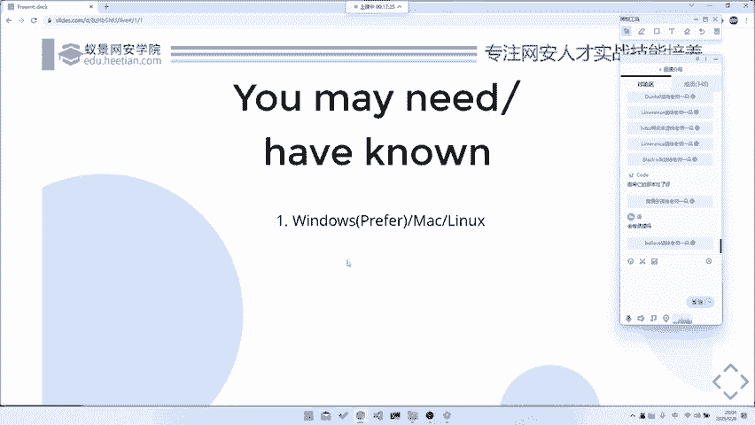

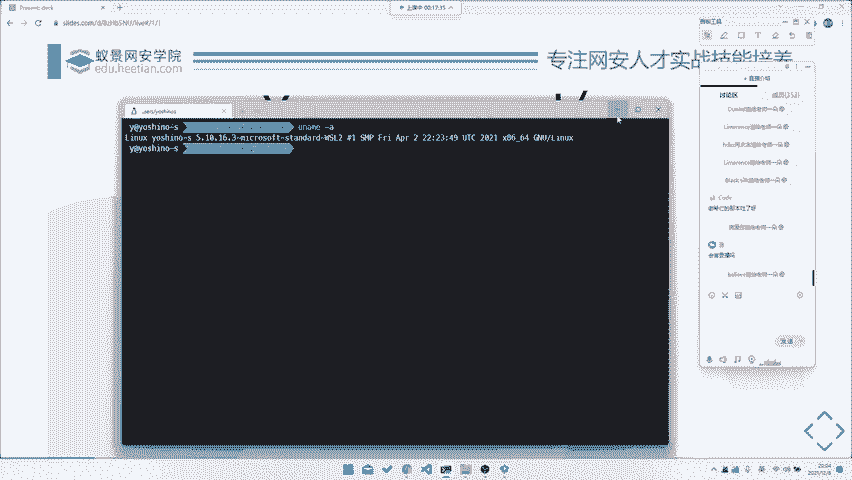

上一节我们介绍了课程的整体框架，本节中我们来看看进行流量分析前需要做的准备。

进行流量分析需要掌握一些基础知识，例如计算机网络和通信协议的基础。这些基础是深入分析流量的前提。本课程会简要讲解，但深入学习需要课后自行研读相关书籍。

以下是进行本课程学习需要准备的环境和工具：
*   **操作系统**：建议使用 Windows 系统，并配置一个 WSL（Windows Subsystem for Linux）环境或 Linux 虚拟机。Mac 用户也可使用虚拟机。流量分析工具对平台依赖性不高，但此环境组合较为通用。
*   **工具**：主要工具是 Wireshark。此外，可能用到 Tshark（命令行版 Wireshark）或 Pyshark（Python 库）等脚本工具。

## 流量分析的发展方向

在深入工具之前，我们先了解一下流量分析在 CTF 竞赛之外的现实应用和发展方向，这有助于理解其价值。

流量分析在国内 CTF 比赛中常被归为“杂项”，但在国际上，它主要归属于 **取证** 和 **流量分析** 两个方向。

以下是流量分析未来的几个进阶发展方向：
*   **大规模流量分析与安全监控**：例如，从海量网络数据中检测异常请求、攻击流量或爬虫行为。这应用于 EDR（端点检测与响应）、流量审计等安全领域。
*   **数字取证**：协助进行网络犯罪调查，通过分析嫌疑人的网络访问记录和行为数据来辅助办案。
*   **协议逆向辅助**：通过抓取和分析网络数据包，来辅助理解或逆向工程未知的通信协议。

现阶段我们专注于分析单个数据包文件，但最终目标是掌握处理大规模甚至实时流量的技能。这在一些 CTF 题目中也有体现，例如需要从大量流量中批量提取并执行代码的题目。

## 核心工具详解

了解了背景后，我们正式进入核心工具部分。工欲善其事，必先利其器，掌握好工具是高效分析的第一步。

### Wireshark：图形化流量分析神器 🦈

Wireshark 是世界上最主流的网络协议分析器。它功能强大，支持分析绝大多数网络协议。

**公式/代码表示其强大性：**
`Wireshark 支持协议 ≈ {TCP/IP, HTTP, SSL/TLS, DNS, ...} ∪ {Modbus, S7comm, I²C, Bluetooth, 802.11, USB, ...}`

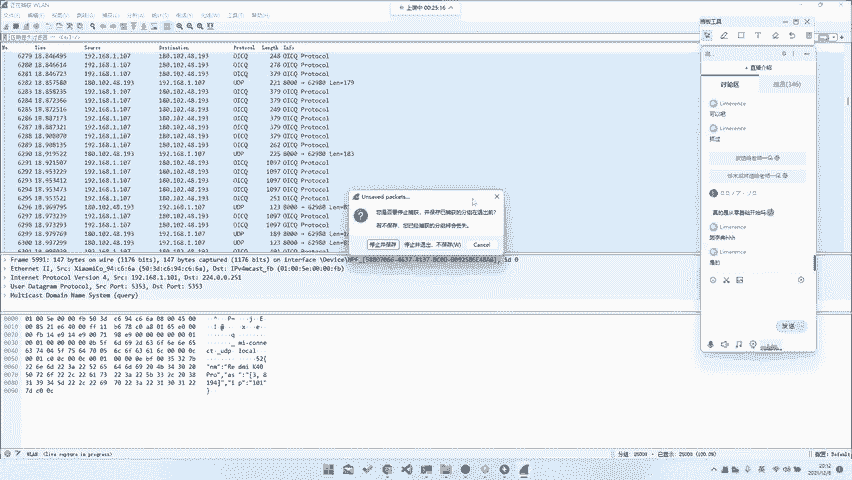

它可以用于动态抓包和静态流量包分析。安装过程简单，从其官网下载对应版本即可。

在图形界面中，你可以：
1.  选择网卡进行实时抓包。
2.  打开已有的数据包文件（`.pcap`、`.pcapng`）进行分析。
3.  使用丰富的过滤表达式筛选特定流量。
4.  右键点击数据包，选择“追踪流” -> “TCP流/HTTP流/SSL流”来重组会话内容。
5.  通过“文件” -> “导出对象”来提取传输的文件。

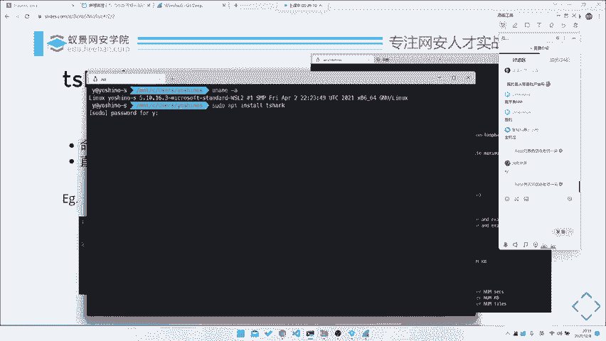

对于初学者，Wireshark 的图形界面非常友好，是入门和进行初步分析的首选工具。

### Tshark：命令行利器 💻

当需要进行自动化处理、批量分析或与脚本集成时，图形界面就不够方便了。这时，Tshark（命令行版的 Wireshark）就派上了用场。

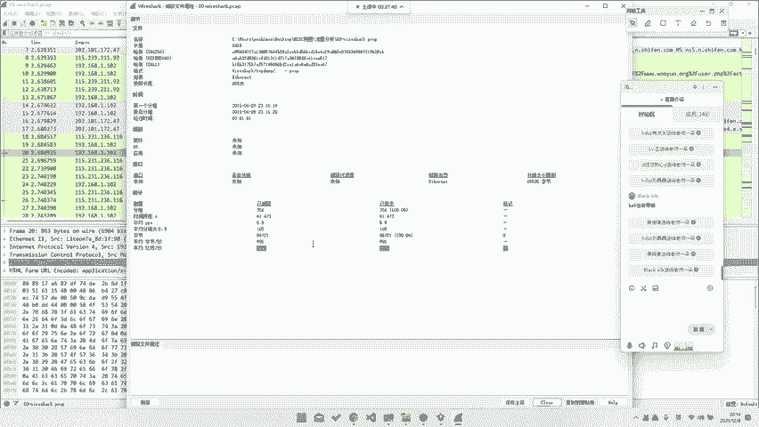

在 Linux（如 Ubuntu）上，可以通过 `sudo apt install tshark` 安装。

以下是 Tshark 的一些常用命令示例：

**1. 基础读取与过滤：**
```bash
# 读取文件并应用显示过滤器（只显示HTTP请求）
tshark -r capture.pcap -Y “http.request”
```

**2. 提取特定字段（如HTTP POST数据）：**
```bash
# 提取HTTP请求中的文件数据（如POST正文）
tshark -r capture.pcap -Y “http.request” -T fields -e http.file_data
```

**3. 追踪并输出特定TCP流（例如流索引为2的HTTP流）：**
```bash
# 以ASCII格式输出第二个TCP流的内容
tshark -r capture.pcap -z “follow,tcp,ascii,2”
```

这些命令允许你将流量分析流程脚本化，是处理复杂或重复性任务的关键。

### Pyshark：Python 集成库 🐍

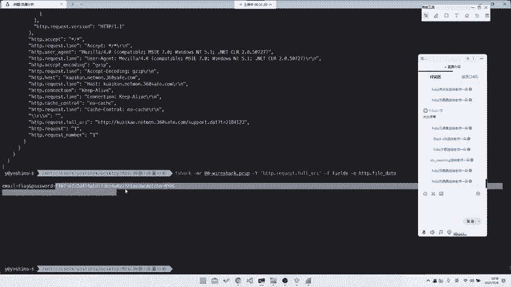

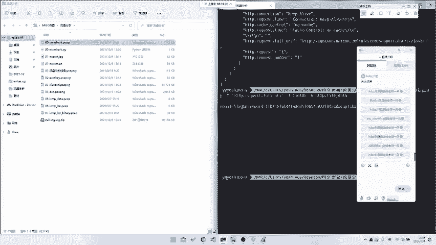

对于熟悉 Python 的选手，Pyshark 库提供了在 Python 脚本中直接解析数据包的能力，灵活性最高。

首先需要安装：`pip install pyshark`

以下是一个简单的示例脚本，用于提取 HTTP 请求中的数据：

```python
import pyshark

# 加载数据包文件
cap = pyshark.FileCapture(‘capture.pcap’, display_filter=“http.request”)

for pkt in cap:
    try:
        # 打印HTTP文件数据
        print(pkt.http.file_data)
    except AttributeError:
        # 某些包可能没有该字段
        pass
```

通过 Python 脚本，你可以轻松地集成数据分析、字符串处理、文件操作等复杂逻辑，实现高度定制化的流量分析。

### 工具使用策略总结

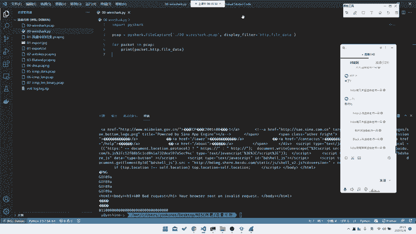

在实际解题中，推荐的工作流程是：
1.  **初步探索**：使用 **Wireshark** 图形界面打开数据包，进行整体浏览、过滤和简单追踪，理解流量结构和题目意图。
2.  **精确提取**：根据初步分析确定的特征，使用 **Tshark** 命令或 **Pyshark** 脚本，精准地提取出所需的数据。
3.  **后续处理**：将提取出的数据（可能是字符串、十六进制、文件等）用 Python 或其他脚本进行进一步解码、解密或分析。

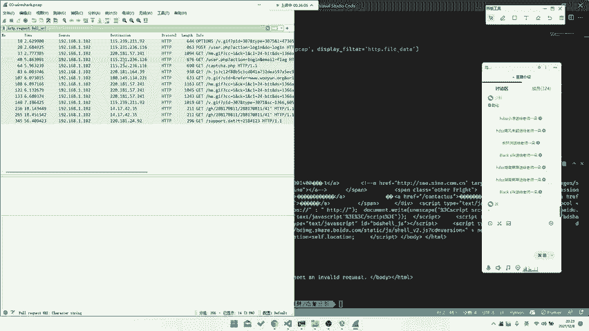

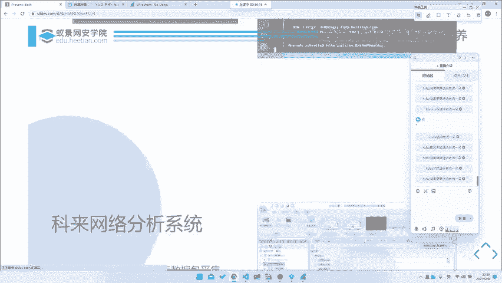

### 其他辅助工具


除了 Wireshark 生态，还有其他工具，例如国产的 **科来网络分析系统**。它更侧重于流量的整体统计、协议分布和会话分析，在需要宏观把握流量特征（如“找出请求次数最多的IP”）的题目中可能有用。但本课程核心仍围绕 Wireshark 系列工具展开。

---

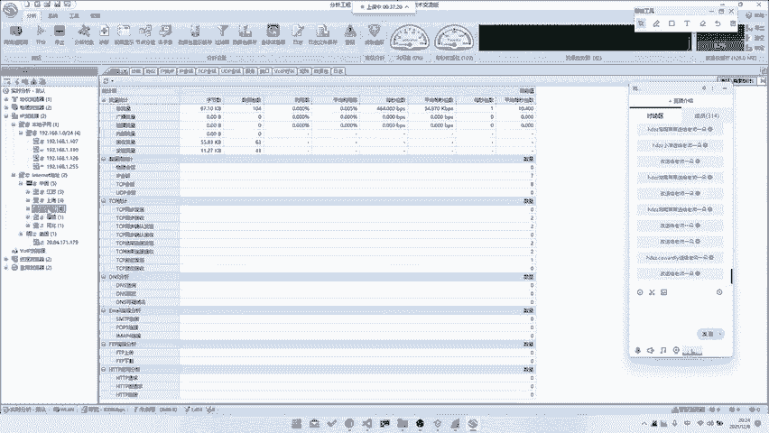

本节课中我们一起学习了流量分析的基础知识、其应用前景，并详细介绍了核心工具链：**Wireshark**、**Tshark** 和 **Pyshark**。掌握从图形化探索到命令行自动化提取的技能，是应对各类流量分析挑战的基石。下一节，我们将开始运用这些工具，深入实际的流量分析案例。