# 护网行动红蓝攻防教程：P67：拿到题目该做什么之关键点提取与信息收集 🎯

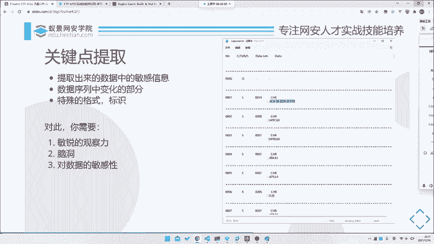

在本节课中，我们将学习在拿到一道题目（特别是涉及数据包或协议分析类题目）后，如何系统地进行关键点提取与信息收集。这是从原始数据中挖掘有效信息、定位解题方向的核心步骤。

## 概述 📋

面对一个包含大量数据（例如时间序列数据、网络流量）的题目，直接分析所有内容效率低下且容易迷失方向。本节将介绍一套标准流程：首先进行数据预处理，接着提取关键信息，最后利用强大的信息搜集能力寻找突破口。掌握这个方法，能帮助你高效应对各类复杂题目。

## 关键点提取 🔍

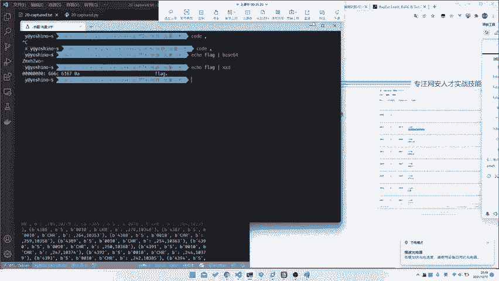

上一节我们介绍了数据的初步处理，本节中我们来看看如何从处理后的数据中提取关键信息。关键点提取，即从数据中找出我们需要重点关注和后续分析的部分。因为时间序列上的数据可能非常多（例如本例中有9000多行），我们不可能对每一个数据点都进行深入分析。虽然所有数据都可能与最终获取flag有关，但在分析核心要点时，必须有所侧重。

以下是提取关键点时需要关注的几个部分：

1.  **数据中的变化部分**：观察哪些字段的值在随时间变化。例如，在本数据中，`number`字段是递增的，这种规律性变化可能不是重点；而`data`字段的内容各不相同，很可能包含重要信息。
2.  **敏感或特殊格式的数据**：寻找具有特定模式的数据，例如可能是Base64编码、十六进制字符串、特殊分隔符等。这些格式本身可能就是线索。
3.  **协议或指令关键词**：数据中可能包含一些特定的命令或协议标识符，这些是判断流量类型和进行后续搜索的关键。

提取这些关键点，需要你具备以下几种能力：

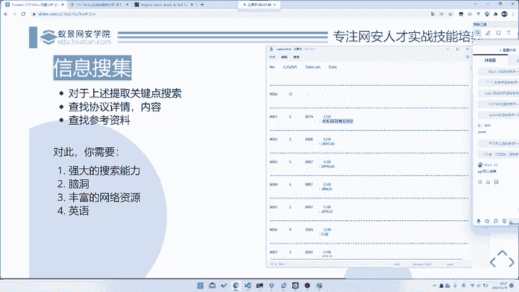

*   **敏锐的观察能力**：能快速识别出数据中哪些部分在变化，哪些部分保持不变。
*   **一定的“脑洞”（联想能力）**：有些题目的设计思路巧妙，需要你能将数据特征与可能的考点联系起来。
*   **对数据的敏感度**：熟悉常见的数据格式和编码。例如，看到`666C6167`能立刻联想到这是“flag”的十六进制表示；看到`ZM`开头的字符串能想到可能是Base64编码。

## 信息搜集 🌐

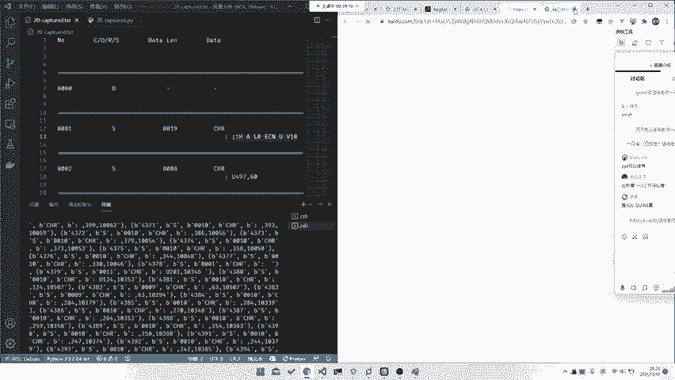

在提取出关键信息后，下一步就是利用这些信息进行搜索。信息搜集的核心原则是“不要重复造轮子”。前人可能已经分析过相同或类似的协议，甚至本题就是一道原题，直接搜索可以极大提升解题效率。

我们需要将上一步提取出的关键词（如协议名称、特殊指令、数据格式）作为搜索条件进行查找。信息搜集可能涉及以下内容：

*   查找特定协议的详细文档或RFC标准。
*   搜索是否有该协议的分析文章或类似题目的Writeup（解题报告）。
*   寻找可用的解析工具或脚本。

有效的搜索依赖于以下能力：

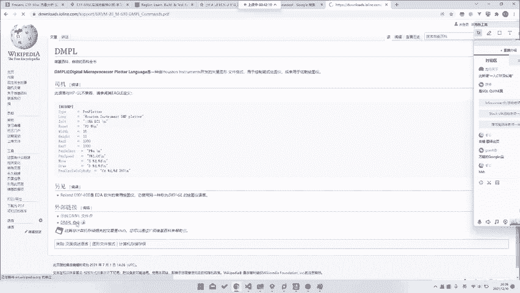

*   **搜索技巧**：掌握高级搜索语法，能精准定位信息，而非简单使用通用关键词。
*   **丰富的网络资源储备**：拥有自己的“宝藏”收藏夹，包含各类技术论坛、文档站点、漏洞库等。
*   **外语能力（特别是英语）**：很多一手技术资料和比赛题目都是英文的。有时甚至需要其他语言能力，例如曾有比赛题目，其唯一公开的Writeup是韩文版本。

### 搜索实战演示

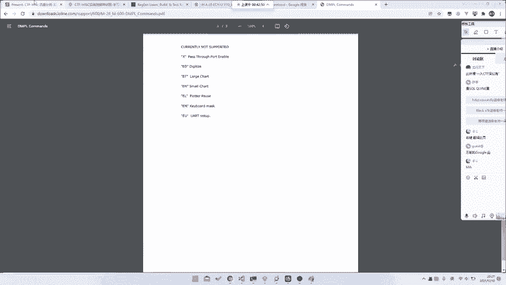

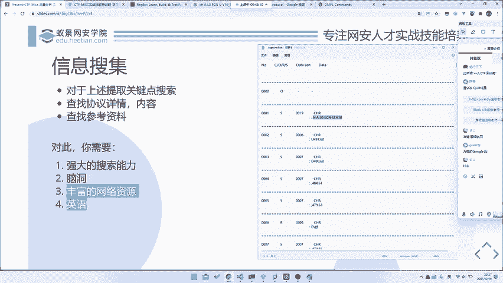

让我们以课程中的例子来模拟一个完整的搜索过程。假设我们从数据中提取到一个疑似协议名称的关键词“DMPL”。

1.  **初步尝试**：将“DMPL”直接放入百度搜索，结果可能只找到一些关于“刻字机”的零星信息，没有协议细节。
2.  **调整策略**：尝试搜索数据包中一段固定的特殊格式字符串（例如开头部分），可能会在论坛或博客中找到完全相同的字符串，从而发现有人讨论过相关流量。
3.  **深入挖掘**：根据找到的线索（如“DMPL协议”），尝试用更专业的术语搜索。例如，在谷歌搜索“DMPL protocol”，就能找到其英文全称“Digital Microprocessor Plot Language”以及详细的协议指令文档（如`PEN SELECT`, `PEN SPEED`, `MOVE`, `DRAW`等）。
4.  **获得突破**：找到官方或详细的协议文档后，题目就迎刃而解。你可以根据文档理解每个字段的含义，从而编写脚本解析数据，还原出flag。

这个例子很好地印证了信息搜集的各个环节：需要搜索技巧来找到初始线索，需要一点联想能力将“DMPL”与“protocol”关联，需要知道使用Google等搜索引擎，并且足够的英语能力是理解最终文档的关键。

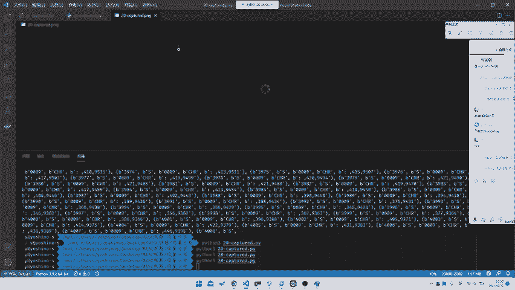

## 实战应用与总结 🚀

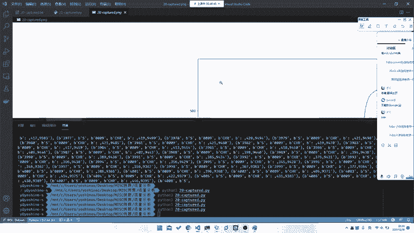

回到我们的题目，在通过信息搜集找到DMPL协议文档后，我们得知`UP`代表拾笔（移动但不绘制），`DOWN`代表落笔（移动并绘制）。我们只需要关注`data`字段中，以`UP`、`DOWN`或坐标点（如`123,456`）开头的行。

以下是处理流程：

1.  **提取关键指令**：从数据中筛选出包含`UP`、`DOWN`和坐标点的行。
2.  **数据可视化**：根据指令，将坐标点连接起来绘图。即使不完全理解`UP`/`DOWN`，仅将所有坐标点连线，有时也能看出模糊的flag形状。
3.  **调整与优化**：根据绘出的图像调整坐标比例或方向（例如发现图像倒置时，对Y坐标进行 `[最大值] - y` 的变换），最终得到清晰的flag图形。

```python
# 示例代码片段：提取坐标并进行简单绘图（使用matplotlib）
import matplotlib.pyplot as plt

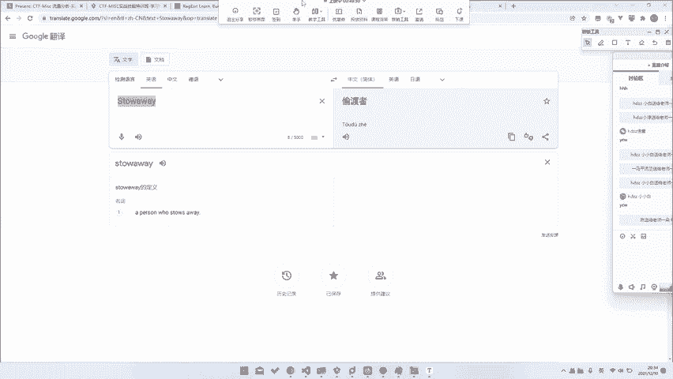

x_coords = []
y_coords = []
# ...（解析数据，将坐标填入上述列表）...

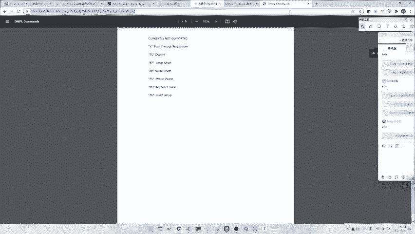

plt.plot(x_coords, y_coords)
plt.gca().invert_yaxis() # 如果图像上下颠倒，可以反转Y轴
plt.show()
```

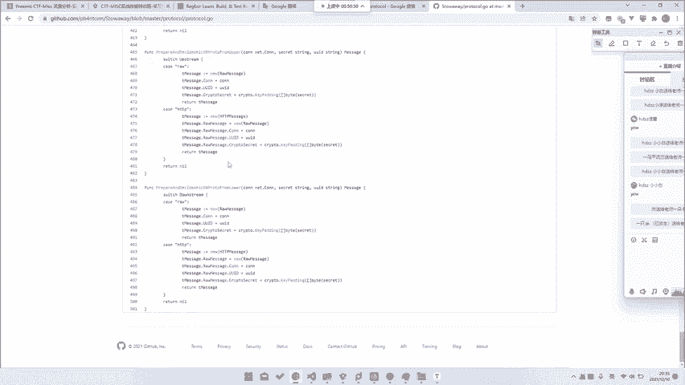

本节课中我们一起学习了应对数据解析类题目的三个核心步骤：**数据预处理 -> 关键点提取 -> 信息搜集**。这是一个普适的解题框架，无论题目简单还是复杂（例如涉及更冷门或自定义的协议），遵循这个流程都能帮助你理清思路，一步步逼近答案。关键在于培养观察力、积累搜索经验，并善于利用已有的网络资源。