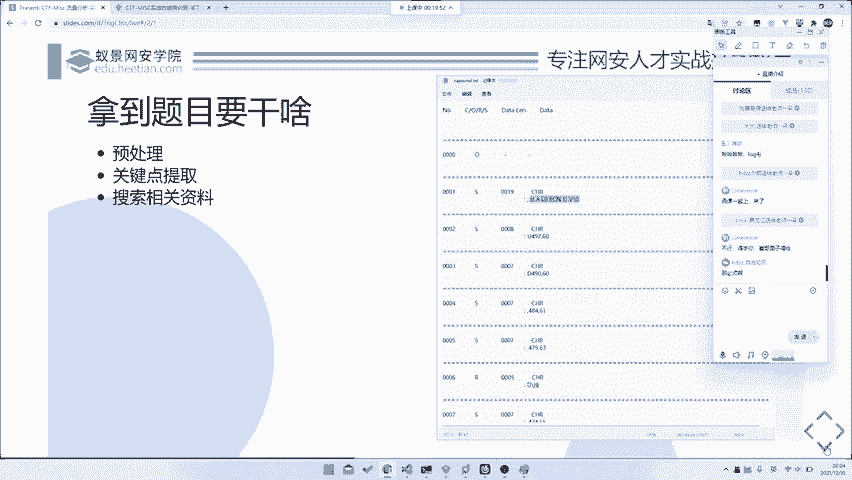
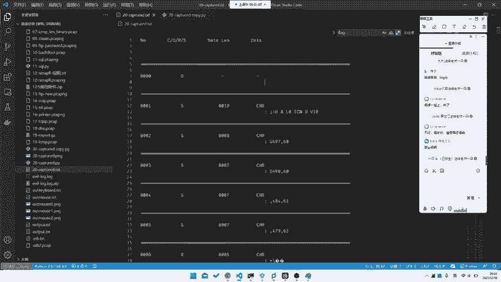
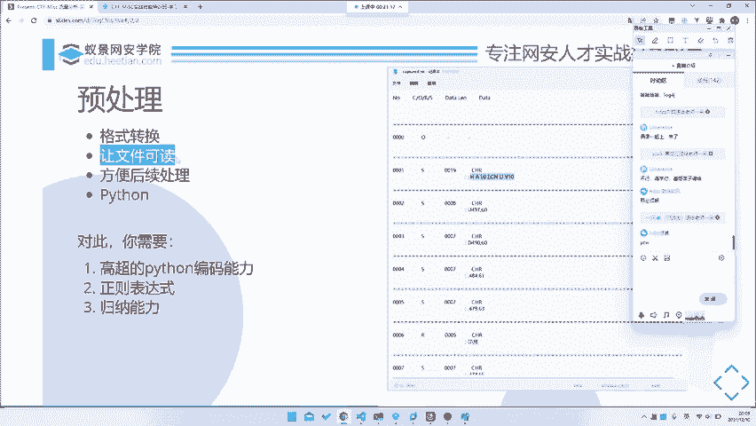
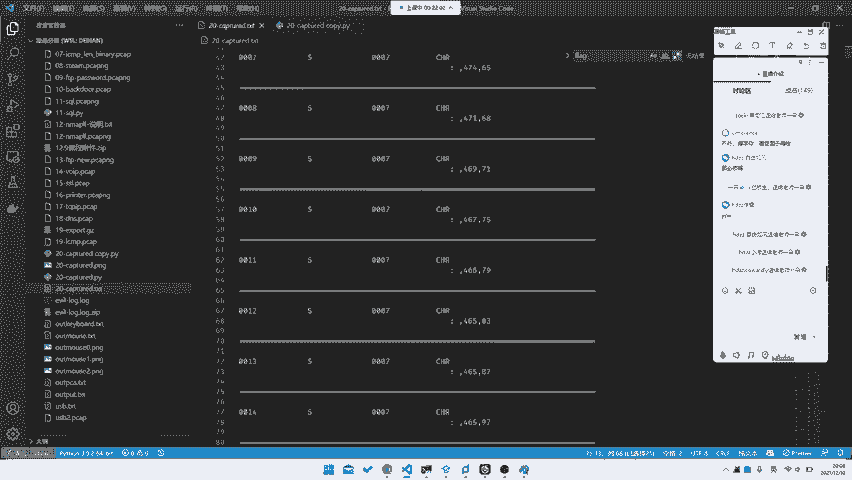
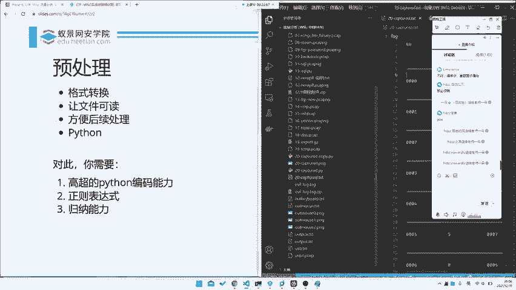
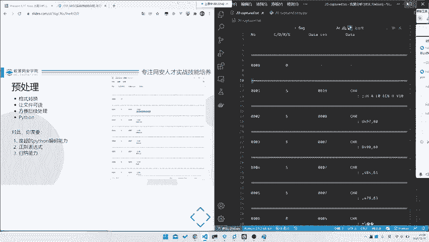
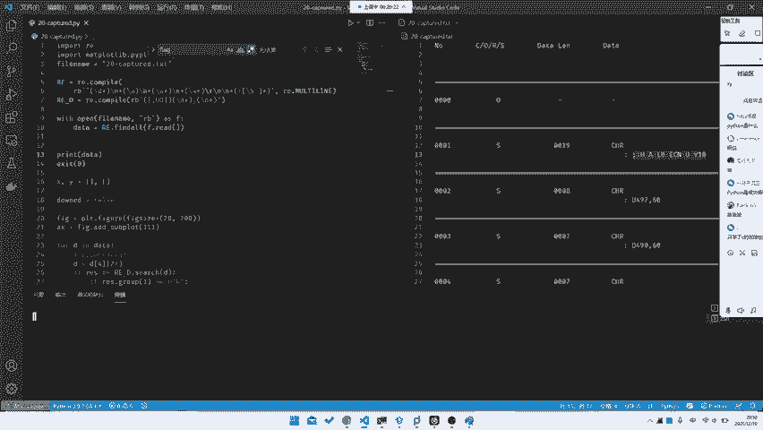
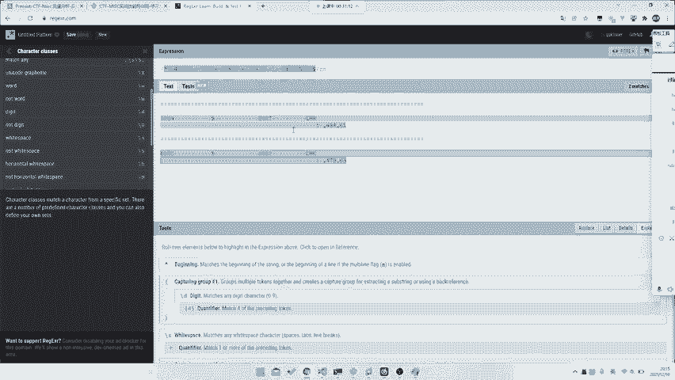
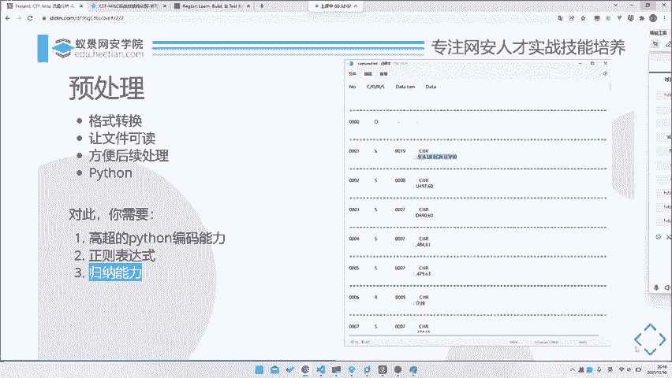

# 护网行动红蓝攻防教程：P68：拿到题目该做什么之预处理



在本节课中，我们将学习如何入手一道全新的题目，特别是如何进行预处理，将原始数据转化为可分析的结构化格式。我们将通过一个具体案例，完整演示从拿到题目到完成预处理的全过程。

---

## 概述：解题的第一步





面对一道新题目，尤其是涉及大量杂乱数据的题目时，直接寻找答案往往无从下手。因此，我们需要一个系统化的入手流程。这个过程可以概括为三个核心步骤：**预处理**、**关键点提取**和**搜索相关资料**。本节课，我们将重点讲解第一步——预处理。

上一节我们介绍了解题的整体思路，本节中我们来看看如何具体执行预处理。





## 预处理：让数据可读

预处理的核心目标是**转化数据格式**，使其变得**可读**和**易于后续分析**。无论是TXT、JSON还是其他格式，转化后我们才能更方便地进行操作。



例如，我们拿到一个包含近24000行数据的TXT文件。文件内容看似有规律，包含“number”、“CORS”、“datalan”、“data”等字段，但直接全局搜索“flag”是无效的。因此，必须首先进行预处理。

### 第一步：观察与找规律

观察数据，我们发现它似乎是一个时间序列，每行数据可能包含多个字段。例如，一行数据可能呈现以下模式：
```
0000 C 1234 datalan data: something_here
```
我们需要找出这些字段之间的分隔规律（如空格、特定字符），为提取数据做准备。这就像解“找规律”数学题，是预处理的基础。

### 第二步：使用正则表达式提取数据

找到规律后，我们需要将所需的数据字段提取出来。**正则表达式**是完成此任务最强大的工具，因为它能精准匹配文本模式。



以下是一个用于提取示例数据中关键字段的Python脚本核心代码：

```python
import re

pattern = r'^(\d+)\s+(\w)\s+(\S+)\s+(\S+):\s*(.+)$'
# 解释：
# ^(\d+)     -> 匹配行首的数字（如0000），作为第一个分组（ID）
# \s+(\w)    -> 匹配空格后的单个字母（如C），作为第二个分组
# \s+(\S+)   -> 匹配空格后的一串非空字符（如1234），作为第三个分组
# \s+(\S+):  -> 匹配空格后、冒号前的一串非空字符（如data），作为第四个分组
# \s*(.+)$   -> 匹配冒号后的所有内容（直到行尾），作为第五个分组（实际数据）

with open('raw_data.txt', 'r') as f:
    for line in f:
        match = re.match(pattern, line)
        if match:
            # 提取出的五个字段
            id, letter, code, field, content = match.groups()
            print(f"ID: {id}, Letter: {letter}, Code: {code}, Field: {field}, Content: {content}")
```

运行此脚本后，杂乱的数据会被整理成清晰的结构化格式，例如：
```
ID: 0000, Letter: C, Code: 1234, Field: data, Content: something_here
```
这样，我们就完成了数据的预处理，为后续分析打下了坚实基础。

### 预处理所需的核心能力

以下是成功进行预处理你需要掌握的几项关键技能：

1.  **基础的Python编码能力**：能够编写脚本来读取文件、处理字符串和循环数据。
2.  **熟练使用正则表达式**：这是从文本中提取信息的核心。推荐使用在线工具（如 [regex101.com](https://regex101.com)）来学习和测试你的正则表达式。
3.  **数据规律的归纳能力**：能够从杂乱的数据中观察并总结出重复出现的模式。

---

## 总结



本节课中，我们一起学习了面对新题目时的第一步——**预处理**。我们通过一个实际案例，演示了如何观察数据规律，并利用**正则表达式**编写Python脚本，将杂乱的原始文本数据转化为结构清晰、易于分析的数据格式。掌握预处理是后续进行关键信息提取和深入分析的前提。



下一节，我们将基于预处理后的数据，探讨如何进行**关键点的提取**。