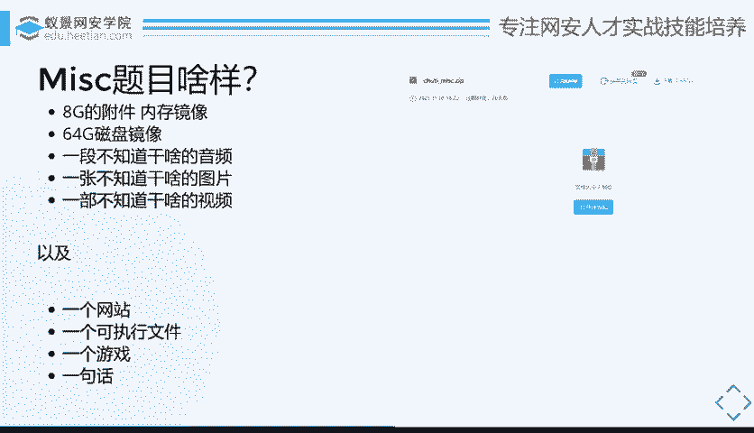
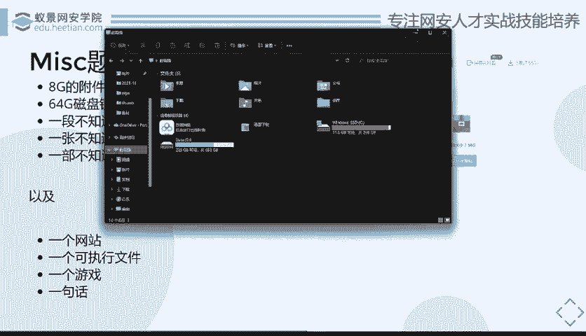

# CTF入门：P69：什么是MISC 🔍

在本节课中，我们将系统性地探讨CTF比赛中的MISC（杂项）类别。我们将了解MISC题目的来源、特点、选手的现状以及未来的学习与发展方向。通过本次学习，你将对MISC在CTF及网络安全领域中的定位有一个清晰的认识。

## MISC从哪里来？🤔

首先，我们从最基础的概念开始。什么是MISC？通俗来讲，MISC就是“大杂烩”，它包含了多种类型的题目和资源。具体而言，它是一个分类，涵盖了诸如OSINT（开源情报搜集）、隐写术、取证、编码以及许多其他无法明确归入Web、Pwn、Reverse或Crypto类别的题目。

简而言之，**所有你不知道如何分类的CTF题目，都可以归为MISC**。

值得注意的是，国内外的比赛环境存在差异。在国外比赛中，上述类型可能会被细分为独立的类别（如取证题、隐写题）。但在国内，由于环境因素，这些题目通常被统一归入“MISC”类别，导致国内的MISC题目内容非常庞杂。

## 为什么推荐学习MISC？🌟

上一节我们介绍了MISC的基本定义，本节中我们来看看为什么许多前辈会推荐初学者从MISC入手。MISC通常被认为是最有趣、最平易近人、最容易入门且最贴近生活的CTF方向。

以下是具体原因：
*   **最有趣、最平易近人**：MISC中的许多场景与现实生活息息相关。例如，通过社会工程学手段进行的盗号、恢复被删除的微信聊天记录或电脑文件、甚至通过一张照片分析出拍摄地点等信息，都属于MISC的范畴。
*   **最容易入门**：与其他方向相比，MISC的入门门槛相对较低。学习Web可能需要先掌握PHP、Python等语言；学习Pwn或Reverse可能需要理解操作系统、计算机体系结构并使用IDA等专业工具。而入门MISC，甚至可以不要求编程基础，关键在于拥有足够的“脑洞”和探索精神。
*   **最贴近生活**：许多潜藏在身边的网络安全风险，如盗号、网络犯罪等，其手法与MISC中的知识有相似之处。因此，学习MISC也能帮助理解现实中的安全威胁。

MISC的最终发展方向也印证了其特性，例如向数字取证领域发展，未来可能辅助执法机构进行案件调查。

## MISC选手的挑战与所需技能 ⚙️

尽管MISC看似拥有诸多优点，但真正深入后便会发现其面临的巨大挑战。成为一名优秀的MISC选手需要广泛的知识储备和强大的学习能力。

首先，MISC选手需要一些基础能力和大量工具。

以下是成为一名MISC选手可能需要掌握的部分内容：
*   **基础技能**：熟练使用Linux系统是基本要求。
*   **广泛的知识面**：所需知识不仅限于计算机领域，还可能涉及音频处理、图像分析、数字信号处理，甚至人工智能、嵌入式系统或区块链等。
*   **核心特质**：最重要的是拥有一颗热爱学习的心。因为解决MISC题目的大部分思路和知识，往往需要你在比赛现场快速学习掌握。
*   **工具集合**：需要掌握大量工具，例如用于破解的Kali Linux、用于压缩包破解的`fcrackzip`、用于磁盘取证的`Autopsy`或国产的“取证大师”、用于流量分析的Wireshark，有时甚至需要用到Photoshop、After Effects等多媒体处理软件，或者MATLAB进行数学建模。
*   **开发环境**：你可能会遇到需要Web开发或二进制分析的环境，因此相应的Python、C/C++等开发环境也需要准备。
*   **硬件要求**：最后，一个容量巨大的硬盘至关重要。这并非玩笑，因为MISC题目附件动辄几个GB甚至几十GB（如完整的磁盘镜像、内存镜像），用于存储各种学习资料和比赛附件。

## MISC选手在做什么？🎯

在CTF社群中，关于MISC选手的讨论常常带有调侃意味。有一种观点认为：“所谓的MISC手，不应该是Web不会、Reverse逆不出来、Pwn看不懂、密码写不出来，只能做做MISC签到题的人的自嘲吗？”这虽然夸张，但也反映了MISC选手需要知识面极广的事实。

更客观地看，MISC选手在比赛中可能处理隐写、取证、古典密码、冷门协议等各种“杂项”知识。这迫使选手不断学习新知识，从而形成了比专精单一方向的选手更广的知识面。例如，Web手可能专注于Web漏洞，Reverse手专注于二进制逆向，而MISC手则需要什么都知道一点。

然而，这种“广而不深”的特点，也使得MISC在职业发展上缺乏完全对口的专门岗位。但这并不意味着它没有价值。CTF（夺旗赛）本身具有游戏性质，MISC在其中提供了多样化的挑战和乐趣。

在实际赛场上，MISC选手在做什么呢？他们可能在分析一个巨大的磁盘镜像，也可能在玩一个《我的世界》游戏存档（因为flag就藏在通关过程中），或者对着一张图片、一段音频苦思冥想。当其他方向的题目被队友“AK”（全部解决）时，MISC选手可能还在与一道需要极大“脑洞”的题目搏斗。他们的工作状态常常是：对着题目发呆、开脑洞、想不出来、暂时放弃，但最终又可能因为一个精妙的解法而豁然开朗。

## MISC的未来与方向 🚀

通过前面的介绍，我们了解了MISC的广泛性和挑战性。那么，学习MISC的未来方向是什么？虽然MISC本身可能没有直接对口的“MISC工程师”岗位，但它所培养的能力极具价值。

MISC所锻炼的**快速学习能力、广泛的知识视野、解决问题的灵活思维以及取证分析基础**，是网络安全领域许多岗位都需要的核心素质。你可以朝着数字取证、安全分析、渗透测试（需要广泛知识面）或安全研发等方向发展。MISC的学习过程，是构建你网络安全知识体系宽度的一个绝佳途径。

**本节课中我们一起学习了**：MISC（杂项）在CTF中的定义与来源；为什么MISC适合初学者入门；成为一名MISC选手所需面对的挑战和需要掌握的广泛技能；MISC选手在比赛中的真实状态与工作内容；以及通过学习MISC所能培养的能力及其未来的发展方向。记住，MISC不仅是CTF的一个分类，更是锻炼你广泛学习能力和解决问题思维的舞台。