# 护网行动红蓝攻防教程：P70：22_网络流量篇之FTP和ICMP流量

## 概述
在本节课中，我们将学习如何分析网络流量中的FTP和ICMP协议数据，并从中提取隐藏的信息。我们将通过具体的实例，演示如何使用命令行工具和脚本处理这些协议流量，以解决网络安全挑战。

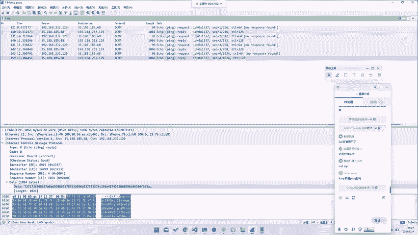

---

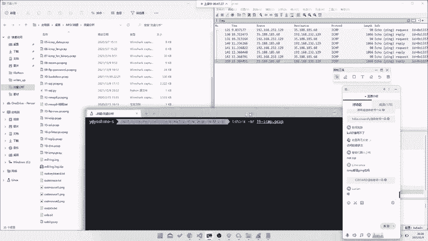

## 协议层次分析
上一节我们介绍了HTTP流量分析，本节中我们来看看FTP和ICMP流量。这两种协议与HTTP不同，它们运行在不同的网络层次上。HTTP通常运行在TCP协议之上，而FTP和ICMP则有其独特的传输方式。

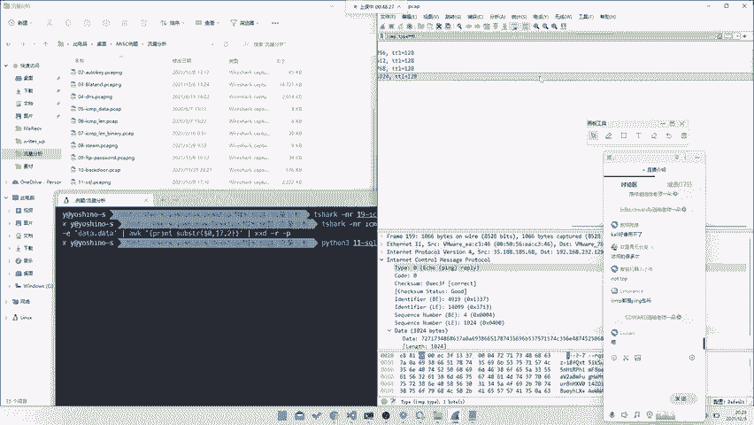

ICMP协议不仅用于常见的`ping`命令，它还可以承载其他类型的数据。ICMP协议直接运行在IP层之上，与TCP/UDP属于同一层级。

## ICMP流量分析基础
对于ICMP流量，我们需要关注数据包中的特定字段。例如，在一个ICMP数据包中，`data`字段可能包含隐藏的信息。

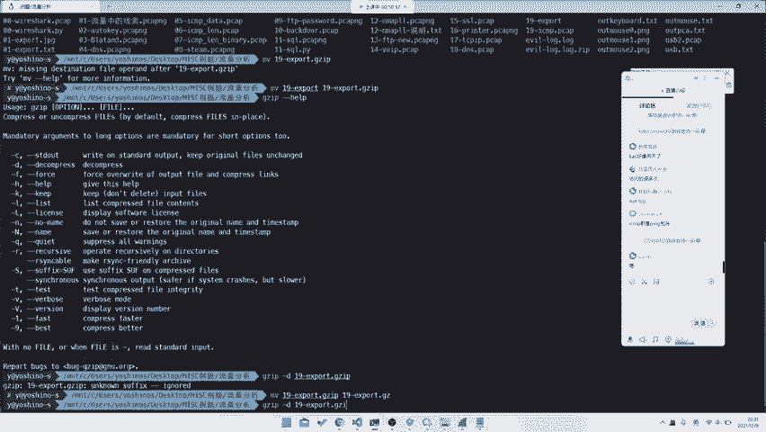

以下是一个过滤ICMP响应包的示例命令：
```bash
tshark -r icmp.pcap -Y "icmp.type == 0"
```
这个命令会过滤出所有ICMP响应包（`type`为0）。

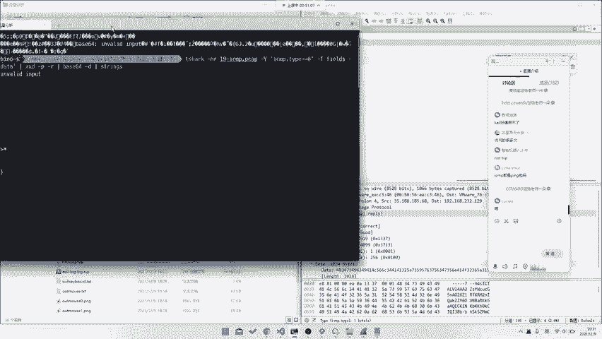

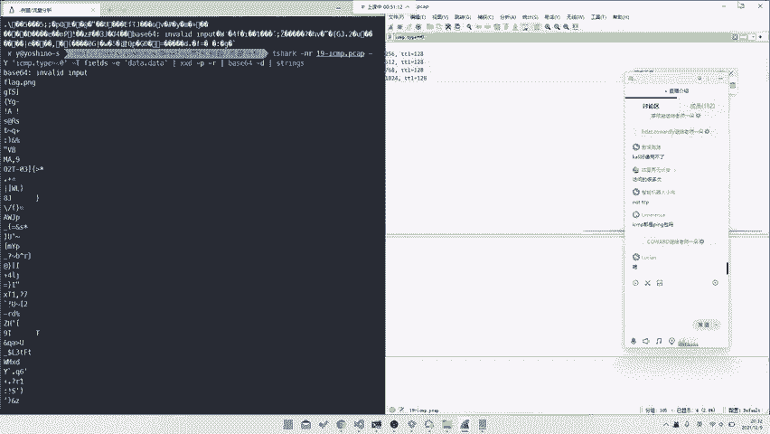

## 从ICMP数据中提取Base64编码
在某些CTF题目或安全场景中，flag可能被编码后隐藏在ICMP数据包的`data`字段中。

以下是提取并解码Base64数据的步骤：
1.  **过滤并导出数据**：使用`tshark`过滤出包含数据的ICMP响应包，并导出`data`字段。
    ```bash
    tshark -r challenge.pcap -Y "icmp.type == 0" -T fields -e data.data
    ```
2.  **解码十六进制**：导出的数据通常是十六进制格式，需要先转换为原始字节。可以使用`xxd`工具。
    ```bash
    xxd -r -p
    ```
3.  **解码Base64**：将上一步得到的原始字节进行Base64解码。
    ```bash
    echo "Base64字符串" | base64 -d
    ```
    解码后可能会得到一个文件名（如`flag.png`）或直接是flag内容。

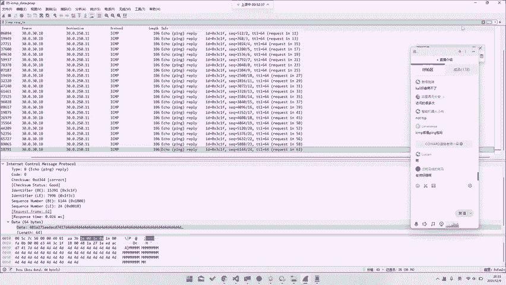

## 处理特殊编码的ICMP数据
有时，flag并非直接放在`data`字段中，而是通过其他方式隐藏。

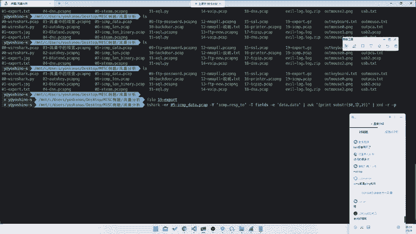

以下是几种常见情况及其处理方法：
1.  **数据隐藏在特定字节位**：观察发现，flag的每个字符可能隐藏在`data`字段的固定偏移位置。可以使用`awk`命令提取。
    ```bash
    tshark -r challenge.pcap -Y "icmp.type == 0" -T fields -e data.data | awk '{print substr($0, 17, 2)}'
    ```
    这个命令会提取每个数据包`data`字段从第17位开始的两个字符。
2.  **数据隐藏在长度字段**：有时，flag的ASCII码值会被隐藏在ICMP包的`length`字段中。可以通过过滤并导出`data.len`字段来获取。
    ```bash
    tshark -r challenge.pcap -Y "icmp.type == 8" -T fields -e data.len
    ```
    然后将得到的数字序列转换为对应的ASCII字符即可。

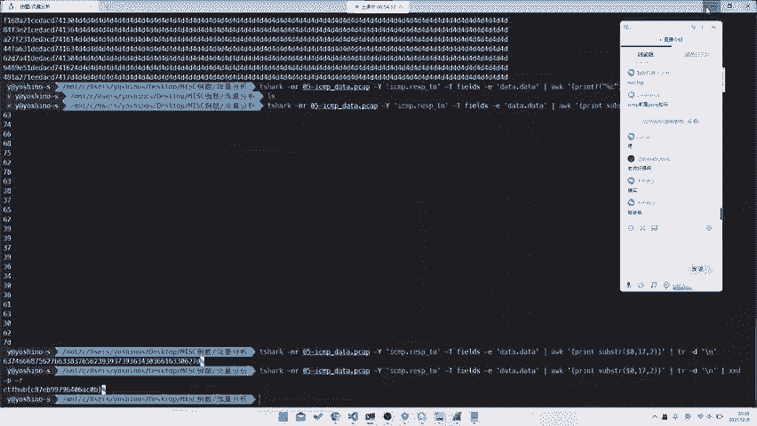

## 使用Python脚本辅助分析
如果不熟悉命令行工具，编写Python脚本是另一种灵活高效的方法。

以下是一个示例脚本，用于从导出的数据中提取并解码flag：
```python
import base64

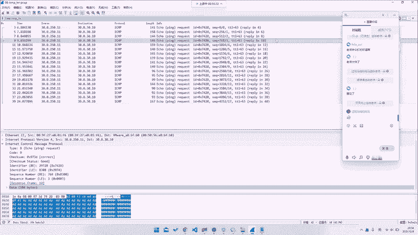

# 读取导出的数据文件
with open('output.txt', 'r') as f:
    lines = f.readlines()

# 提取每一行特定位置的字符并拼接
flag_hex = ''
for line in lines:
    line = line.strip()
    if len(line) > 16:  # 确保有足够长度
        flag_hex += line[16:18]  # 提取第17、18位字符

# 将十六进制字符串转换为字节，然后Base64解码
flag_bytes = bytes.fromhex(flag_hex)
flag = base64.b64decode(flag_bytes).decode('utf-8')
print(flag)
```
这个脚本演示了如何自动化完成数据提取和解码的过程。

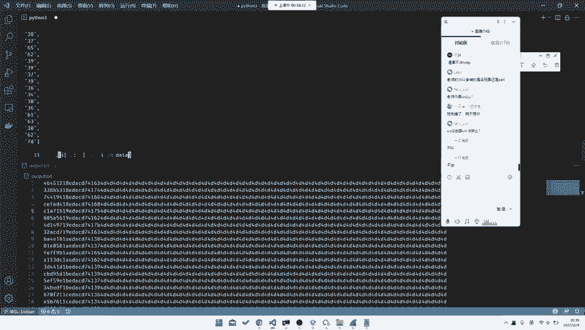

## FTP流量分析简述
FTP流量分析通常关注命令通道和数据通道。在CTF题目中，可能需要从捕获的FTP流量中寻找认证信息、传输的文件或隐藏的命令。

一个常见的任务是过滤出FTP登录凭证：
```bash
tshark -r ftp.pcap -Y "ftp.request.command == USER || ftp.request.command == PASS" -T fields -e ftp.request.arg
```

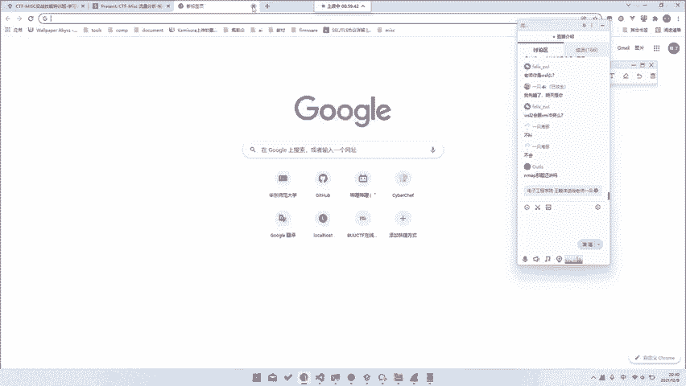

## 总结
本节课中我们一起学习了如何分析FTP和ICMP网络流量。我们掌握了以下核心技能：
1.  理解ICMP协议与TCP/UDP协议层次的区别。
2.  使用`tshark`过滤和导出ICMP协议特定字段（如`data`、`length`）。
3.  从ICMP数据包中提取隐藏的Base64或十六进制编码信息，并进行解码。
4.  利用`awk`、`xxd`、`base64`等命令行工具进行快速数据处理。
5.  编写Python脚本以更灵活的方式处理复杂的流量分析任务。
6.  了解了FTP流量分析的基本思路。

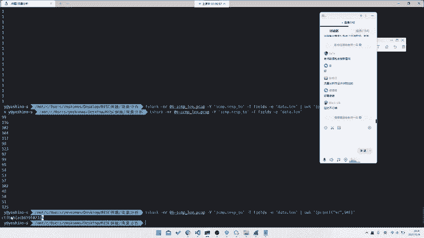

通过本课的学习，你应具备从常见网络协议流量中发现和提取隐藏信息的基本能力，这是应急响应和渗透测试中的重要技能。