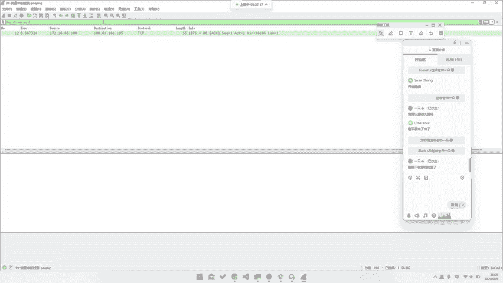
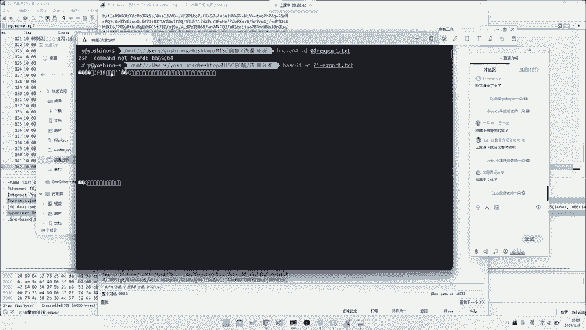
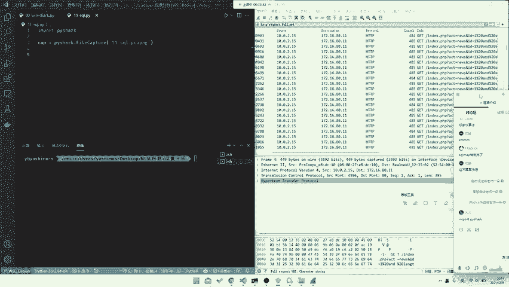
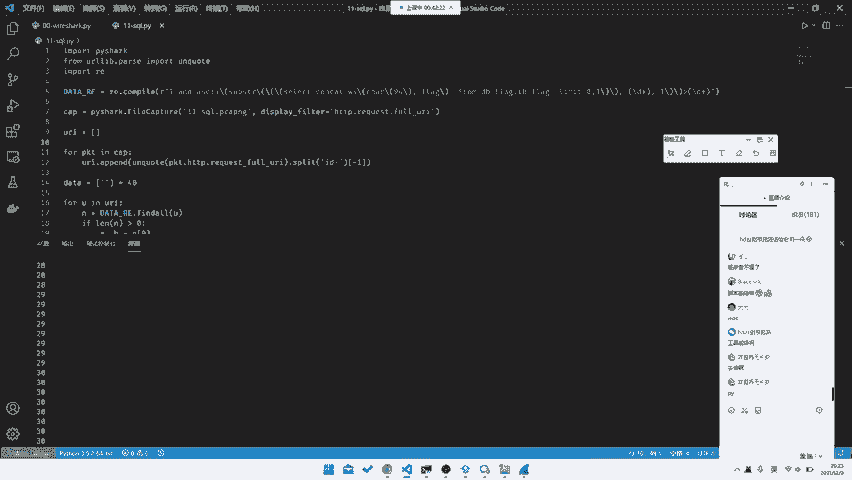
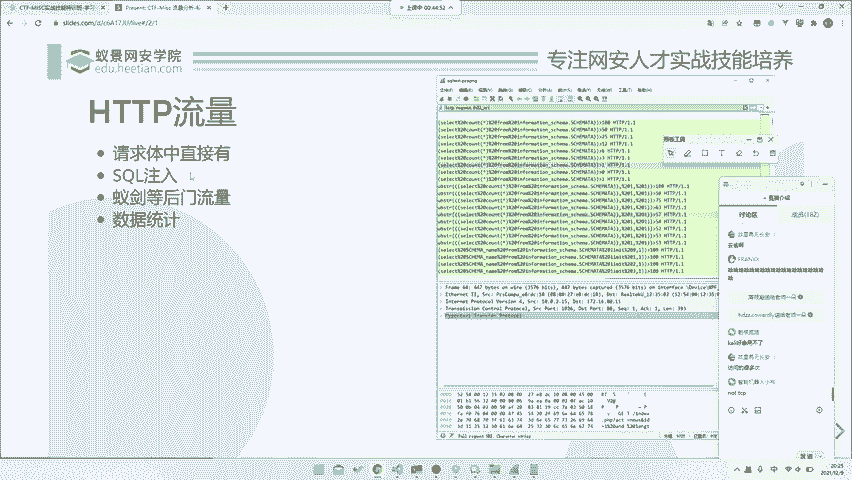

# 网络流量分析：P71：23_网络流量篇之HTTP流量 🔍

在本节课中，我们将学习如何分析HTTP协议的网络流量数据包。我们将通过几个具体的例子，了解如何从流量中提取关键信息、识别攻击行为并最终获取目标数据（如Flag）。课程内容涵盖基础数据提取、SQL注入流量分析以及后门流量识别。

---



## 请求体中直接包含数据

上一节我们介绍了网络流量分析的基本概念，本节中我们来看看最简单的一种情况：数据直接包含在HTTP请求或响应体中。



以下是处理此类流量的步骤：

1.  使用Wireshark打开提供的流量包文件（`.pcapng`）。
2.  在过滤器中输入 `http` 以筛选出所有HTTP流量。
3.  逐个检查数据包，或在“文件”菜单中尝试“导出对象”->“HTTP...”来查看所有HTTP传输的文件。
4.  在流量中，寻找异常或可疑的数据。例如，发现一个对 `analysis.php` 的请求，其响应体中包含一串明显的Base64编码字符串。
5.  将这段Base64字符串复制出来进行解码。可以使用在线工具，或在命令行使用 `base64 -d` 命令。
    ```bash
    echo "Base64字符串" | base64 -d > output.bin
    ```
6.  解码后，检查文件头。例如，发现文件头为 `JFIF`，表明这是一个JPG图片文件。
7.  将解码后的二进制数据保存为 `.jpg` 文件并打开，即可找到隐藏的Flag。

这种题型较为基础，关键在于识别出经过编码的敏感数据。

---

## 分析攻击流量（以SQL注入为例）

接下来，我们分析更复杂的情况：从攻击流量中提取信息。这里以一道包含SQL注入盲注的题目为例。


首先，流量包通常较大，需要使用过滤器。观察流量，可以发现形如 `index.php?act=news&id=1` 的请求，其中 `id` 参数后的值在不断变化，这是典型的SQL注入特征。



以下是分析此类流量的方法：

1.  在Wireshark过滤器中输入 `http.request.uri`，筛选出所有HTTP请求的URI。
2.  观察URI，发现注入使用 `substr()` 函数和二分法（`between and`）来逐位爆破数据。
3.  编写Python脚本，自动化提取每位字符的正确值。核心思路是：遍历所有请求URI，使用正则表达式匹配出当前爆破的“位置”和“字符的ASCII值”，并将最终结果按顺序组合。
    ```python
    import pyshark
    import re
    from urllib.parse import unquote

    # 读取流量文件
    cap = pyshark.FileCapture('sql.pcapng', display_filter='http.request.uri')
    uris = []
    for pkt in cap:
        uris.append(pkt.http.request_uri)

    # 解码并提取关键数据
    data = ['' for _ in range(40)]  # 假设Flag长度不超过40
    pattern = re.compile(r'substr\(.*?,(\d+),1\)\)=(\d+)')
    for uri in uris:
        decoded_uri = unquote(uri)
        match = pattern.search(decoded_uri)
        if match:
            pos, ascii_val = int(match.group(1)), int(match.group(2))
            # 通常最后一个请求包含该位置正确的字符
            data[pos] = chr(ascii_val)

    # 拼接并输出Flag
    flag = ''.join([c for c in data if c])
    print(flag)
    ```
4.  运行脚本后，即可得到注入获取的完整Flag字符串。

这道题展示了如何通过编写脚本，高效处理有规律的海量流量数据。

---

## 识别后门与统计流量

最后，我们来看涉及后门命令和流量统计的题型。例如，题目描述：分析一次 `nmap` 扫描本地端口的流量。

以下是解题思路：

1.  在Wireshark中打开流量包。
2.  目标是找出扫描器发现了哪些开放端口。这通常体现在对扫描请求的响应上。
3.  可以尝试过滤 `tcp.flags.syn==1 and tcp.flags.ack==1` 来寻找TCP三次握手成功的包（即端口开放），或直接搜索包含“open”等关键词的字符串。
4.  逐个检查过滤出的数据包，查看目标IP和端口，即可列出所有开放的端口。



这道题留作思考：如何编写一个Wireshark显示过滤器，来快速筛选出表示端口开放的数据包？这需要你查阅TCP标志位的文档。

---

## 课程总结

本节课中我们一起学习了HTTP流量分析的三种常见场景：
1.  **直接提取**：从请求/响应体中直接获取编码后的数据（如Base64），并进行解码。
2.  **攻击分析**：从SQL注入等攻击流量中，通过编写脚本自动化提取攻击者获取的信息。
3.  **后门与统计**：识别扫描、后门连接等行为，并通过过滤和统计找出关键信息（如开放端口）。



掌握这些基础技能，是进行更复杂网络安全事件分析和应急响应的关键一步。