# 护网行动红蓝攻防教程：P72：24_网络流量篇之其他网络流量 📡

在本节课中，我们将学习网络流量分析中除常见协议外的一些其他协议和流量类型，包括VOIP、USB流量以及一些新兴的、需要特定知识或工具分析的流量。掌握这些内容有助于应对更复杂的实战场景。

## 其他网络协议分析

上一节我们介绍了常见的网络协议分析，本节中我们来看看一些其他有趣的协议。

### VOIP协议分析

VOIP（Voice over IP）是一种基于IP网络的语音传输协议。在CTF比赛中，可能会出现与VOIP相关的题目，通常涉及实时语音流（RTP）的解析。

例如，一道名为“VOIP”的题目，其流量中包含通过RTP传输的实时语音。使用Wireshark可以直接播放该语音流。操作步骤如下：

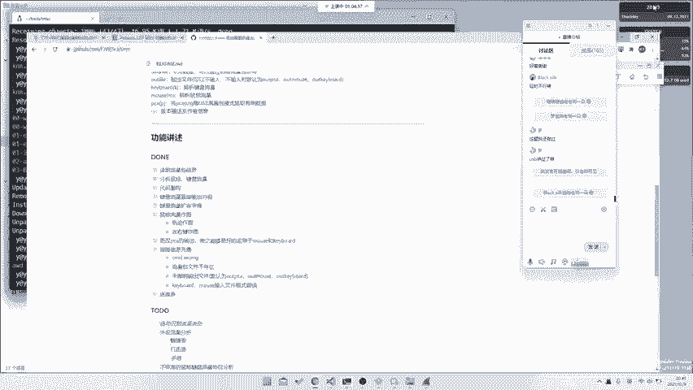

1.  在Wireshark中过滤出RTP流。
2.  选择“电话” -> “VOIP通话”。
3.  点击“播放流”，即可听到语音内容。语音中可能直接读出flag，例如：“Hi, listen second... please press one to listen to the flag”。

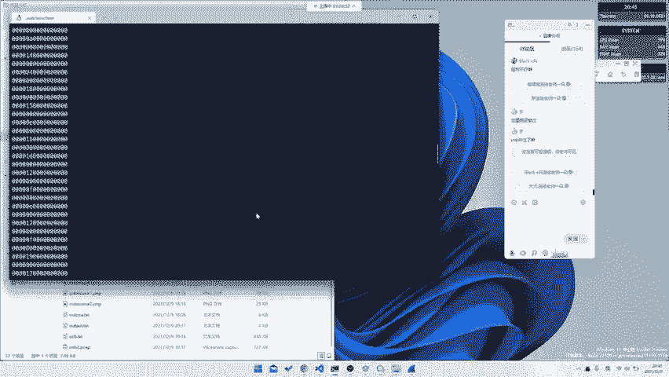

这类题目的核心是识别协议并提取音频信息。解题本身可能没有难度，关键在于知道这是VOIP流量并使用正确工具导出。网络流量分析不仅限于HTTP、TCP、ICMP或FTP，还可能涉及基于UDP或其他专用协议（如SIP、SNMP等）的通信。

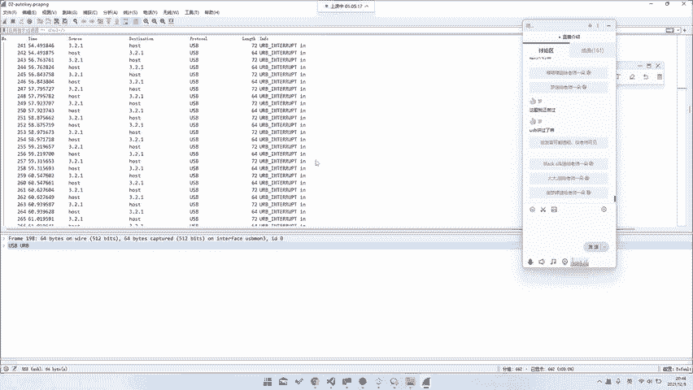

### 基于TCP/IP的隐写流量

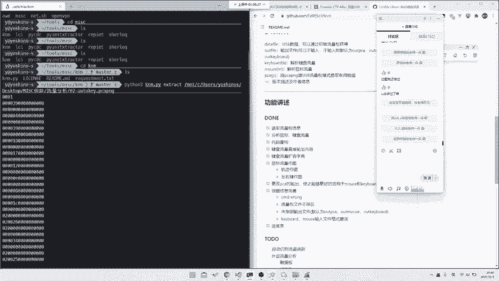

有些题目看似是普通的TCP/IP流量，但flag隐藏在数据包的特定字段中。

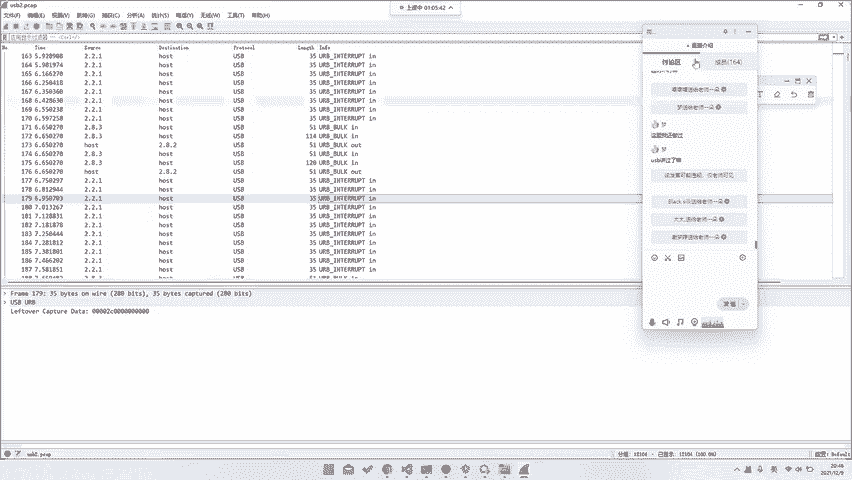

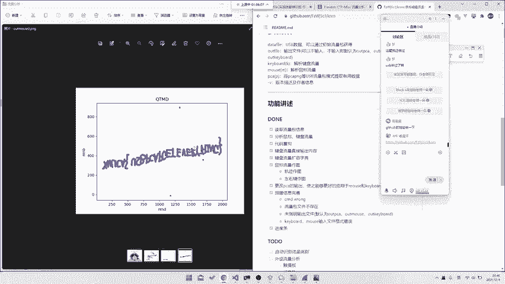

例如，一道题目中所有数据包的目的地都是`8.8.8.8`，TCP载荷内容无意义。但观察发现，所有数据包的源IP地址属于同一个C段，只有最后一位在变化。因此，解题思路是提取所有源IP地址的最后一位，将其组合起来即可得到flag。

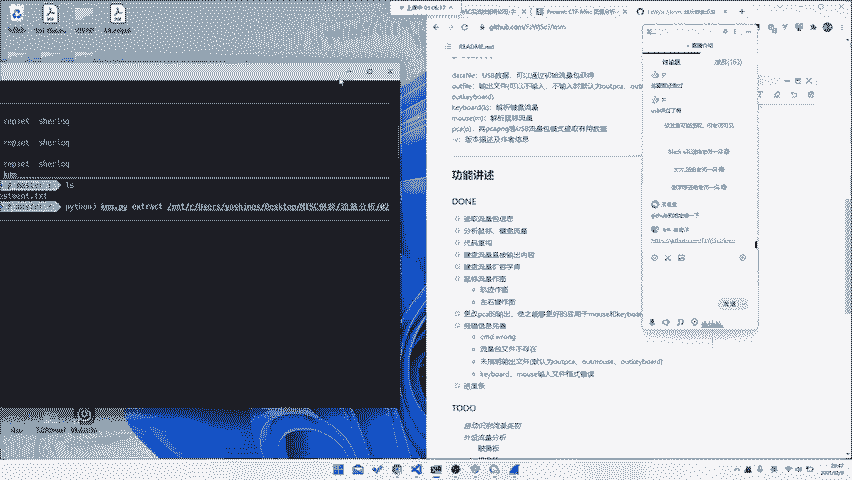

**核心操作**：提取数据包源IP的最后一个字节。
```python
# 伪代码示例：从pcap文件中提取源IP最后一位
import pyshark
cap = pyshark.FileCapture(‘traffic.pcap’)
flag_chars = []
for pkt in cap:
    if hasattr(pkt, ‘ip’):
        src_ip = pkt.ip.src
        last_octet = src_ip.split(‘.’)[-1]
        flag_chars.append(chr(int(last_octet)))
flag = ‘’.join(flag_chars)
print(flag)
```

## USB流量分析

网络流量分析只是流量分析的一部分，另一大类是USB流量。USB流量中，键盘和鼠标流量最为常见。

以下是USB流量分析的常见类型和工具。

### 键盘流量分析

USB键盘流量数据通常有固定的长度（如8字节），关键击键信息存放在数据包中的特定位置（例如第三位）。通过提取这些位置的数据，并对照USB HID键值表，可以还原出键入的内容。

存在现成的工具可以一键解析，例如GitHub上的项目 `USBKeyboardDataHacker`。

**核心概念**：USB中断传输（Interrupt Transfer）数据包中的特定字节代表按键码。

### 鼠标流量分析

USB鼠标流量记录了鼠标的移动、点击等事件。通过解析这些数据，可以还原出鼠标的移动轨迹或点击序列。

同样有现成的脚本工具，可以将原始的USB鼠标流量数据转换成一张描述鼠标移动轨迹的图片。

**核心操作**：解析`Interrupt IN`数据包，提取坐标和按键信息并绘图。
```python
# 伪代码示例：解析鼠标流量并绘图
import matplotlib.pyplot as plt
x, y = [], []
# ... 解析pcap文件，提取鼠标坐标数据 ...
plt.plot(x, y)
plt.show()
```

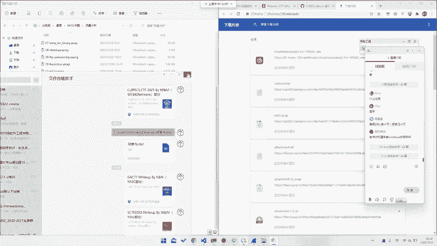

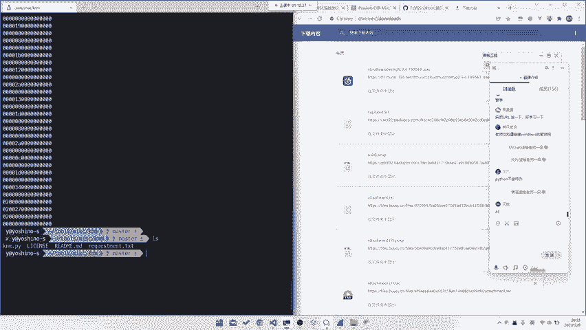

### 其他USB设备流量

USB流量并不仅限于键盘和鼠标。近年来CTF比赛中出现了更多类型的USB设备流量，需要选手根据题目描述或流量特征自行分析协议。

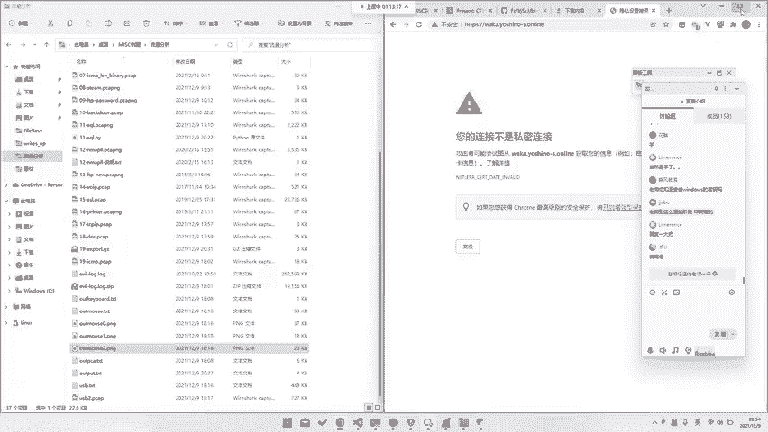

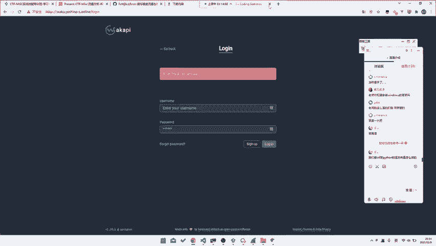

*   **游戏手柄流量**：例如“西湖论剑2020”初赛的一道关于Steam手柄的题目。即使不清楚具体协议，也可以通过分析数据包的时间间隔等特征来解题。
*   **打印机流量**：存在专门的打印机通信协议（如PJL、PCL）。解题需要阅读相关协议文档，从流量中提取打印内容。题目可能直接命名为“printer”作为提示，或者可以通过USB设备描述符中的`Vendor ID`和`Product ID`来识别设备类型。
*   **新兴设备流量**：可能出现如公共刷卡机、安卓ADB调试（如scrcpy屏幕镜像）、Nintendo Switch手柄等设备的流量。解题关键在于寻找流量特征（如特定字符串、数据格式），并通过搜索引擎查找相关协议资料。

**通用解题思路**：对于未知协议的新题目，在没有明确方向时，可以尝试以下步骤：
1.  观察流量数据的整体结构和特征（如是否有固定分隔符、可读字符串）。
2.  猜测数据字段的含义（如“up”可能代表抬起，“down”代表按下）。
3.  根据设备类型或特征字符串，上网搜索可能的协议规范。
4.  结合找到的文档，编写解析脚本提取flag。

## 总结与学习建议

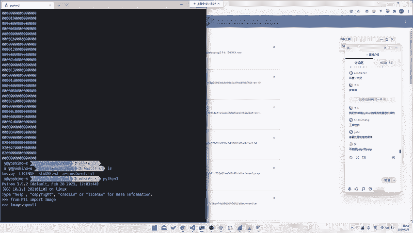

本节课中我们一起学习了网络流量分析中一些其他协议和USB流量的分析方法。

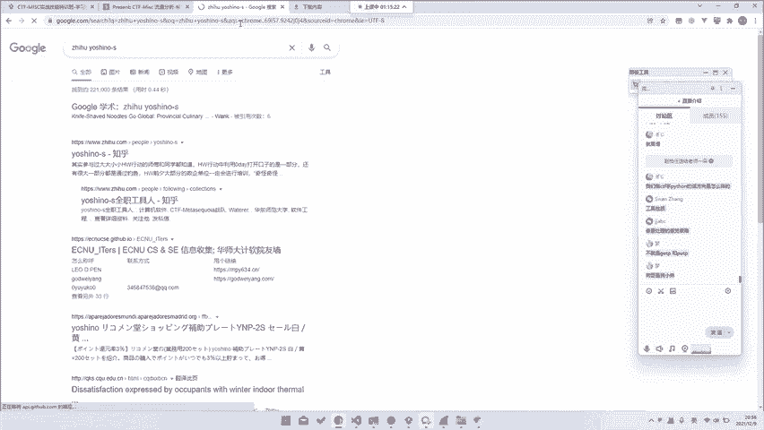

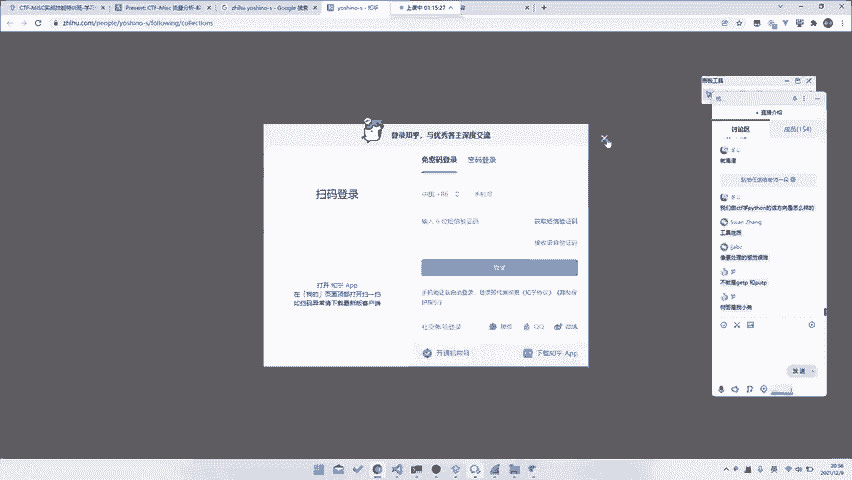

我们了解到，除了常见协议，还需关注如VOIP、基于TCP/IP的隐写以及各种USB设备流量。面对未知流量，关键在于**细心观察数据特征**、**善用搜索引擎查找协议资料**，并**灵活运用或编写解析工具**。

对于想提升相关技能的学习者，建议：
1.  **勤于实践**：多接触各类流量分析题目，积累经验。
2.  **掌握工具**：熟悉Wireshark、tshark以及各种现成的解析脚本。
3.  **学习编程**：将Python等语言作为解决问题的工具，无需深究所有语法，重点学习与文件操作、数据提取、网络解析相关的库（如`pyshark`， `PIL`）。
4.  **阅读WriteUp**：多阅读其他选手的解题报告，学习他们的分析思路和技巧。

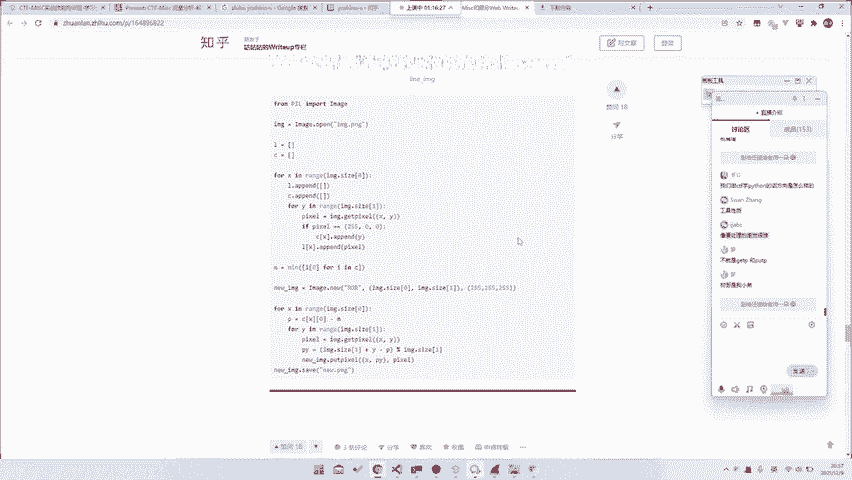

通过持续的练习和代码编写，分析复杂流量的能力将得到有效提升。