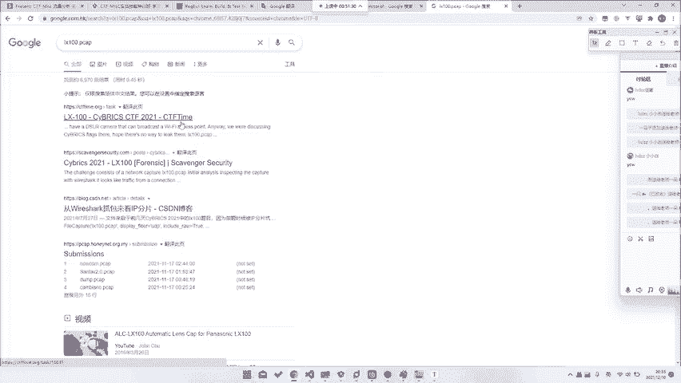
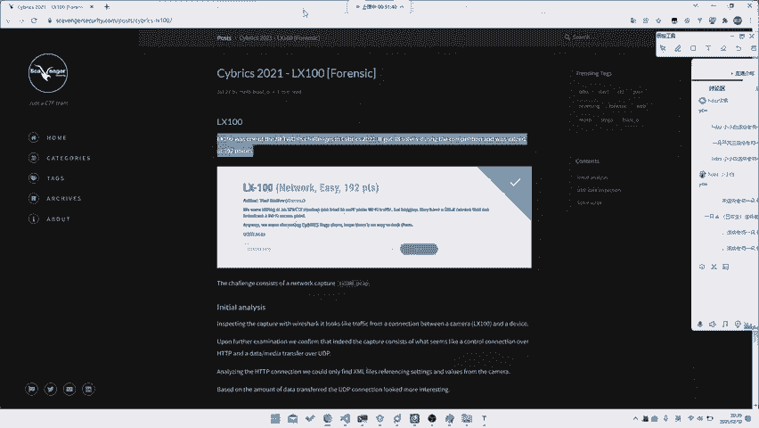
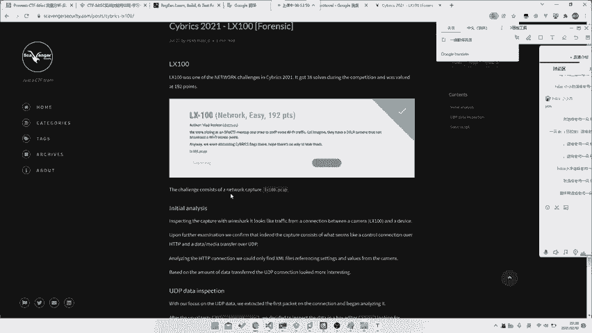
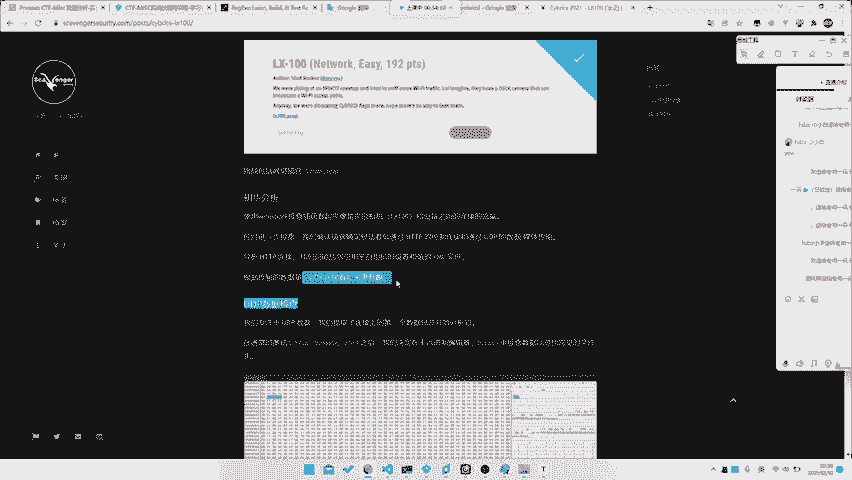
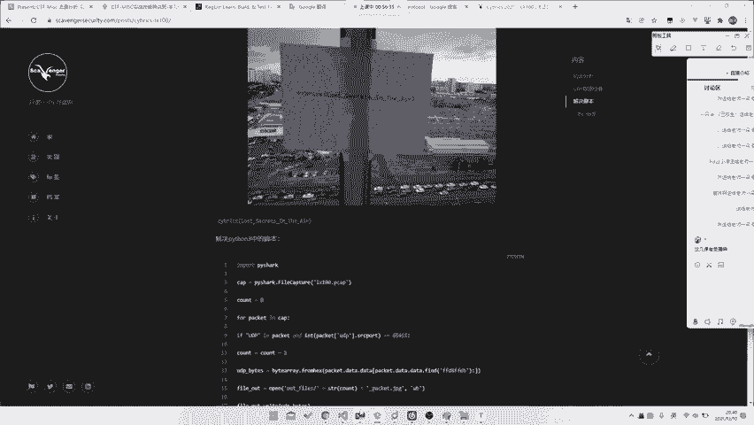
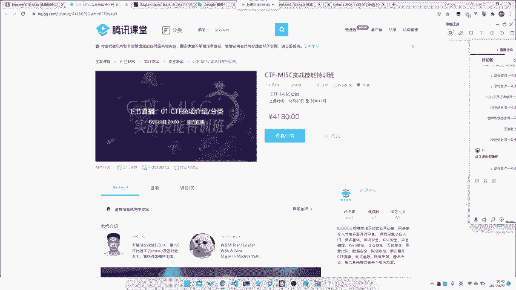
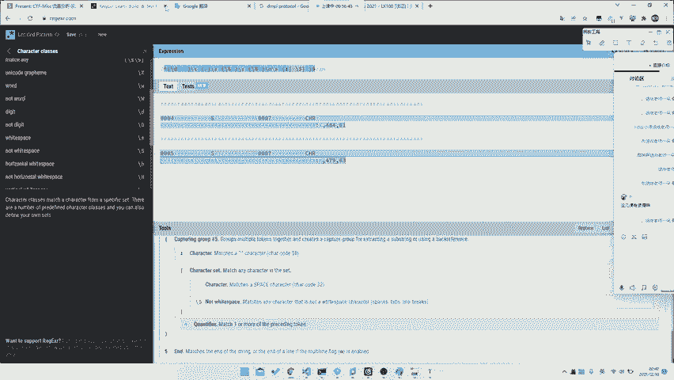
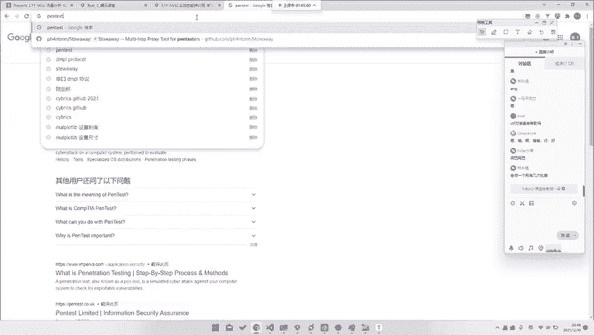

# 护网行动红蓝攻防教程：P73：25_一些实战分析 🎯

## 概述
在本节课中，我们将通过一个具体的实战案例，来探讨在流量分析（Misc）题目中，如何运用搜索能力、学习能力和解题策略来解决问题，即使在不完全理解底层协议的情况下。

---

## 实战案例：C of time 题目分析

上一节我们介绍了流量分析的基础知识，本节中我们来看看一个具体的实战案例。

这个案例来自CYBRESES比赛中的一个题目，名为“C of time”。虽然我们无法获取原始的题目附件，但可以通过回顾解题过程来学习其中的思路。

题目场景如下：我们面对一个未知协议的流量包。即使我们不知道它是什么协议，甚至没有进行任何复杂的分析，也有可能成功解题。

### 解题思路与过程

以下是解题的核心步骤：

1.  **聚焦协议类型**：首先，需要将分析目标聚焦到UDP协议上。这是解题的关键起点。
2.  **导出数据**：将捕获到的所有UDP数据流导出。
3.  **识别文件特征**：无需理解完整的传输协议，只需知道目标文件（本例中是JPG图片）的文件头特征。JPG文件的文件头是 `FF D8`。
4.  **提取与重组**：根据文件头特征，从导出的UDP数据中提取出所有疑似JPG文件的数据片段。
5.  **查看结果**：将提取出的数据片段依次查看，即可得到隐藏的图片。

**核心操作公式**：
`成功解题 = 聚焦正确协议(UDP) + 识别文件特征(如: JPG头FFD8) + 提取并重组数据`

这个案例表明，有时解题并不需要深究协议细节，强大的搜索能力（知道要搜索“JPG文件头”）和基本的脑洞（尝试从UDP流中提取文件）可能就足够了。

---

## 从案例中提炼的Misc核心能力

通过上述案例，我们可以总结出成功解决Misc类题目所需的三项核心能力：

1.  **强大的脑洞**：能够跳出常规思维，尝试不同的分析角度和可能性。
2.  **出色的搜索能力**：能够快速、准确地利用搜索引擎（包括使用英文关键词）找到所需的知识点或工具。
3.  **快速的学习能力**：能够在短时间内理解并应用新接触到的协议或技术文档。

Misc题目有时会直接使用完整的、长达数十页的标准协议文档作为题目背景，这时快速学习能力就显得至关重要。

---

## 如何有效提升Misc解题水平

回到流量分析的主题，我们能讲授的具体协议知识是有限的。更重要的，是掌握学习方法与解题策略。

以下是提升解题水平的最佳实践：

*   **主动做题与复盘**：做题的目的不是为了遇到原题，而是积累经验。无论题目是否解出，都要复盘：
    *   如果没解出，查看别人的Writeup，学习他人的搜索关键词、分析工具和思路。
    *   如果解出，对比他人的Writeup，反思自己是哪个关键步骤或灵感起到了作用。
*   **在实战中成长**：参与计时性的CTF比赛，在没有Writeup参考的压力环境下，通过与队友的思维碰撞、对比其他队伍的解题进度，能极大地锻炼临场分析和解决问题的能力。
*   **总结个人方法论**：在不断的练习和比赛中，形成一套适合自己的、高效的做题流程和学习策略，这比单纯积累知识片段更为重要。

---

## 总结与答疑

本节课我们一起学习了如何通过一个实战案例，理解Misc解题中脑洞、搜索和学习能力的重要性，并探讨了通过主动做题、实战比赛和复盘来提升技能的有效路径。

流量分析作为一个广阔的主题，三节课的时间只能引领大家入门。真正的精通需要大家在课后投入大量时间进行练习、思考和总结。

最后，希望大家能建立起自己的学习体系。如果在学习过程中希望有系统的引导，也可以参考相关的课程或训练营。现在，是答疑时间，欢迎大家提出关于Misc、流量分析、CTF解题策略或任何相关学习路径的问题。