# 护网行动红蓝攻防教程：P74：26_弱口令爆破

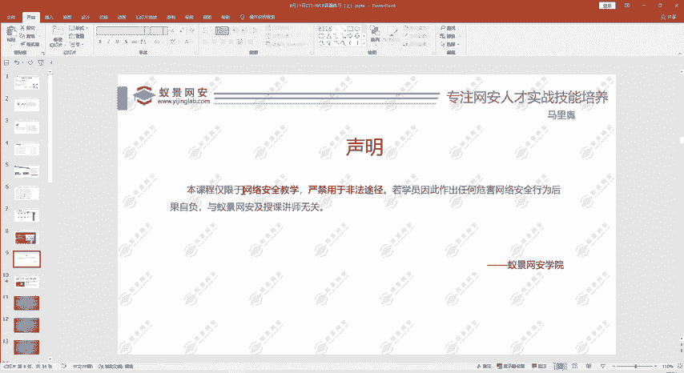

在本节课中，我们将学习如何通过一道CTF Web真题，掌握弱口令爆破的实战流程。课程将涵盖信息收集、编码分析、工具使用及爆破攻击等核心技能。


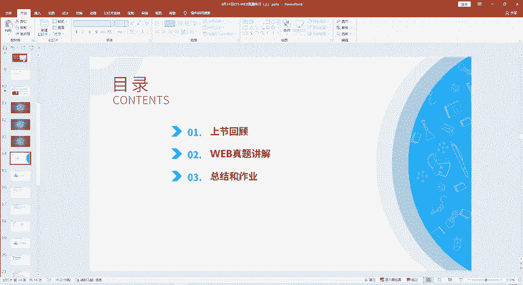

## 课程回顾与引入

上一节我们介绍了网络安全的基本法律与道德规范。本节中，我们来看看如何将这些知识应用于实际的CTF解题中。

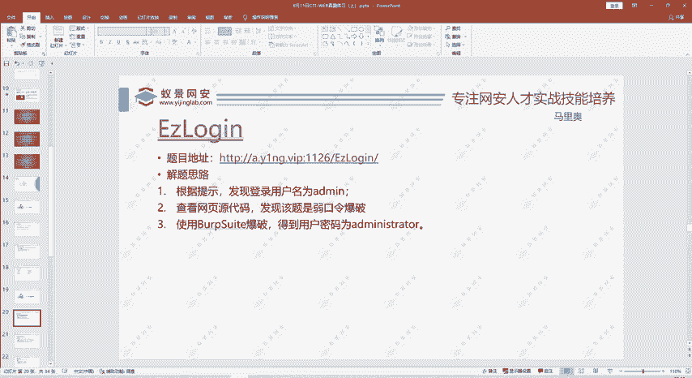

今天的主要内容分为三部分：
1.  简单回顾昨天的课程内容。
2.  讲解六道Web真题的解题方法。
3.  进行课程总结并布置作业。

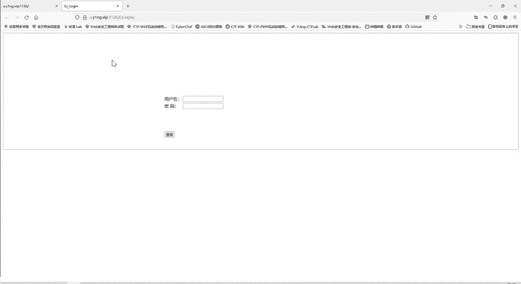

课程最后会留一些作业，只要认真听讲，完成作业没有问题。


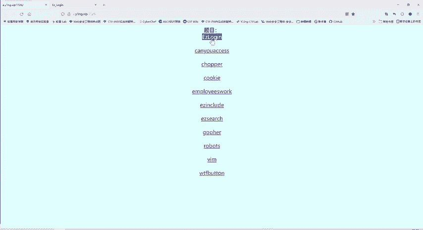

## 真题实战：Easy Log In

以下是第一道真题“Easy Log In”的解题过程。在CTF比赛中，题目的每一个信息都可能是有用的线索。


### 信息收集与初步分析

题目名称为“Easy Log In”，页面中存在一个登录框，提示我们需要进行登录。

当前我们不知道用户名和密码。可以尝试猜测用户名是否为“admin”。在登录框输入用户名 `admin` 和密码 `admin` 进行尝试。

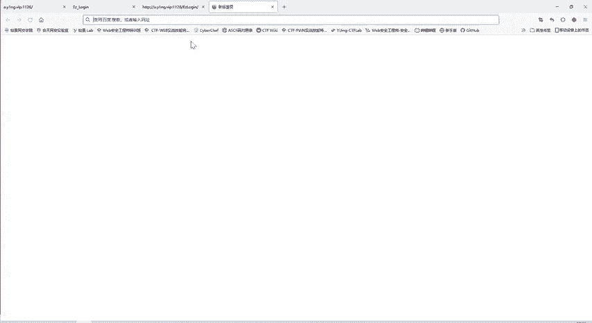

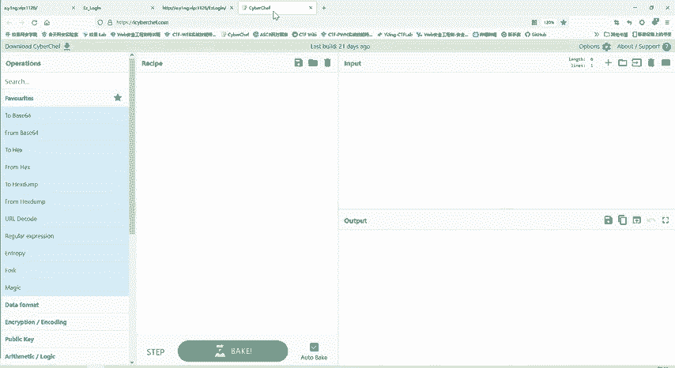

系统返回提示“wrong password”。这说明用户名 `admin` 是正确的，但密码错误。

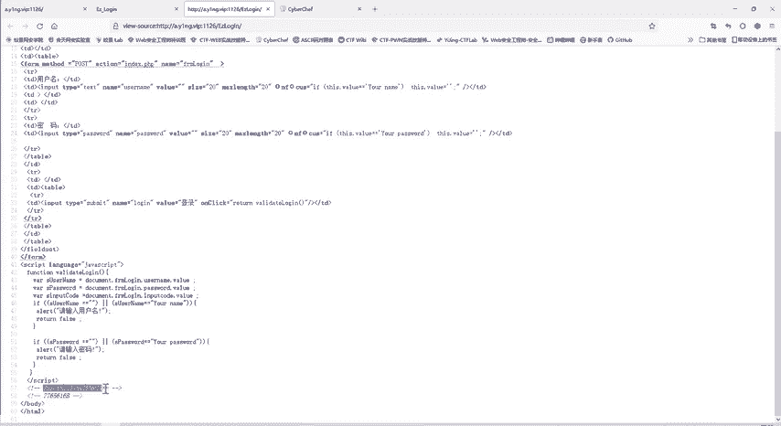

下一步工作是找到正确的密码。我们可以检查更多信息源。


### 检查网页源代码

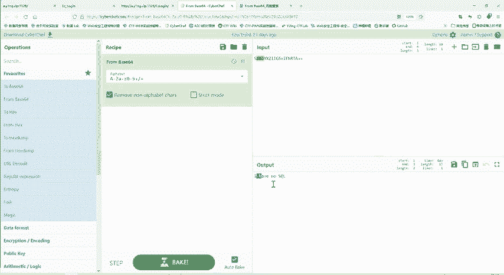

通过右键点击页面，选择“查看网页源代码”，可以寻找隐藏信息。

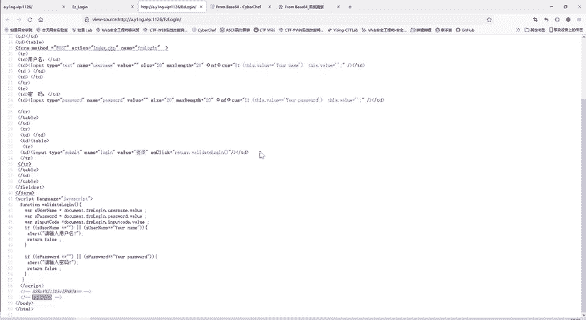

在源代码中，发现两段特殊的编码文本：
*   `SSBoYXZlIG5vIHNxbCBpbmplY3Rpb24gc2tpbGxz`
*   `Nzc2NTYxNkM`

有一定经验的同学可以看出，第一段以等号结尾，很可能是 **Base64** 编码。我们使用解码工具进行解码。

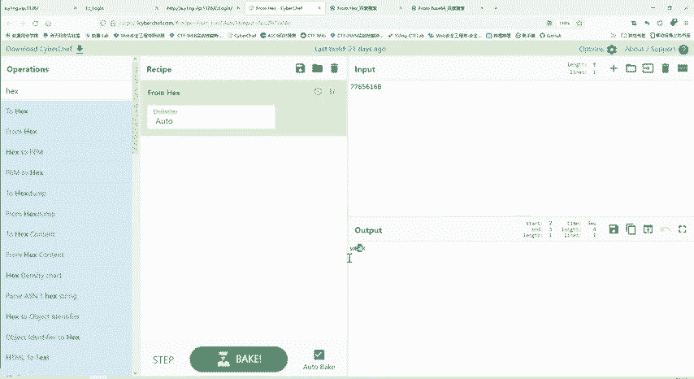

解码 `SSBoYXZlIG5vIHNxbCBpbmplY3Rpb24gc2tpbGxz` 后，得到明文：
```
I have no sql injection skills
```
这提示我们本题不能使用SQL注入的“万能密码”等方式，排除了一个错误方向。

第二段 `Nzc2NTYxNkM` 看起来像是十六进制数字（字符范围为0-9, A-F）。我们尝试进行十六进制解码。

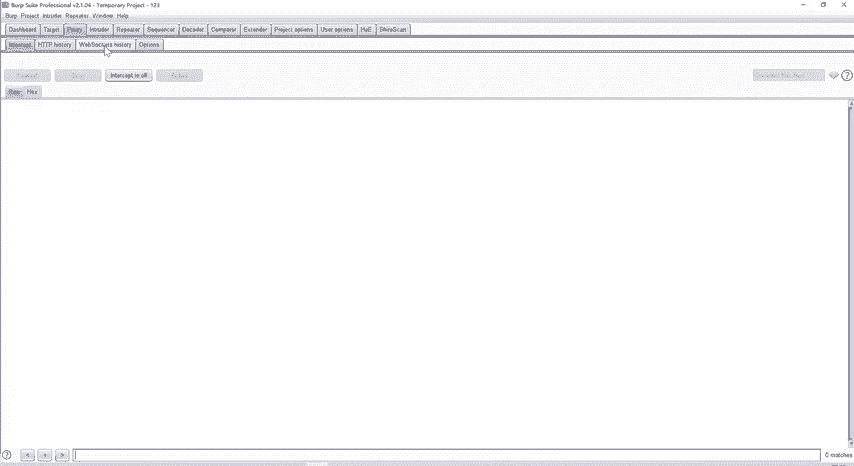

解码 `Nzc2NTYxNkM` 后，得到明文：
```
weak
```
这提示我们密码可能与“弱口令”有关。


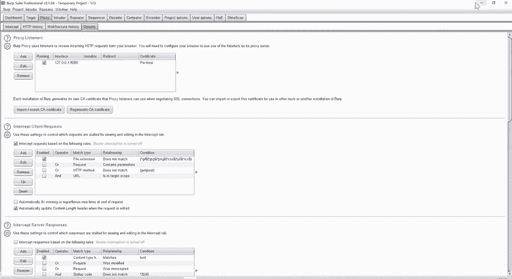

### 使用Burp Suite进行爆破

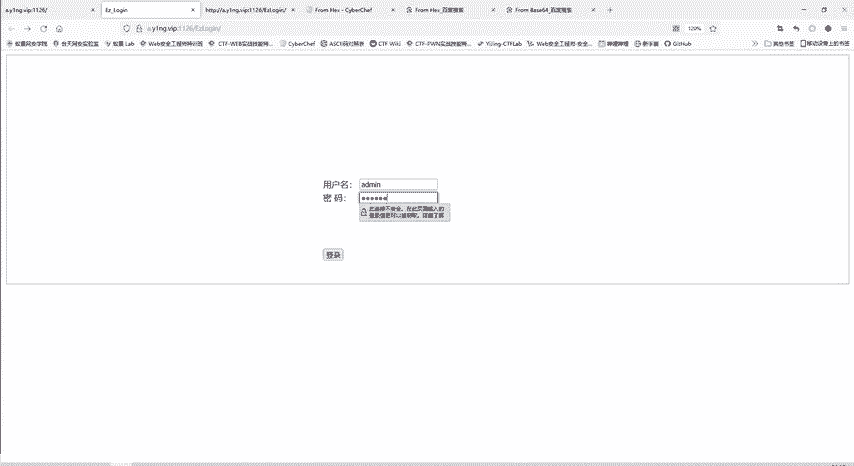

弱口令数量很多，手动尝试效率低下。此时需要使用 **Burp Suite** 工具进行自动化爆破。

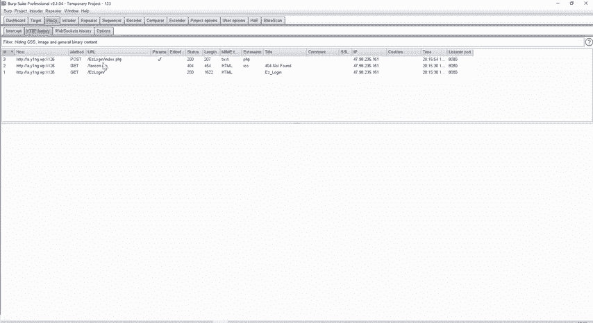

操作步骤如下：
1.  打开浏览器代理，设置为监听本地端口（例如8080）。
2.  启动Burp Suite，确保代理监听开启。
3.  在登录页面，输入用户名 `admin` 和一个任意错误的密码（如123456），并提交登录请求。
4.  此时，Burp Suite会捕获到这次HTTP请求。

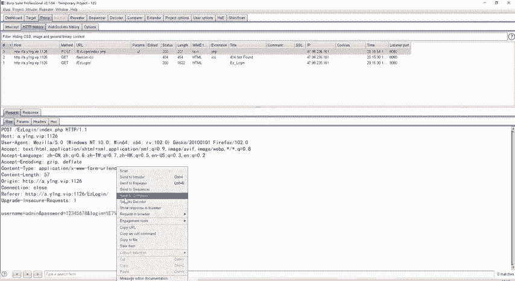

在Burp Suite的Proxy -> History中找到捕获的POST请求，将其发送到Intruder模块。
在Intruder模块的Positions标签页，清除所有自动标记的变量，只将密码（`password`）参数值标记为需要爆破的变量。
在Payloads标签页，加载一个常用的弱口令字典（例如top100、top1000密码字典）。
开始攻击（Start attack）。

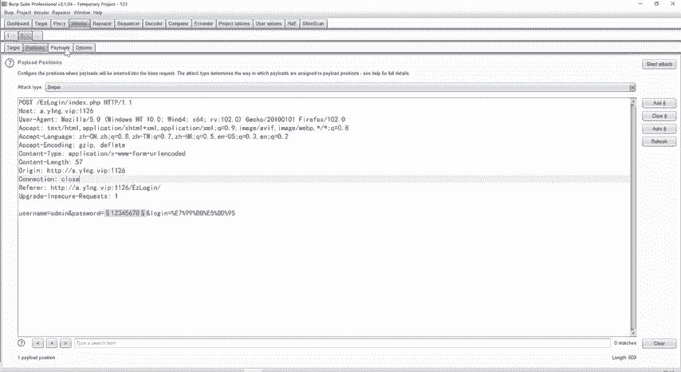

攻击完成后，通过比较响应包的长度（Length）来筛选结果。通常，登录成功和失败的响应长度会不同。
我们发现，当密码为 `administrator` 时，响应长度与其他尝试明显不同，因此该密码很可能是正确的。


### 获取Flag

使用用户名 `admin` 和密码 `administrator` 进行登录。
登录成功，页面显示Flag，第一道题目完成。


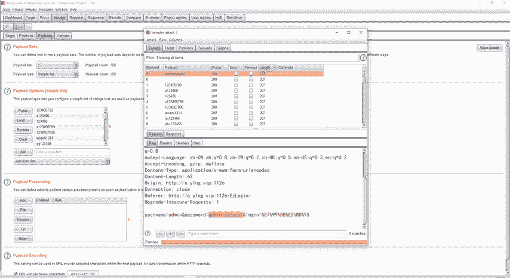

## 解题思路总结

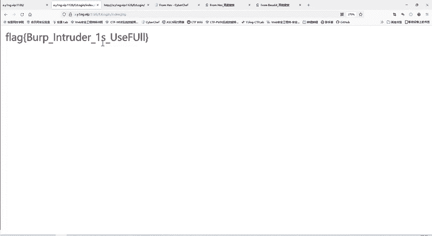

本节课中我们一起学习了第一道CTF真题“Easy Log In”的完整解题流程：
1.  **信息收集**：根据题目提示和页面元素，确定用户名为 `admin`。
2.  **源码分析**：通过查看网页源代码，发现Base64和十六进制编码的提示信息，解码后得知需进行弱口令爆破。
3.  **工具使用**：配置Burp Suite代理，捕获登录请求，并利用Intruder模块对密码字段进行字典爆破。
4.  **结果分析**：通过对比HTTP响应长度，筛选出正确的密码 `administrator`，最终成功登录获取Flag。

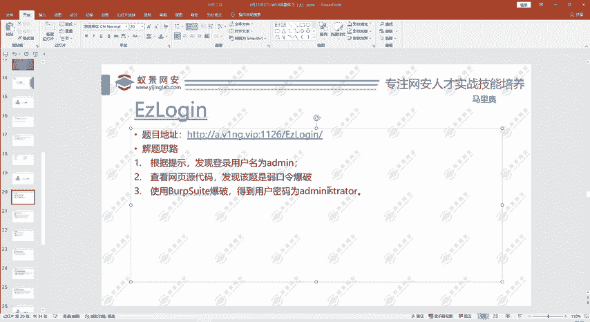

这道题目融合了信息收集、编码知识、工具使用等多个基础知识点，是Web安全入门的一个经典练习。