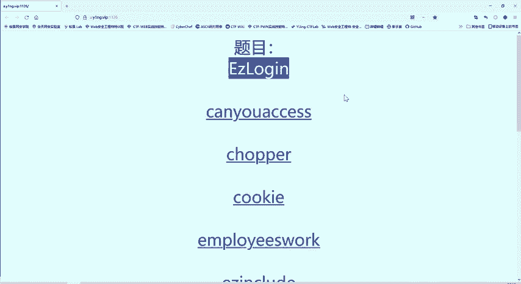
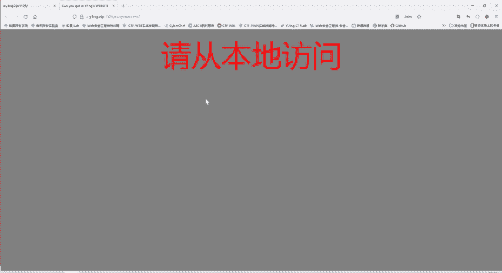
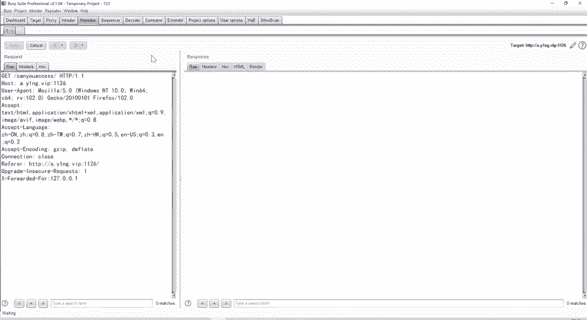
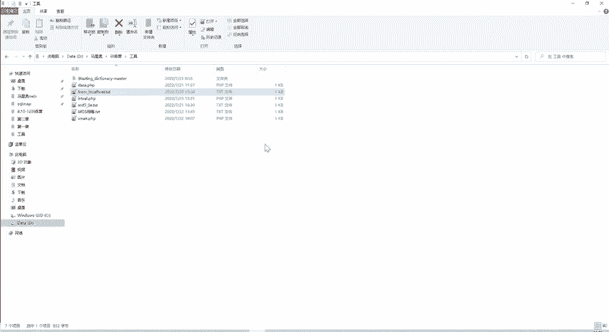

# 护网行动红蓝攻防教程：P75：27_指定参数访问



在本节课中，我们将学习如何通过修改HTTP请求头中的特定参数来满足服务器的访问要求，从而获取目标Flag。这是CTF（Capture The Flag）竞赛和渗透测试中常见的Web安全挑战。

上一节我们介绍了基础的请求拦截与修改，本节中我们来看看如何通过精确控制请求头信息来通过服务器的验证。



## 理解题目要求

题目要求从本地访问主办方的服务器。作为CTF参赛者，我们需要模拟“本地访问”这一条件。这通常意味着需要修改HTTP请求，使其看起来像是从服务器本地（127.0.0.1）发起的。

## 使用工具进行请求重放



我们使用Burp Suite的Repeater模块来手动修改和重放HTTP请求。以下是操作步骤：


1.  将浏览器流量代理到Burp Suite。
2.  在Proxy模块的HTTP历史记录中找到目标请求。
3.  右键点击该请求，选择“Send to Repeater”。
4.  切换到Repeater模块，即可对请求进行编辑和重发。

## 尝试修改请求头

初始请求被服务器拒绝，提示“请从本地访问”。我们首先尝试添加常见的表示客户端源IP的头部字段。

我们尝试添加 `X-Forwarded-For` 头部，并将其值设为 `127.0.0.1`。
```http
X-Forwarded-For: 127.0.0.1
```
发送请求后，服务器返回了新的提示：“你以为我不知道X-Forwarded-For”。这说明服务器识别并过滤了这个特定的头部字段。

## 绕过过滤并满足多个条件

当单一常用字段被过滤时，我们可以尝试使用其他具有相同功能的字段。以下是实现“从本地访问”效果的其他HTTP头部字段列表：
*   `Client-IP: 127.0.0.1`
*   `X-Real-IP: 127.0.0.1`
*   `X-Originating-IP: 127.0.0.1`
*   `X-Remote-IP: 127.0.0.1`
*   `X-Remote-Addr: 127.0.0.1`
*   `X-Client-IP: 127.0.0.1`

我们将所有这些头部字段一次性添加到请求中并发送。此时，“从本地访问”的验证通过了，但出现了新的要求：“从谷歌访问”。

“从谷歌访问”通常指修改 `Referer` 头部，该字段表示请求的来源页面。我们将它的值改为谷歌的域名。
```http
Referer: https://www.google.com/
```
发送请求后，验证再次通过，出现了第三个要求：“使用ABC浏览器”。

浏览器类型由 `User-Agent` 头部指定。我们将它的值修改为题目要求的 `ABC Browser`。
```http
User-Agent: ABC Browser
```
当同时满足了“从本地访问”、“从谷歌访问”和“使用ABC浏览器”这三个条件后，服务器返回了正确的响应，Flag成功出现。

## 总结



本节课中我们一起学习了如何通过修改HTTP请求头来通过服务器的访问控制。关键点在于：
1.  理解常见HTTP头部字段的作用（如 `X-Forwarded-For`, `Referer`, `User-Agent`）。
2.  当某个字段被过滤时，能够灵活使用其他等效字段进行替换。
3.  使用Burp Suite的Repeater模块进行手动的、精细化的请求修改与测试。
这种方法在CTF挑战、安全测试和绕过某些WAF（Web应用防火墙）规则时非常实用。