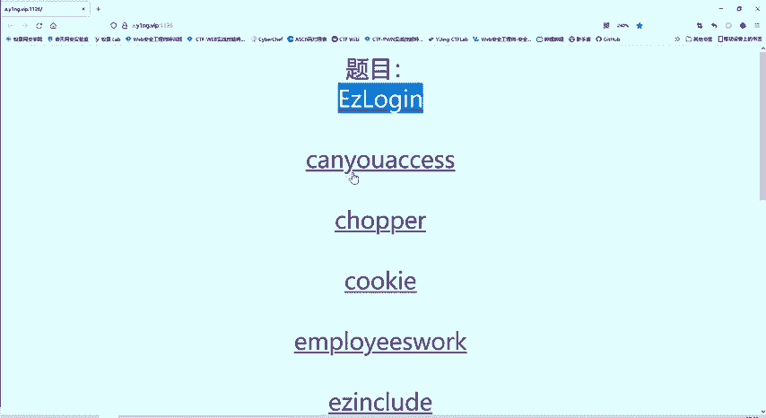
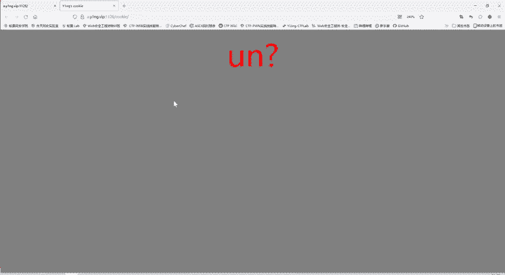
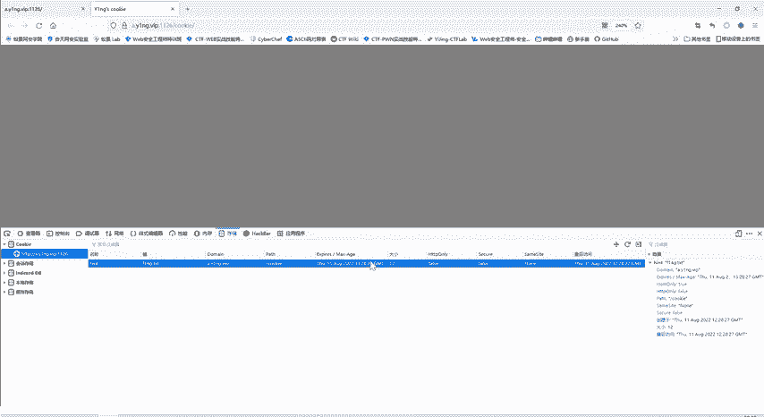
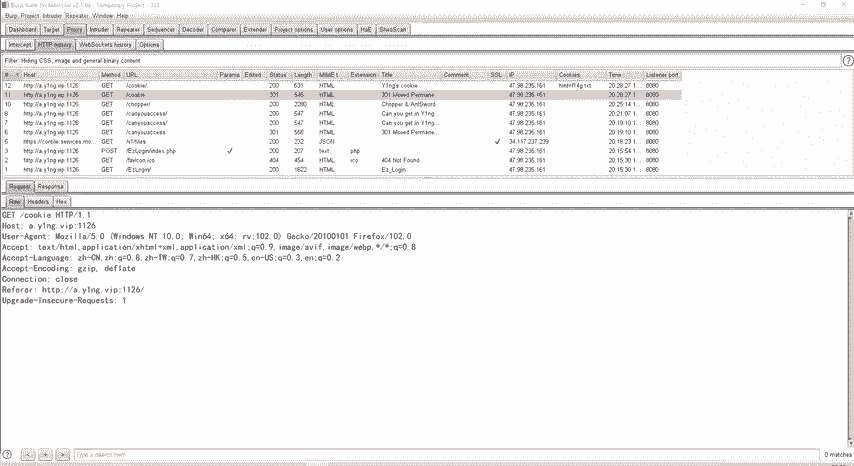
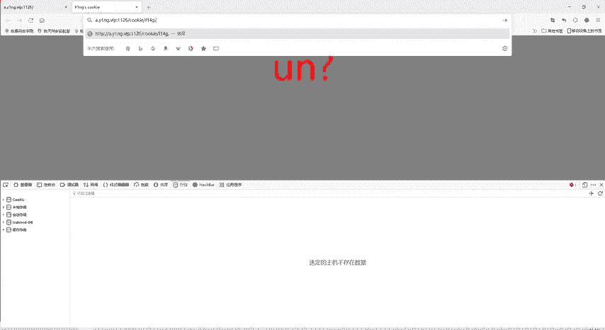
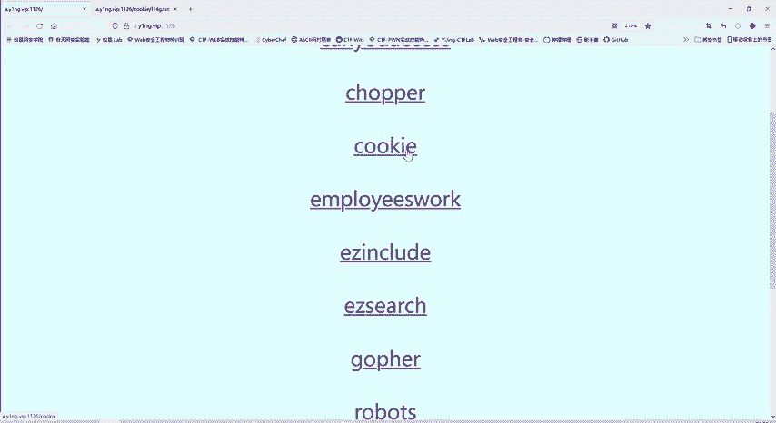

# 护网行动红蓝攻防教程：P77：29_cookie 🍪

在本节课中，我们将学习如何通过检查和分析浏览器Cookie来获取CTF（夺旗赛）题目中的关键信息。Cookie是Web安全中一个基础但重要的概念，掌握其查看和利用方法是渗透测试的必备技能。

上一节我们介绍了使用工具进行数据包分析，本节中我们来看看如何利用Cookie信息解题。

## 查看Cookie的方法

有多种方法可以查看网站的Cookie信息。以下是两种常见的方法：

1.  **浏览器开发者工具**：在网页上点击右键，选择“检查”或“审查元素”，在开发者工具中找到“应用程序”（Application）或“存储”（Storage）选项卡，其中可以查看当前网站的Cookie详情。
2.  **抓包工具**：使用如Burp Suite等抓包工具拦截浏览器与服务器的通信，在HTTP请求或响应头中可以直接查看和修改Cookie数据。

## 解题步骤分析

题目名称为“cookie”，提示我们需要关注与Cookie相关的内容。

1.  **定位关键Cookie**：通过上述方法检查网站Cookie，发现一个名为`hint`的Cookie，其值为`F14G.TXT`。这个值看起来像是“FLAG.TXT”的变形，在CTF比赛中常作为线索。
2.  **访问关键资源**：既然提示指向`F14G.TXT`文件，我们可以尝试直接访问这个文件。在浏览器地址栏输入该文件名进行访问。
3.  **获取Flag**：成功访问`F14G.TXT`文件后，即可在文件内容中找到本题的Flag。

**核心操作**可以概括为：检查Cookie -> 发现线索 (`hint=F14G.TXT`) -> 访问线索指向的资源 -> 获得Flag。

## 总结

本节课中我们一起学习了Cookie在CTF解题中的应用。关键点在于学会使用浏览器开发者工具或抓包工具查看HTTP请求中的Cookie信息，并能敏锐地识别出其中可能隐藏的线索（如变形后的Flag文件名）。掌握这项基础技能，是进行Web安全测试和应急响应的重要一步。