# 护网行动红蓝攻防教程：P78：30_双写绕过 🔐

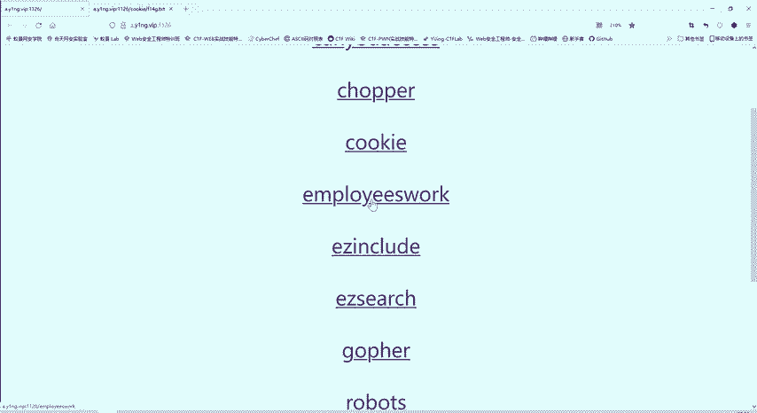

在本节课中，我们将要学习一种在Web安全中常见的绕过技术——双写绕过。我们将通过一个具体的CTF题目，分析其代码逻辑，并演示如何利用双写绕过的方法来获取目标Flag。

## 题目分析与代码审计

上一节我们介绍了如何寻找目标文件，本节中我们来看看如何分析后端代码逻辑以找到突破口。

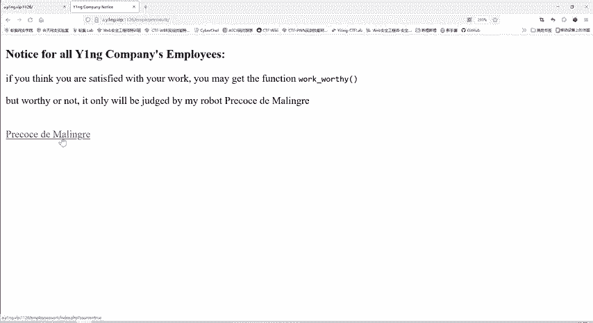

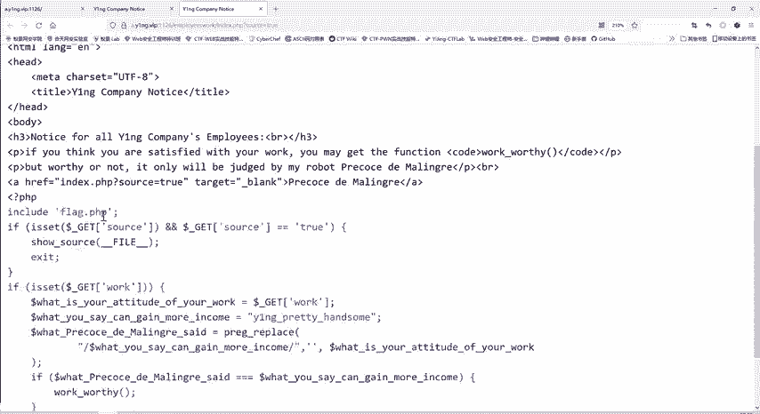

首先，我们访问目标网页，发现一个指向 `flag.php` 的链接，但直接访问该文件无法获得任何内容。通过查看页面源代码，我们发现了一个可以点击的链接，点击后显示了后端的PHP代码。

以下是后端代码的核心逻辑：

```php
if ($_GET['source'] == 't') {
    exit();
}
$attitude = $_GET['work'];
$get = "YNGpretty handsome";
if (preg_replace("/$get/", "", $attitude) === $get) {
    include("flag.php");
}
```

这段代码的含义是：
1.  如果通过GET方法传递的参数 `source` 等于 `t`，则脚本直接退出。
2.  否则，将GET参数 `work` 的值赋给变量 `$attitude`。
3.  定义字符串 `$get` 为 `"YNGpretty handsome"`。
4.  使用 `preg_replace` 函数，在 `$attitude` 字符串中查找 `$get` 字符串，并将其替换为空。
5.  **关键判断**：如果替换后的结果**仍然等于**原始的 `$get` 字符串，则包含并执行 `flag.php` 文件。

## 理解挑战与双写绕过原理

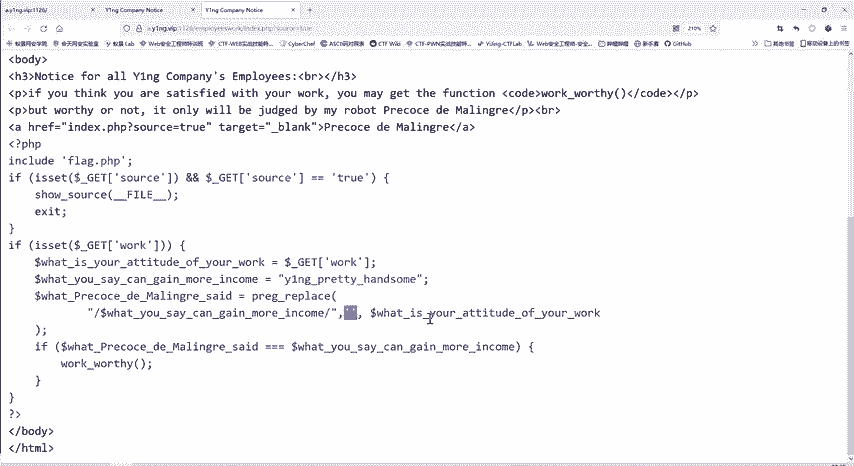

上一节我们分析了代码逻辑，本节中我们来看看其中的矛盾点以及如何利用双写绕过来解决它。

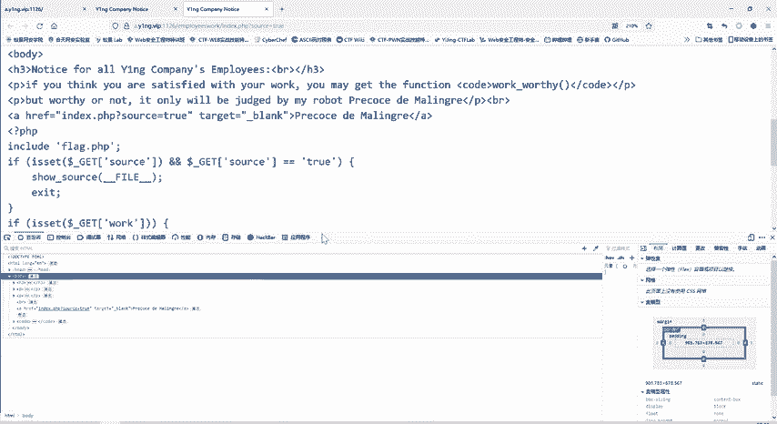

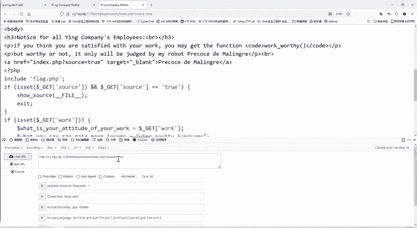

代码的逻辑要求存在一个矛盾：`preg_replace` 函数会将 `$attitude` 中的 `"YNGpretty handsome"` 替换为空。替换后，字符串理应变短或消失，怎么可能还等于完整的 `"YNGpretty handsome"` 呢？

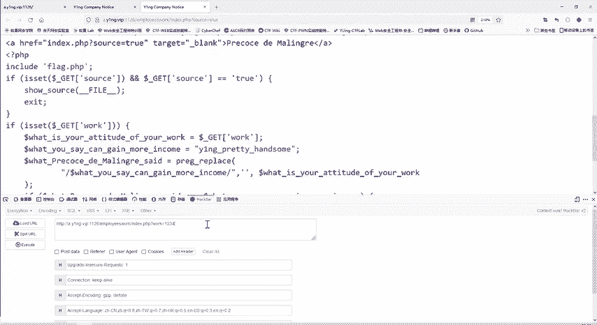

这时就需要用到**双写绕过**技术。

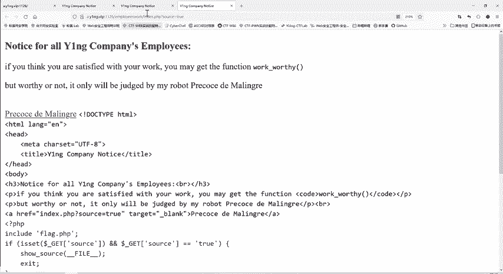

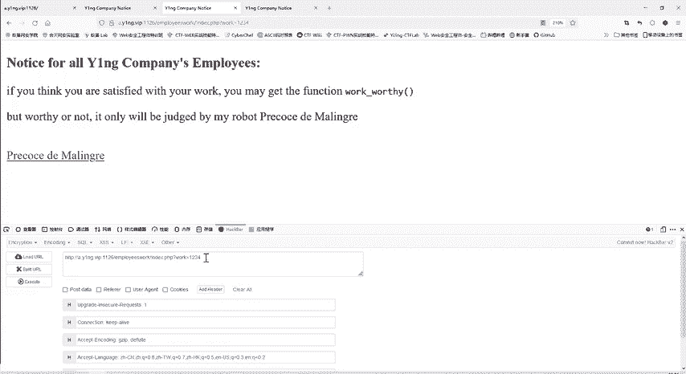

**双写绕过**的核心思想是：构造一个输入，使得在被过滤（或替换）掉特定部分后，剩下的部分恰好是我们期望通过验证的字符串。

以下是实现双写绕过的具体思路：
1.  我们的目标是让 `preg_replace("/YNGpretty handsome/", "", $attitude)` 的结果等于 `"YNGpretty handsome"`。
2.  我们可以在 `$attitude` 中写入 `"YNGpretty handsome"`，但在这串字符的**中间某个位置**，再插入一次 `"YNGpretty handsome"`。
3.  当 `preg_replace` 执行时，它会找到并删除中间插入的那一串 `"YNGpretty handsome"`。
4.  删除后，原本位于两端的 `"Y"` 和 `"handsome"` 就会拼接起来，重新形成完整的 `"YNGpretty handsome"`，从而通过验证。

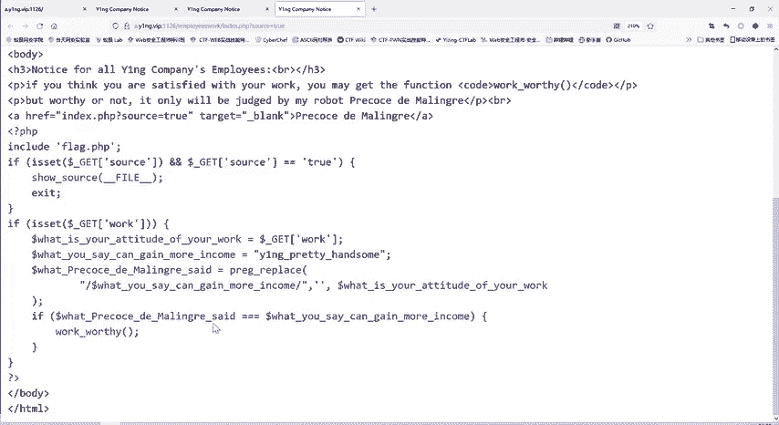

用公式可以简单表示为：
**构造 Payload**： `"YNGpretty" + "YNGpretty handsome" + " handsome"`
**经过 `preg_replace` 过滤后**： `"YNGpretty" + "" + " handsome" = "YNGpretty handsome"`

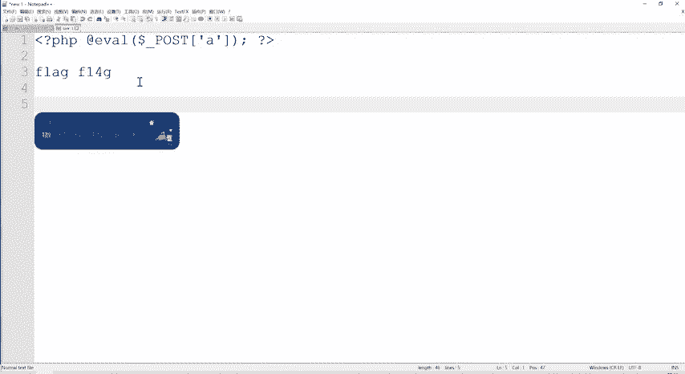

## 实战操作演示

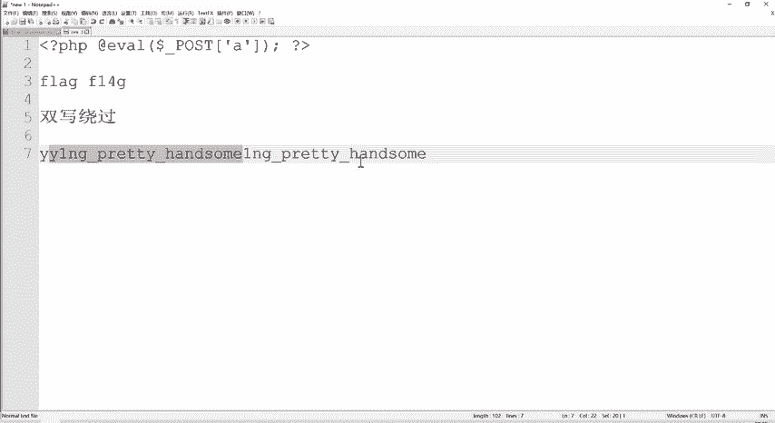

理解了原理后，我们通过工具来构造并发送Payload。

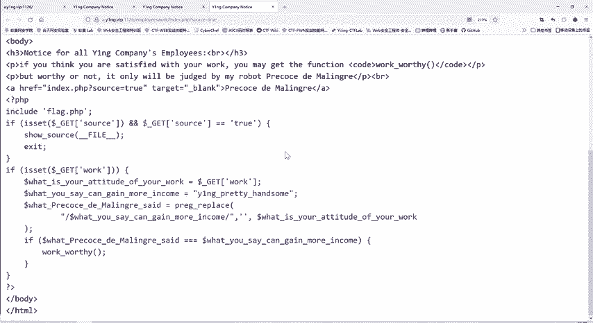

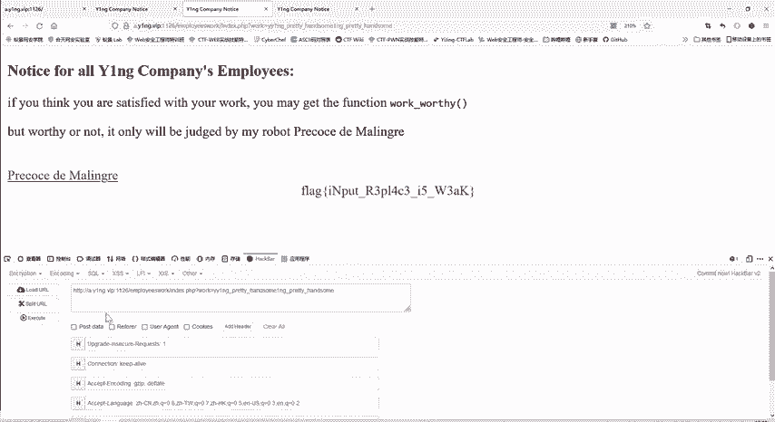

我们将使用HackBar工具（或浏览器开发者工具的网络选项卡）来发送GET请求。我们需要传递的 `work` 参数值为：`YNGprettyYNGpretty handsome handsome`。

发送请求后，服务器端的处理流程如下：
1.  `$attitude` 被赋值为 `"YNGprettyYNGpretty handsome handsome"`。
2.  `preg_replace` 在其中找到 `"YNGpretty handsome"` 并将其删除。
3.  删除后，字符串变为 `"YNGpretty handsome"`。
4.  该结果与 `$get` 相等，条件成立，执行 `include("flag.php")`。
5.  Flag内容成功在页面中显示出来。

## 核心要点总结

本节课中我们一起学习了双写绕过技术。

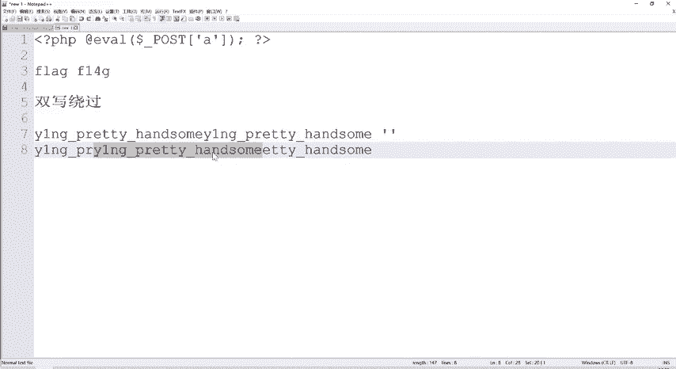

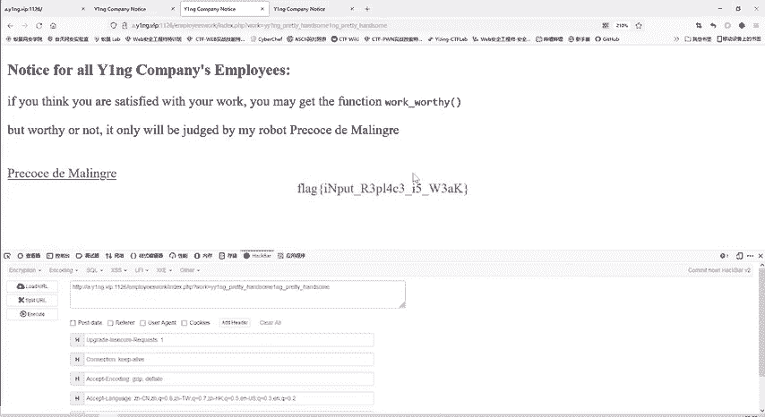

我们从一个无法直接访问 `flag.php` 的CTF题目开始，通过审计后端PHP代码，发现了其利用 `preg_replace` 函数进行字符串匹配和替换的逻辑。我们分析了代码中“替换后字符串仍需等于原字符串”的矛盾要求，并由此引出了**双写绕过**的解决方案。

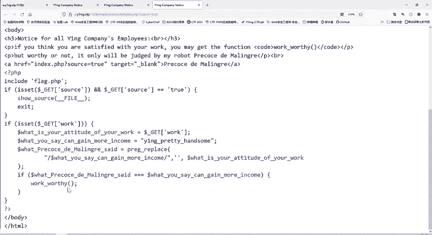

**双写绕过**的关键在于，通过精心构造输入数据，使得被过滤系统删除掉一部分内容后，剩余的数据恰好能重新组合成通过验证所需的原始字符串。这种方法在绕过一些简单的字符串过滤或黑名单检测时非常有效。

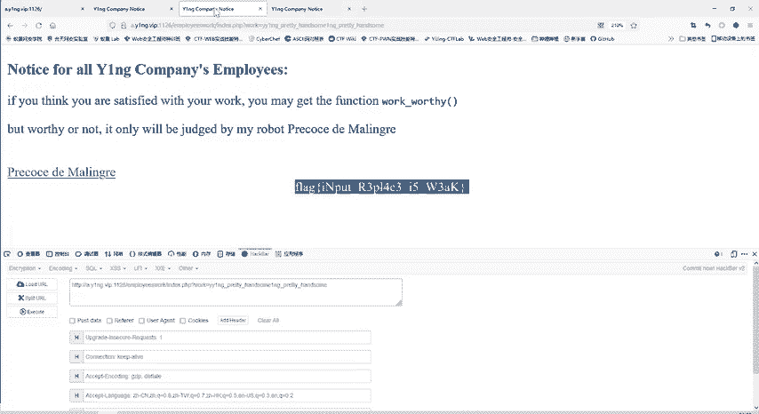

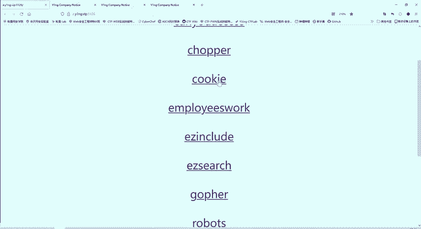

通过本课的学习，你应该能够理解双写绕过的基本原理，并能够在类似的代码审计场景中识别和利用这种技术。