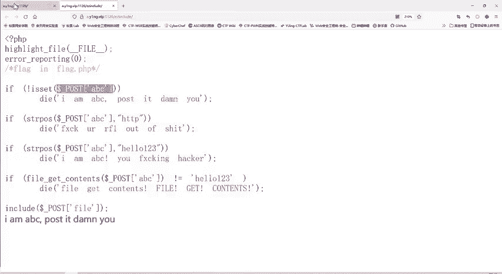
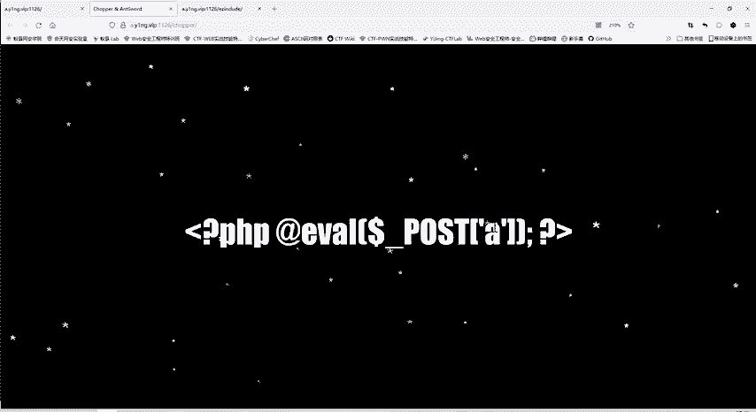
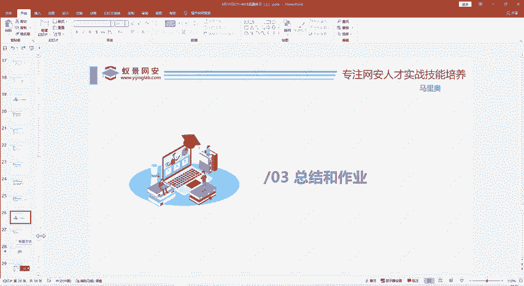

# 护网行动红蓝攻防教程：P79：多重验证与data协议、filter协议

在本节课中，我们将学习如何应对一道包含多重验证的CTF题目。题目要求我们通过四层验证，最终读取服务器上的 `flag.php` 文件。我们将重点学习如何使用 `data` 协议绕过字符串检测，以及如何使用 `PHP filter` 协议读取PHP文件的源代码。

## 题目分析与目标



首先，我们打开题目页面。页面提示“flag就在flag.php当中”，因此我们的最终目标是读取 `flag.php` 文件的内容。



题目代码使用了 `$_POST[‘abc’]` 方法接收参数。这与我们之前学习的“一句话木马”原理类似，都是通过POST方法传递参数。如果参数 `abc` 不存在，代码会输出“IMABC”。

## 第一关：传递POST参数

由于代码使用POST方法接收参数，我们不能像GET请求那样直接在URL后添加 `?abc=value`。需要使用工具来发送POST请求。

我们可以使用浏览器的开发者工具，或者安装HackBar插件。在HackBar中，我们需要在“Post data”区域填写参数，格式为 `abc=value`。例如，我们尝试传递 `abc=123456`。

发送请求后，页面不再输出“IMABC”，说明第一关的检测通过了。代码执行到了下一部分。

## 第二关与第三关：字符串过滤

接下来，代码对我们传递的 `abc` 参数值进行了两次字符串检查：
1.  检查参数值中是否包含字符串 `http`。
2.  检查参数值中是否包含字符串 `hello123`。

如果参数值包含以上任意一个字符串，验证就会失败，并输出错误信息。

因此，我们构造的 `abc` 参数值必须同时避开 `http` 和 `hello123` 这两个字符串。

## 第四关：文件内容验证

第四关的验证逻辑是：将我们传递的 `abc` 参数值当作一个**文件名**，用 `file_get_contents()` 函数去读取这个文件的内容。如果读取到的文件内容不等于字符串 `hello123`，验证就会失败。

这带来了一个难题：我们不知道服务器上哪个文件的内容恰好是 `hello123`。

## 关键突破：使用data协议

这里，我们需要利用 `file_get_contents()` 函数的一个特性：它不仅可以读取本地文件，还可以处理**数据流**。

我们可以使用 `data` 协议来直接构造一个数据流作为“文件”内容。基本格式为：
```
data://text/plain, 你想要的内容
```

但是，直接写入 `hello123` 会触发第三关的过滤。因此，我们需要对 `hello123` 进行编码来绕过检测。这里使用 `base64` 编码。

编码后的 `hello123` 为 `aGVsbG8xMjM=`。这样，最终的 `abc` 参数值可以构造为：
```
abc=data://text/plain;base64,aGVsbG8xMjM=
```

当 `file_get_contents()` 读取这个“数据流文件”时，会对 `base64` 部分进行解码，得到的内容正是 `hello123`，从而通过第四关验证，同时又没有在原始参数字符串中出现 `hello123`。

## 最终步骤：读取flag.php

通过所有四层验证后，代码会包含（include）一个文件。我们需要让这个文件是 `flag.php`。

然而，直接包含 `flag.php` 会导致其中的PHP代码被执行，而不是显示源代码。为了看到其源代码，我们需要使用 `PHP filter` 协议。

`PHP filter` 协议可以将文件内容进行编码转换后再输出。常用方法是将其内容转换为 `base64` 编码，我们再对编码结果进行解码即可得到源代码。

因此，最终的Payload需要组合 `data` 协议和文件包含的目标。假设包含的变量是 `file`，我们最终的请求参数可能类似于：
```
abc=data://text/plain;base64,aGVsbG8xMjM=&file=php://filter/convert.base64-encode/resource=flag.php
```

服务器执行后，会返回 `flag.php` 文件的 `base64` 编码内容。我们将其解码，就能得到包含flag的源代码。

## 操作步骤总结

以下是解决此题的关键步骤总结：
1.  **发送POST请求**：使用工具（如HackBar）向目标URL发送POST请求。
2.  **构造绕过参数**：将 `abc` 参数的值设置为 `data://text/plain;base64,aGVsbG8xMjM=`，以同时绕过第二、三、四关的验证。
3.  **利用filter协议**：在通过验证后，控制文件包含的参数（例如 `file`），使其值为 `php://filter/convert.base64-encode/resource=flag.php`，以读取 `flag.php` 的base64编码源码。
4.  **解码获取Flag**：对服务器返回的base64字符串进行解码，即可得到 `flag.php` 的明文源代码，从中找到flag。

## 本节课总结

本节课中，我们一起学习了一道综合性的CTF题目。我们掌握了以下关键技能：
*   理解了通过POST方法传递参数的方式。
*   学习了如何绕过基于字符串匹配的过滤检查。
*   深入了解了 `file_get_contents()` 函数和 `data` 协议的结合使用，可以将其参数视为数据流而非文件名。
*   掌握了使用 `base64` 编码绕过直接字符串过滤的技巧。
*   学会了使用 `php://filter` 协议来读取PHP文件的源代码，而不是执行它。



这些协议和技巧在文件包含、代码执行等类型的漏洞利用中非常常见，是红队实战和CTF比赛中的重要知识点。