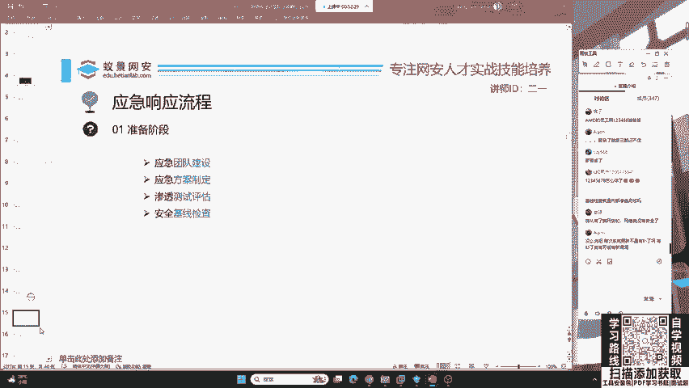
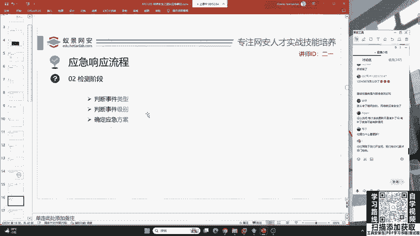
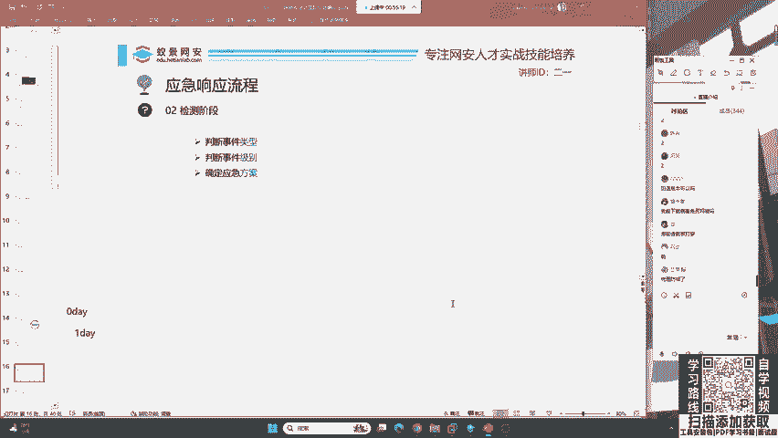
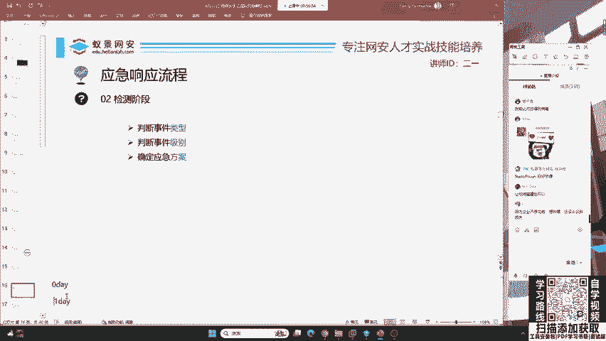
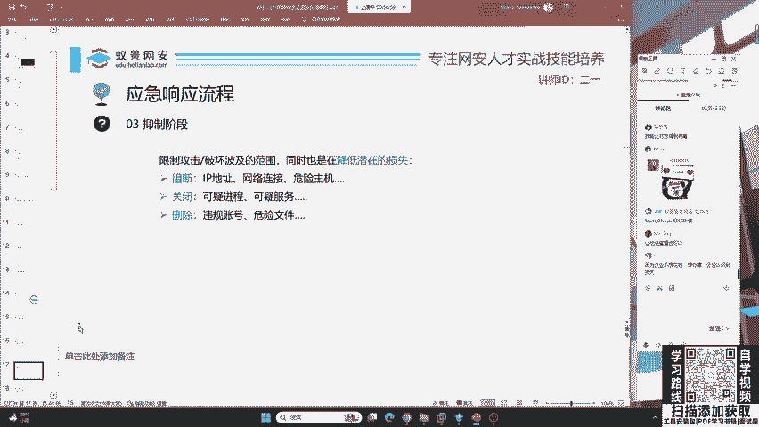

# 护网行动红蓝攻防教程：P7：蓝队应急响应-6.检测阶段 🔍

在本节课中，我们将要学习应急响应流程中的“检测阶段”。我们将探讨如何发现和识别网络攻击，特别是面对未知漏洞时的应对策略。理解检测阶段是蓝队成员进行有效防御和响应的关键。

上一节我们介绍了应急响应的准备阶段，本节中我们来看看当攻击发生时，如何有效地进行检测。

## 检测阶段概述

检测阶段是指在遭受攻击后，蓝队识别和确认安全事件的过程。没有任何防御措施能保证100%的安全。即使系统安装了所有补丁，或网站防护得非常好，攻击者仍可能利用未知漏洞发起攻击。

## 零日漏洞与一日漏洞

在检测阶段，我们需要理解攻击者可能使用的武器。以下是两种常见的漏洞类型：

*   **零日漏洞**：指尚未被公开披露、厂商也未发布补丁的漏洞。攻击者利用的是完全未知的安全缺陷。
*   **一日漏洞**：指已被部分安全人员或攻击者知晓，但相关企业尚未修复或未向公众广泛公开的漏洞。

在护网行动中，红队经常使用零日或一日漏洞进行攻击。例如，攻击者可能发现了Windows 11最新版或QQ等流行软件中尚未被修复的漏洞。

## 能否防御零日攻击？

面对未知的零日漏洞，防御是否可能？这取决于企业的安全建设水平。

一个安全建设非常完善的企业，可以通过部署综合性的安全设备和策略来**降低零日攻击的影响**。其核心思想是：即使漏洞被利用，也要让攻击者无法达成最终目标或难以获取有价值的信息。

这依赖于终端安全、员工设备管理、端点检测与响应（EDR）系统等多层防护的综合运用。然而，企业安全建设是一个漫长且需要全员参与的过程。如果任何一个环节存在短板（例如某位员工安全意识不足），整个防御体系就可能被攻破。许多企业遭受攻击，并非因为设备不足，而是安全策略未能有效落地执行。

本节课中我们一起学习了应急响应的检测阶段。我们了解了零日漏洞和一日漏洞的概念，并探讨了通过完善的安全体系建设来缓解未知威胁的可能性。记住，检测的核心在于快速发现异常，而强大的纵深防御体系是应对高级威胁的基石。下一节，我们将进入应急响应的“遏制阶段”。