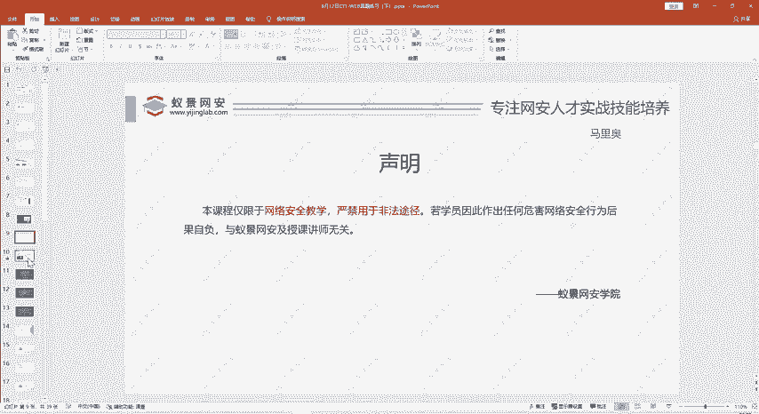
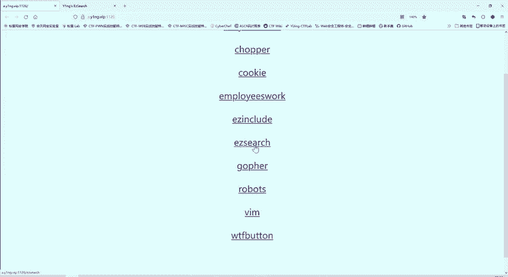
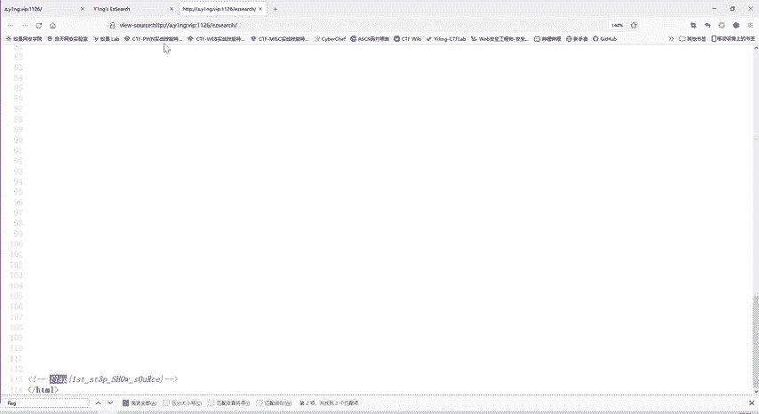

# 护网行动红蓝攻防教程：P80：32_网页源代码搜索 🔍

在本节课中，我们将学习一个在CTF（Capture The Flag）比赛和渗透测试中非常基础但至关重要的技能：如何通过查看和分析网页源代码来寻找隐藏的信息。我们将通过一个简单的案例，演示如何利用浏览器工具发现网页中不可见的“Flag”。



---

## 课程声明

本课程内容仅限于网络安全教学目的，严禁用于任何非法途径。

## 案例回顾与引入

上一节我们介绍了文件包含漏洞（E include）。本节中，我们来看看另一个基础题型：网页源代码搜索。

我们打开题目“EZ327”。题目提示我们“where is flag”，即询问Flag在哪里。




## 初步分析与观察

首先，我们在页面上直观地寻找，看不到任何明显的Flag信息。URL中的“search”提示我们这可能与搜索有关。

当我们查看网页的HTML源代码时，初始视野内同样没有发现有效内容。但我们注意到浏览器右侧的滚动条，这暗示页面下方还有更多内容。

以下是查看网页源代码的基本方法：
```快捷键
Ctrl + U （查看页面源代码）
或 在页面右键点击“查看网页源代码”
```

## 深入源代码寻找线索

我们向下滚动源代码页面。


在源代码靠下的位置，我们发现了Flag信息。它被包含在HTML注释标记中：
```html
<!-- flag{this_is_a_secret_flag} -->
```
HTML注释的内容不会在浏览器中渲染显示，只存在于源代码里。因此，在做Web类题目时，检查源代码是必不可少的一步。

## 核心技巧：使用搜索功能

有时，Flag可能隐藏在海量的代码或文本中，手动寻找效率低下且容易遗漏。

以下是快速定位关键词的方法：
1.  在源代码页面，按下键盘快捷键 **`Ctrl + F`**。
2.  这会调出页内搜索框。
3.  输入关键词，例如“flag”，进行搜索。



通过搜索，我们可以快速定位到所有包含“flag”字样的位置，从而轻松找到正确的Flag。本题中，我们便通过此方法直接找到了答案。

## 要点总结与练习建议

本节课我们一起学习了网页源代码搜索的基础技巧：
1.  **查看源代码**是Web安全测试的常规起点。
2.  要留意**滚动条**，页面显示的内容可能只是全部信息的一部分。
3.  **HTML注释** `<!-- 内容 -->` 是隐藏信息的常见位置。
4.  熟练使用 **`Ctrl + F`** 搜索功能可以极大提升效率。

这个题目对于有经验的人来说非常简单，但对于初学者，它强调了“经验”和“基础操作”的重要性。尽管老师讲解了方法，但**动手练习**至关重要。只有亲自完成题目，知识才能牢固掌握。希望同学们能将所学题目都实践一遍。


---

**本节课总结**：我们掌握了通过查看网页源代码并利用搜索功能来发现隐藏信息（如Flag）的基本方法。这是CTF竞赛和网络安全评估中一项非常基础且实用的技能。