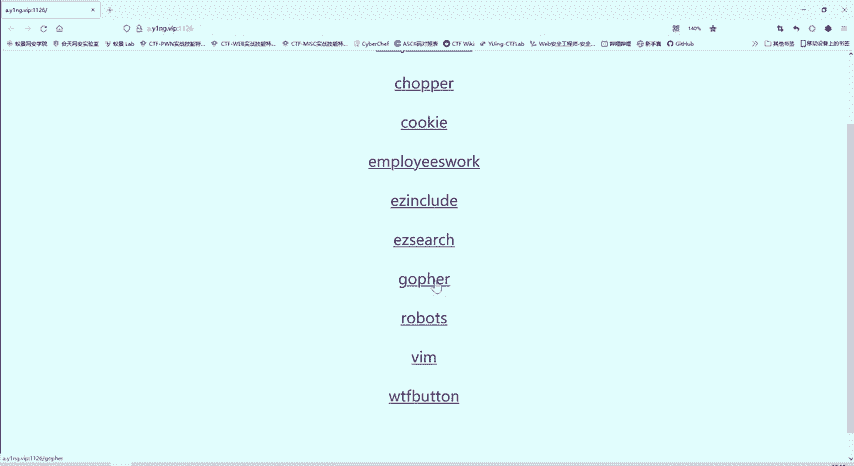
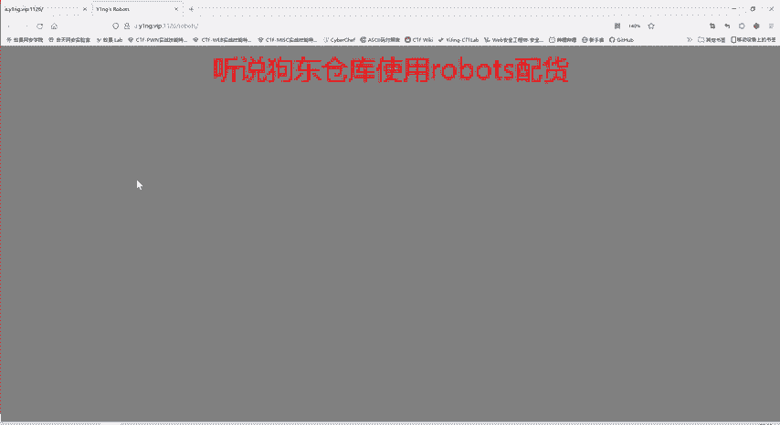
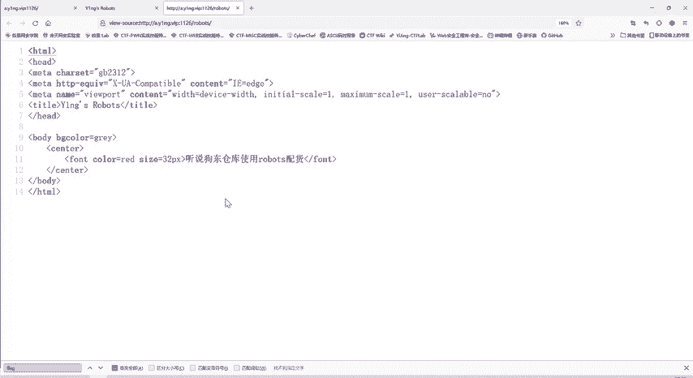
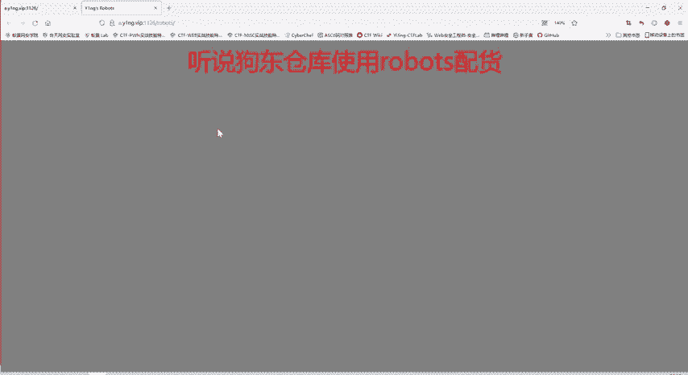
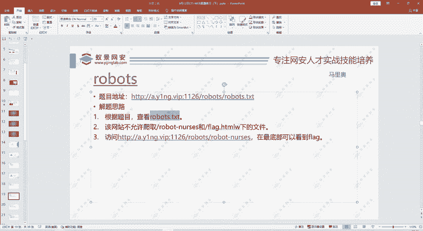
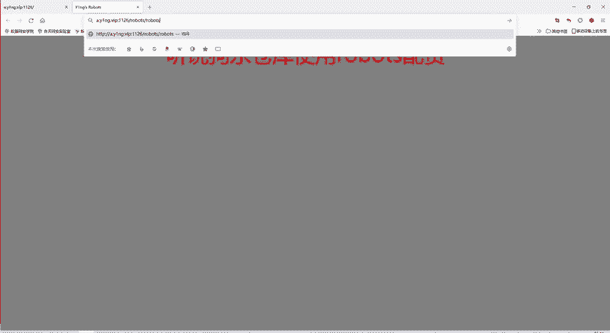
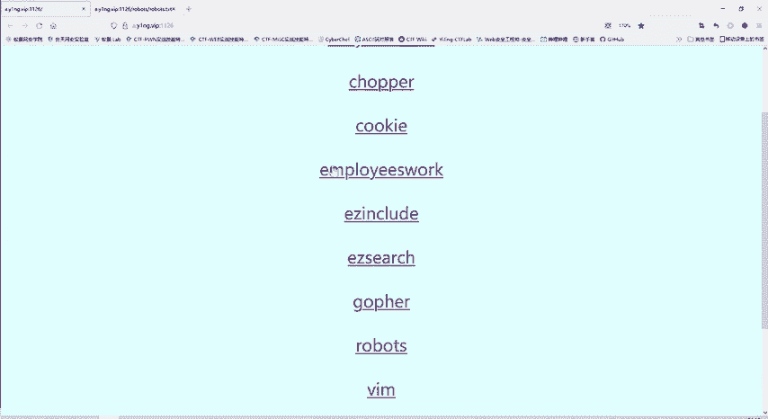
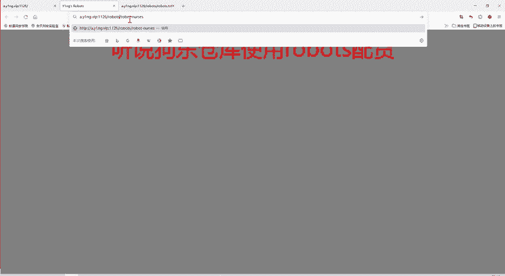
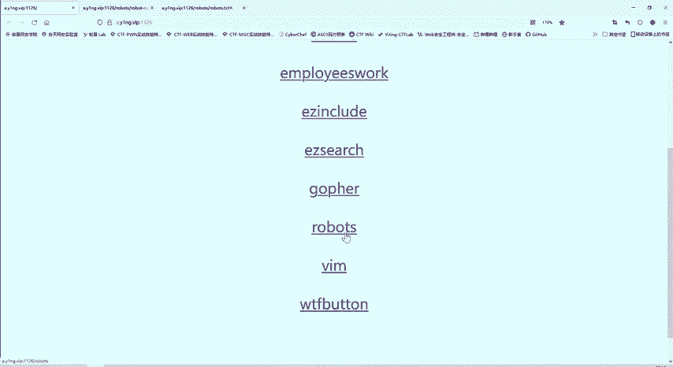

# 护网行动红蓝攻防教程：P81：33_robots协议

在本节课中，我们将要学习网络安全中一个重要的概念——Robots协议。我们将通过一道具体的CTF题目，来理解这个协议的作用、格式以及如何利用它来发现隐藏的信息。

---



## 概述

Robots协议，也称为爬虫协议，是网站用来告知网络爬虫哪些内容可以抓取、哪些内容禁止抓取的规范。它通常以 `robots.txt` 文件的形式存在于网站的根目录下。理解这个协议对于进行Web安全测试和信息收集至关重要。

上一节我们介绍了HTTP协议相关的知识，本节中我们来看看Robots协议在实际场景中的应用。



## 题目分析与解题过程

题目提示信息为“狗东仓库使用robots配货”，并且标题中反复出现“robots”。这强烈暗示本题与Robots协议有关。



首先，我们尝试查看网页源代码，以寻找与flag相关的信息。




在源代码中没有发现明显的flag信息。我们尝试在页面中搜索“flag”字段。


经过搜索确认，页面中确实不存在“flag”这个字段。那么，这道题应该如何解决呢？

## 理解Robots协议



这道题的核心是考察对Robots协议的理解。Robots协议是一个“君子协议”，它并非通过技术手段强制阻止访问，而是声明了网站的抓取规则。

网站（如京东、知乎）拥有大量网页和信息。网络爬虫可以编写程序自动抓取这些信息。Robots协议的作用就是告诉爬虫，网站中哪些目录或文件是允许抓取的，哪些是禁止抓取的。

既然题目反复提到robots，我们应该检查网站根目录下是否存在 `robots.txt` 文件。




访问 `robots.txt` 后，我们看到了协议内容。

以下是该文件内容的解析：

```
User-agent: *
Disallow: /flag1_is_h3re.php
Disallow: /n0t_@_flAg_FiLe_dONT_5p1De_it.php
```

*   **`User-agent: *`**：这是一个HTTP请求头字段，指代爬虫程序本身。这里的星号 `*` 是通配符，表示该规则适用于所有爬虫。
*   **`Disallow:`**：此指令用于禁止爬虫访问指定的路径。

这两行规则的含义是：**禁止所有爬虫访问 `/flag1_is_h3re.php` 和 `/n0t_@_flAg_FiLe_dONT_5p1De_it.php` 这两个文件。**

作为网站管理者，声明某些文件禁止抓取，通常意味着这些文件包含敏感或不想公开的信息。因此，这为我们提供了重要的线索。

## 发现隐藏信息

根据 `robots.txt` 的提示，我们尝试访问被禁止抓取的文件。



首先访问 `/flag1_is_h3re.php`。




页面看起来是空白的。但观察浏览器进度条，可以推测页面可能加载了内容。有时信息会隐藏在页面底部或HTML注释中。

我们查看该页面的源代码。


在网页源代码中搜索，发现了关键词“YNG robot”。这很可能就是本题的flag或关键信息。

所以，这道题的解题思路很清晰：**发现并解读 `robots.txt` 文件，然后访问其中声明的禁止访问的路径，从而找到隐藏信息。**

## 协议的意义与应用

Robots协议主要是一种规范声明。大型公司（如京东）会使用它来保护商品信息、价格数据等不被竞争对手爬取和分析。

对于安全测试人员或CTF选手来说，`robots.txt` 文件是一个重要的信息泄露源，常常会指向隐藏的管理后台、备份文件或包含敏感信息的页面。

以下是Robots协议的基本格式示例：

```
User-agent: [爬虫名称]
Allow: [允许访问的路径]
Disallow: [禁止访问的路径]
Sitemap: [网站地图地址]
```

## 总结

本节课中我们一起学习了Robots协议。我们了解到：

1.  **Robots协议**是一个放置在网站根目录下的 `robots.txt` 文件，用于指导网络爬虫的抓取行为。
2.  其核心指令包括 `User-agent`（指定爬虫）和 `Disallow`（指定禁止访问的路径）。
3.  在CTF比赛或实际安全测试中，`robots.txt` 文件常常会泄露敏感的目录或文件路径，是信息收集的关键一环。
4.  解题时，遇到与“robots”相关的提示，应优先检查 `http://target.com/robots.txt`。



通过这道简单的题目，我们掌握了利用Robots协议发现隐藏资源的基本方法。在后续的学习中，我们将遇到更多将协议知识与漏洞利用结合起来的复杂场景。