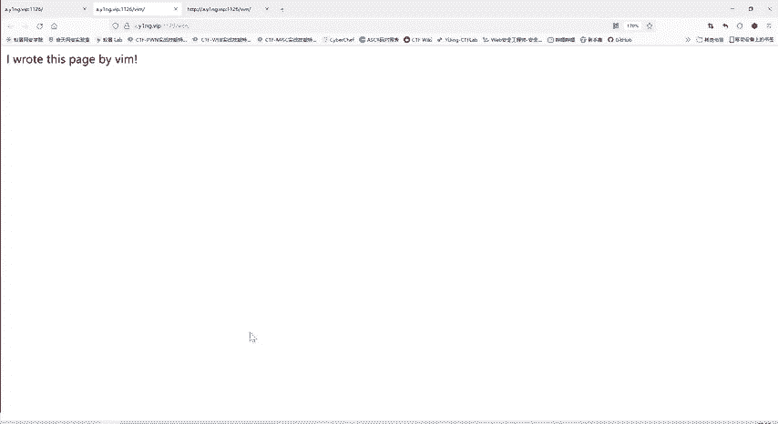
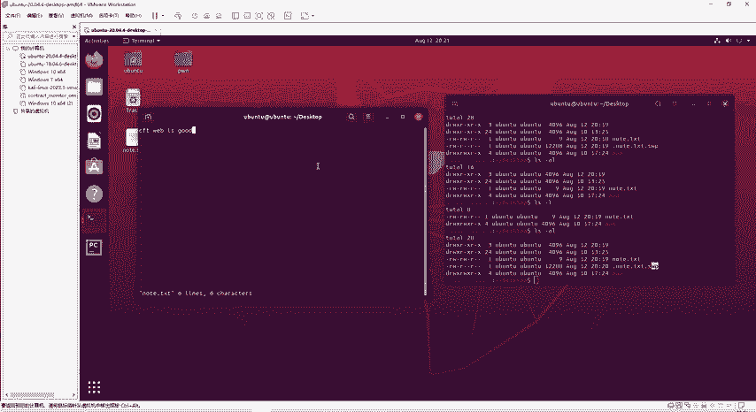
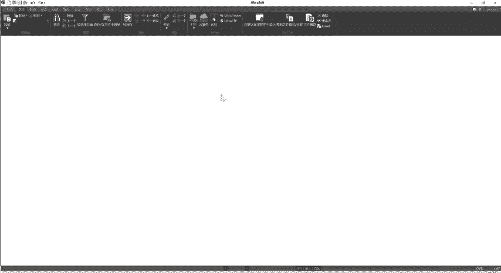
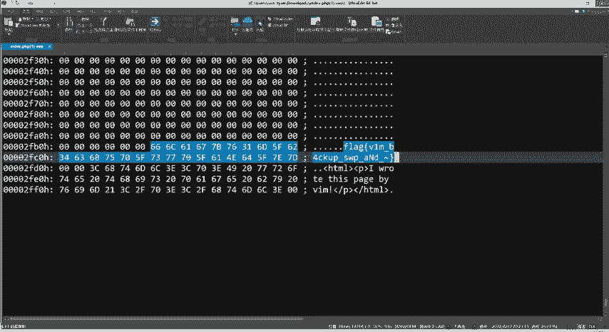
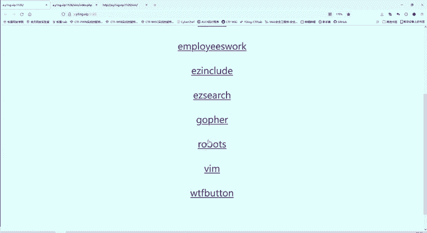

# 护网行动红蓝攻防教程：P82：34_VIM隐藏flag 🚩

在本节课中，我们将学习如何利用VIM编辑器的特性来发现隐藏的Flag。我们将从一个看似空白的网页入手，通过分析其背后的技术细节，最终找到目标信息。



---

## 问题分析

上一节我们介绍了如何通过网页源代码寻找线索。本节中我们来看看一个特殊的案例。

题目提示：“I wrote this page by VIM”。这意味着该网页是使用VIM编辑器编写的。仅从网页表面无法看到任何Flag内容，查看网页源代码也一无所获。因此，问题的突破口很可能与VIM编辑器本身的特性有关。

## VIM编辑器特性

VIM是Linux系统中一个强大的文本编辑器。它有一个重要特性：在编辑文件时，VIM会自动创建一个**交换文件**（Swap File），用于备份和异常恢复。

以下是VIM交换文件的关键点：
*   当使用VIM正常编辑并保存退出时，交换文件会被自动删除。
*   如果VIM异常退出（如系统崩溃、强制关闭终端），交换文件会被保留。
*   交换文件的命名规则为：**`.原文件名.swp`**，这是一个隐藏文件。



我们可以通过一个简单的命令来模拟和观察这个过程：
```bash
# 使用VIM编辑一个文件
vim note.txt
# 在编辑状态下强制关闭终端或VIM进程，模拟异常退出
```
异常退出后，使用 `ls -a` 命令可以查看到生成的 `.note.txt.swp` 隐藏文件。

## 解题步骤

理解了VIM的特性后，我们就可以开始解题。以下是解题的具体步骤：

1.  **确定目标文件名**：题目访问的是一个目录（`/vim/`），Web服务器通常会默认访问该目录下的 `index.php` 文件。因此，原文件名很可能是 `index.php`。
2.  **构造交换文件名**：根据VIM交换文件的命名规则，尝试访问可能存在的隐藏文件：`.index.php.swp`。
3.  **访问交换文件**：在浏览器中直接访问 `http://目标网址/.index.php.swp`。如果存在，浏览器会提示下载该文件。
4.  **分析文件内容**：使用文本编辑器（如Notepad++, VS Code, UE等）打开下载的 `.swp` 文件。在这个备份文件中，我们通常可以找到文件被编辑时的完整内容，包括未在正常网页中显示的Flag。

## 工具辅助



在第一步确定网站技术栈时，可以使用浏览器插件（如Wappalyzer）进行快速分析。该插件能自动识别网站使用的编程语言、框架等信息。例如，分析目标网站显示其使用PHP开发，这进一步印证了我们寻找 `index.php` 交换文件的思路是正确的。



---

## 总结

本节课中我们一起学习了如何利用VIM编辑器的交换文件机制来发现隐藏信息。关键点在于：
1.  识别题目与VIM编辑器相关的提示。
2.  理解VIM交换文件（`.swp`）的产生条件和命名规则。
3.  结合Web目录的默认文件（如`index.php`），构造出潜在的交换文件路径并进行访问。
4.  从下载的交换文件中分析提取出Flag。



这种方法属于**信息泄露**漏洞的利用，是渗透测试和CTF比赛中常见的考点。掌握这些编辑器或系统的特性，能帮助我们在安全评估中发现更多潜在的风险点。