# 护网行动红蓝攻防教程：P83：35_wtfbutton

在本节课中，我们将学习如何通过修改网页元素或手动提交数据来绕过前端限制，从而获取隐藏的Flag。这是一个典型的Web安全挑战，涉及对HTML表单和HTTP请求的理解。

## 题目分析与初步尝试

题目要求点击一个按钮来获取Flag。然而，页面上看似可点击的按钮实际上无法响应点击。

以下是初步尝试的步骤：
1.  直接点击页面上的按钮，发现没有反应。
2.  查看网页源代码，搜索关键词“flag”，发现两处相关代码：
    *   一段提示文字：“点击它获取flag”。
    *   一个表单输入框，其属性为 `value="flag"` 且 `disabled`（禁用）。
3.  检查源代码中发现的链接，访问并搜索“flag”，未发现有效信息。

## 理解网页渲染与源代码

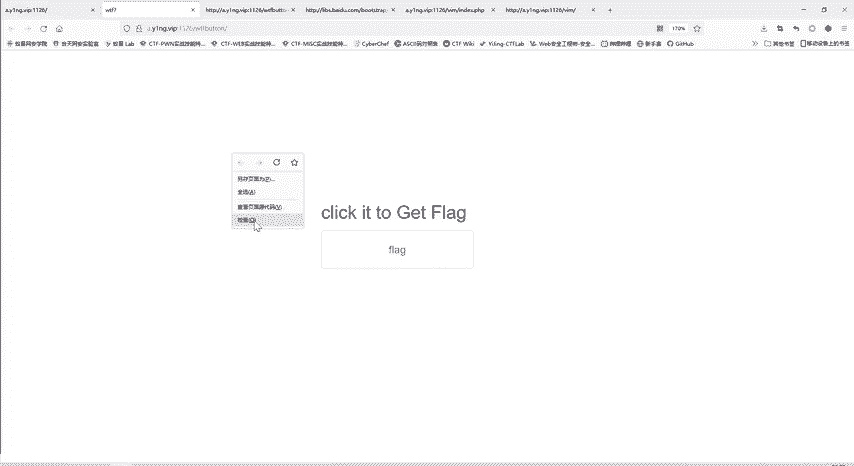

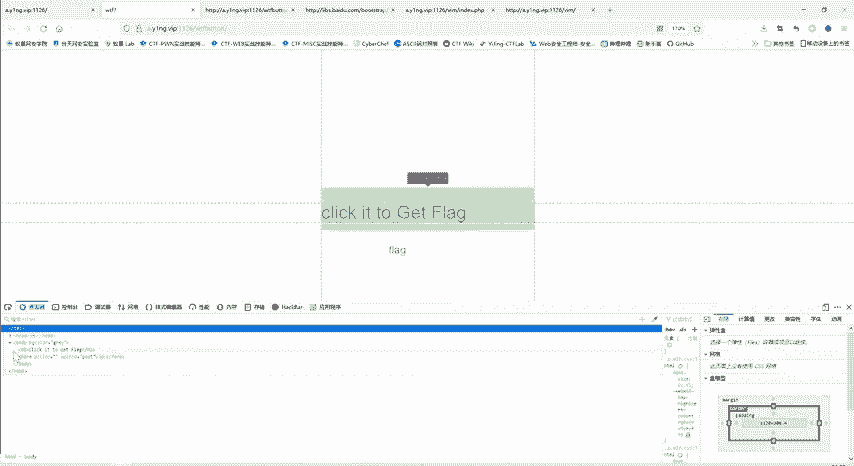

网页源代码是服务器返回的原始HTML代码。而浏览器检查器（如“元素”标签页）显示的是经过浏览器解析和渲染后的**文档对象模型（DOM）**。两者可能不同，因为JavaScript可以动态修改DOM。

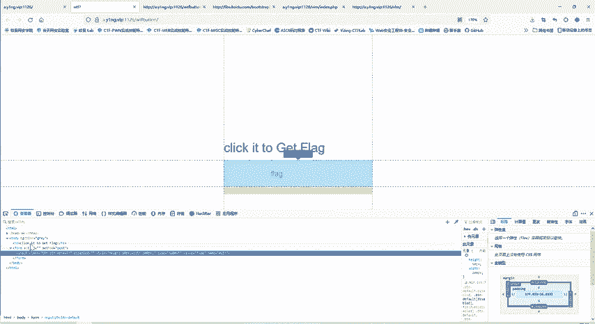

上一节我们查看了源代码，本节中我们来看看浏览器渲染后的DOM结构。

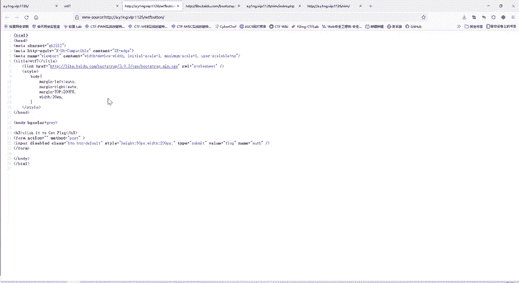

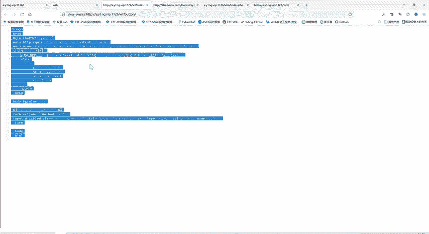

在浏览器中右键点击页面，选择“检查”或“审查元素”，可以打开开发者工具。使用元素选择器（箭头图标）定位到目标按钮，可以看到其HTML代码中包含 `disabled` 属性，这解释了按钮为何无法点击。

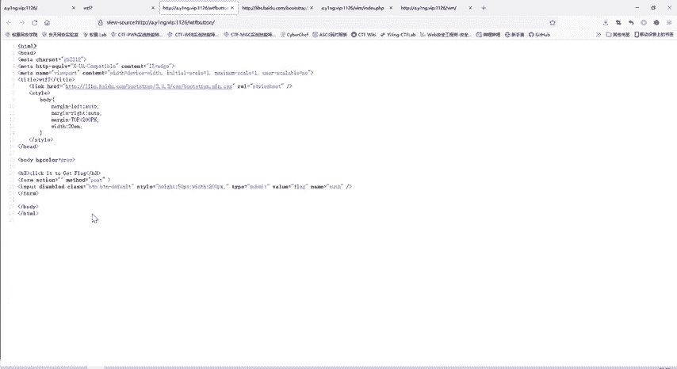

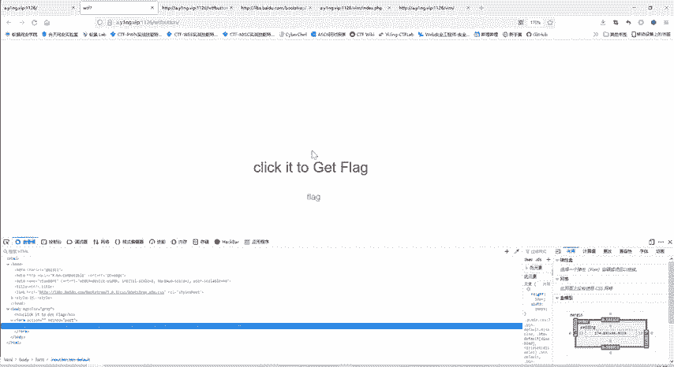

## 方法一：修改DOM元素

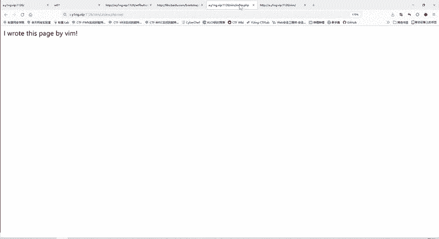

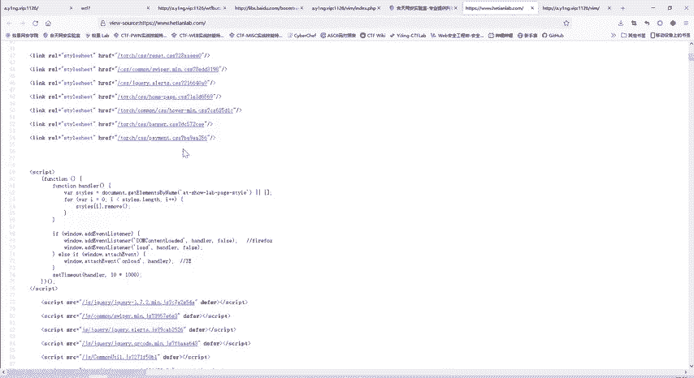

既然按钮因 `disabled` 属性而失效，我们可以直接修改DOM来移除这个限制。

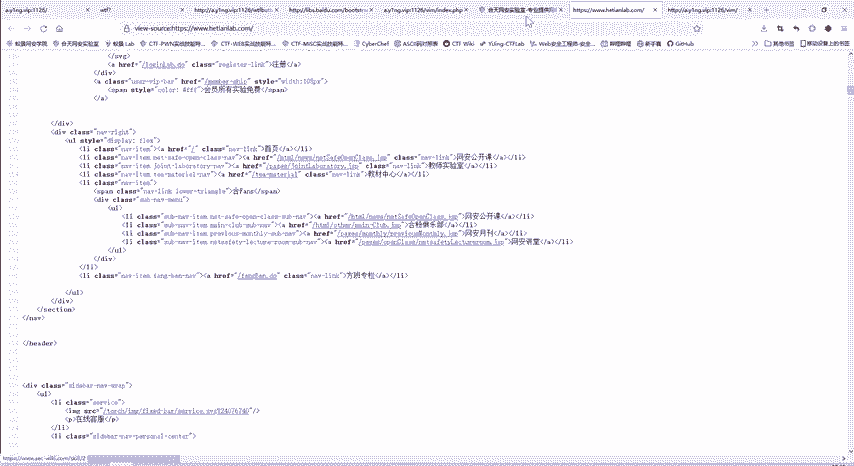

以下是操作步骤：
1.  在开发者工具的“元素”面板中，找到按钮对应的 `<input>` 标签。
2.  双击 `disabled` 属性，将其删除或将其值改为 `false`。
3.  此时页面上的按钮变为可点击状态，点击后即可成功提交表单并显示Flag。

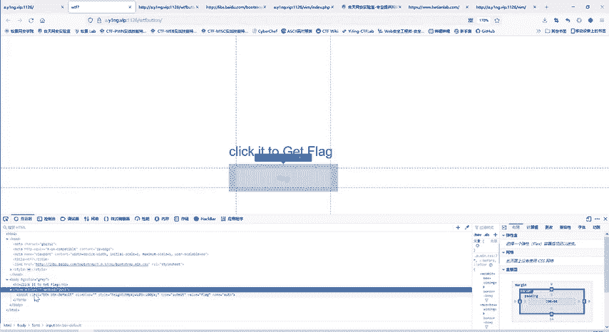

## 方法二：手动构造并发送POST请求

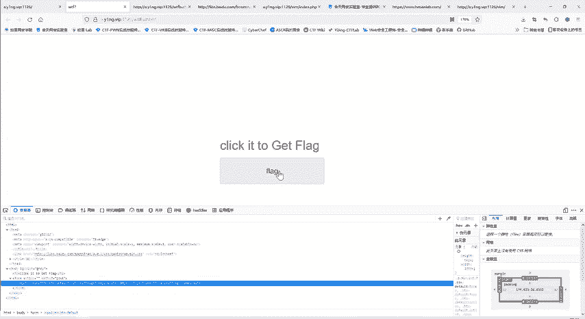

除了修改前端，我们还可以直接模拟表单提交的HTTP请求。表单代码显示，它旨在以POST方法向当前URL提交一个数据，参数名为 `ws`，参数值为 `flag`。

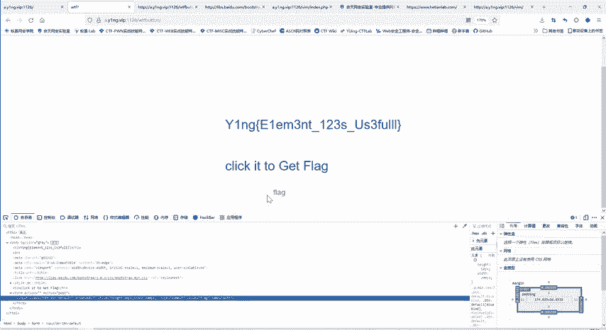

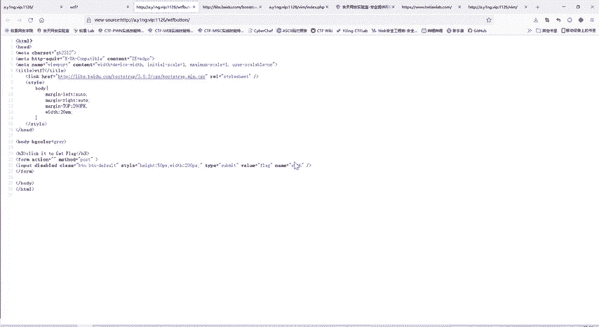

我们可以使用浏览器插件（如HackBar）来手动发送这个POST请求。

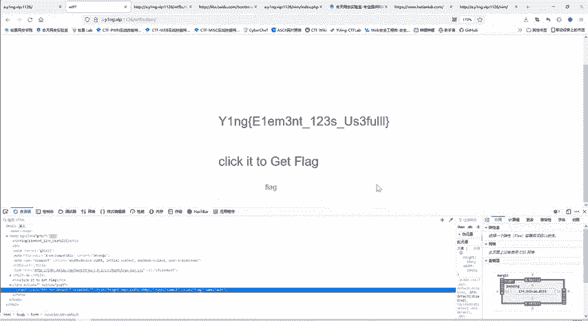

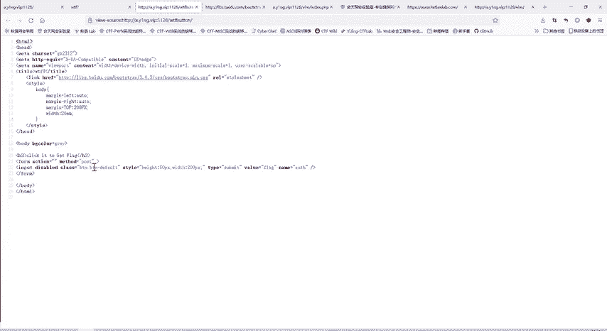

以下是使用HackBar发送POST请求的步骤：
1.  在浏览器中安装并打开HackBar插件。
2.  将题目URL加载到插件的地址栏中。
3.  在POST数据区域输入：`ws=flag`
4.  点击“Execute”执行发送。

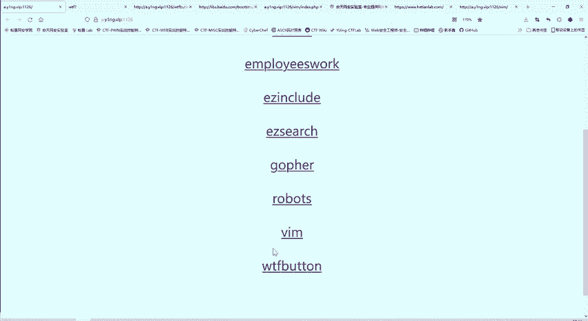

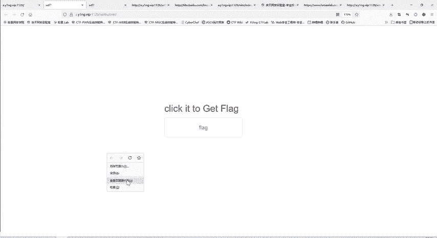

服务器在接收到正确的POST数据后，便会返回包含Flag的响应。

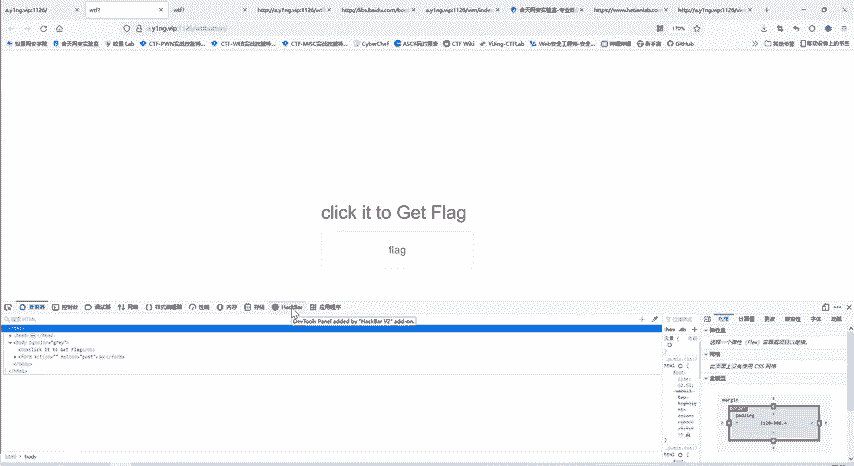

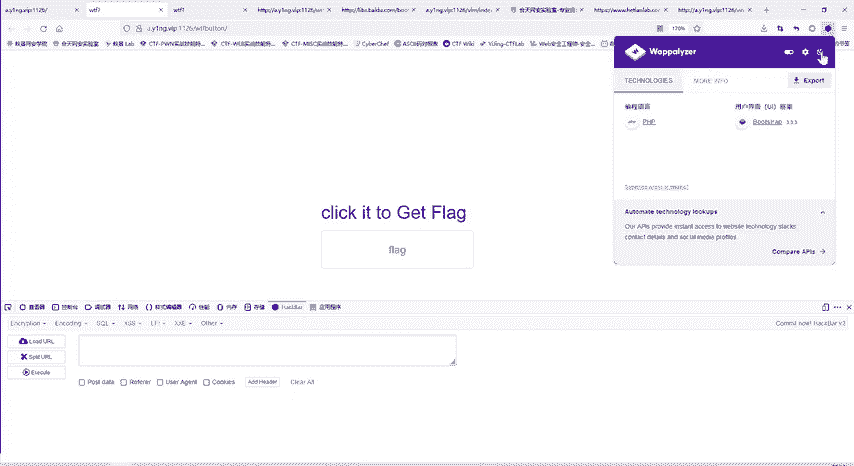

## 核心概念总结

*   **HTML表单提交**：表单通过 `<form>` 标签定义，其 `action` 属性指定提交地址，`method` 属性指定请求方法（GET或POST）。表单数据以 `name=value` 的格式发送。
    ```html
    <form action="" method="post">
        <input type="submit" name="ws" value="flag" disabled>
    </form>
    ```
*   **HTTP POST请求**：一种向服务器提交数据的方法，数据包含在请求体中，而非URL中。
*   **前端限制绕过**：网页上的交互限制（如禁用按钮）通常仅在前端（客户端）生效。通过修改DOM或直接发送HTTP请求，可以绕过这些限制，直接与后端服务器交互。

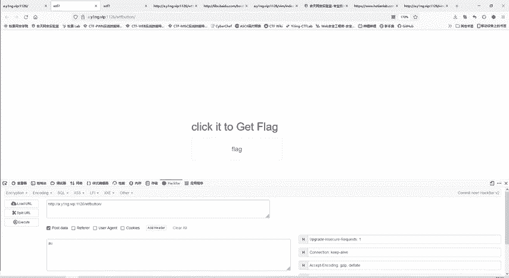

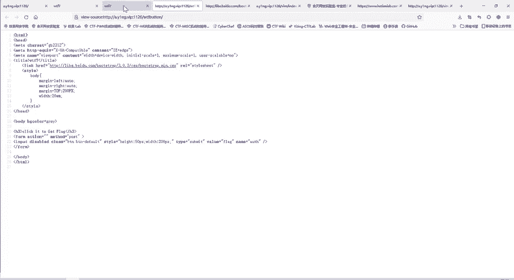

## 课程总结

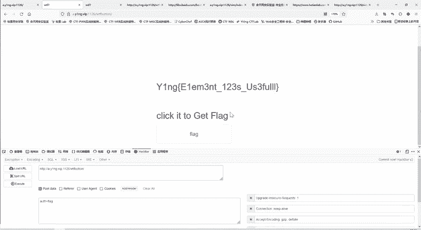

本节课中我们一起学习了解决“WTFbutton”挑战的两种方法。我们首先分析了题目，发现前端按钮被禁用；随后，我们通过修改DOM元素移除了禁用状态，成功点击按钮获取Flag。此外，我们还学习了通过HackBar插件手动构造并发送POST请求来达到相同目的。这个案例揭示了前端安全限制的局限性，强调了理解HTTP协议和前后端交互原理在Web安全中的重要性。