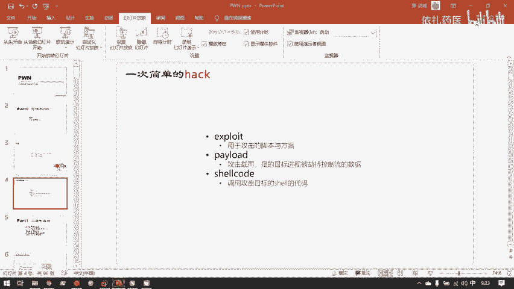
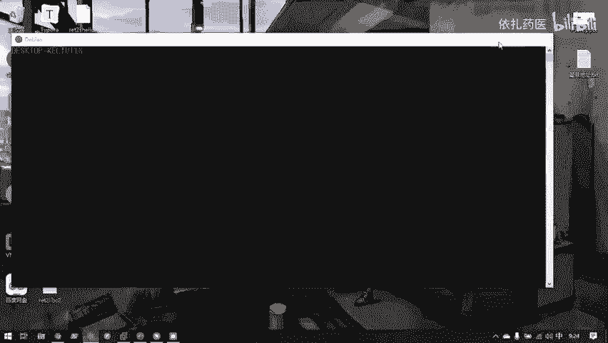

# 护网行动红蓝攻防教程：P84：1. 一次简单的PWN 🧠

在本节课中，我们将要学习二进制漏洞利用（PWN）的基础概念，并通过一个简单的演示来了解一次完整的PWN攻击流程。我们将从核心概念入手，逐步理解PWN是什么，它与Web漏洞的区别，以及如何利用工具分析并攻击一个二进制程序。

## 概述：什么是PWN？🤔

PWN是CTF比赛中的一个方向，其核心在于二进制漏洞的利用与挖掘。这个词语最初来自黑客的俗语，意为成功找到并利用了一个二进制程序或设备中的漏洞，从而取得了控制权。例如，“PWN掉一个程序”或“PWN掉一台服务器”。

## PWN与Web漏洞的区别 🔍

PWN所研究的漏洞，针对的是已经编译成机器码的二进制程序。而Web漏洞通常源于PHP等高级语言在代码层面上的设计缺陷。PWN的漏洞存在于更底层的二进制层面，例如程序解释器本身的漏洞。

## 什么是二进制程序？💻

二进制程序，即可执行文件。在Linux下，其格式为ELF，相当于Windows下的EXE文件。运行这些文件，就会执行对应的机器码指令。

## 一次简单的PWN攻击演示 🚀

上一节我们介绍了PWN的基本概念，本节中我们来看看一次完整的PWN攻击是如何进行的。我们将通过一个CTF题目来演示整个过程。

### 环境与目标

攻击目标是在远程服务器（IP: `192.168.1.100`）的10202端口上运行的一个名为 `ret2libc3` 的二进制程序。我们本地也拥有相同的程序文件用于分析。

### 第一步：分析二进制程序

首先，我们需要全面了解这个二进制程序。使用 `file` 命令查看其基本信息，确认它是一个32位的Linux ELF可执行文件。

接着，我们使用强大的反汇编与反编译工具IDA Pro来分析程序。将二进制文件拖入IDA后，工具会将其机器码转译为汇编代码。通过安装的F5插件，我们还可以进一步将汇编代码还原成功能等价的C语言伪代码，以便于分析逻辑。

**核心工具与代码示例：**
```bash
# 查看文件类型
file ret2libc3
# 输出：ret2libc3: ELF 32-bit LSB executable, Intel 80386, version 1 (SYSV), dynamically linked, interpreter /lib/ld-linux.so.2, for GNU/Linux 2.6.32, BuildID[sha1]=..., not stripped
```
分析C语言伪代码是寻找漏洞的关键，这要求我们具备扎实的C语言基础。

### 第二步：寻找漏洞

在反编译出的C语言代码中，我们仔细分析程序逻辑。在本例中，我们发现了两个关键漏洞：一处内存信息泄露和一处缓冲区溢出。这些漏洞的具体原理将在后续课程中详细讲解。

### 第三步：编写漏洞利用脚本（Exploit）

找到漏洞后，我们需要编写攻击脚本（Exploit）来利用它们。我们使用Python的 `pwntools` 模块来方便地构造攻击。

以下是攻击脚本的核心步骤：

1.  **建立连接**：使用 `remote()` 函数连接到目标服务器的指定端口。
2.  **构造攻击载荷（Payload）**：根据发现的漏洞，精心构造一段恶意的字节流数据。
3.  **发送载荷**：将构造好的Payload发送给目标程序。
4.  **劫持控制流**：目标程序处理恶意数据后，其执行流程会被我们劫持。
5.  **获取交互式Shell**：利用 `interactive()` 函数，获得一个与目标服务器的交互式Shell，从而控制服务器。

**核心代码示例：**
```python
from pwn import * # 导入pwntools模块

# 1. 连接到远程目标
io = remote('192.168.1.100', 10202)

# 2. & 3. 构造并发送Payload（此处为示例，具体构造方式取决于漏洞）
payload = b'A' * 100 + p32(0xdeadbeef) # 例如：填充数据+覆盖返回地址
io.sendlineafter(b'input:', payload) # 在接收到‘input:’提示后发送Payload

# 4. & 5. 劫持控制流后，进入交互模式
io.interactive()
```

### 第四步：执行攻击

运行编写好的Python脚本。脚本会自动连接服务器、发送Payload。成功后，我们会看到切换到了交互模式（`Switching to interactive mode`），并获得了目标服务器的Shell提示符。

在真实的CTF比赛中，此时可以执行命令（如 `cat flag.txt`）来读取flag文件并得分。整个攻击过程在脚本运行时非常迅速，主要时间花费在前期分析和编写Exploit上。



## 核心概念总结 📚



在刚才的PWN演示过程中，我们接触了几个核心概念：

以下是相关概念的简要说明：

*   **Exploit**：指用于实施攻击的脚本或一套完整的攻击方案。它是一个名词。
*   **Payload**：攻击载荷，指我们精心构造并发送给目标程序的恶意数据，旨在触发漏洞并劫持程序控制流。
*   **Shell**：命令行接口，为用户提供与操作系统进行文本交互的界面。在Linux服务器上，我们通常通过Shell来执行命令。PWN的最终目标往往是获取目标服务器的一个Shell。

**Shell与终端（Terminal）的关系**：终端（如Gnome Terminal）是一个运行Shell的程序窗口。一个终端可以运行多个Shell进程（如bash、zsh）。我们通过Shell输入命令来控制操作系统。

## 总结 🎯

本节课中我们一起学习了PWN的基础知识。我们了解到PWN是针对二进制程序的漏洞利用技术，它与Web漏洞存在于不同层面。我们通过一个完整的演示，看到了从分析二进制程序、寻找漏洞、编写Exploit到最终获取Shell的整个PWN攻击流程。同时，我们也明确了Exploit、Payload和Shell这几个关键概念。在接下来的课程中，我们将深入探讨各类二进制漏洞的原理和利用技术。