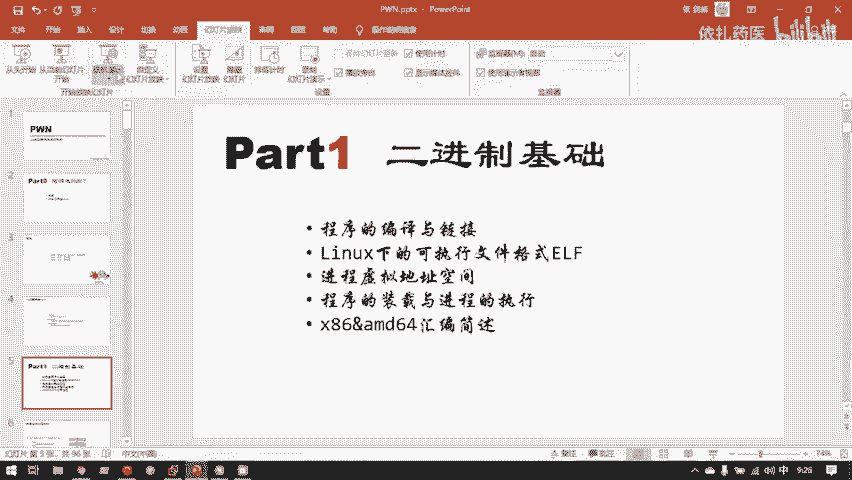
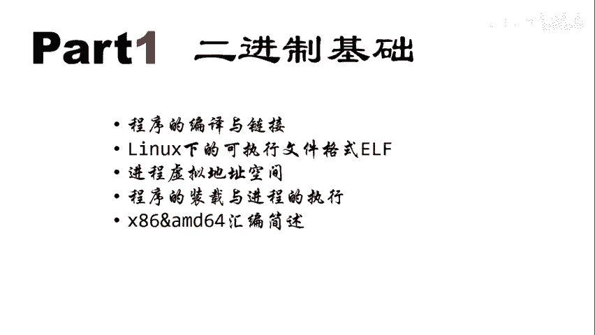
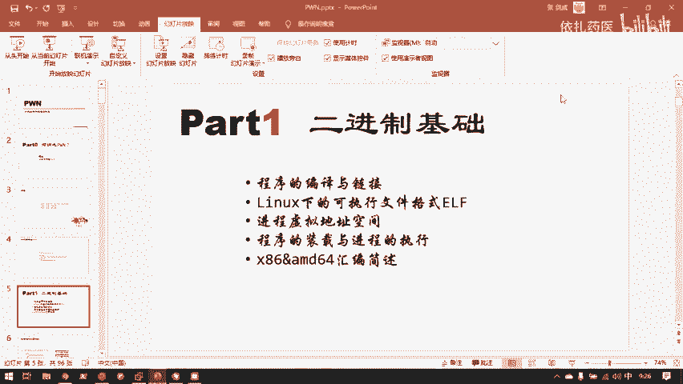
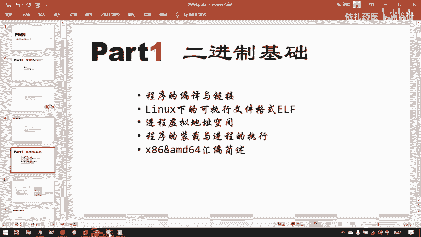
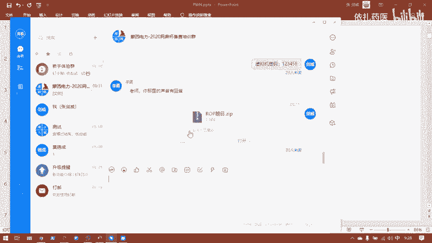
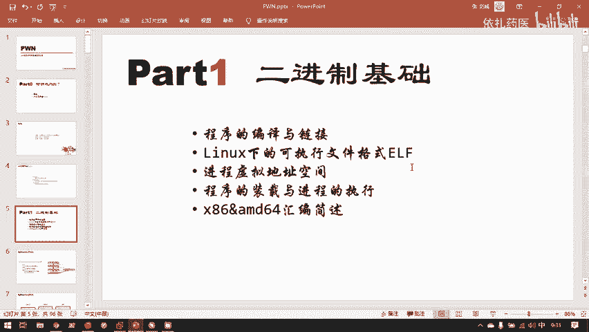
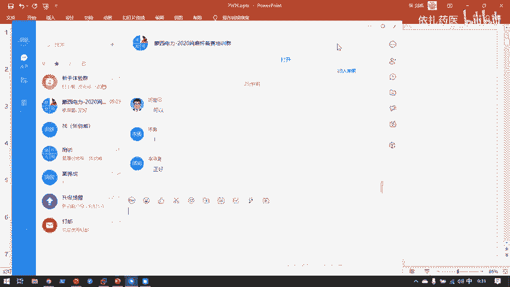
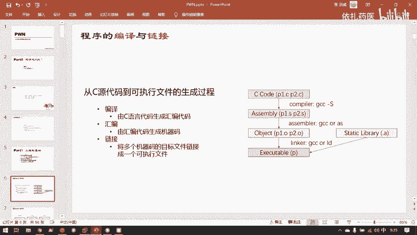
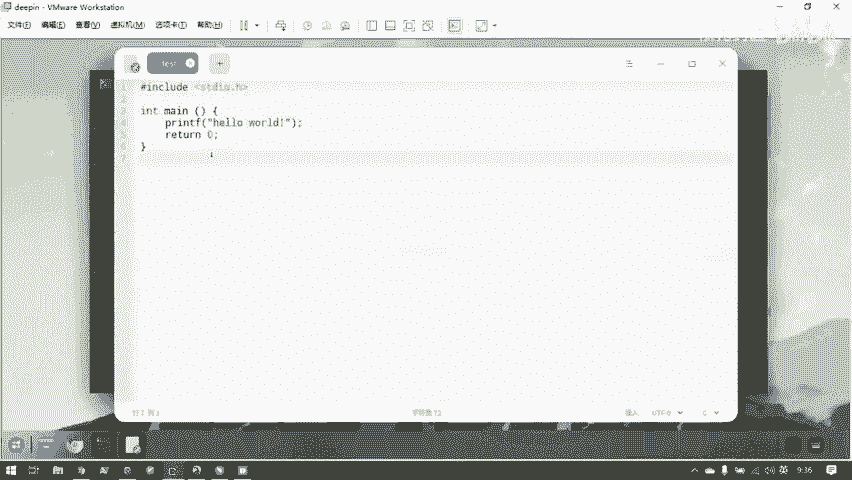
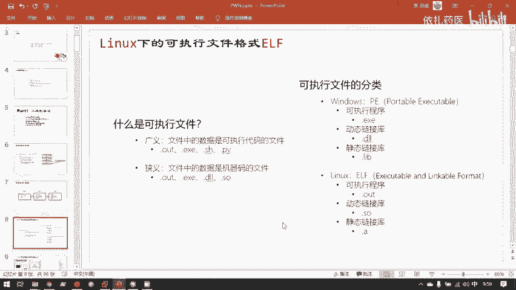

# 护网行动红蓝攻防教程：P85：2.程序的编译与链接 🔧











在本节课中，我们将要学习二进制程序的基础知识，特别是程序的编译与链接过程。理解这些底层原理是进行二进制漏洞挖掘和利用的基石。


上一节我们介绍了二进制安全在CTF中的重要性，本节中我们来看看一个C语言程序是如何从源代码变成可执行文件的。


## 二进制安全的重要性与挑战 💡

二进制安全方向在CTF中被认为是最难的方向之一。它以难入门和难提升著称。二进制漏洞挖掘离操作系统底层非常近，需要大量的编程、操作系统、汇编原理和计算机体系结构知识来支撑。





单纯背诵漏洞可以解题，但无法理解其所以然。要完全理解一个漏洞的原理，并作为安全研究员去挖掘更深的漏洞，就需要补足大量的计算机科学技术相关的底层知识。

## 必备的基础知识 📚

以下是学习二进制安全特别重要的两项基础知识。



*   **C语言编程基础**：分析二进制程序时，最终目标是将汇编代码转换成C语言来理解。如果读不懂C语言代码，问题会很大。C语言基础语法较少，关键库函数也不多，有其他高级语言基础的话，学习起来会很快。
*   **Linux基础**：Linux是研究二进制安全的主要平台，熟悉其命令行操作和系统特性至关重要。



这两点如果没有掌握好，学习二进制可能会比较困难。

## 深入理解与熟练运用 🎯

一个看起来很简单的知识，其实需要大家背得很熟练，才有实力去做题目。例如，函数调用栈的工作原理，只有在脑海中滚瓜烂熟，能像动画一样自动模拟出来时，才能在做栈溢出题目时立刻发现问题所在。


## 程序的编译与链接流程 ⚙️

我们要攻击的是二进制程序。知己知彼，百战百胜，我们需要完全了解攻击目标。一切编译型语言都可以生成二进制程序，但我们主要研究C语言（和少量C++）。C语言历史悠久，设计之初存在许多未考虑完善的问题，加之市场占有量广，遗留了大量安全隐患。

只要有对执行效率和时间极其敏感的领域（如金融交易系统）存在，C/C++这种能直接编译成高效机器码的语言就不会绝迹。因此，研究其二进制漏洞大有市场。

### 从源代码到可执行文件

一个C语言程序在磁盘上最初以文本文件形式存储，内容是字符串。Linux系统通过文件头（而非Windows的后缀名）来识别文件类型。使用 `file` 命令可以查看。

程序必须被载入内存才能运行。磁盘上的文件只是静态的二进制数据。

### 编译过程详解

我们通常用 `gcc` 命令一步生成可执行文件：
```bash
gcc test.c -o test
```
但这背后隐藏了复杂的步骤。对于漏洞挖掘，我们主要关心中间的两个过程：汇编和链接。

1.  **生成汇编代码**：使用 `-S` 选项。
    ```bash
    gcc -S test.c
    ```
    这会生成 `test.s` 文本文件，里面是汇编代码。
2.  **生成目标文件**：汇编器将汇编代码转换成机器码，生成目标文件（`.o`）。
    ```bash
    gcc -c test.s -o test.o
    ```
3.  **链接**：链接器将目标文件与所需的库函数（如 `printf`）连接起来，生成最终的可执行文件。链接分为静态链接（库代码直接嵌入可执行文件）和动态链接（运行时从共享库中加载）。

**为什么需要链接？**
像 `printf` 这样的函数并非我们自己实现，而是存在于系统库（如 `libc.so`）中。如果只编译不链接，生成的目标文件会缺失这部分代码，无法独立运行。

### 机器码与反汇编

CPU只认识0和1（机器码）。我们写的C代码或Python代码，CPU无法直接理解。编译型语言（如C）通过编译器将源代码直接翻译成机器码；解释型语言（如Python）通过解释器边翻译边执行。

可执行文件（如Linux下的ELF格式）在磁盘上存储的就是机器码，用文本编辑器打开会看到乱码，因为其中很多字节值超出了ASCII可见字符的范围。

汇编指令与机器码几乎是一一对应的关系。例如，汇编指令 `push ebp` 对应的机器码是 `0x55`。因此，反汇编（将机器码转成汇编）相对简单，本质上是查表。而反编译（将汇编/机器码转回高级语言代码）则困难得多，目前IDA Pro是业界最强的工具。

## 总结 📝



本节课中我们一起学习了二进制安全的基础，重点剖析了C语言程序的编译与链接流程。我们了解到，从 `test.c` 源代码到 `a.out` 可执行文件，经历了预处理、编译、汇编和链接四个关键阶段。理解静态链接与动态链接的区别、以及机器码与汇编代码的映射关系，对于后续分析二进制程序的结构、寻找漏洞入口至关重要。记住，扎实的C语言和Linux基础是通往二进制安全世界的必经之路。