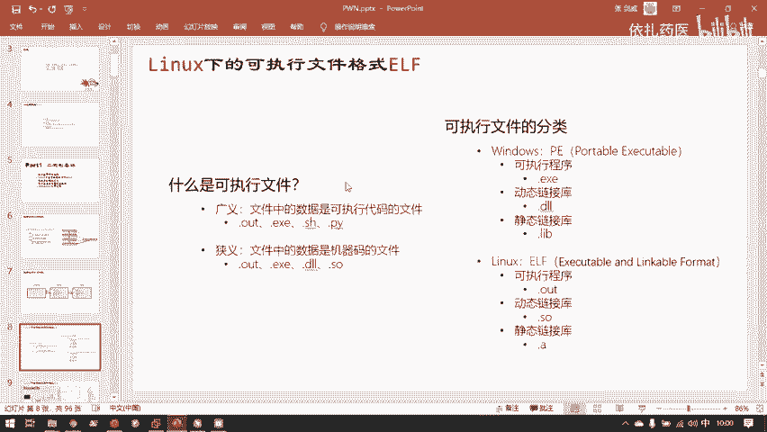
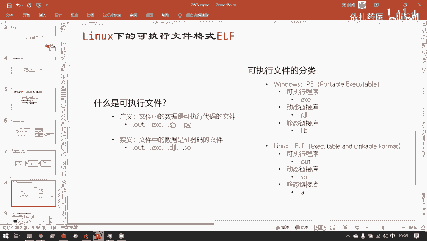
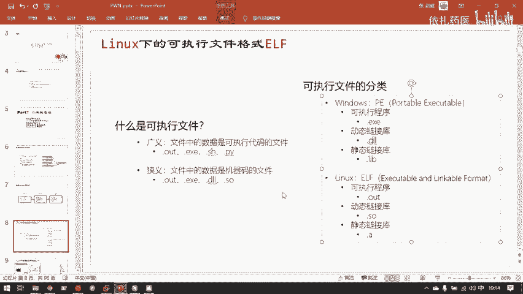
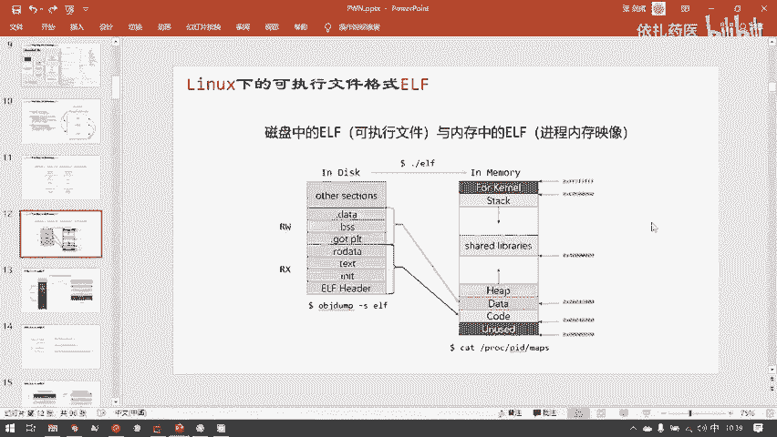

# 护网行动红蓝攻防教程：P86：3.Linux下的可执行文件格式ELF 🐧






在本节课中，我们将要学习Linux系统下的可执行文件格式——ELF。理解ELF文件的结构是进行二进制安全分析、逆向工程和漏洞挖掘的基础。我们将从基本概念入手，逐步解析ELF文件的组成、它在磁盘与内存中的不同形态，以及如何查看和分析它。

---

## 可执行文件概述


可执行文件是包含计算机指令（代码）的文件，操作系统可以加载并执行它。在Linux系统中，最常见的可执行文件格式是ELF。

广义的可执行文件包括任何包含可执行代码的文件，例如：
*   **脚本文件**：如Python的 `.py` 文件、Shell的 `.sh` 文件、Windows的批处理 `.bat` 文件。它们需要特定的解释器（如 `python3`、`bash`）来执行。
*   **二进制文件**：即狭义的可执行文件，其内容直接是CPU能识别的**机器码**，由高级语言编译而成。

在Linux中，文件是否能执行不取决于后缀名，而取决于其**文件权限**。我们可以使用 `chmod` 命令为文件添加执行权限（`x`）。

```bash
# 为脚本文件添加执行权限
chmod +x exploit.py
# 然后可以直接执行
./exploit.py
```

---

## 可执行文件的分类

以下是不同平台下主要的可执行文件格式：

*   **Windows平台 - PE格式**
    *   **可执行程序**：`.exe`
    *   **动态链接库**：`.dll`
    *   **静态链接库**：`.lib`
*   **Linux平台 - ELF格式**
    *   **可执行程序**：通常无固定后缀，或使用 `.out`
    *   **动态链接库**：`.so`
    *   **静态链接库**：`.a`

> **小知识**：PE意为“可移植可执行文件”（Portable Executable），源于微软早期希望统一桌面、移动等设备应用生态的构想。



---

## ELF文件结构详解

上一节我们介绍了可执行文件的分类，本节中我们来看看ELF文件的具体结构。一个ELF文件主要由以下几部分组成：


### 核心组成部分

1.  **ELF Header（文件头）**：位于文件开头，描述了整个文件的组织信息，如文件类型（可执行文件、共享库等）、目标机器架构、程序入口地址以及**节头表**和**程序头表**的位置。操作系统首先读取它来了解如何加载文件。
2.  **Program Header Table（程序头表/段表）**：它描述了**段**（Segment）的信息。段是用于指导操作系统如何将文件内容映射到**进程虚拟内存空间**的控制单元。每个段定义了内存中一块区域的权限（如可读`R`、可写`W`、可执行`X`）。
3.  **Section Header Table（节头表）**：它描述了**节**（Section）的信息。节是链接和重定位的基本单元，用于在磁盘上组织文件内容，例如将代码、数据、符号等分类存放。
4.  **.text节（代码节）**：存放程序的**机器指令**（代码）。通常权限为可读、可执行，但**不可写**，以防止程序在运行时被意外或恶意修改。
5.  **.data节 / .rodata节（数据节）**：存放程序已初始化的全局变量和静态变量（`.data`）以及只读数据如字符串常量（`.rodata`）。

> **代码 vs 数据**：以简单的“Hello World”程序为例，`printf("Hello World")` 中的函数调用指令是**代码**，存储在 `.text` 节；而字符串 `"Hello World"` 本身是**数据**，通常存储在 `.rodata` 节。

---

## 从磁盘文件到内存进程

ELF文件存储在磁盘上，当我们需要执行它时，操作系统会将其加载到内存中，形成一个**进程映像**。这个过程涉及视图的转换。

### 两种视图

*   **链接视图（节视图）**：这是磁盘上ELF文件的组织形式，侧重于如何将代码和数据分类、链接。工具（如链接器 `ld`）主要使用此视图。
*   **执行视图（段视图）**：这是文件被加载到内存后的组织形式，侧重于如何为运行分配内存和设置权限。操作系统加载器使用此视图。

### 映射关系

下图清晰地展示了从磁盘到内存的映射过程：



*   在磁盘上，文件由多个**节**紧密排列组成。
*   加载到内存时，具有相同权限的**节**会被合并到一个**段**中。
    *   例如，多个具有“只读可执行”权限的代码节（如 `.text`、`.plt`）会被合并到 **代码段**。
    *   多个具有“可读可写”权限的数据节（如 `.data`、`.bss`）会被合并到 **数据段**。
*   进程的虚拟内存空间远大于ELF文件本身，它还包含了**栈**（用于函数调用）、**堆**（用于动态内存分配）以及共享库映射区等，以支撑程序的完整运行。

---

## 如何查看ELF结构

了解理论后，我们可以使用工具实际查看ELF文件的结构。

以下是两个常用的命令，分别用于查看磁盘上的ELF文件和内存中的进程映像：

*   **查看磁盘上的ELF文件节信息**：使用 `objdump` 工具。
    ```bash
    objdump -s simple.elf
    ```

*   **查看运行中进程的内存映射**：在调试器（如GDB）中，或通过 `/proc` 文件系统。
    ```bash
    # 方法一：通过 /proc（PID为进程ID）
    cat /proc/<PID>/maps

    # 方法二：在GDB调试器中
    gdb ./simple.elf
    (gdb) start          # 启动并暂停在main函数
    (gdb) info proc mappings  # 或使用 `vmmap` 命令（如果插件支持）
    ```

> **地址空间布局提示**：请注意，不同的工具描述内存布局时，可能将低地址画在上方或下方。这取决于绘图是强调“地址数值的增长方向”还是“数据写入的先后顺序”。理解本质即可，无需纠结图示方向。

---

## 总结

本节课中我们一起学习了Linux下的可执行文件格式ELF。我们从可执行文件的基本概念讲起，区分了广义和狭义的可执行文件。然后，我们深入解析了ELF文件的三大核心结构：**文件头**、**程序头表（段表）**和**节头表**，并理解了代码节与数据节的区别。

关键点在于，我们学习了ELF文件从**磁盘存储**（节视图）到**内存加载**（段视图）的转换过程，看到了具有相同权限的节如何被合并为段，并映射到进程的虚拟地址空间中。最后，我们介绍了使用 `objdump` 和查看 `/proc/<PID>/maps` 来实际分析ELF文件结构的方法。


掌握ELF格式是后续学习二进制安全、漏洞分析、逆向工程和攻防对抗的坚实基础。